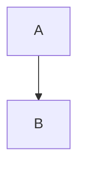

# 文件名提取功能说明

本文档说明如何从 Markdown 内容中自动提取文件名的功能。

## 🎯 功能概述

生成 DOCX 文件时，自动从文档内容中提取合适的文件名，而不是使用固定的 `markdown_mermaid_document.docx`。

## 📋 提取规则

### 优先级顺序

1. **第一个标题**：优先使用文档中的第一个 Markdown 标题
2. **第一行文本**：如果没有标题，使用第一行非空文本
3. **默认名称**：如果都没有，使用 `document.docx`

### 提取逻辑

```javascript
function extractFileName(content) {
    // 1. 尝试匹配第一个标题
    const headingMatch = content.match(/^#+\s+(.+)$/m);
    if (headingMatch) {
        return sanitizeFileName(headingMatch[1]);
    }
    
    // 2. 如果没有标题，取第一行非空文本
    const lines = content.split('\n');
    for (const line of lines) {
        const trimmed = line.trim();
        if (trimmed && !isSpecialLine(trimmed)) {
            return sanitizeFileName(trimmed);
        }
    }
    
    // 3. 默认名称
    return 'document';
}
```

## 🔍 识别标题

### 支持的标题格式

支持所有级别的 Markdown 标题（# 到 ######）：

```markdown
# 一级标题
## 二级标题
### 三级标题
#### 四级标题
##### 五级标题
###### 六级标题
```

### 正则表达式

```javascript
/^#+\s+(.+)$/m
```

**解释**：
- `^` - 行首
- `#+` - 一个或多个 `#` 号
- `\s+` - 一个或多个空格
- `(.+)` - 捕获标题文本
- `$` - 行尾
- `m` - 多行模式

### 示例

| Markdown 内容 | 提取的标题 | 文件名 |
|---------------|-----------|--------|
| `# 项目报告` | 项目报告 | `项目报告.docx` |
| `## 会议纪要 2024` | 会议纪要 2024 | `会议纪要_2024.docx` |
| `### Technical Specification` | Technical Specification | `Technical_Specification.docx` |

## 📝 第一行文本提取

### 跳过的特殊行

如果没有标题，会跳过以下特殊行：

```javascript
// 跳过的模式
- 空行
- 代码块标记：```
- 分隔线：--- 或 ===
- 装饰线：*** 或 ___
```

### 示例

**示例 1：跳过代码块**
```markdown


项目架构图

这是一个架构图的说明...
```
→ 文件名：`项目架构图.docx`

**示例 2：跳过分隔线**
```markdown
---

# 这不是标题，只是普通文本

项目文档

正文内容...
```
→ 文件名：`这不是标题只是普通文本.docx`

**示例 3：纯文本文档**
```markdown
这是一篇文章的开头

正文内容继续...
```
→ 文件名：`这是一篇文章的开头.docx`

## 🧹 文件名清理

### 清理规则

```javascript
function sanitizeFileName(name) {
    let cleaned = name
        // 1. 移除非法字符
        .replace(/[<>:"/\\|?*]/g, '')
        
        // 2. 空格替换为下划线
        .replace(/\s+/g, '_')
        
        // 3. 保留 ASCII 和中文字符
        .replace(/[^\u0000-\u007F\u4e00-\u9fa5]/g, '')
        
        // 4. 去除首尾空格
        .trim();
    
    // 5. 限制长度为 50 字符
    if (cleaned.length > 50) {
        cleaned = cleaned.substring(0, 50);
    }
    
    // 6. 如果清理后为空，返回默认名称
    return cleaned || 'document';
}
```

### 非法字符处理

#### Windows 文件名非法字符

以下字符会被移除：

| 字符 | 名称 | 说明 |
|------|------|------|
| `<` | 小于号 | 重定向符号 |
| `>` | 大于号 | 重定向符号 |
| `:` | 冒号 | 驱动器分隔符 |
| `"` | 双引号 | 引用符号 |
| `/` | 正斜杠 | 路径分隔符 |
| `\` | 反斜杠 | 路径分隔符 |
| `|` | 竖线 | 管道符号 |
| `?` | 问号 | 通配符 |
| `*` | 星号 | 通配符 |

#### 空格处理

所有空格（包括连续空格）都会被替换为单个下划线：

```
"项目 报告 2024" → "项目_报告_2024"
"My   Document" → "My_Document"
```

#### 特殊字符处理

保留 ASCII 字符（0-127）和中文字符（U+4E00 到 U+9FA5），其他字符被移除：

```
"项目报告📊" → "项目报告"
"Report✨2024" → "Report2024"
"测试•文档" → "测试文档"
```

### 长度限制

文件名最长 50 个字符（不包括 `.docx` 扩展名）：

```javascript
if (cleaned.length > 50) {
    cleaned = cleaned.substring(0, 50);
}
```

**原因**：
- Windows 路径长度限制（260 字符）
- 保持文件名简洁易读
- 避免显示问题

## 📊 完整示例

### 示例 1：标准标题

**输入**：
```markdown
# 2024年度工作总结

## 概述

今年完成了...
```

**处理过程**：
1. 找到第一个标题：`2024年度工作总结`
2. 清理文件名：保持不变
3. 生成文件：`2024年度工作总结.docx`

### 示例 2：带特殊字符的标题

**输入**：
```markdown
# 项目报告：Q1/Q2 进展 (2024)

内容...
```

**处理过程**：
1. 找到第一个标题：`项目报告：Q1/Q2 进展 (2024)`
2. 清理文件名：
   - 移除 `:`、`/`、`(`、`)` → `项目报告Q1Q2 进展 2024`
   - 空格替换为下划线 → `项目报告Q1Q2_进展_2024`
3. 生成文件：`项目报告Q1Q2_进展_2024.docx`

### 示例 3：英文标题

**输入**：
```markdown
# Technical Design Document - API v2.0

## Introduction

This document describes...
```

**处理过程**：
1. 找到第一个标题：`Technical Design Document - API v2.0`
2. 清理文件名：
   - 空格替换为下划线 → `Technical_Design_Document_-_API_v2.0`
3. 生成文件：`Technical_Design_Document_-_API_v2.0.docx`

### 示例 4：无标题文档

**输入**：
```markdown
这是一份没有标题的文档，直接从正文开始。

第二段内容...
```

**处理过程**：
1. 没有找到标题
2. 取第一行文本：`这是一份没有标题的文档，直接从正文开始。`
3. 清理文件名：`这是一份没有标题的文档直接从正文开始`
4. 生成文件：`这是一份没有标题的文档直接从正文开始.docx`

### 示例 5：空文档或仅有代码块

**输入**：
```markdown

```

**处理过程**：
1. 没有找到标题
2. 第一行是代码块标记，跳过
3. 没有其他有效文本
4. 使用默认名称
5. 生成文件：`document.docx`

### 示例 6：超长标题

**输入**：
```markdown
# 这是一个非常非常非常非常非常非常非常非常非常非常非常非常非常非常非常长的标题用于测试文件名长度限制功能

内容...
```

**处理过程**：
1. 找到第一个标题（很长）
2. 清理并截断到 50 字符
3. 生成文件：`这是一个非常非常非常非常非常非常非常非常非常非常非常非常非常非常非常长的标题用于测试文件名长.docx`

## 🧪 测试用例

### 测试标题提取

```javascript
// 测试用例
const testCases = [
    {
        input: '# Hello World\n\nContent...',
        expected: 'Hello_World.docx'
    },
    {
        input: '## 项目文档\n\n内容...',
        expected: '项目文档.docx'
    },
    {
        input: '### Test: Document\n\nContent...',
        expected: 'Test_Document.docx'
    }
];

// 运行测试
testCases.forEach(test => {
    const fileName = extractFileName(test.input);
    console.log(`输入: ${test.input.substring(0, 20)}...`);
    console.log(`期望: ${test.expected}`);
    console.log(`实际: ${fileName}.docx`);
    console.log('---');
});
```

### 测试文件名清理

```javascript
const sanitizeTests = [
    { input: '文件<名>称', expected: '文件名称' },
    { input: 'File: Name', expected: 'File_Name' },
    { input: 'Test/File\\Name', expected: 'TestFileName' },
    { input: '项目 报告   2024', expected: '项目_报告_2024' },
    { input: '测试emoji😀文档', expected: '测试emoji文档' }
];

sanitizeTests.forEach(test => {
    const result = sanitizeFileName(test.input);
    console.log(`"${test.input}" → "${result}"`);
    console.assert(result === test.expected, 'Test failed!');
});
```

## 💡 使用建议

### 1. 给文档添加明确的标题

**推荐**：
```markdown
# 2024年度财务报告

## 概述
...
```

**不推荐**：
```markdown
2024年度财务报告

概述
...
```

### 2. 标题简洁明了

**推荐**：
```markdown
# 项目技术方案
```

**不推荐**：
```markdown
# 【重要】关于XXXX项目的技术实现方案及相关问题的详细说明文档（初稿v1.0）
```

### 3. 避免特殊字符

**推荐**：
```markdown
# 季度报告 Q1 2024
```

**不推荐**：
```markdown
# 季度报告：Q1/Q2（2024）- 最终版！！！
```

## 🔧 自定义配置

### 修改长度限制

如果需要更长的文件名：

```javascript
// 原代码（50 字符）
if (cleaned.length > 50) {
    cleaned = cleaned.substring(0, 50);
}

// 修改为 80 字符
if (cleaned.length > 80) {
    cleaned = cleaned.substring(0, 80);
}
```

### 修改默认文件名

```javascript
// 原代码
return cleaned || 'document';

// 自定义默认名
return cleaned || '未命名文档';
```

### 保留更多字符

如果需要保留 emoji 或其他 Unicode 字符：

```javascript
// 原代码：只保留 ASCII 和中文
.replace(/[^\u0000-\u007F\u4e00-\u9fa5]/g, '')

// 修改：保留更多字符
.replace(/[\u0000-\u001F\u007F-\u009F]/g, '')  // 只移除控制字符
```

## 🐛 已知限制

1. **不支持 Setext 标题**：
   ```markdown
   这是标题
   ========
   ```
   只支持 ATX 风格标题（`# 标题`）

2. **HTML 注释会被包含**：
   ```markdown
   # 标题<!-- 注释 -->
   ```
   会生成 `标题.docx`（注释会被移除）

3. **多行标题取第一行**：
   ```markdown
   # 这是
   一个多行标题
   ```
   只会取 `这是`

## 📚 相关代码

### 核心函数位置

- **提取文件名**：`extractFileName(content)` - 约第 845 行
- **清理文件名**：`sanitizeFileName(name)` - 约第 876 行
- **调用位置**：`generateDocxButton` 事件处理 - 约第 970 行

### 相关文件

- `index.html` - 主应用文件
- `readme.md` - 项目说明
- `QUICKSTART.md` - 快速开始指南

## 🎓 总结

文件名提取功能通过以下步骤工作：

1. **优先级选择**：标题 > 第一行 > 默认名
2. **智能跳过**：忽略代码块、分隔线等特殊行
3. **安全清理**：移除非法字符，限制长度
4. **友好命名**：生成易读的文件名

这样用户就能得到有意义的文件名，而不是千篇一律的 `document.docx`！