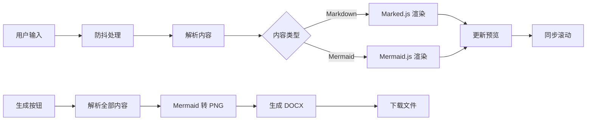

# 项目结构说明

本文档介绍项目的文件组织结构和各文件的作用。

## 📁 目录结构

```
md-mermaid-toDocx/
├── .github/
│   └── workflows/
│       └── deploy.yml          # GitHub Actions 自动部署配置
├── .gitignore                   # Git 忽略文件配置
├── index.html                   # 主应用文件（包含 HTML/CSS/JS）
├── default.md                   # 默认示例内容
├── readme.md                    # 项目说明文档
├── DEPLOY.md                    # 部署指南
└── PROJECT_STRUCTURE.md         # 本文件
```

## 📄 文件说明

### 核心文件

#### `index.html`
主应用文件，包含完整的应用代码：
- **HTML 结构**：页面布局和 DOM 元素
- **CSS 样式**：响应式布局、主题样式
- **JavaScript 逻辑**：
  - Markdown 解析和渲染
  - Mermaid 图表渲染
  - DOCX 文档生成
  - 同步滚动功能
  - 实时预览更新

**技术依赖**（通过 CDN 引入）：
```html
<!-- 使用国内可用的 unpkg.com CDN 源 -->

<!-- Mermaid 图表渲染 -->
<script src="https://unpkg.com/mermaid@11.6.0/dist/mermaid.min.js"></script>

<!-- Markdown 解析 -->
<script src="https://unpkg.com/marked@15.0.12/marked.min.js"></script>

<!-- DOCX 生成 -->
<script src="https://unpkg.com/docx@9.5.0/dist/index.iife.js"></script>

<!-- 文件保存 -->
<script src="https://unpkg.com/file-saver@2.0.5/dist/FileSaver.min.js"></script>
```

**CDN 说明**：
- 使用 [unpkg.com](https://unpkg.com/) 作为 CDN 源
- unpkg 在中国境内访问速度较快且稳定
- 所有依赖库通过 CDN 加载，无需本地安装

#### `default.md`
默认加载的示例内容文件：
- 演示 Markdown 基础语法
- 展示各种 Mermaid 图表类型
- 提供使用说明
- 帮助用户快速上手

**加载机制**：
```javascript
async function loadDefaultMd() {
    const response = await fetch('default.md');
    combinedContentInput.value = await response.text();
}
```

### 配置文件

#### `.github/workflows/deploy.yml`
GitHub Actions 自动部署配置：

**触发条件**：
- 推送到 `main` 或 `master` 分支
- 手动触发（`workflow_dispatch`）

**部署流程**：
1. 检出代码 (`actions/checkout@v4`)
2. 配置 Pages (`actions/configure-pages@v4`)
3. 上传构建产物 (`actions/upload-pages-artifact@v3`)
4. 部署到 Pages (`actions/deploy-pages@v4`)

**权限设置**：
```yaml
permissions:
  contents: read
  pages: write
  id-token: write
```

#### `.gitignore`
Git 版本控制忽略规则：
- 操作系统文件（`.DS_Store`, `Thumbs.db`）
- 编辑器配置（`.vscode/`, `.idea/`）
- 临时文件（`*.tmp`, `*.log`）
- 依赖目录（`node_modules/`）
- 环境变量文件（`.env`）

### 文档文件

#### `readme.md`
项目主文档，包含：
- ✨ 功能特性介绍
- 🚀 在线使用地址
- 💻 本地运行方法
- 📖 使用说明和示例
- 🛠️ 技术栈说明
- 📦 部署指南
- 🙏 致谢和改进说明

#### `DEPLOY.md`
详细的部署指南：
- GitHub 仓库创建
- 代码推送步骤
- GitHub Pages 配置
- 自动部署流程
- 故障排查方法
- 自定义域名设置

#### `PROJECT_STRUCTURE.md`
项目结构说明文档（本文件）

## 🔧 关键功能实现

### 1. 多语言支持

自动检测浏览器语言并支持手动切换：

**语言检测**：
```javascript
let currentLang = localStorage.getItem('preferredLang') || 
                 (navigator.language.startsWith('zh') ? 'zh-CN' : 'en');
```

**多语言文本定义**：
```javascript
const i18n = {
    'zh-CN': {
        title: 'Markdown & Mermaid to DOCX',
        fontLabel: '字体:',
        generateButton: '生成 DOCX',
        // ... 更多文本
    },
    'en': {
        title: 'Markdown & Mermaid to DOCX',
        fontLabel: 'Font:',
        generateButton: 'Generate DOCX',
        // ... 更多文本
    }
};
```

**应用语言**：
```javascript
function applyLanguage(lang) {
    // 更新所有带 data-i18n 属性的元素
    document.querySelectorAll('[data-i18n]').forEach(el => {
        const key = el.getAttribute('data-i18n');
        if (texts[key]) {
            el.textContent = texts[key];
        }
    });
}
```

**特性**：
- 自动检测浏览器语言
- 手动切换语言（语言选择器）
- 使用 localStorage 保存用户偏好
- 支持简体中文和英文

### 2. 响应式布局

使用 CSS Flexbox 和媒体查询实现：

```css
/* 默认上下布局 */
.editor-preview-container {
    display: flex;
    flex-direction: column;
}

/* 宽屏时左右布局 */
@media (min-width: 1024px) {
    .editor-preview-container {
        flex-direction: row;
    }
}
```

### 3. 同步滚动

通过监听滚动事件实现：

```javascript
function syncScroll(source, target) {
    const percentage = source.scrollTop / 
        (source.scrollHeight - source.clientHeight);
    target.scrollTop = percentage * 
        (target.scrollHeight - target.clientHeight);
}

combinedContentInput.addEventListener('scroll', () => {
    syncScroll(combinedContentInput, documentPreviewDiv);
});
```

### 4. 实时预览

使用防抖（debounce）优化性能：

```javascript
function schedulePreviewUpdate() {
    clearTimeout(debounceTimerPreview);
    debounceTimerPreview = setTimeout(updateFullPreview, 500);
}

combinedContentInput.addEventListener('input', schedulePreviewUpdate);
```

### 5. Mermaid 渲染

解析代码块并渲染为图表：

```javascript
// 解析 ```mermaid ... ``` 代码块
const mermaidMatch = content.match(/^```mermaid\n([\s\S]*?)\n```$/m);

// 使用 Mermaid 渲染
await mermaid.render(renderId, mermaidCode);
```

### 6. DOCX 生成

使用 docx 库生成 Word 文档：

```javascript
const doc = new docx.Document({
    creator: "Markdown & Mermaid to DOCX",
    sections: [{
        children: documentElements
    }]
});

const blob = await docx.Packer.toBlob(doc);
saveAs(blob, "document.docx");
```

## 📊 数据流



## 🎨 样式组织

### 全局样式
- 重置样式（`* { margin: 0; padding: 0; }`）
- 基础字体和颜色
- 布局容器样式

### 组件样式
- **工具栏**：`.toolbar`
- **编辑器**：`textarea#combinedContentInput`
- **预览区**：`#documentPreview`
- **按钮**：`button` 及其状态（`:hover`, `:disabled`）

### 响应式样式
- 媒体查询：`@media (min-width: 1024px)`
- 打印样式：`@media print`

### 预览内容样式
- 标题样式：`h1` ~ `h6`
- 段落和列表：`p`, `ul`, `ol`
- 表格样式：`table`, `tr`, `td`, `th`
- 代码样式：`code`, `pre`
- Mermaid 图表：`.mermaid-preview-segment svg`

## 🔄 开发工作流

1. **本地开发**
   ```bash
   python -m http.server 8000
   # 访问 http://localhost:8000
   ```

2. **修改代码**
   - 编辑 `index.html`
   - 刷新浏览器查看效果

3. **提交代码**
   ```bash
   git add .
   git commit -m "描述修改内容"
   git push
   ```

4. **自动部署**
   - GitHub Actions 自动触发
   - 1-2 分钟后生效

## 📈 未来改进方向

- [x] 多语言支持（已完成：中英文）
- [ ] 添加更多语言（日文、韩文等）
- [ ] 添加主题切换（亮色/暗色）
- [ ] 支持更多导出格式（PDF、HTML）
- [ ] 添加本地存储功能
- [ ] 支持文件拖拽上传
- [ ] 添加快捷键支持
- [ ] 优化移动端体验
- [ ] 添加协同编辑功能
- [ ] 支持自定义样式模板

## 🐛 已知问题

- Mermaid 图表在 DOCX 中以 PNG 格式嵌入，可能影响清晰度
- 复杂表格在 DOCX 中可能需要手动调整
- 某些 Markdown 扩展语法可能不支持

## 📝 维护说明

### 依赖更新

定期检查并更新 CDN 依赖：
- Mermaid.js
- Marked.js
- docx
- FileSaver.js

### 浏览器兼容性

支持的浏览器：
- ✅ Chrome 90+
- ✅ Firefox 88+
- ✅ Safari 14+
- ✅ Edge 90+

### 性能优化

- 使用防抖减少渲染频率
- 大文档分段渲染
- 图片懒加载
- CSS 优化

## 📞 技术支持

如有问题，请：
1. 查看 [readme.md](readme.md)
2. 查看 [DEPLOY.md](DEPLOY.md)
3. 提交 GitHub Issue