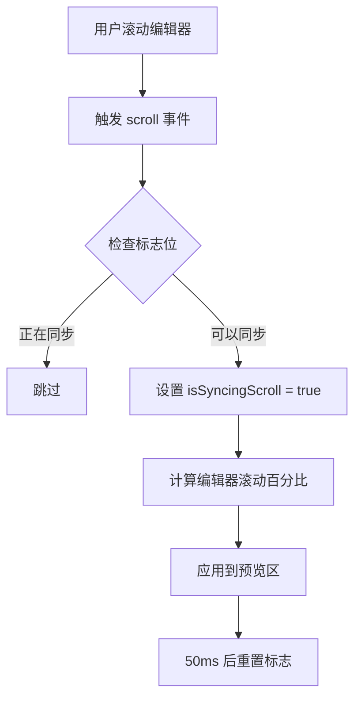
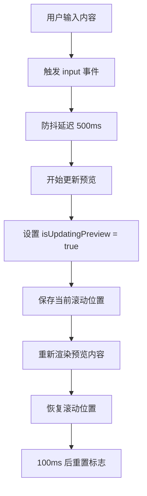
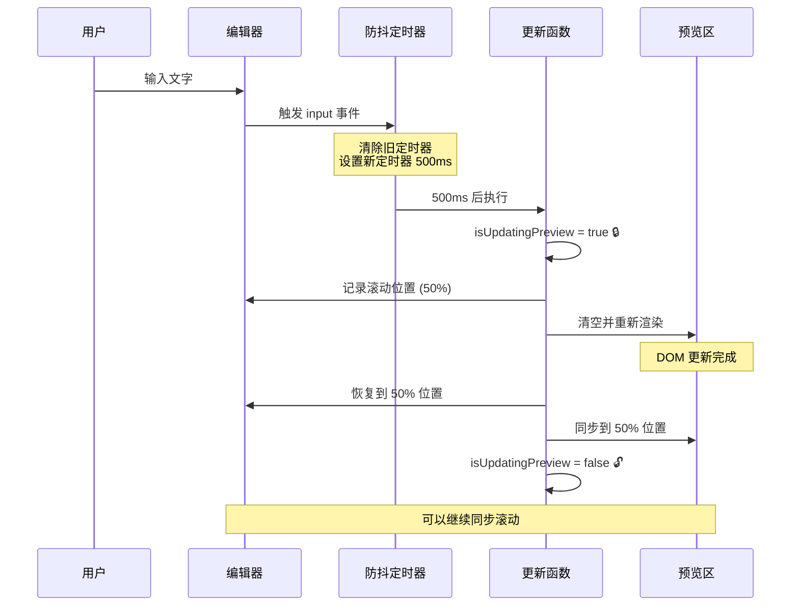
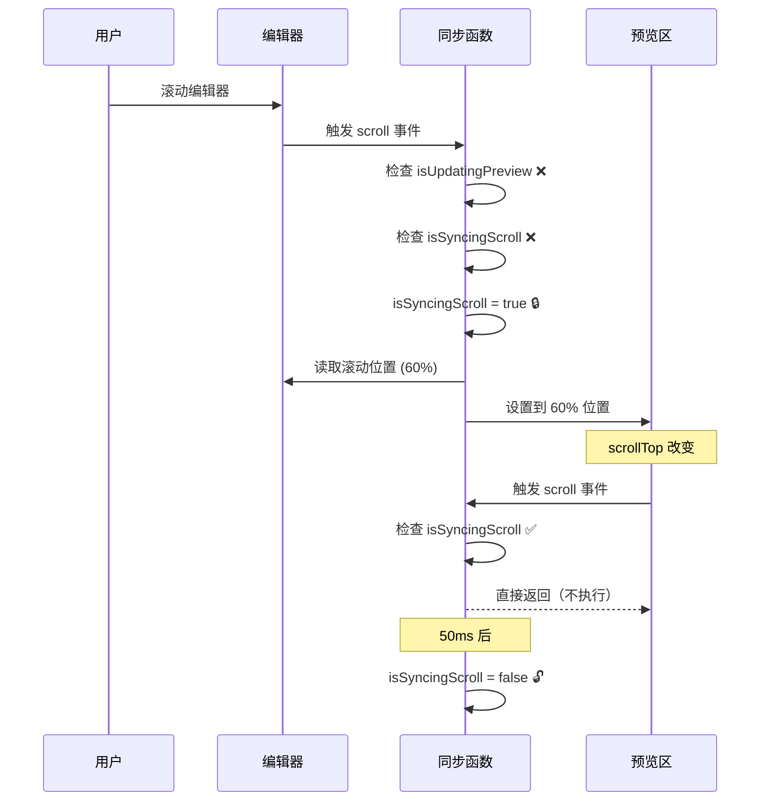

# 同步滚动功能说明

本文档详细解释项目中的同步滚动功能实现原理和问题修复方案。

## 🎯 功能目标

实现编辑器和预览区域的双向同步滚动，让用户在编辑时能够方便地对照查看。

## 📐 同步滚动的数学原理

### 核心思想

将滚动位置转换为百分比，然后应用到目标元素。

### 计算公式

```javascript
// 1. 计算源元素的滚动百分比
const sourceScrollPercentage = source.scrollTop / (source.scrollHeight - source.clientHeight);

// 2. 应用到目标元素
const targetScrollTop = sourceScrollPercentage * (target.scrollHeight - target.clientHeight);
target.scrollTop = targetScrollTop;
```

### 公式解释

#### 关键属性

- **scrollTop**：元素当前滚动的距离（从顶部开始）
- **scrollHeight**：元素内容的总高度（包括不可见部分）
- **clientHeight**：元素可见区域的高度（视口高度）

#### 可视化示例

```
┌─────────────────┐  ← scrollTop = 0 (顶部)
│                 │
│  可见区域       │  ← clientHeight = 500px
│                 │
├─────────────────┤  ← scrollTop = 当前位置
│                 │
│  隐藏内容       │
│                 │
│                 │
└─────────────────┘  ← scrollHeight = 2000px (总高度)
```

#### 计算过程

假设编辑器滚动到 50% 位置：

```javascript
// 编辑器属性
editor.scrollTop = 750px        // 当前滚动位置
editor.scrollHeight = 2000px    // 总内容高度
editor.clientHeight = 500px     // 可见高度

// 1. 计算滚动百分比
maxScroll = 2000 - 500 = 1500px  // 最大可滚动距离
percentage = 750 / 1500 = 0.5    // 50%

// 2. 应用到预览区（假设预览区更高）
preview.scrollHeight = 3000px
preview.clientHeight = 500px
preview.maxScroll = 3000 - 500 = 2500px

// 3. 计算预览区应该滚动的位置
preview.scrollTop = 0.5 × 2500 = 1250px
```

## 🔄 工作流程

### 1. 用户滚动编辑器



### 2. 预览内容更新



## 🐛 问题分析

### 问题 1：输入时跳转到顶部

**现象**：
- 用户在编辑器中输入文字
- 预览区域更新渲染
- 编辑器突然滚动到顶部
- 用户找不到正在编辑的位置

**原因**：

```javascript
// 触发链：
用户输入 
→ updateFullPreview() 
→ documentPreviewDiv.innerHTML = '' (清空预览)
→ 预览区 scrollTop 重置为 0
→ 触发预览区的 scroll 事件
→ syncScroll(preview, editor)
→ 编辑器被滚动到顶部 ❌
```

### 问题 2：循环触发

**现象**：
- 滚动一个区域
- 两个区域来回触发滚动事件
- 造成性能问题

**原因**：

```javascript
// 循环：
编辑器滚动 
→ 触发编辑器 scroll 事件
→ 同步到预览区
→ 预览区 scrollTop 改变
→ 触发预览区 scroll 事件
→ 同步回编辑器 ♻️
→ 无限循环
```

## ✅ 解决方案

### 方案 1：防止循环触发

使用 `isSyncingScroll` 标志：

```javascript
let isSyncingScroll = false;

function syncScroll(source, target) {
    if (isSyncingScroll) return;  // 🚫 如果正在同步，直接返回
    isSyncingScroll = true;        // 🔒 上锁
    
    // 执行同步逻辑
    target.scrollTop = ...;
    
    setTimeout(() => {
        isSyncingScroll = false;   // 🔓 50ms 后解锁
    }, 50);
}
```

**工作原理**：
1. A 滚动 → 设置标志 → 同步到 B
2. B 的 scrollTop 改变 → 触发 B 的 scroll 事件
3. B 的 scroll 事件检查标志 → 发现正在同步 → 不执行
4. 50ms 后标志重置

### 方案 2：预览更新时保持位置

使用 `isUpdatingPreview` 标志：

```javascript
let isUpdatingPreview = false;

async function updateFullPreview() {
    isUpdatingPreview = true;  // 🔒 标记正在更新
    
    // 1️⃣ 保存当前位置
    const editorScrollTop = combinedContentInput.scrollTop;
    const editorScrollPercentage = editorScrollTop / 
        (combinedContentInput.scrollHeight - combinedContentInput.clientHeight);
    
    // 2️⃣ 更新预览内容
    documentPreviewDiv.innerHTML = '';
    // ... 渲染新内容
    
    // 3️⃣ 延迟恢复位置（等待 DOM 更新）
    setTimeout(() => {
        // 恢复编辑器位置
        combinedContentInput.scrollTop = 
            editorScrollPercentage * 
            (combinedContentInput.scrollHeight - combinedContentInput.clientHeight);
        
        // 同步预览区位置
        documentPreviewDiv.scrollTop = 
            editorScrollPercentage * 
            (documentPreviewDiv.scrollHeight - documentPreviewDiv.clientHeight);
        
        isUpdatingPreview = false;  // 🔓 解锁
    }, 100);
}
```

### 方案 3：有条件的同步滚动

```javascript
// 编辑器滚动事件
combinedContentInput.addEventListener('scroll', () => {
    if (!isUpdatingPreview) {  // ✅ 只在非更新时同步
        syncScroll(combinedContentInput, documentPreviewDiv);
    }
});

// 预览区滚动事件
documentPreviewDiv.addEventListener('scroll', () => {
    if (!isUpdatingPreview) {  // ✅ 只在非更新时同步
        syncScroll(documentPreviewDiv, combinedContentInput);
    }
});
```

## 🎬 完整流程

### 用户输入文字



### 用户手动滚动



## 📊 关键参数

### 时间延迟

| 参数 | 值 | 说明 |
|------|-----|------|
| 防抖延迟 | 500ms | 用户停止输入后才更新预览 |
| 同步锁延迟 | 50ms | 防止循环触发的保护时间 |
| 位置恢复延迟 | 100ms | 等待 DOM 更新完成 |

### 标志位

| 标志位 | 用途 |
|--------|------|
| `isSyncingScroll` | 防止滚动同步的循环触发 |
| `isUpdatingPreview` | 防止预览更新时触发同步滚动 |

## 🧪 测试场景

### 场景 1：快速输入
- ✅ 编辑器保持在输入位置
- ✅ 预览区同步到相应位置
- ✅ 不会跳转到顶部

### 场景 2：滚动编辑器
- ✅ 预览区跟随滚动
- ✅ 不会循环触发
- ✅ 滚动流畅

### 场景 3：滚动预览区
- ✅ 编辑器跟随滚动
- ✅ 不会循环触发
- ✅ 滚动流畅

### 场景 4：插入大量内容
- ✅ 编辑器保持在光标位置
- ✅ 预览区正确同步
- ✅ 性能良好

## 🔍 调试技巧

### 查看滚动状态

在浏览器控制台执行：

```javascript
// 查看编辑器状态
console.log({
    scrollTop: combinedContentInput.scrollTop,
    scrollHeight: combinedContentInput.scrollHeight,
    clientHeight: combinedContentInput.clientHeight,
    percentage: combinedContentInput.scrollTop / 
        (combinedContentInput.scrollHeight - combinedContentInput.clientHeight)
});

// 查看预览区状态
console.log({
    scrollTop: documentPreviewDiv.scrollTop,
    scrollHeight: documentPreviewDiv.scrollHeight,
    clientHeight: documentPreviewDiv.clientHeight,
    percentage: documentPreviewDiv.scrollTop / 
        (documentPreviewDiv.scrollHeight - documentPreviewDiv.clientHeight)
});

// 查看标志位
console.log({
    isSyncingScroll,
    isUpdatingPreview
});
```

### 监控滚动事件

```javascript
// 添加调试日志
combinedContentInput.addEventListener('scroll', () => {
    console.log('Editor scroll event', {
        isUpdatingPreview,
        isSyncingScroll,
        scrollTop: combinedContentInput.scrollTop
    });
});
```

## 💡 优化建议

### 1. 智能同步

只在内容高度足够时才启用同步：

```javascript
function shouldSync(element) {
    return element.scrollHeight > element.clientHeight * 1.5;
}

if (shouldSync(combinedContentInput) && shouldSync(documentPreviewDiv)) {
    // 启用同步滚动
}
```

### 2. 平滑滚动

使用 `scrollTo` 代替直接设置 `scrollTop`：

```javascript
target.scrollTo({
    top: targetScrollTop,
    behavior: 'smooth'  // 平滑滚动
});
```

### 3. 节流优化

对滚动事件进行节流：

```javascript
let scrollThrottleTimer = null;

combinedContentInput.addEventListener('scroll', () => {
    if (scrollThrottleTimer) return;
    
    scrollThrottleTimer = setTimeout(() => {
        syncScroll(combinedContentInput, documentPreviewDiv);
        scrollThrottleTimer = null;
    }, 16);  // ~60fps
});
```

## 📚 相关资源

- [MDN: Element.scrollTop](https://developer.mozilla.org/en-US/docs/Web/API/Element/scrollTop)
- [MDN: Element.scrollHeight](https://developer.mozilla.org/en-US/docs/Web/API/Element/scrollHeight)
- [MDN: Element.clientHeight](https://developer.mozilla.org/en-US/docs/Web/API/Element/clientHeight)

## 🎓 总结

同步滚动的核心是：
1. **百分比转换**：将绝对位置转换为相对位置
2. **状态管理**：使用标志位防止循环和冲突
3. **位置保持**：更新内容时保存和恢复位置
4. **时机控制**：在合适的时机启用/禁用同步

通过这些机制，实现了流畅、准确的双向同步滚动体验。