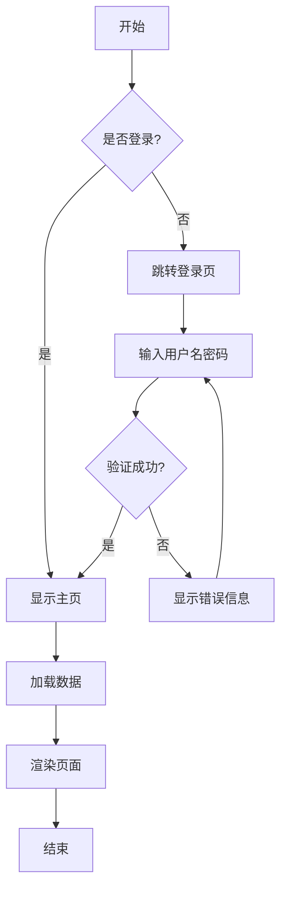
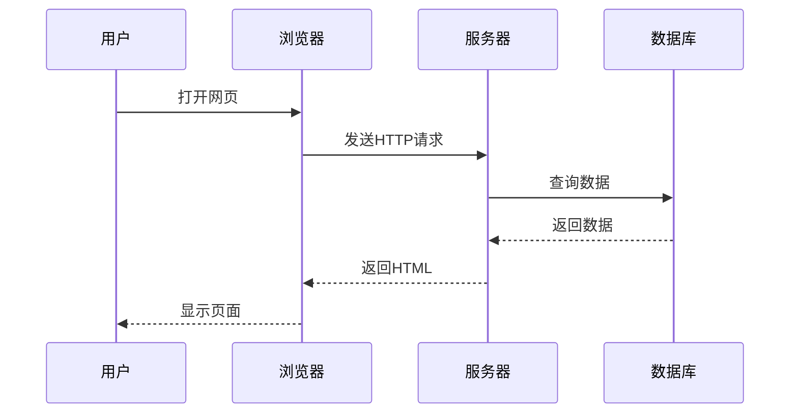
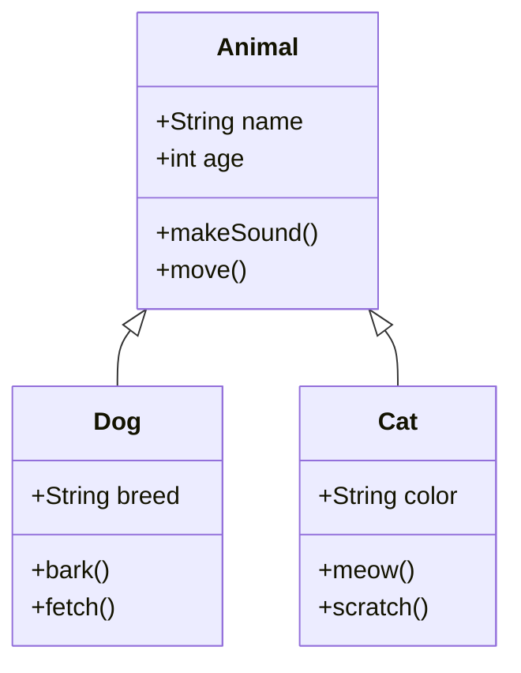
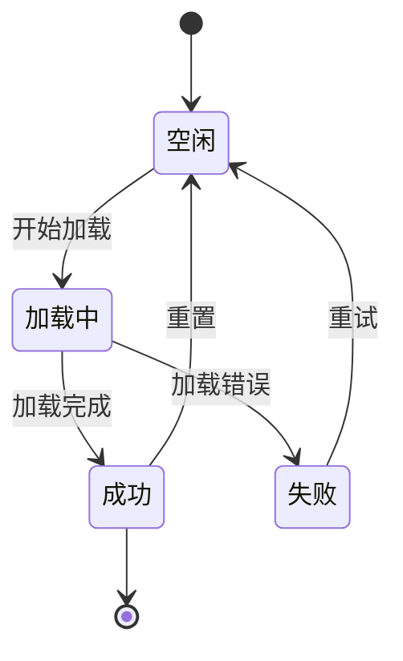
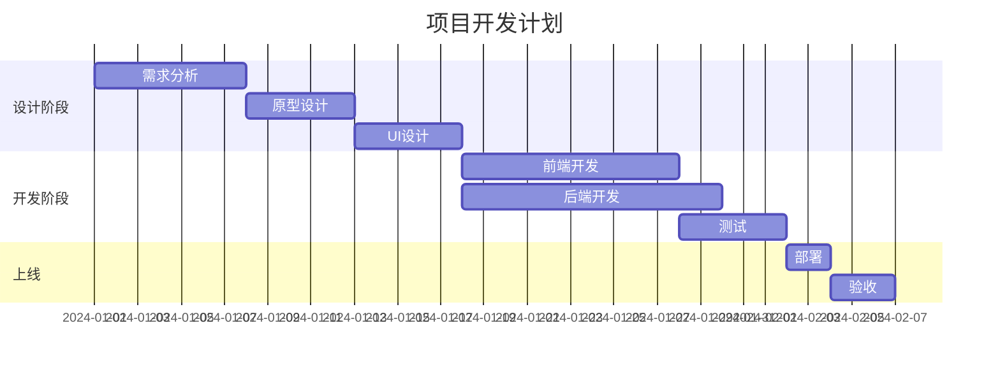
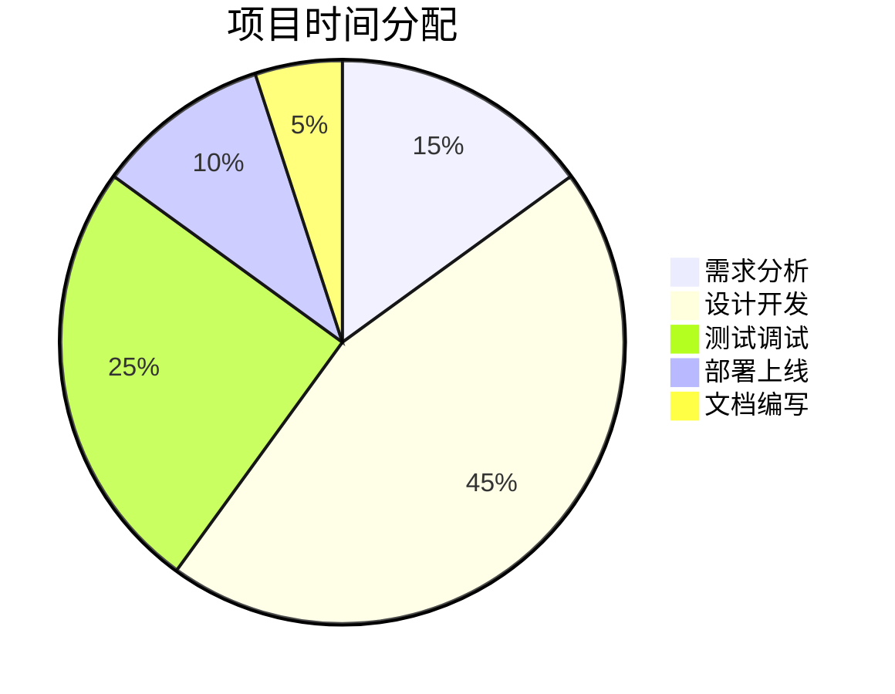

# Markdown & Mermaid 示例文档

欢迎使用 Markdown & Mermaid to DOCX 转换器！

## 功能特性

本工具支持以下功能：

- **Markdown 语法**：标题、列表、表格、代码块等
- **Mermaid 图表**：流程图、时序图、类图等多种图表
- **实时预览**：编辑内容即时渲染
- **同步滚动**：左右对照，方便编辑
- **DOCX 导出**：一键生成 Word 文档

## Markdown 基础语法

### 文本格式

这是 **粗体文本**，这是 *斜体文本*，这是 ~~删除线文本~~。

这是 `行内代码` 示例。

### 列表

无序列表：
- 项目 1
- 项目 2
  - 子项目 2.1
  - 子项目 2.2
- 项目 3

有序列表：
1. 第一步
2. 第二步
3. 第三步

任务列表：
- [x] 已完成的任务
- [ ] 待完成的任务
- [ ] 另一个待完成的任务

### 表格

| 功能 | 描述 | 状态 |
|------|------|------|
| Markdown 渲染 | 支持完整语法 | ✅ |
| Mermaid 图表 | 多种图表类型 | ✅ |
| DOCX 导出 | 一键生成 | ✅ |
| 实时预览 | 即时渲染 | ✅ |

### 代码块

```javascript
function hello() {
    console.log("Hello, World!");
    return true;
}
```

```python
def greet(name):
    print(f"Hello, {name}!")
    return True
```

## Mermaid 图表示例

### 流程图



### 时序图



### 类图



### 状态图



### 甘特图



### 饼图



## 引用

> 这是一段引用文本。
> 
> 可以包含多个段落。

## 链接

这是一个 [GitHub](https://github.com) 链接。

---

## 使用说明

1. 在左侧编辑器中修改此内容
2. 右侧会实时显示预览效果
3. 选择合适的字体（支持中文字体如微软雅黑、宋体、黑体、楷体等，以及英文字体 Calibri、Arial 等）
4. 点击"生成 DOCX"按钮下载文档
5. 编辑器和预览区域支持同步滚动，方便对照编辑

## 字体建议

- **中文文档**：推荐使用微软雅黑、黑体（清晰易读）
- **正式文档**：推荐使用宋体、仿宋（传统正式）
- **艺术文档**：推荐使用楷体、华文楷体（优雅古典）
- **英文文档**：推荐使用 Calibri、Arial（现代简洁）

祝使用愉快！🎉