# Markdown & Mermaid 示例文档

欢迎使用 Markdown & Mermaid to DOCX 转换器！

## 功能特性

本工具支持以下功能：

- **Markdown 语法**：标题、列表、表格、代码块等
- **Mermaid 图表**：流程图、时序图、类图等多种图表
- **主题配置**：15+ 精美主题，支持自定义颜色（Flowchart, State, Sequence, Class, ER 图表）
- **ASCII 输出**：支持将图表导出为 ASCII/Unicode 文本格式
- **实时预览**：编辑内容即时渲染
- **同步滚动**：左右对照，方便编辑
- **DOCX 导出**：一键生成 Word 文档

## Markdown 基础语法

### 文本格式

这是 **粗体文本**，这是 *斜体文本*，这是 ~~删除线文本~~。

这是 `行内代码` 示例。

### 列表

无序列表：
- 项目 1
- 项目 2
  - 子项目 2.1
  - 子项目 2.2
- 项目 3

有序列表：
1. 第一步
2. 第二步
3. 第三步

任务列表：
- [x] 已完成的任务
- [ ] 待完成的任务
- [ ] 另一个待完成的任务

### 表格

| 功能 | 描述 | 状态 |
|------|------|------|
| Markdown 渲染 | 支持完整语法 | ✅ |
| Mermaid 图表 | 多种图表类型 | ✅ |
| DOCX 导出 | 一键生成 | ✅ |
| 实时预览 | 即时渲染 | ✅ |

### 代码块

```javascript
function hello() {
    console.log("Hello, World!");
    return true;
}
```

```python
def greet(name):
    print(f"Hello, {name}!")
    return True
```

## Mermaid 图表示例

### 流程图

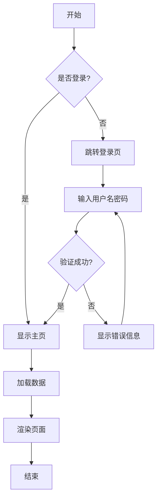
```mermaid
graph TD
    A["开始"] --> B{"是否登录?"}
    B -->|"是"| C["显示主页"]
    B -->|"否"| D["跳转登录页"]
    C --> E["加载数据"]
    D --> F["输入用户名密码"]
    F --> G{"验证成功?"}
    G -->|"是"| C
    G -->|"否"| H["显示错误信息"]
    H --> F
    E --> I["渲染页面"]
    I --> J["结束"]
```

### 时序图

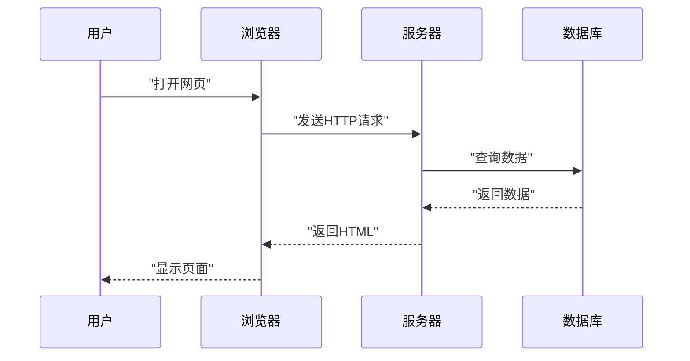
```mermaid
sequenceDiagram
    participant 用户
    participant 浏览器
    participant 服务器
    participant 数据库

    用户->>浏览器: "打开网页"
    浏览器->>服务器: "发送HTTP请求"
    服务器->>数据库: "查询数据"
    数据库-->>服务器: "返回数据"
    服务器-->>浏览器: "返回HTML"
    浏览器-->>用户: "显示页面"
```

### 类图

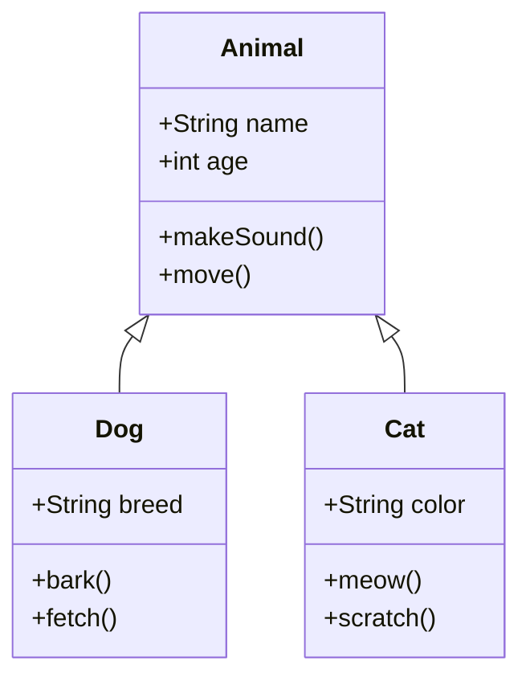
```mermaid
classDiagram
    class Animal {
        +String name
        +int age
        +makeSound()
        +move()
    }

    class Dog {
        +String breed
        +bark()
        +fetch()
    }

    class Cat {
        +String color
        +meow()
        +scratch()
    }

    Animal <|-- Dog
    Animal <|-- Cat
```

### 状态图

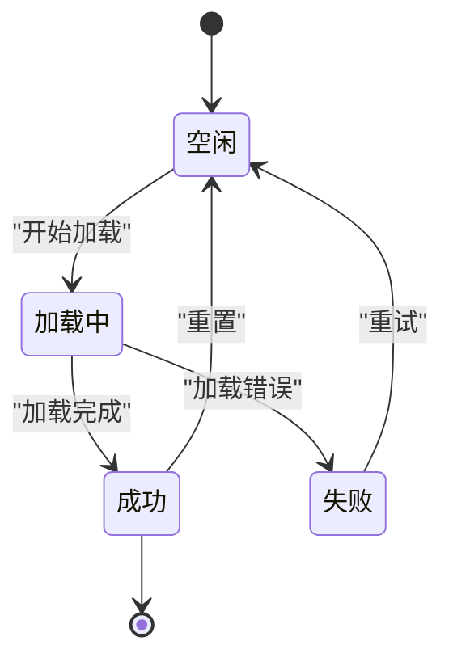
```mermaid
stateDiagram-v2
    [*] --> 空闲
    空闲 --> 加载中: "开始加载"
    加载中 --> 成功: "加载完成"
    加载中 --> 失败: "加载错误"
    成功 --> 空闲: "重置"
    失败 --> 空闲: "重试"
    成功 --> [*]
```

### 甘特图

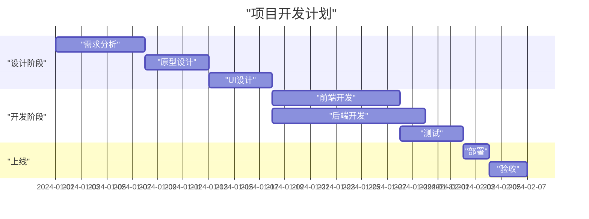
```mermaid
gantt
    title "项目开发计划"
    dateFormat  YYYY-MM-DD
    section "设计阶段"
    "需求分析"           :a1, 2024-01-01, 7d
    "原型设计"           :a2, after a1, 5d
    "UI设计"             :a3, after a2, 5d
    section "开发阶段"
    "前端开发"           :b1, after a3, 10d
    "后端开发"           :b2, after a3, 12d
    "测试"               :b3, after b1, 5d
    section "上线"
    "部署"               :c1, after b3, 2d
    "验收"               :c2, after c1, 3d
```

### 饼图

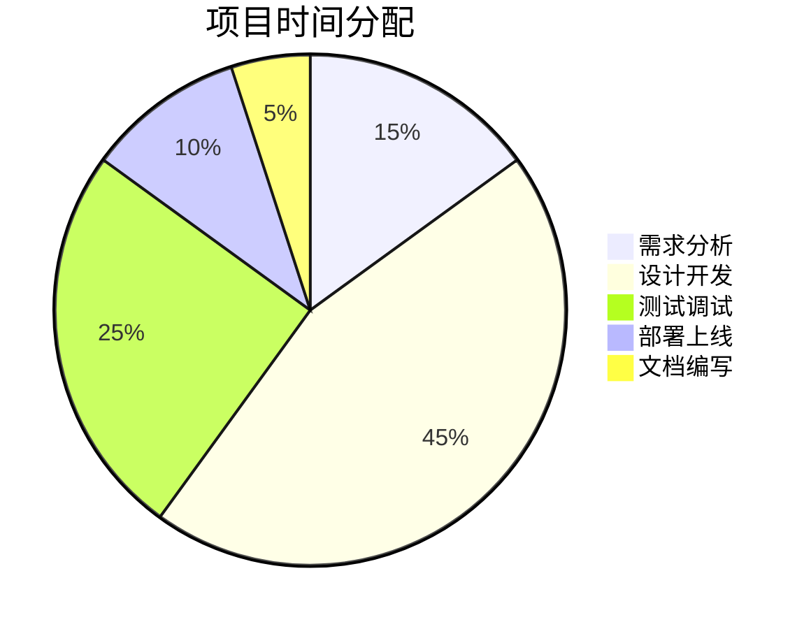
```mermaid
pie title 项目时间分配
    "需求分析" : 15
    "设计开发" : 45
    "测试调试" : 25
    "部署上线" : 10
    "文档编写" : 5
```

### ER 图（实体关系图）

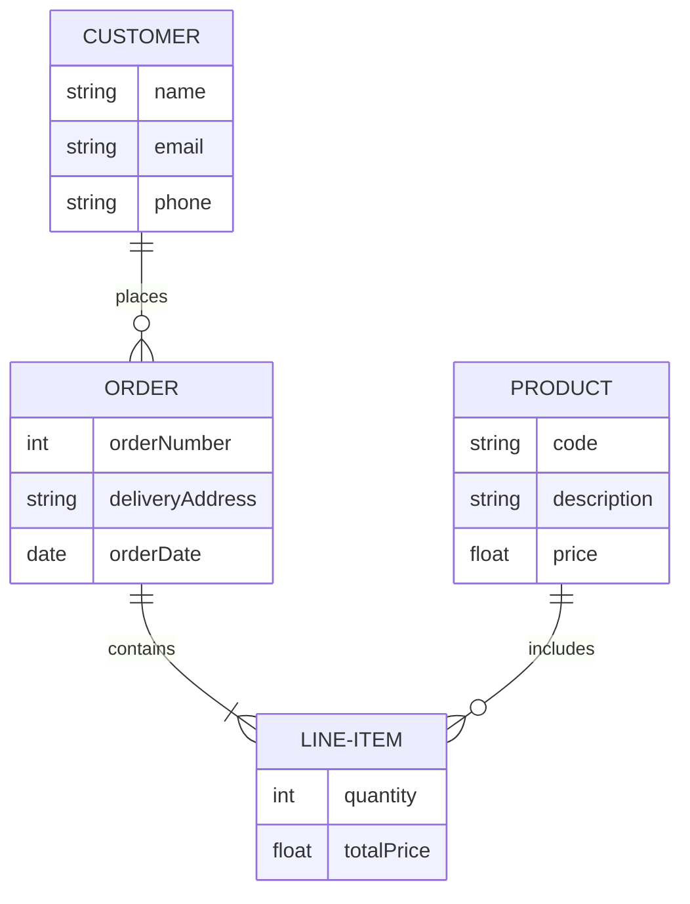
```mermaid
erDiagram
    CUSTOMER ||--o{ ORDER : places
    CUSTOMER {
        string name
        string email
        string phone
    }
    ORDER ||--|{ LINE-ITEM : contains
    ORDER {
        int orderNumber
        string deliveryAddress
        date orderDate
    }
    PRODUCT ||--o{ LINE-ITEM : includes
    PRODUCT {
        string code
        string description
        float price
    }
    LINE-ITEM {
        int quantity
        float totalPrice
    }
```

### 用户旅程图

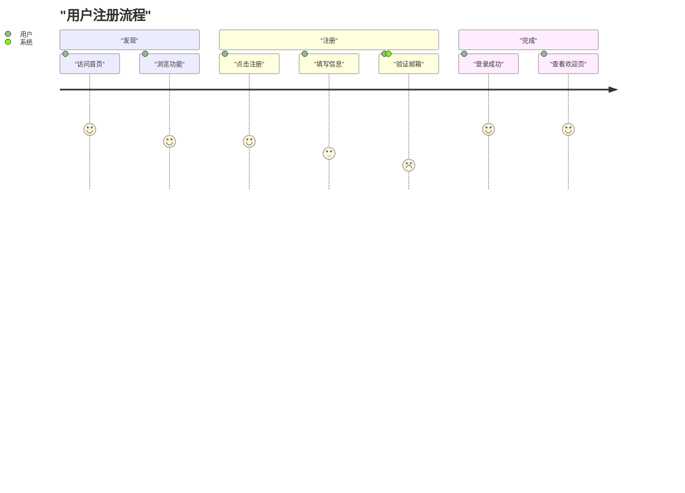
```mermaid
journey
    title "用户注册流程"
    section "发现"
      "访问首页": 5: 用户
      "浏览功能": 4: 用户
    section "注册"
      "点击注册": 4: 用户
      "填写信息": 3: 用户
      "验证邮箱": 2: 用户, 系统
    section "完成"
      "登录成功": 5: 用户
      "查看欢迎页": 5: 用户
```

### Git 图

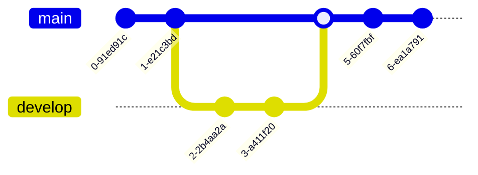
```mermaid
gitGraph
    commit
    commit
    branch develop
    checkout develop
    commit
    commit
    checkout main
    merge develop
    commit
    commit
```

### 象限图

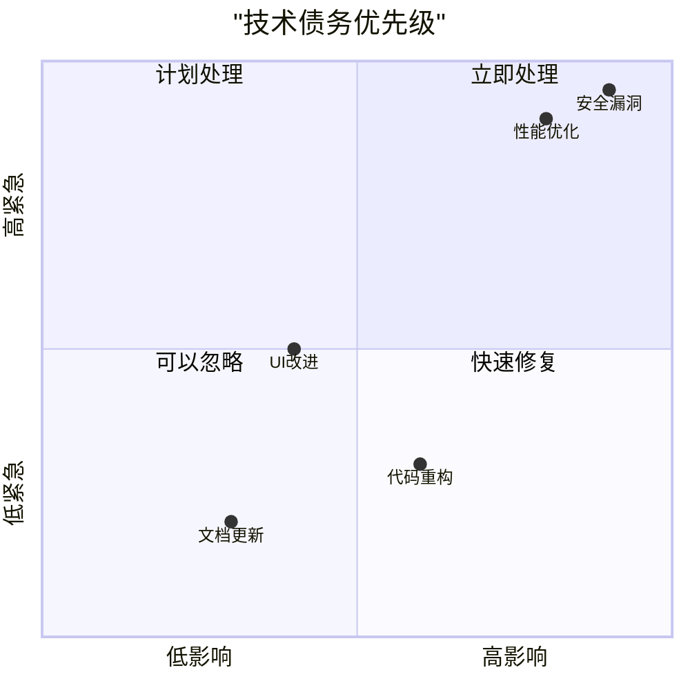
```mermaid
quadrantChart
    title "技术债务优先级"
    x-axis "低影响" --> "高影响"
    y-axis "低紧急" --> "高紧急"
    quadrant-1 "立即处理"
    quadrant-2 "计划处理"
    quadrant-3 "可以忽略"
    quadrant-4 "快速修复"
    "性能优化": [0.8, 0.9]
    "代码重构": [0.6, 0.3]
    "文档更新": [0.3, 0.2]
    "安全漏洞": [0.9, 0.95]
    "UI改进": [0.4, 0.5]
```

### 思维导图

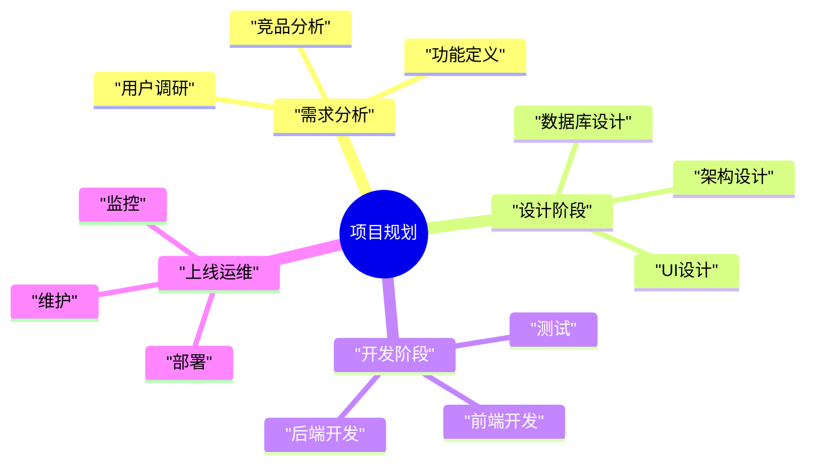
```mermaid
mindmap
  root(("项目规划"))
    "需求分析"
      "用户调研"
      "竞品分析"
      "功能定义"
    "设计阶段"
      "UI设计"
      "架构设计"
      "数据库设计"
    "开发阶段"
      "前端开发"
      "后端开发"
      "测试"
    "上线运维"
      "部署"
      "监控"
      "维护"
```

### 时间线

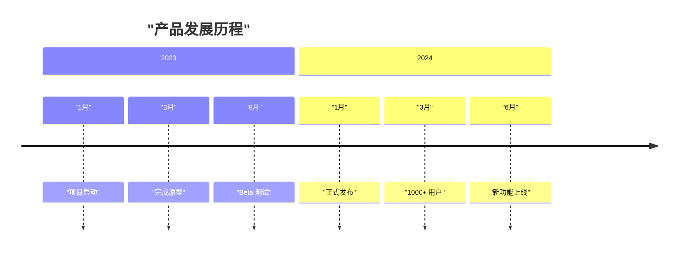
```mermaid
timeline
    title "产品发展历程"
    section 2023
        "1月" : "项目启动"
        "3月" : "完成原型"
        "6月" : "Beta 测试"
    section 2024
        "1月" : "正式发布"
        "3月" : "1000+ 用户"
        "6月" : "新功能上线"
```

### 需求图

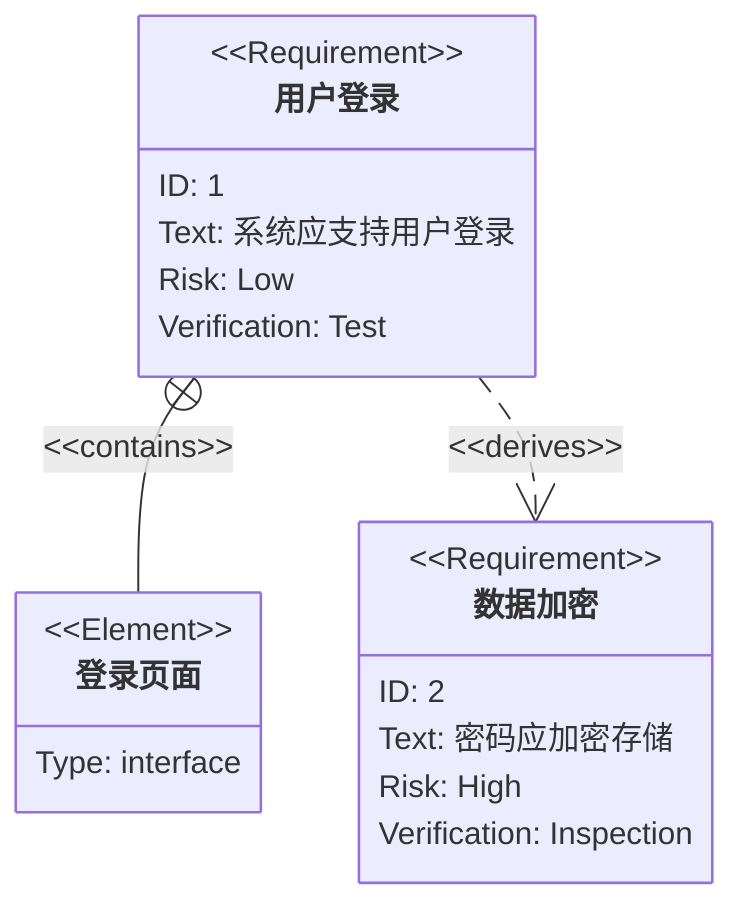
```mermaid
requirementDiagram
    requirement "用户登录" {
        id: 1
        text: "系统应支持用户登录"
        risk: low
        verifymethod: test
    }

    element "登录页面" {
        type: interface
    }

    requirement "数据加密" {
        id: 2
        text: "密码应加密存储"
        risk: high
        verifymethod: inspection
    }

    "用户登录" - contains -> "登录页面"
    "用户登录" - derives -> "数据加密"
```

### XY 图表

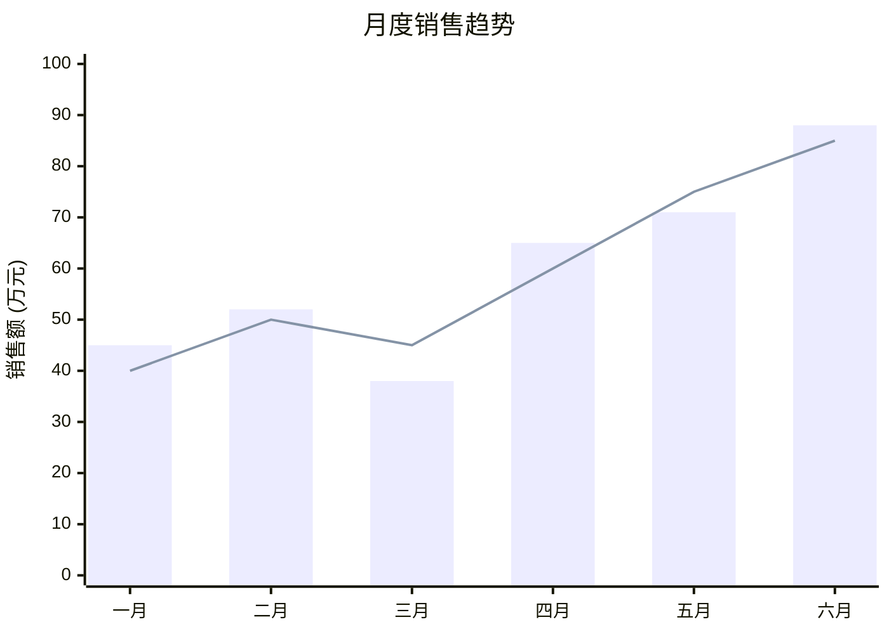
```mermaid
xychart-beta
    title "月度销售趋势"
    x-axis ["一月", "二月", "三月", "四月", "五月", "六月"]
    y-axis "销售额 (万元)" 0 --> 100
    bar [45, 52, 38, 65, 71, 88]
    line [40, 50, 45, 60, 75, 85]
```

### 桑基图

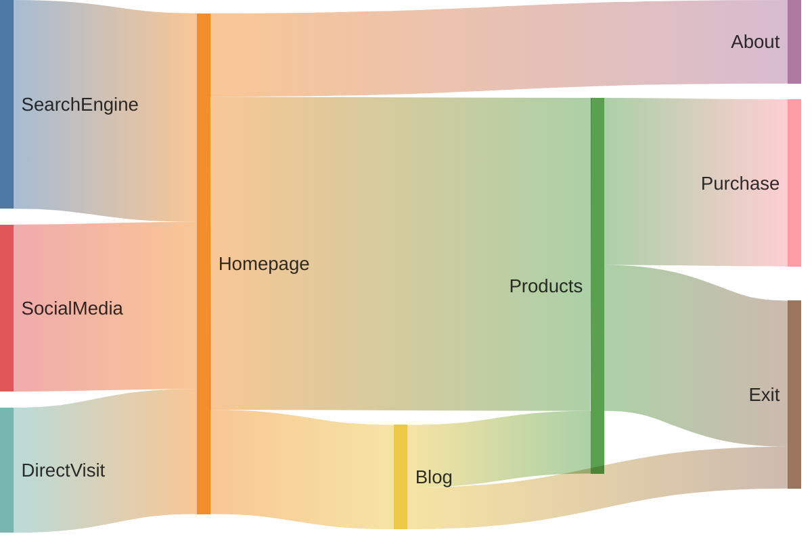
```mermaid
---
config:
  sankey:
    showValues: false
---
sankey-beta

SearchEngine,Homepage,100
SocialMedia,Homepage,80
DirectVisit,Homepage,60
Homepage,Products,150
Homepage,Blog,50
Homepage,About,40
Products,Purchase,80
Products,Exit,70
Blog,Products,30
Blog,Exit,20
```

### 块图

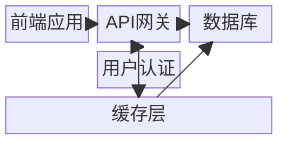
```mermaid
block-beta
    columns 3
    A["前端应用"] B["API网关"] C["数据库"]
    A --> B
    B --> C

    space
    D["用户认证"]
    space

    D --> B

    E["缓存层"]:3
    B --> E
    E --> C
```

### 时序图（带注释和分组）

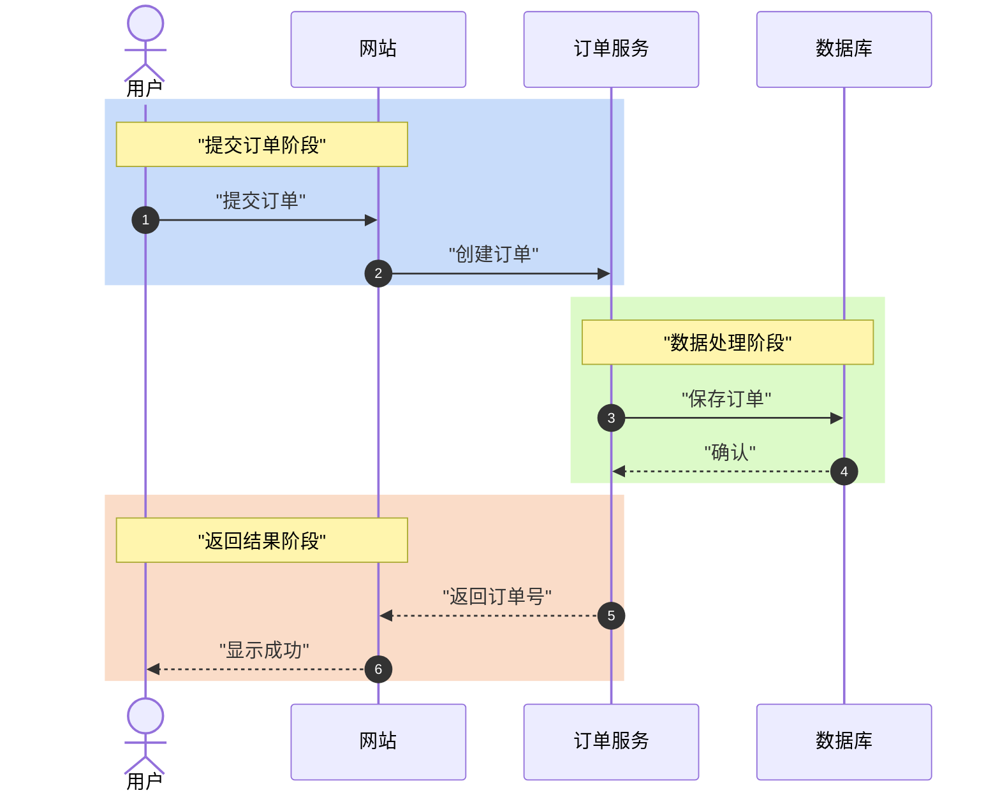
```mermaid
sequenceDiagram
    autonumber
    actor 用户
    participant 网站
    participant 订单服务
    participant 数据库

    rect rgb(200, 220, 250)
    Note over 用户,网站: "提交订单阶段"
    用户->>网站: "提交订单"
    网站->>订单服务: "创建订单"
    end

    rect rgb(220, 250, 200)
    Note over 订单服务,数据库: "数据处理阶段"
    订单服务->>数据库: "保存订单"
    数据库-->>订单服务: "确认"
    end

    rect rgb(250, 220, 200)
    Note over 网站,用户: "返回结果阶段"
    订单服务-->>网站: "返回订单号"
    网站-->>用户: "显示成功"
    end
```

### 看板图

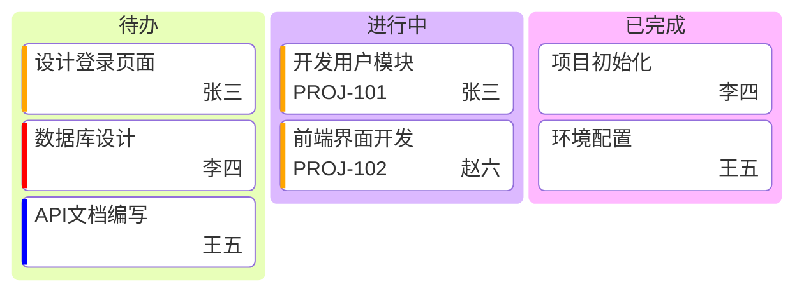
```mermaid
kanban
  todo[待办]
    task1[设计登录页面]@{ assigned: '张三', priority: 'High' }
    task2[数据库设计]@{ assigned: '李四', priority: 'Very High' }
    task3[API文档编写]@{ assigned: '王五', priority: 'Low' }

  doing[进行中]
    task4[开发用户模块]@{ assigned: '张三', ticket: 'PROJ-101', priority: 'High' }
    task5[前端界面开发]@{ assigned: '赵六', ticket: 'PROJ-102', priority: 'High' }

  done[已完成]
    task6[项目初始化]@{ assigned: '李四' }
    task7[环境配置]@{ assigned: '王五' }
```

### 架构图

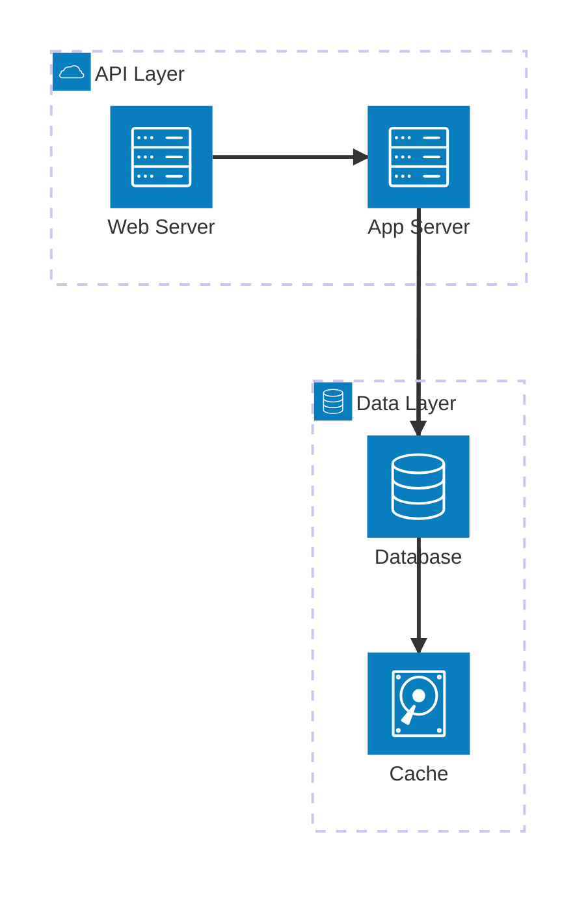
```mermaid
architecture-beta
    group api(cloud)[API Layer]

    service web(server)[Web Server] in api
    service app(server)[App Server] in api

    group data(database)[Data Layer]

    service db(database)[Database] in data
    service cache(disk)[Cache] in data

    web:R --> L:app
    app:B --> T:db
    app:B --> T:cache
```

### C4 架构图

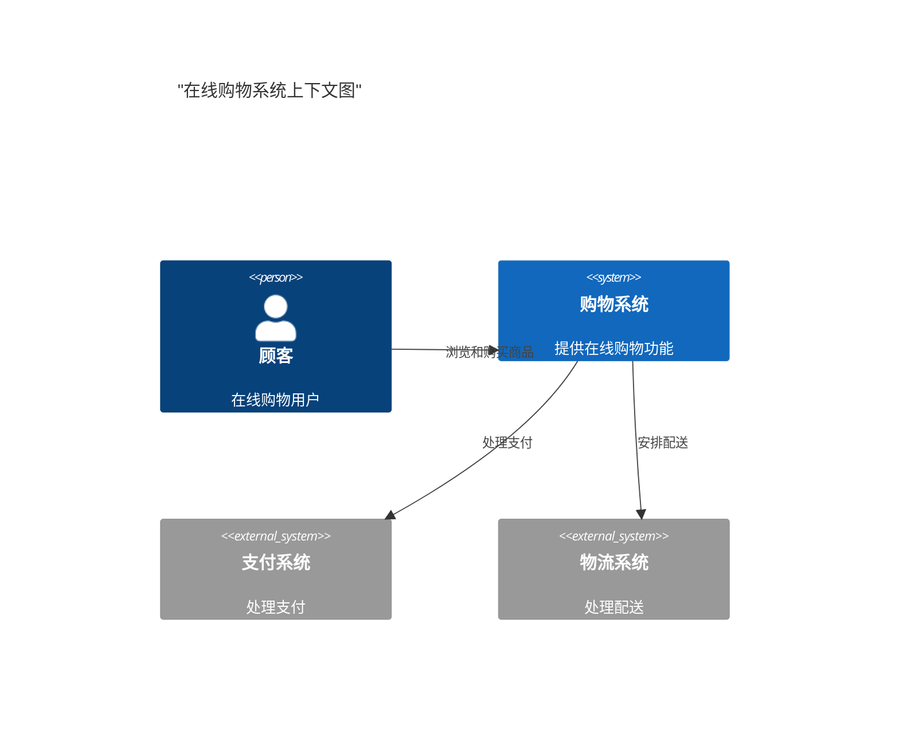
```mermaid
C4Context
    title "在线购物系统上下文图"

    Person(customer, "顾客", "在线购物用户")
    System(shop, "购物系统", "提供在线购物功能")
    System_Ext(payment, "支付系统", "处理支付")
    System_Ext(shipping, "物流系统", "处理配送")

    Rel(customer, shop, "浏览和购买商品")
    Rel(shop, payment, "处理支付")
    Rel(shop, shipping, "安排配送")
```


### 雷达图（暂不支持）

```mermaid
radar-beta
    title "技术能力评估"
    axis "前端开发", "后端开发", "数据库", "DevOps", "测试", "架构设计"
    curve team1["团队A"]{85, 70, 75, 60, 80, 65}
    curve team2["团队B"]{70, 90, 80, 85, 70, 75}
    curve team3["团队C"]{60, 65, 90, 70, 85, 80}
```

## 引用

> 这是一段引用文本。
>
> 可以包含多个段落。

## 链接

这是一个 [GitHub](https://github.com) 链接。

---

## 使用说明

1. 在左侧编辑器中修改此内容
2. 右侧会实时显示预览效果
3. **选择主题**：使用顶部主题选择器切换 15+ 种精美主题
4. **自定义主题**：点击 🎨 按钮自定义背景色、前景色等颜色配置
5. **输出模式**：
   - **SVG (主题)**：应用主题到支持的图表（Flowchart, Sequence, Class, ER）
   - **ASCII (文本)**：将图表转换为纯文本，适合终端和聊天界面
   - **经典 (兼容)**：所有图表使用原生 Mermaid.js 渲染，最大兼容性
6. 选择合适的字体（支持中文字体如微软雅黑、宋体、黑体、楷体等，以及英文字体 Calibri、Arial 等）
7. 点击"生成 DOCX"按钮下载文档
8. 编辑器和预览区域支持同步滚动，方便对照编辑

### 输出模式说明

#### SVG (主题) - 默认模式
- 为支持的图表应用自定义主题（Flowchart, Sequence, Class, ER）
- 图表美观、专业，颜色可自定义
- 不支持主题的图表（State, Gantt, Pie 等）使用原生 Mermaid.js 渲染

#### ASCII (文本) - 终端友好
- 将图表转换为纯文本格式，适合：
  - 终端/命令行界面
  - 聊天工具（Slack, Discord, 企业微信等）
  - 纯文本文档
- 支持 Unicode 盒绘字符（`┌─┐│└┘`）和纯 ASCII 字符（`+-|`）
- 仅支持：Flowchart, Sequence, Class, ER

#### 经典 (兼容) - 完全兼容模式
- **所有图表**强制使用原生 Mermaid.js 渲染
- 不应用自定义主题，使用 Mermaid 默认样式
- 最大兼容性，确保所有图表类型正确显示
- 适合需要原生样式或调试的场景

### 主题功能说明

- **支持主题的图表**：Flowchart（流程图）、Sequence（时序图）、Class（类图）、ER（ER图）
- **不支持主题的图表**：State（状态图）、Gantt（甘特图）、Pie（饼图）、Journey（用户旅程图）等使用原生 Mermaid.js 渲染
- **主题持久化**：选择的主题会自动保存，下次打开页面时保持您的选择
- **经典模式**：需要原生 Mermaid.js 样式时，切换到"经典 (兼容)"输出模式

> **注意**：状态图暂时使用原生 Mermaid.js 渲染（beautiful-mermaid 0.1.3 版本的状态图支持存在问题，待库更新后将启用主题支持）

## 字体建议

- **中文文档**：推荐使用微软雅黑、黑体（清晰易读）
- **正式文档**：推荐使用宋体、仿宋（传统正式）
- **艺术文档**：推荐使用楷体、华文楷体（优雅古典）
- **英文文档**：推荐使用 Calibri、Arial（现代简洁）

祝使用愉快！🎉
