# Markdown & Mermaid 示例文档

欢迎使用 Markdown & Mermaid to DOCX 转换器！

## 功能特性

本工具支持以下功能：

- **Markdown 语法**：标题、列表、表格、代码块等
- **Mermaid 图表**：流程图、时序图、类图等多种图表
- **实时预览**：编辑内容即时渲染
- **同步滚动**：左右对照，方便编辑
- **DOCX 导出**：一键生成 Word 文档

## Markdown 基础语法

### 文本格式

这是 **粗体文本**，这是 *斜体文本*，这是 ~~删除线文本~~。

这是 `行内代码` 示例。

### 列表

无序列表：
- 项目 1
- 项目 2
  - 子项目 2.1
  - 子项目 2.2
- 项目 3

有序列表：
1. 第一步
2. 第二步
3. 第三步

任务列表：
- [x] 已完成的任务
- [ ] 待完成的任务
- [ ] 另一个待完成的任务

### 表格

| 功能 | 描述 | 状态 |
|------|------|------|
| Markdown 渲染 | 支持完整语法 | ✅ |
| Mermaid 图表 | 多种图表类型 | ✅ |
| DOCX 导出 | 一键生成 | ✅ |
| 实时预览 | 即时渲染 | ✅ |

### 代码块

```javascript
function hello() {
    console.log("Hello, World!");
    return true;
}
```

```python
def greet(name):
    print(f"Hello, {name}!")
    return True
```

## Mermaid 图表示例

### 流程图

```mermaid
graph TD
    A[开始] --> B{是否登录?}
    B -->|是| C[显示主页]
    B -->|否| D[跳转登录页]
    C --> E[加载数据]
    D --> F[输入用户名密码]
    F --> G{验证成功?}
    G -->|是| C
    G -->|否| H[显示错误信息]
    H --> F
    E --> I[渲染页面]
    I --> J[结束]
```



### 时序图

```mermaid
sequenceDiagram
    participant 用户
    participant 浏览器
    participant 服务器
    participant 数据库
    
    用户->>浏览器: 打开网页
    浏览器->>服务器: 发送HTTP请求
    服务器->>数据库: 查询数据
    数据库-->>服务器: 返回数据
    服务器-->>浏览器: 返回HTML
    浏览器-->>用户: 显示页面
```



### 类图


### 状态图

```mermaid
stateDiagram-v2
    [*] --> 空闲
    空闲 --> 加载中: 开始加载
    加载中 --> 成功: 加载完成
    加载中 --> 失败: 加载错误
    成功 --> 空闲: 重置
    失败 --> 空闲: 重试
    成功 --> [*]
```



### 甘特图

```mermaid
gantt
    title 项目开发计划
    dateFormat  YYYY-MM-DD
    section 设计阶段
    需求分析           :a1, 2024-01-01, 7d
    原型设计           :a2, after a1, 5d
    UI设计             :a3, after a2, 5d
    section 开发阶段
    前端开发           :b1, after a3, 10d
    后端开发           :b2, after a3, 12d
    测试               :b3, after b1, 5d
    section 上线
    部署               :c1, after b3, 2d
    验收               :c2, after c1, 3d
```



### 饼图

```mermaid
pie title 项目时间分配
    "需求分析" : 15
    "设计开发" : 45
    "测试调试" : 25
    "部署上线" : 10
    "文档编写" : 5
```



## 引用

> 这是一段引用文本。
> 
> 可以包含多个段落。

## 链接

这是一个 [GitHub](https://github.com) 链接。

---

## 使用说明

1. 在左侧编辑器中修改此内容
2. 右侧会实时显示预览效果
3. 选择合适的字体
4. 点击"生成 DOCX"按钮下载文档

祝使用愉快！🎉