# 第一章 绪论

## 1.1 研究背景与研究意义

### 1.1.1 研究背景

#### 一、政策驱动：送教上门纳入国家基本公共服务体系

送教上门制度是保障重度残疾儿童少年受教育权利的重要制度设计，其核心内涵是指由特殊教育学校或普通学校选派具备相应专业能力的教师，定期前往因身体条件限制无法到校就读的重度残疾儿童家庭或福利机构，为其提供个别化教育、康复训练及家庭教育指导等综合性服务。自2014年国务院办公厅转发教育部等七部门《特殊教育提升计划（2014—2016年）》首次在国家层面明确提出"为确实不能到校就读的重度残疾儿童少年提供送教上门服务"以来，送教上门制度经历了从地方探索到全国推广、从政策倡导到制度确立的发展历程。

2021年12月，国务院办公厅转发教育部等七部门《"十四五"特殊教育发展提升行动计划》（国办发〔2021〕60号），进一步明确提出"健全送教上门制度，完善送教上门服务标准"，将送教上门服务标准的制定与完善提升至国家政策议程的核心位置。该计划要求"到2025年，初步建立高质量的特殊教育体系"，并强调"推动特殊教育学校和普通学校结对帮扶共建、集团化融合办学，创设融合教育环境"，为送教上门服务的规范化、标准化发展提供了明确的政策指引。

2023年7月，国家发展改革委等十部门联合印发《国家基本公共服务标准（2023年版）》（发改社会〔2023〕1072号），将"残疾儿童送教上门"正式纳入"弱有所扶"基本公共服务事项范畴。这一政策安排具有里程碑式的意义：它标志着送教上门服务已经从一项教育系统的内部工作安排，上升为国家基本公共服务体系的有机组成部分，其服务供给由此获得了公共财政保障的刚性约束力和基本公共服务均等化的制度驱动力。

与此同时，服务业标准化工作也在持续推进。GB/T 24421《服务业组织标准化工作指南》系列国家标准于2009年首次发布，2023年完成全面修订，形成了由五部分组成的标准体系：GB/T 24421.1《服务业组织标准化工作指南 第1部分：标准化工作基本要求》、GB/T 24421.2《服务业组织标准化工作指南 第2部分：标准体系构建》、GB/T 24421.3《服务业组织标准化工作指南 第3部分：标准编写》、GB/T 24421.4《服务业组织标准化工作指南 第4部分：标准实施及评价》和GB/T 24421.5《服务业组织标准化工作指南 第5部分：改进》。该系列标准为服务业组织建立涵盖服务通用基础标准、服务提供标准、服务保障标准和服务评价与改进标准四个层次的标准体系提供了系统的方法论指导。然而，纵观现有学术研究和政策实践，将GB/T 24421标准化方法论系统应用于特殊教育公共服务领域——特别是送教上门服务场景——的研究尚付阙如。

#### 二、现实需求：重度残疾儿童教育服务的供需矛盾

据统计，截至2024年底，全国共有特殊教育学校2,396所，在校特殊教育学生91.59万人（教育部，2025）。其中，送教上门在校生共184,617人（含特教学校送教75,987人、小学送教66,293人、初中送教42,337人）（教育部，2025），约占在校特殊教育学生总数的20.2%。换言之，全国约有18.5万名重度残疾儿童少年需要通过送教上门的方式接受教育服务，这一群体的规模远超此前估算。这一庞大的服务群体面临的教育困境是多维度的：

第一，服务供给的碎片化问题突出。由于缺乏统一的送教上门服务标准，各省、市乃至县域之间的送教上门服务在服务内容、服务频次、服务时长、服务师资配备、服务质量评价等方面存在显著差异。部分地区送教上门流于形式，每月仅上门1至2次，每次服务时长不足1小时，难以满足重度残疾儿童的教育与康复需求；部分地区的送教上门内容单一，以识字和简单算术为主，缺乏系统的生活适应训练、康复训练和社会交往能力培养。

第二，服务主体的履职边界模糊。送教上门涉及特殊教育学校教师、普通学校资源教师、康复治疗师、社会工作者、残联工作人员等多个服务主体，但各主体之间的职责分工、协作机制、信息共享等缺乏制度性安排。教师与家长之间的角色边界尤为模糊：送教上门因在家庭场域中实施，教师的专业主导性与家长的生活在场性之间存在天然张力，家长究竟是教育服务的被动接受者、协助配合者还是积极参与者，这一问题在既有制度设计中未得到充分回应。

第三，服务质量保障机制缺失。送教上门服务普遍缺乏系统的质量标准、监测机制和改进机制。各地送教上门服务的质量评价多依赖于简单的次数统计和满意度问卷调查，缺乏基于专业标准的、涵盖过程性指标和结果性指标的综合性质量评价体系。教师送教上门工作的绩效考核标准不明确，激励机制不足，导致送教教师队伍的专业认同感和职业稳定性面临挑战。

第四，家庭场域的教育功能未被充分激活。重度残疾儿童的成长环境以家庭为核心，家庭教育在送教上门服务体系中的基础性地位和主体性功能尚未得到充分重视。家长的教育能力参差不齐，家庭教育指导服务供给不足，家庭场域与学校场域之间的教育衔接不畅，严重制约了送教上门的育人实效。

#### 三、理论需求：公共服务标准化与特殊教育交叉领域的学理建构

从学术研究的角度审视，送教上门服务体系建设面临三重理论挑战：

其一，公共服务标准化理论与特殊教育服务的适配性问题。公共服务标准化理论源于新公共管理运动，强调通过标准化手段提升公共服务的效率、质量和均等化水平。然而，特殊教育服务具有高度的异质性和个性化特征——每一名重度残疾儿童的身心发展状况、教育需求和家庭环境均有所不同，这与社会服务标准化所追求的规范性和统一性之间构成了一种内在张力。如何在标准化与个性化之间建立动态平衡机制，是送教上门服务体系建设必须回应的基础性理论问题。

其二，家庭场域嵌入的服务供给模型建构问题。传统学校教育以学校场域为核心，教师处于专业主导地位，学生处于学习主体地位，家校关系建立在"学校为主、家庭为辅"的协作框架之上。送教上门则将教育服务的实施场域逆转为以家庭为核心，教师在家庭场域中开展工作，家长在场域中具有天然的主导优势。这种场域嵌入方式对既有的教育服务供给模型提出了根本性挑战：教师的专业权威如何在家庭场域中有效运作？家长的教育主体地位如何在制度设计中得到体现？家庭环境资源如何被系统整合为教育服务的有机组成部分？这些问题呼唤一个能够有机整合教师专业力量、家长主体参与和家庭环境资源的创新性理论模型。

其三，育人功能与公共服务供给功能的融合问题。送教上门服务兼具"公共服务供给"和"育人实践"的双重属性：从公共服务维度看，送教上门是国家向重度残疾儿童提供的基本公共教育服务，需遵循均等化、可及性、标准化等公共服务原则；从育人维度看，送教上门是促进重度残疾儿童全面发展的教育实践，需遵循因材施教、全面发展、家校共育等教育规律。如何在送教上门服务体系中实现两种逻辑的有机融合，避免公共服务逻辑对育人逻辑的遮蔽或替代，是构建高质量送教上门服务体系的又一关键理论问题。

#### 四、国际参照：全纳教育与可持续发展框架下的制度合法性

从国际视角看，送教上门服务体系建设具有坚实的国际法基础和全球政策共识支撑。

2006年联合国大会通过的《残疾人权利公约》（Convention on the Rights of Persons with Disabilities, CRPD）第24条明确规定，缔约国应"确保残疾人不因残疾而被排拒于普通教育系统之外"（第2款a项），并应"在有利于发展学习和社交能力的环境中，为盲、聋或聋盲人（特别是儿童）提供教育时，确保以最适合个人情况的语言、交流方式和手段，在充分有利于学术和社会发展的环境中提供教育"（第3款c项）。CRPD第24条所确立的全纳教育原则，为送教上门作为保障重度残疾儿童受教育权的特殊教育服务形式提供了国际人权法层面的合法性基础。

2015年联合国大会通过的《2030年可持续发展议程》中，可持续发展目标4（Sustainable Development Goal 4, SDG 4）提出"确保包容和公平的优质教育，让全民终身享有学习机会"，其子目标4.5明确要求"消除教育中的性别差距，并确保弱势群体（包括残疾人）平等获得各级教育和职业培训"。SDG 4的全球监测框架将"残疾儿童教育覆盖率"纳入核心监测指标，为各国完善包括送教上门在内的特殊教育服务提供了国际政策承诺层面的动力机制。

2018年，国际标准化组织（International Organization for Standardization, ISO）发布了ISO 21001:2018《教育组织——教育组织管理体系——要求及使用指南》（Educational organizations — Management systems for educational organizations — Requirements with guidance for use），该标准首次从管理体系标准化的角度为教育组织（包括特殊教育服务组织）建立、实施、维护和改进管理体系提供了国际通用的方法论框架。2025年7月，ISO发布了ISO 21001:2025（第2版），进一步强化了包容性教育、学习者中心、社会责任等原则。ISO 21001强调以学习者为中心、领导力承诺、过程方法和持续改进等质量管理原则，其与GB/T 24421标准体系的融合应用，为送教上门服务标准体系建设提供了国际标准层面的方法论参照。值得注意的是，2025年中国已启动ISO 21001采标工作（计划号20251573-T-469），拟制定国家标准《教育组织 教育组织管理体系 要求与使用指南》，标志着教育管理标准化在中国进入新的发展阶段。

上述国际法、国际政策和国际标准共同构成了送教上门服务体系建设的外部制度环境，既为研究的开展提供了国际合法性支撑，也为服务标准体系的构建提供了可资借鉴的国际经验与标准资源。

### 1.1.2 研究意义

#### 一、理论意义

本研究的理论意义体现在以下三个方面：

第一，拓展公共服务标准化理论在特殊教育领域的应用边界。公共服务标准化理论在义务教育、医疗卫生、养老服务等领域的应用已有较为丰富的研究积累，但在特殊教育领域——特别是送教上门这类高度个性化的公共服务场景中的应用研究极为匮乏。本研究将GB/T 24421服务业组织标准化方法论系统引入送教上门服务领域，构建涵盖服务通用基础标准、服务提供标准、服务保障标准和服务评价与改进标准四个层次的送教上门服务标准体系，为公共服务标准化理论在异质性服务场景中的应用提供新的理论解释和实证支持，拓展公共服务标准化理论的适用边界。

第二，构建家庭场域嵌入的特殊教育服务供给理论模型。本研究提出的"家庭场域嵌入的三元立体履职模型"以教师、儿童、家长为三大履职主体，以家庭场域为嵌入空间，以育人关系为联结纽带，构建了一个将家庭从教育服务的"外围支持"提升为"核心场域"的理论分析框架。该模型超越了传统家校合作理论将家庭定位为学校辅助支持系统的局限，从场域理论、生态系统理论和家庭系统理论的交叉视角出发，重新定义了家庭在重度残疾儿童教育服务中的结构性地位和功能性角色，为理解家庭场域中的教育服务供给机制提供了新的理论工具。

第三，回应特殊教育服务治理中标准化与个性化关系的理论争议。标准化与个性化的关系是公共服务治理中的经典理论难题，在特殊教育领域尤为突出。本研究从"标准体系的层次性"和"服务供给的适切性"两个维度出发，提出送教上门服务标准体系应采用"通用标准+专业标准+个别化标准"的分层架构，在标准化框架内为个性化服务留出弹性空间，探索标准化治理逻辑与个性化服务逻辑的协调路径，为化解特殊教育服务治理中标准化与个性化之间的张力提供理论方案。

#### 二、实践意义

第一，为送教上门服务标准化实践提供系统方案。当前全国各地送教上门服务的规范化程度参差不齐，缺乏全国性的服务标准体系指引。本研究构建的送教上门服务标准体系将为各级教育行政部门、特殊教育学校和送教服务组织提供一套完整的标准化工作指南，有助于推动送教上门服务从"经验驱动"向"标准驱动"转变，提升服务的专业性、规范性和实效性。

第二，为特殊教育教师送教工作提供履职依据。送教上门教师普遍面临工作边界模糊、履职标准缺失的困境。本研究从服务提供、服务保障、服务评价与改进等多个维度明确送教教师的职责边界和工作标准，为教师提供清晰的履职依据和专业发展指引，有助于提升送教教师队伍的专业化水平和工作效能感。

第三，为重度残疾儿童家庭提供权益保障的制度支撑。送教上门服务的标准化不仅是对服务供给方的规范，更是对服务接受方——重度残疾儿童及其家庭——权益的保障。本研究构建的服务标准体系明确了送教上门服务的质量底线和保障要求，为家长参与送教服务、监督服务质量、维护子女受教育权提供了制度性工具。

第四，为全国送教上门服务均等化提供政策建议。本研究将在深入调研典型地区送教上门服务现状的基础上，提出推进全国送教上门服务均等化的政策建议，为教育行政部门制定和完善送教上门相关政策提供决策参考，服务于"十四五"特殊教育发展提升行动计划中"完善送教上门服务标准"的政策目标。

---

## 1.2 核心研究问题

基于上述研究背景，本研究的核心研究问题是：**如何在公共服务标准化视域下，以GB/T 24421标准体系为方法论基础，系统构建送教上门育人服务体系？**

这一核心研究问题包含三个层次：

**第一，送教上门服务的中国实践现状如何？存在哪些关键性问题？**

送教上门制度自2014年在全国推广以来，各地在服务模式、服务内容、服务标准等方面进行了多样化探索，积累了丰富的实践经验。然而，学界对这些实践经验的系统梳理和比较分析尚不充分。本研究的首要问题在于：当前中国送教上门服务的整体格局如何？各地区在送教上门服务供给上存在怎样的差异和共性问题？送教上门服务面临的核心瓶颈是什么？对这些问题的回答，将为本研究构建送教上门服务标准体系提供扎实的事实基础和实践依据。

**第二，GB/T 24421标准体系如何应用于送教上门服务领域？其适用性边界和改造路径是什么？**

GB/T 24421系列标准为服务业组织标准化工作提供了系统的方法论框架，但该框架主要面向一般的服务业组织场景，尚未针对特殊教育公共服务领域——特别是送教上门服务——进行专门化适配。本研究需要回答的第二个核心问题是：GB/T 24421标准体系的哪些内容可以直接应用于送教上门服务领域？哪些内容需要根据送教上门服务的特殊性进行改造和拓展？如何在保留标准体系结构完整性的同时，确保其能够有效回应送教上门服务的个性化、异质性和家庭场域嵌入等特征？

**第三，如何在送教上门服务标准体系中实现"育人"功能与"服务供给"功能的有机统一？**

送教上门具有教育服务与公共服务的双重属性，其标准体系构建不能简单套用一般服务行业的标准化模式。本研究需要回答的第三个核心问题是：送教上门服务标准体系如何超越行政性"服务供给"的单一逻辑，将教育性的"育人"目标嵌入标准体系的核心位置？具体而言，如何在服务提供标准中体现促进儿童全面发展的育人导向？如何在服务保障标准中保障教师专业发展和家长参与权利？如何在服务评价与改进标准中建立以儿童发展为核心的质量评价指标体系？

**第四，"家庭场域嵌入的三元立体履职模型"的理论基础是什么？其制度实现路径是什么？**

送教上门服务区别于其他教育服务的根本特征在于其所处的家庭场域。在家庭场域中，教师、儿童、家长三者之间构成了一个独特的育人三角关系。本研究需要回答的第四个核心问题是：家庭场域嵌入条件下，教师、儿童、家长三者的履职关系如何理解和界定？三者的角色、权利、责任和互动机制如何在制度层面得到合理设计？三元立体履职模型如何从理论构想转化为可操作的制度安排？

**第五，送教上门服务标准体系的实施保障机制如何构建？**

标准体系的价值不仅在于文本建构，更在于实施落地。本研究需要回答的第五个核心问题是：如何构建有效的标准实施保障机制，确保送教上门服务标准体系能够在各级教育行政部门、特殊教育学校和送教服务组织中切实执行？包括但不限于：标准实施的组织保障机制、经费保障机制、人员培训机制、监督评估机制和持续改进机制等。

---

## 1.3 研究思路与研究方法

### 1.3.1 研究思路

本研究遵循"问题辨识—理论建构—适配论证—体系构建—模型嵌入—实施保障"的研究逻辑，整体研究思路如下：

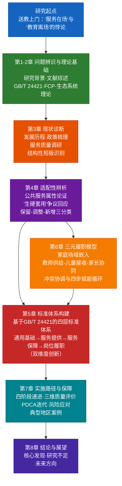

**图1-1 研究技术路线与章节逻辑关系**
```

**第一阶段：问题辨识与理论准备。** 通过系统梳理送教上门服务的政策背景、实践现状和学术文献，明确研究的核心问题和理论基点。该阶段的工作包括：全面检索和综述公共服务标准化理论、特殊教育服务理论、家庭场域理论等领域的国内外学术文献；系统整理和分析2014年以来中央和地方层面的送教上门政策文本；初步建构研究的理论分析框架。

**第二阶段：现状调查与问题诊断。** 通过政策文本分析、实地调研和访谈调查等方法，深入了解当前中国送教上门服务的运行现状和问题症结。重点考察东、中、西部地区典型省份的送教上门服务实践，比较不同地区在服务模式、服务内容、服务标准、资源配置、质量保障等方面的差异和共性，识别制约送教上门服务质量提升的关键因素。

**第三阶段：理论建构与标准设计。** 在理论研究和现状分析的基础上，构建"家庭场域嵌入的三元立体履职模型"，并将该模型与GB/T 24421标准体系的方法论框架相结合，系统设计和编制送教上门育人服务标准体系。标准体系涵盖服务通用基础标准、服务提供标准、服务保障标准和服务评价与改进标准四个层次，每个层次下设若干核心标准项目。

**第四阶段：标准验证与优化。** 运用德尔菲专家咨询法和典型案例验证法，对初步构建的送教上门服务标准体系进行科学性、可行性和完备性检验。根据专家咨询意见和案例验证结果，对标准体系进行迭代优化和完善。

**第五阶段：实施路径设计与政策建议。** 在标准体系验证完善的基础上，研究送教上门服务标准体系的实施路径，包括组织保障机制、经费保障机制、人员培训机制、监督评估机制和持续改进机制的设计。在此基础上，提出推进全国送教上门服务标准化、均等化发展的政策建议。

### 1.3.2 研究方法

本研究综合运用以下研究方法：

#### 一、文献研究法

文献研究法是本研究的基础性方法。围绕公共服务标准化、送教上门服务、特殊教育政策、家庭参与教育等核心议题，系统检索和梳理以下四类文献：

（1）政策文献：系统收集2014年以来国务院、教育部、中国残疾人联合会等部门发布的与特殊教育和送教上门相关的政策文件、发展规划、标准规范等，梳理送教上门政策的演进脉络和关键节点。

（2）学术文献：检索中国知网（CNKI）、万方数据、Web of Science、Scopus、ERIC等国内外学术数据库中与公共服务标准化、特殊教育服务标准化、送教上门服务、家庭与特殊教育等主题相关的中英文学术论文、学位论文和学术著作，系统梳理该领域的理论进展和研究前沿。

（3）标准文献：系统收集GB/T 24421系列标准、ISO 21001、ISO 29993等与服务业标准化和教育组织管理相关的国家标准和国际标准，分析其内容结构和方法论特征，为本研究的标准体系构建提供方法论参考。

（4）国际文献：系统收集CRPD委员会一般性意见、联合国教科文组织（UNESCO）特殊教育政策文件、世界卫生组织（WHO）康复服务指南、美国《残障个体教育法》（IDEA）实施细则、英国SEND实践守则等国际和各国政策文献，为本研究的国际比较分析提供文献基础。

#### 二、比较研究法

采用比较研究法在以下三个维度展开比较分析：

（1）国际比较：选取美国、英国、日本、澳大利亚等具有代表性的发达国家，比较分析其在重度残疾儿童家庭支持服务、融合教育送教服务、特殊教育服务标准化等方面的制度设计、实践做法和经验教训，提炼可供中国借鉴的有益经验。

（2）国内地区比较：选取东、中、西部地区具有代表性的省（市、自治区），比较分析不同地区送教上门服务的制度安排、实践模式、标准化程度和实施效果，探究送教上门服务质量的区域差异及其影响因素。

（3）跨领域比较：选取医疗卫生领域的"家庭医生签约服务"标准化、养老服务领域的"居家养老服务"标准化、社会工作领域的"个案管理服务"标准化等，与送教上门服务标准化进行跨领域比较，借鉴其他公共服务领域标准化实践的成功经验。

#### 三、案例研究法

采用多案例研究策略，选取3至5个在送教上门服务方面具有典型做法和显著成效的地区（兼顾东、中、西部区域分布和城市、农村不同属性）作为深度案例，进行实地调研和系统分析。具体研究手段包括：

（1）深度访谈：对案例地区教育行政部门负责人、特殊教育学校校长、送教上门教师、接受送教服务的学生家长等进行半结构化深度访谈，深入了解送教上门服务的实际运作过程、关键成功因素和面临的主要困难。

（2）参与式观察：跟随送教教师进入重度残疾儿童家庭，实地观察送教上门服务的全过程，记录服务环境、服务内容、服务互动和服务效果等现场信息，获取第一手质性资料。

（3）文件分析：收集案例地区送教上门服务的政策文件、工作方案、服务记录、评估报告等文本资料，分析服务制度设计的完整性和实施效果。

（4）跨案例比较：运用模式匹配技术和跨案例综合技术，归纳不同案例在送教上门服务实践中的共性规律和个性特征，为理论模型建构和标准体系设计提供实证支撑。

#### 四、德尔菲法

德尔菲法（Delphi Method）将用于送教上门服务标准体系的专家咨询和标准验证环节。具体设计与实施步骤如下：

（1）专家遴选：从特殊教育政策研究、特殊教育学校管理、特殊教育师资培养、公共服务标准化、教育质量评价、康复医学、社会工作、家庭教育等八个领域遴选具有丰富理论知识和实践经验且在本领域具有影响力的专家15至25名，组成咨询专家库。

（2）咨询工具编制：基于初步构建的送教上门服务标准体系，编制德尔菲专家咨询问卷。问卷包含标准体系框架的合理性评价、各层级标准的必要性和可行性评估、标准之间的逻辑关系评价、开放式意见征集等模块，采用Likert五级量表和开放式问题相结合的形式。

（3）多轮咨询实施：预计进行三至四轮专家咨询。首轮咨询收集专家对标准体系框架和核心标准的意见与建议；第二轮咨询在综合首轮反馈并修改标准体系后，进行程度判断和意见收敛；第三轮咨询在进一步修订后确认共识程度。如专家意见在第三轮后仍未充分收敛，则进行第四轮咨询。

（4）数据分析：运用描述性统计方法分析专家评分，计算各指标的均值、标准差、变异系数和满分率；运用非参数检验方法比较不同领域专家意见的差异；运用内容分析法对专家开放性意见进行编码和主题归纳。

（5）共识判断标准：以专家意见的变异系数小于等于0.25或标准差小于等于1.0作为达到共识的标准，以均值大于等于4.0为高认可度标准。

#### 五、政策文本分析法

以2014年以来国家层面和省级层面发布的送教上门相关政策文本为分析对象，运用内容分析法进行系统分析：

（1）文本采集：通过国务院、教育部、中国残疾人联合会、各省教育厅等官方网站及北大法宝等政策数据库，系统收集与送教上门相关的政策文本。

（2）编码分析：基于扎根理论的编码策略，运用NVivo质性分析软件对政策文本进行开放式编码、主轴编码和选择性编码，识别政策话语中的核心概念、行动逻辑和责任关系。

（3）政策比较：建立"政策目标—政策工具—责任主体—保障机制"的分析框架，对不同时期、不同地区的送教上门政策进行纵向演进分析和横向比较分析。

#### 六、实地调查法

采用问卷调查和实地走访相结合的方式，调查送教上门服务的实践现状：

（1）问卷调查：面向特殊教育学校和送教教师发放调查问卷，了解送教上门服务的频次、内容、方式、资源配置、教师感受和面临的困难等；面向接受送教服务的家长发放调查问卷，了解家长对送教服务的内容、质量和效果的满意度及改进建议。

（2）实地走访：在案例地区进行实地走访，观察送教上门服务现场，收集服务实施的实物证据和影像资料，获取与送教服务相关的行政档案和服务档案。

---

## 1.4 研究创新点

### 1.4.1 标准体系构建创新：GB/T 24421四层标准体系在送教上门服务中的首次系统应用

本研究的第一个创新点在于首次将GB/T 24421《服务业组织标准化工作指南》系列国家标准系统应用于送教上门服务领域，构建涵盖服务通用基础标准、服务提供标准、服务保障标准和服务评价与改进标准四个层次的送教上门育人服务标准体系。

这一创新的学术价值在于：

其一，突破了传统的"行业标准化"思维定势。既有的特殊教育标准化研究多聚焦于课程标准、教师专业标准、学校办学标准等教育行业内部标准，本研究将研究视角拓展至服务业组织标准化这一更为宏观的标准治理框架，实现了特殊教育标准化从"教育行业内部标准化"向"公共服务标准化"的范式转换。

其二，建立了特殊教育服务标准化的结构化学理框架。GB/T 24421的四个标准层次（通用基础标准、服务提供标准、服务保障标准、服务评价与改进标准）为送教上门服务标准体系提供了清晰的结构化分析框架，使标准体系的设计从"服务事项简单罗列"走向"标准层次逻辑建构"，提升了标准体系的系统性和科学性。

其三，实现了国家标准方法论与具体服务场景的有机对接。本研究在遵循GB/T 24421标准体系结构逻辑的前提下，根据送教上门服务的特殊性，对每一层次的标准项目进行了领域适配和内容创新。例如，在服务提供标准层面，根据送教上门在家庭场域中实施的特点，设置了"家庭环境安全评估标准""家—校—社区协同服务标准""个别化家庭服务计划编制标准"等创新性标准项目；在服务保障标准层面，增设了"送教教师安全出行保障标准""送教教师心理健康支持标准""家长教育能力建设服务标准"等具有送教上门服务特色的标准项目。

### 1.4.2 三元模型创新："家庭场域嵌入的三元立体履职模型"的原创性建构

本研究的第二个创新点在于原创性地提出了"家庭场域嵌入的三元立体履职模型"，为理解重度残疾儿童送教上门服务中的主体关系和互动机制提供了全新的理论分析框架。

该模型的创新性体现在以下三个方面：

第一，家庭场域从"背景性存在"上升为"结构性要素"。在既有的送教上门研究中，家庭通常被作为服务实施的被动"场景"或"背景"来处理。本研究创造性地引入场域理论、生态系统理论和家庭系统理论的多维视角，将家庭场域上升为送教上门服务体系的"结构性构成要素"，系统阐释了家庭场域物理空间、社会空间和心理空间对服务供给的三重嵌入机制，实现了家庭角色从"服务背景"到"服务要素"的理论跃升。

第二，三元履职关系从"线性格局"重构为"立体网络"。既有的送教服务研究多关注教师对儿童的"一对一"教学指导关系，或将教师—家长关系简化为"指导—配合"的单向关系。本研究提出的三元立体履职模型将教师、儿童、家长三者的履职关系重构为一种相互嵌入、动态平衡的立体网络结构：教师的职责不仅是向儿童传授知识技能，更包括赋能家长、协调家庭资源、联结社区服务；家长的职责不仅是配合教师开展教育，更包括创设家庭育人环境、实施日常教育干预、参与教育决策；儿童的职责不是被动接受，而是作为具有主动发展潜能的学习主体。这一关系的重构从结构层面回应了"育人共同体"的理想诉求。

第三，履职概念从"角色赋予"深化为"能力建构"。既有的职责界定多停留在"应该做什么"的角色规范层面，本研究提出的履职模型进一步深入到"能够做什么"和"如何做到"的能力建构层面，从知识结构、能力素养、权利保障、支持系统四个维度界定教师、儿童、家长三者的履职能力要求和支持条件，使三元立体履职模型从理论构想转化为可操作、可评价的能力框架。

### 1.4.3 家庭场域嵌入创新：送教上门服务供给模式的范式重构

本研究的第三个创新点在于将"家庭场域嵌入"确立为送教上门服务供给模式的核心分析概念，系统论证了家庭场域嵌入对送教服务供给模式重构的理论意涵和实践路径。

"家庭场域嵌入"这一概念创新性地揭示了一个被既有送教上门研究所忽视的关键事实：送教上门区别于学校教育和远程教育的根本特征，不在于"上门"这一服务输送方式的改变，而在于教育服务实施场域从"学校场域"到"家庭场域"的根本性转换。这种场域转换不仅改变了教育服务的地理位置和物理空间，更深刻地改变了教育服务的关系结构、权力配置和互动模式。

具体而言，家庭场域嵌入对送教上门服务供给模式形成的重构效应体现在三个维度：

一是权力结构的重构。在学校场域中，教师作为制度化的教育权威，拥有对教育目标、教育内容、教育方法、教育评价的系统性控制权。在家庭场域中，教师的教育权威面临"去制度化"的挑战——教师不再是教育场域的"主人"，家长对教育过程的话语权和影响力显著增强。本研究的创新在于，不是将这种权力结构的变化视为送教服务的"障碍"，而是将其视为构建新型育人共同体的"资源"，在制度设计中为家长赋权增能，使家长从送教服务的"配合者"转变为"合作者"乃至"共育者"。

二是关系模式的重构。学校场域中的师生关系是制度化、非人格化的专业关系，家庭场域中的送教关系则具有显著的人格化和关系化特征。教师在家庭场域中不仅是教育者，也是家庭环境的"客人"；家长不仅是儿童监护人，也是教育过程的"在场者"；家庭不仅是教育场所，也是教育内容的"来源地"。本研究提出的三元立体履职模型正是对这种多重角色交织的关系模式的系统理论回应。

三是资源逻辑的重构。学校场域中的教育资源以制度化、标准化为基本特征，家庭场域中的教育资源则以生活化、情境化为基本特征。本研究的创新在于，将家庭日常生活资源——包括家庭物理环境、日常生活事件、家庭成员互动、社区邻里关系等——纳入送教服务的资源体系，使其从教育服务的"非正式补充"上升为"正式教育资源的有机组成部分"，实现制度化教育资源与生活化教育资源的有机整合。

### 1.4.4 研究方法创新：多学科交叉与多元方法互证的综合性研究设计

本研究的第四个创新点在于综合运用教育学、公共管理学、社会学、系统科学等学科的理论视角和研究方法，构建了一个多学科交叉、多元方法互证的综合性研究设计。

在理论层面，本研究整合了公共服务标准化理论（公共管理学）、特殊教育理论（教育学）、场域理论和生态系统理论（社会学）、家庭系统理论（心理学/家庭治疗学）等多学科的理论资源，构建了"公共服务标准视域下送教上门育人服务体系构建"的分析框架，实现了从单一学科视角向多学科交叉融合的方法论突破。

在方法层面，本研究构建了"文献研究+政策文本分析+国际比较+案例研究+实地调查+德尔菲法"的多元方法体系，形成了"理论推演—实证检验—专家确认"的三重验证机制，保障了研究结论的科学性和稳健性。

---

## 1.5 全书框架结构

本书共分为九章，各章主要内容如下：

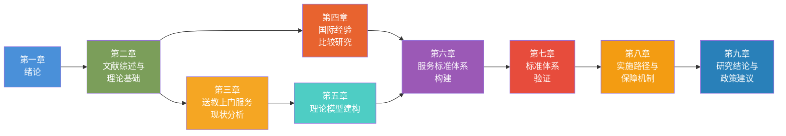

**第一章 绪论。** 阐述研究的背景和意义，明确核心研究问题，说明研究思路和研究方法，总结研究的创新点，概述全书的框架结构。

**第二章 文献综述与理论基础。** 系统梳理公共服务标准化理论、特殊教育服务理论、场域理论与生态系统理论、家庭系统理论等领域的既有研究成果，识别研究缺口，构建本研究的理论分析基础。重点评述GB/T 24421服务业组织标准化方法论、送教上门服务研究、家庭与特殊教育关系研究、残疾儿童受教育权研究等四个专题方向的学术进展。

**第三章 送教上门服务现状分析。** 基于全国范围内的政策文本分析和东、中、西部典型省市的实地调研数据，系统呈现中国送教上门服务的制度演进历程、运行现状、区域差异和核心问题，为后续的标准体系构建提供实证基础。本章将建立送教上门服务现状的多维分析框架，从服务覆盖面、服务内容、服务方式、服务主体、资源配置、质量保障、家长参与等维度展开系统分析。

**第四章 国际经验比较研究。** 选取美国、英国、日本、澳大利亚四个发达国家作为比较对象，系统分析其在重度残疾儿童家庭支持服务、融合教育送教服务、特殊教育服务标准化等方面的制度安排和实践经验，提炼对中国送教上门服务标准化建设的有益启示。同时，梳理CRPD、SDG 4、ISO 21001等国际框架对送教上门服务标准体系建设的要求和指引。

**第五章 理论模型建构：家庭场域嵌入的三元立体履职模型。** 在理论研究和现状分析的基础上，系统建构"家庭场域嵌入的三元立体履职模型"。该章详细阐释家庭场域嵌入的理论意涵和运作机制，界定教师、儿童、家长三者在送教上门服务中的履职角色和能力要求，分析三元互动关系的结构、动力和边界。同时，将该模型与GB/T 24421标准体系的方法论框架进行对接，建立从理论模型到标准体系的概念映射关系。

**第六章 服务标准体系构建。** 以GB/T 24421标准体系为方法论基础，以三元立体履职模型为理论指引，系统构建送教上门育人服务标准体系。该章按照服务通用基础标准、服务提供标准、服务保障标准、服务评价与改进标准四个层次，逐一编制各层次的核心标准项目，形成完整的送教上门服务标准体系文本。标准体系的构建将遵循"通用标准为框架、专业标准为核心、个别化标准为弹性空间"的分层架构原则。

**第七章 标准体系验证。** 运用德尔菲专家咨询法和典型案例验证法，对第六章构建的送教上门服务标准体系进行科学性、可行性和完备性检验。该章将呈现三轮德尔菲专家咨询的实施过程和数据分析结果，并以东、中、西部三个典型案例地区的实际服务场景为验证载体，检验标准体系的适切性和可操作性，根据验证结果对标准体系进行修正完善。

**第八章 标准实施路径与保障机制。** 研究送教上门服务标准体系的实施路径，构建包括组织保障、经费保障、人员保障、技术保障和监督评估在内的五维保障机制体系。该章将结合中国特殊教育管理体制的实际，设计标准体系的分级实施策略，探讨中央—省—市—县—校五级联动实施机制的构建路径，提出标准实施的阶段性推进方案。

**第九章 研究结论与政策建议。** 总结全书的主要研究结论和核心观点，凝练送教上门育人服务体系构建的理论贡献和实践价值，提出推进全国送教上门服务标准化发展的政策建议，指出本研究的局限性和未来研究方向。

全书的逻辑结构如下：**第一、二章**构成研究的"基础篇"，完成研究问题的提出和理论基础的搭建；**第三、四章**构成研究的"事实篇"，呈现送教上门服务的中国实践和国际参照；**第五、六章**构成研究的"建构篇"，完成理论模型建构和标准体系设计；**第七、八章**构成研究的"验证与实施篇"，完成标准体系的验证和落地路径设计；**第九章**构成研究的"总结篇"，凝练结论并提出建议。五篇之间以"基础—事实—建构—验证—总结"的逻辑链条递进展开，形成一个完整的研究闭环。

---

## 本章小结

本章作为全书的绪论部分，完成了以下五项基础性工作：

第一，系统阐述了研究的时代背景和学术价值。从政策驱动、现实需求、理论需求和国际参照四个维度阐述了送教上门育人服务体系构建研究的必要性和紧迫性，并从理论和实践两个层面阐明了研究的意义。

第二，明确界定了研究的核心问题和子问题。围绕"如何在公共服务标准化视域下，以GB/T 24421标准体系为方法论基础，系统构建送教上门育人服务体系"这一核心问题，从现状诊断、标准方法、育人逻辑、理论模型、实施保障五个维度分解出五个层次的研究子问题，形成了清晰的问题链结构。

第三，完整呈现了研究的技术路线和方法论设计。以"问题辨识—理论建构—实证检验—标准设计—实施路径"为研究主线，设计了五个阶段的研究进程，并综合运用文献研究法、比较研究法、案例研究法、德尔菲法、政策文本分析法和实地调查法等六种研究方法，构建了多学科交叉和多元方法互证的综合性研究方法体系。

第四，凝练了研究的四个创新点。从标准体系构建创新（GB/T 24421的首次系统应用）、三元模型创新（家庭场域嵌入的三元立体履职模型的原创性建构）、家庭场域嵌入创新（送教服务供给模式的范式重构）和研究方法创新（多学科交叉与多元方法互证）四个维度阐明了研究的学术贡献。

第五，勾勒了全书的研究框架。以九章结构将全书分为"基础篇—事实篇—建构篇—验证与实施篇—总结篇"五个逻辑递进的研究模块，清晰呈现了全书的研究内容、逻辑脉络和篇章关系，为后续各章的展开提供了导航指引。


---


# 第二章 国内外研究现状与理论基础

公共服务标准化是提升基本公共服务均等化水平、保障服务质量和促进社会公平的重要制度工具。送教上门作为特殊教育公共服务的重要组成部分，其育人服务体系的构建，需要在充分梳理国内外研究进展、把握学科发展前沿的基础上，借助成熟的理论框架进行系统设计。本章将从特殊教育标准化、送教上门质量研究两个维度展开文献综述，并系统阐述支撑送教上门育人服务体系构建的核心理论基础，为后续章节的服务体系设计与实施路径探索提供理论依据和学术支撑。

## 2.1 国内外特殊教育标准化研究进展

### 2.1.1 国内特殊教育标准化研究进展

#### 2.1.1.1 服务业标准化体系的理论探索与制度发展

我国服务业标准化工作始于21世纪初，经过二十余年的发展，已形成较为完备的标准体系框架。2009年，国家标准化管理委员会发布了GB/T 24421《服务业组织标准化工作指南》系列标准，标志着我国服务业标准化工作进入规范化、系统化阶段。该系列标准最初分为四个部分：GB/T 24421.1《基本要求》、GB/T 24421.2《标准体系》、GB/T 24421.3《标准编写》和GB/T 24421.4《标准实施及评价》，为服务业组织建立标准体系提供了全面的方法论指导。

2023年，该系列标准进行了重要修订。新版的GB/T 24421.2-2023《服务业组织标准化工作指南 第2部分：标准体系构建》对标准体系的结构进行了重新设计，提出了"通用基础标准体系—服务提供标准体系—服务保障标准体系—岗位标准体系"的四层标准体系架构。这一架构的核心思想在于：服务业组织的标准化工作应当从通用基础层面明确术语、符号、分类等基础规范，从服务提供层面规范服务流程、服务规范和服务质量控制，从服务保障层面建立人员、设施、环境、信息等保障标准，从岗位层面明确各岗位的职责、权限和任职要求。四层体系相互关联、层层递进，构成了一个完整的服务质量保证链条。

李春田（2014）在《标准化概论》中系统阐述了服务业标准化的理论框架，指出服务业标准化具有无形性、同步性、异质性和易逝性等特点，这使得服务标准的制定与实施比制造业标准化面临更大的挑战。柳学智（2016）从公共服务均等化的视角，分析了标准化在促进基本公共服务公平供给中的作用机制，认为标准化能够有效降低服务质量的区域差异和群体差异，是实现公共服务均等化的重要制度安排。王玮（2018）进一步提出了公共服务标准化的"三维分析框架"，包括标准内容维度（服务项目、服务流程、服务质量）、标准层级维度（国家标准、行业标准、地方标准、企业标准）和标准功能维度（规范功能、评价功能、改进功能），为公共服务标准化研究提供了系统的分析工具。

在实践层面，我国服务业标准化试点工作自2007年启动以来，已覆盖旅游、物流、养老、政务服务等多个领域。截至2023年底，全国已设立国家级服务业标准化试点项目超过2000个，其中公共服务领域的试点项目占比逐年提升。这些试点实践为特殊教育领域的标准化探索提供了可资借鉴的经验。

#### 2.1.1.2 特殊教育领域标准化的政策演进与地方实践

我国特殊教育领域的标准化进程起步较晚，但近年来发展迅速。2014年，国务院办公厅转发了教育部等七部门制定的《特殊教育提升计划（2014—2016年）》，首次在国家层面明确提出"制定特殊教育学校办学标准"，开启了特殊教育标准化的制度建设进程。2017年修订的《残疾人教育条例》进一步规定："国务院教育行政部门应当会同有关部门制定特殊教育学校、普通学校随班就读资源教室的建设标准、生均公用经费标准、教育教学设备配备标准等"，为特殊教育标准化提供了法规依据。

《"十四五"特殊教育发展提升行动计划》（2022）将标准化建设作为推动特殊教育高质量发展的重要抓手，提出"完善特殊教育办学质量评价指标体系""制定特殊教育学校、普通学校特殊教育班和送教上门等不同安置形式的办学标准和质量标准"等具体任务。这表明，特殊教育标准化已从单一的学校办学标准扩展到涵盖多元安置形式的综合标准体系，送教上门作为其中一种重要的服务安置形式，其标准化建设已提上政策议程。

在理论研究方面，邓猛、颜廷睿（2016）从融合教育的视角分析了我国特殊教育标准化的现实困境与发展路径，指出我国特殊教育标准化面临着标准体系不健全、标准制定缺乏实证基础、标准执行监督机制缺失等问题。彭霞光（2017）对《残疾人教育条例》修订中的标准化条款进行了法理分析，认为标准化是保障残疾人教育权利从"机会公平"走向"过程公平"和"结果公平"的关键制度安排。王雁等（2019）通过比较研究，分析了我国特殊教育学校办学标准与发达国家之间的差距，指出我国在师生比、专业支持人员配备、辅助技术设备配置等关键指标上仍有较大提升空间。

在地方实践层面，福建省在特殊教育标准化建设方面走在全国前列。2018年，福建省教育厅发布了《福建省特殊教育学校标准化建设评估标准》，从学校管理、教育教学、师资队伍、办学条件、教育质量等维度建立了系统的评估指标体系，并开展了全省范围内的标准化学校评估认定工作。该标准的实施显著提升了福建省特殊教育学校的整体办学水平，学生的个别化教育计划（IEP）完成率从62%提升至89%（福建省教育厅，2020）。此外，浙江省、江苏省、广东省等地也相继出台了特殊教育相关的标准和规范，在资源教室建设、随班就读支持、送教上门服务等方面进行了积极的标准化探索。

然而，现有研究也存在明显不足。第一，标准化的关注焦点主要集中在特殊教育学校和随班就读上，对送教上门这一特殊教育安置形式的标准化研究较为薄弱。以中国知网（CNKI）数据库检索为例，截至2024年，以"特殊教育标准化"为主题词检索到的核心期刊论文仅30余篇，而以"送教上门标准化"为主题词检索的结果不足5篇，表明送教上门标准化研究尚处于起步阶段。第二，现有标准体系主要聚焦于硬件设施和办学条件等"硬标准"，对服务流程、服务质量、服务效果等"软标准"的关注不够充分。第三，标准的制定过程缺乏对服务使用者（残疾儿童及其家庭）需求的深度参与和有效回应，标准的"供需匹配"程度有待提升。第四，标准的执行监督和效果评估机制尚未建立，标准的"落地"问题仍是突出挑战。

### 2.1.2 国际特殊教育标准化研究进展

#### 2.1.2.1 国际标准化组织的教育管理标准

国际标准化组织（ISO）于2018年发布了ISO 21001:2018《教育组织管理体系——要求及使用指南》（Educational Organizations — Management Systems for Educational Organizations — Requirements with Guidance for Use），这是首个专门针对教育组织的国际管理体系标准。2025年7月，ISO发布了ISO 21001:2025（第2版），在包容性教育、学习者多样性和社会责任等方面作出强化。该标准基于ISO 9001质量管理体系的基本框架，结合教育服务的特殊属性，为各级各类教育组织（包括特殊教育机构）建立和实施管理体系提供了通用要求和使用指南。2025年，中国已启动ISO 21001采标工作（计划号20251573-T-469），拟制定国家标准《教育组织 教育组织管理体系 要求与使用指南》，教育管理国际标准在中国的本土化进程正在全面推进。

ISO 21001的核心价值在于将"以学习者为中心"的理念贯穿于教育管理的全过程。标准要求教育组织应当：识别学习者的需求和期望，包括有特殊教育需求的学习者（条款4.2）；制定符合学习者需求的教育方案，并确保教育方案的个性化与适应性（条款8.2）；建立包容性的学习环境，消除物理设施、课程内容、教学方法等方面的障碍（条款7.1.4）；监测和评估学习者的学习进展，并基于评估结果持续改进教育服务（条款9.1）。这些要求与送教上门育人服务的内在逻辑高度契合——送教上门的本质正是针对因重度残疾而无法到校就读的学习者，提供个性化的、适应性的、包容性的教育服务。

值得注意的是，ISO 21001采用了"组织管理体系"而非"质量管理体系"的表述，这反映了教育标准化从单纯的质量控制向综合的组织治理转型的趋势。标准不仅关注教育服务的"输出"质量，更关注教育组织的治理结构、领导力、资源管理、能力建设等"过程"要素和"输入"要素，体现了系统思维在教育标准化中的应用。这一理念对于送教上门育人服务体系的构建具有重要启示：标准化不应局限于服务结果的质量检验，而应涵盖从政策保障、组织管理、资源配置到服务实施、效果评估的全链条标准体系。

然而，ISO 21001在特殊教育领域的应用研究仍较为有限。Sharma等（2020）研究了ISO 21001在印度包容教育机构中的应用情况，发现该标准有助于提升教育机构对特殊教育需求学习者的服务能力，但在标准的本土化适应和成本效益方面仍面临挑战。Nieto等（2021）分析了ISO 21001在拉丁美洲特殊教育机构中的实施障碍，指出标准的"通用性"与特殊教育"高度个性化"需求之间存在一定张力，需要在标准的灵活应用方面进行更多的实践探索。

#### 2.1.2.2 澳大利亚NDIS实践标准与残疾人服务质量保障

澳大利亚的国家残疾保险计划（National Disability Insurance Scheme, NDIS）是全球最具代表性的残疾人服务标准化实践之一。NDIS于2013年正式实施，通过"个性化资金支持"模式，为符合条件的残疾人提供终身照护和支持服务。在服务质量保障方面，澳大利亚政府制定了《NDIS实践标准》（NDIS Practice Standards, 2018年发布，2021年修订），该标准由NDIS质量与保障委员会（NDIS Quality and Safeguards Commission）负责监督实施。

NDIS实践标准由核心模块和若干补充模块构成。核心模块适用于所有注册的NDIS服务提供者，涵盖以下领域：权利与责任、服务治理与运营管理、服务提供环境、服务支持提供、服务支持管理。补充模块则针对特定服务类型，包括：早期儿童支持服务、专业行为支持服务、专业健康支持服务、特殊残障住宿服务等。这种"核心模块+补充模块"的标准结构设计，既保证了服务质量的底线要求，又兼顾了不同服务类型的专业特性，具有较高的可操作性和适应性。

在服务质量评价方面，NDIS实践标准采用了"结果导向"的评价方法。标准不仅规定了服务提供者"应当做什么"（过程要求），更明确了服务使用者"应当获得什么"（结果要求）。例如，标准要求服务提供者必须确保"每个参与者都能行使选择和控制的权力""参与者的权利得到尊重和促进""参与者获得安全、有效的优质支持服务"。这种结果导向的标准设计理念，对于送教上门服务的标准化具有重要的借鉴意义——送教上门服务的质量标准，不应仅仅是对教师上门次数、教学时长的简单考核，而应聚焦于服务是否真正促进了重度残疾儿童的发展与参与。

澳大利亚NDIS实践标准的另一重要特色在于其"共建"机制。标准的制定和修订过程广泛吸纳了残疾人及其家庭、服务提供者、专业机构、学术研究机构等利益相关方的参与。这种参与式治理模式确保了标准能够真实反映服务使用者的需求和期望，而不是仅仅体现管理者的意志。英国的Slasberg和Beresford（2017）评价NDIS实践标准是"以服务使用者为中心的标准化"的典型范例，但也指出标准的实施需要充足的资源保障和专业能力支撑，否则可能导致"标准化"流于形式。

#### 2.1.2.3 英国SEND Code of Practice与特殊教育法律框架

英国在特殊教育领域建立了较为完善的法律法规和标准体系。2014年《儿童与家庭法》（Children and Families Act 2014）对特殊教育体系进行了重大改革，将原有的"SEN（Special Educational Needs）"框架扩展为"SEND（Special Educational Needs and Disability）"框架，实现了特殊教育与残障支持的制度统一。2015年发布的《特殊教育需要与残障实施守则》（SEND Code of Practice: 0 to 25 years）是这一法律框架的具体实施指南，为地方当局、学校、健康服务机构和社会照护机构的特殊教育服务提供了法定标准和操作规范。

SEND Code of Practice的标准化价值体现在以下几个方面。第一，标准覆盖了从出生到25岁的全年龄段，打破了特殊教育仅在义务教育阶段实施的制度壁垒，为好重度残疾青少年从教育向成人生活的过渡提供了制度化支持路径。第二，标准建立了"评估—计划—实施—审查"的四阶段循环机制，要求地方当局必须对有特殊教育需要的儿童和青少年进行EHC（Education, Health and Care）需求评估，制定EHC计划，并实施年度审查。这一机制与送教上门服务中对服务对象需求的持续评估和IEP的动态调整机制在逻辑上具有一致性。第三，标准强调了教育与健康、社会照护的跨部门协作整合，要求教育、卫生和社会照护部门共同为有特殊需要的儿童提供"一体化"支持服务，体现了公共服务整合与协调的标准化理念。第四，标准赋予了家长和青少年广泛参与教育决策的权利，包括参与评估、参与计划制定、参与服务选择等，强化了服务使用者在标准化体系中的主体地位。

在学理研究方面，英文学术界对SEND Code of Practice的实施效果进行了大量实证研究。Lamb（2019）基于对英国152个地方当局的调查数据，分析了2014年改革后特殊教育服务的质量变化趋势，发现家长的满意度有所提升，但跨部门协作的"瓶颈"问题仍然突出，尤其是在健康服务和社会照护服务的整合方面。Castro-Kemp和Samuels（2022）的研究指出，尽管SEND Code of Practice在法律层面明确了服务质量标准，但在实施层面，由于地方财政紧缩和专业人才短缺，标准执行的不均衡问题日益严重，不同地区之间的服务质量差异显著。

对于中国送教上门服务的标准化建设而言，SEND Code of Practice提供了三方面的重要借鉴：一是法定标准和实施指南相结合的标准化路径，既保证了标准的权威性，又增强了标准的可操作性；二是跨部门协作的制度化安排，将教育、健康、社会照护等多部门的责任和义务纳入统一的标准框架；三是服务使用者的参与权和话语权保障，将家长和残疾儿童青少年的意见作为服务质量评价的核心指标。

#### 2.1.2.4 美国IDEA框架下IEP的标准化实践

美国1975年颁布的《所有残障儿童教育法》（Education for All Handicapped Children Act, EHA），后经多次修订并更名为《残疾人教育法》（Individuals with Disabilities Education Act, IDEA），是全球特殊教育领域最具影响力的法律之一。IDEA确立了免费适当公共教育（FAPE）、最少限制环境（LRE）、个别化教育计划（IEP）、正当程序保障（Procedural Safeguards）等特殊教育的基本原则。其中，IEP的标准化实践为送教上门服务的规范化提供了重要的参考范式。

IDEA对IEP的内容和程序作出了详细的法定规定。在内容方面，IEP必须包括：学生当前学业成就和功能表现的描述、可测量的年度目标、学生所需特殊教育和相关服务的说明、学生参与州级和学区级评估的安排、服务开始日期及服务频次、时长和地点等。在程序方面，IEP的制定和实施必须经过评估、IEP会议、家长同意、实施与监测、年度审查等法定环节。IDEA还特别规定了IEP团队的人员构成要求，包括家长、至少一名普通教育教师、至少一名特殊教育教师、地方教育机构代表、可解读评估结果的专业人员、学生（适当时）等。这种对IEP内容和程序的法定标准化，为美国特殊教育服务的质量保障提供了基础性制度框架。

在学术研究方面，美国学者围绕IEP质量和标准化问题展开了大量研究。Yell等（2020）系统分析了IDEA框架下IEP的法律要求和实践标准，指出IEP的标准化不应仅仅是对文档格式的统一规定，更应关注IEP的过程质量和结果质量，包括评估的全面性和准确性、目标的适当性和可测量性、服务的充分性和协调性等。Kurth等（2019）通过对全美50个州的IEP政策进行比较分析，发现各州在IEP的具体要求上存在较大差异，例如在IEP目标的编写格式、服务时间的记录方式、过渡计划的具体内容等方面标准不一，这种差异对跨州流动的特殊教育学生的服务连续性构成了影响。

值得注意的是，IDEA明确规定了"送教上门"（Homebound Instruction）的法定地位。根据IDEA的"最少限制环境"原则，当学生的残疾程度导致其无法在普通学校环境中接受教育时，学区必须为学生在家庭或医疗机构中提供教育服务。各州在此基础上制定了具体的送教上门标准。例如，德克萨斯州规定了送教教师的资质要求和服务时长标准；加利福尼亚州明确了送教服务的申请程序和学生转衔回归机制；宾夕法尼亚州则建立了送教服务的质量监测和效果评估标准。然而，Zirkel（2021）对美国50个州的送教上门标准进行了系统比较，发现各州标准在教师资质要求、服务频次、教学内容要求等方面差异悬殊，有的州甚至缺乏明确的标准规范，这成为了美国送教上门服务面临的核心制度困境。

美国IEP标准化实践为我国送教上门服务的标准化建设提供了正反两方面的启示。正面启示在于：通过立法手段对IEP的内容和程序进行标准化规范，能够有效保障残疾学生获得适当教育服务的权利；IEP团队的多学科构成要求，有助于从多维度评估学生需求并制定综合性服务方案。反面警示在于：标准化如果过于注重文档格式的统一而忽视了过程质量和结果质量，可能导致IEP的形式化——仅仅成为一份"合规"的文书而未能真正指导教育实践。事实上，美国多位学者（如Blackwell & Rossetti, 2014; Rakap, 2015）的研究已经揭示了IEP"纸面质量"与"实际服务"之间的鸿沟，这一问题在我国送教上门的IEP实践中同样值得高度警惕。

### 2.1.3 CRPD框架下的包容教育标准化要求

#### 2.1.3.1 CRPD第24条对包容教育的规范内涵

联合国《残疾人权利公约》（Convention on the Rights of Persons with Disabilities, CRPD）于2006年通过、2008年生效，是21世纪国际社会在残疾人权利保障领域最重要的国际法律文书。中国于2008年批准加入CRPD，承担了在国内法律和政策中落实公约义务的国际法责任。CRPD第24条专门规定了残疾人的教育权利，其核心要求是："缔约国应当确保在各级教育中实行包容性教育制度"，并明确提出缔约国应当确保"残疾人不因残疾而被排拒于普通教育系统之外"，"残疾人在普通教育系统中获得必要的合理便利和支持措施"。

CRPD第24条对包容教育的标准化提出了若干规范性要求。首先，第24条第2款要求缔约国确保："残疾人不被排拒于免费和义务初等教育和中等教育之外"；"残疾人可以在自己生活的社区内，在与其他人平等的基础上，获得包容、优质和免费的初等教育和中等教育"；残疾人在教育中获得"合理便利"和"所需支持"。这些规定为特殊教育公共服务确立了"可用性"（Availability）、"可及性"（Accessibility）、"可接受性"（Acceptability）和"可适应性"（Adaptability）的四维质量标准框架——这一框架来源于前联合国受教育权特别报告员Katarina Tomasevski提出的受教育权"4A"框架，并在CRPD语境下被赋予了包容教育的新内涵。

其次，第24条第3款要求缔约国"使残疾人能够学习生活和社交技能，便利他们充分和平等地参与教育和融入社区"；"提供盲文、手语等替代性交流方式"；"聘用包括有残疾的教师在内的合格教师"。这些要求转化为标准化的术语，即特殊教育师资的资质标准、辅助技术的配置标准和无障碍环境的建设标准。

最后，第24条的整体精神强调：包容教育不是将残疾人"安置"在普通教育中的简单操作，而是要求整个教育体系进行系统性变革，从课程设计、教学方法、评价方式到学校文化建设，全面适应所有学习者的多样性需求。这一要求对于送教上门标准化建设具有重要意义——送教上门的标准化不应将送教上门视为普通教育的"简化版"或"缩水版"，而应建立体现重度残疾儿童特殊教育需求和家庭环境特点的专业标准体系。

#### 2.1.3.2 第4号一般性意见对包容教育质量标准的深化

联合国残疾人权利委员会于2016年发布的第4号一般性意见（General Comment No. 4 on Article 24: The Right to Inclusive Education），对CRPD第24条进行了权威解释和深化阐述。第4号一般性意见为包容教育的质量标准提供了更为系统和具体的规范指引。

第4号一般性意见最突出的理论贡献在于明确了"包容"与"融合"、"一体化"之间的区别，建立了一套包容教育的概念分析框架。意见指出："融合"（Integration）是将残疾学生安置在普通学校中，但不改变学校的组织结构和教学系统；而"包容"（Inclusion）则要求从根本上改变学校的文化、政策和实践，以回应所有学生的多样性。意见进一步提出了包容教育的若干核心特征，包括：全系统的改革承诺、课程与教学的差异化、包容性的评估与考试制度、教师的职前培养和在职培训、充足的资源支持等。这些特征可以转化为包容教育质量标准的核心维度。

在质量标准方面，第4号一般性意见特别强调了以下要求：第一，"不得以任何理由（包括残疾的类型和严重程度）将任何人排除在融合教育体系之外"，这意味着送教上门服务对象的确定必须基于严格的专业评估而非行政便利，且必须建立从送教服务向学校教育的转衔路径。第二，"缔约国必须拨出足够的财政和人力资源"用于包容教育的实施，包括为送教上门等非学校安置形式提供充足的经费保障。第三，"缔约国必须建立独立的监测机制"以确保包容教育的质量，包括对送教上门等服务的质量进行持续的监督和评估。第四，缔约国必须"收集分类数据"以监测包容教育的实施进展，包括对接受送教上门服务的残疾儿童数据进行系统的记录和分析。

值得注意的是，第4号一般性意见对"隔离性安置"持审慎态度，认为特殊教育学校等隔离性教育环境只有在"极个别情况下"，即普通教育无法满足学生需求且隔离性教育最有利于学生发展时，才具有合理性。这一立场对送教上门服务的定位提出了重要问题：送教上门作为一种在家庭环境中实施的教育服务，在性质上属于一种高度个性化的教育安置形式，但同时也蕴含着"隔离"的风险——重度残疾儿童长期在家中接受教育，可能缺乏与同伴社会互动的机会。因此，送教上门的标准化体系设计必须包含促进社会融合的机制安排，如引入同伴支持、组织集体活动、利用远程教学手段等，以最大限度地降低"隔离"风险，最大程度地促进"融合"可能。

## 2.2 国内外送教上门质量研究进展

### 2.2.1 国内送教上门质量研究进展

#### 2.2.1.1 送教上门教师负担研究

送教上门教师是服务实施的核心主体，其工作负担和职业体验直接影响着送教服务的质量和可持续性。近年来，国内学者围绕送教教师的工作负担展开了较为系统的实证研究。

卢瑛等（2019）对四川省某市送教上门教师的工作现状进行了问卷调查，发现送教教师面临的首要困难是"交通问题"——送教对象多为农村偏远地区的重度残疾儿童，教师往返送教的路程较长，有的单程即超过2小时。调查显示，送教教师在交通方面平均每次耗费3.2小时，占单次送教总时间（含交通、教学、记录等）的52.6%。交通时间比重过高严重挤压了教学服务的有效时间，也增加了教师的身体疲劳和时间压力。

连赟（2020）通过对全国12个省份送教上门教师的深度访谈，揭示了送教教师在专业能力方面的突出困境。研究发现，送教上门教师的专业背景以普通教育为主（占68.3%），具有特殊教育专业背景的教师仅占21.7%，这使得教师在面对重度、多重残疾儿童时普遍感到专业能力不足。具体表现为三个方面：一是在教育评估方面，教师缺乏对重度残疾儿童进行标准化评估的专业知识和工具；二是在教学设计方面，教师难以将普通教育的课程内容有效转化为适合重度残疾儿童的教学活动；三是在康复支持方面，教师缺乏与物理治疗师、作业治疗师、言语治疗师等康复专业人员协作的知识和技能。

王琴、郑晓坤（2021）采用职业倦怠量表（MBI-ES）对送教上门教师进行了测量，结果显示送教教师的情绪耗竭（Emotional Exhaustion）和去人性化（Depersonalization）得分显著高于特殊教育学校教师和随班就读教师。研究进一步分析发现，送教教师的职业倦怠主要受到以下因素影响：送教工作的孤立性（教师独自上门，缺乏同事互动和专业支持）、工作边界的模糊性（送教任务复杂多样，超出传统教学范畴）、角色冲突（同时承担教师、康复师、心理咨询师、个案管理员等多重角色）、以及成效反馈的滞后性（重度残疾儿童的进步缓慢，教师难以获得即时的职业成就感）。

综合上述研究，送教上门教师负担研究揭示了影响送教服务质量的三个结构性矛盾：第一，送教服务的个性化、高频次要求与教师编制不足、专业能力欠缺之间的矛盾；第二，送教对象地理分布的零散性与有限的教育资源配置之间的矛盾；第三，多学科协作的客观需求与跨部门协调机制缺失之间的矛盾。这些矛盾的存在，凸显了建立送教上门服务标准体系的必要性和紧迫性——通过标准化明确送教教师的资质要求、课程负担标准、交通补贴标准、专业发展支持标准等，从制度层面缓解教师的工作负担。

#### 2.2.1.2 家庭满意度研究

送教上门的直接服务对象是重度残疾儿童及其家庭，家庭满意度是衡量送教服务质量的重要指标。国内学者围绕送教上门服务的家庭满意度进行了多项实证调查，揭示了当前服务中的优势与不足。

彭燕等（2018）对湖南省某市88个接受送教上门服务的家庭进行了满意度调查，发现家长的总体满意度处于"中等"水平（5分量表中均值为3.42）。在满意度的各维度中，家长们对"教师态度"的评价最高（均值为4.15），表现为对送教教师的爱心、耐心和责任心给予充分肯定；对"教学效果"的评价较低（均值为2.97），表现为认为送教服务对孩子的发展促进作用有限；对"服务沟通"的评价也相对较低（均值为3.05），表现为家长们反映获取送教服务信息的渠道不畅，参与IEP制定的机会有限，向教育行政部门反馈意见的途径不足。

李芳等（2019）通过质性研究方法，深入分析了送教上门服务中影响家庭满意度的深层因素。研究发现，家长对送教服务经历了"期望—失望—调适"的情感变化过程。在初次接受送教服务时，家长们普遍抱有较高期待，希望送教能够显著改善孩子的状况；但经过一段时间的服务后，面对孩子进步缓慢的现实，家长们的期望逐渐降低，对服务的评价也从"技术性期待"转向"情感性认同"——即更加注重教师与家庭之间建立的信任关系，而非具体的教学成效。这一发现提示我们，送教上门服务质量评价不能仅看"家长是否满意"的表层数据，而需深入理解家长满意度的形成机制和结构特征。

此外，家庭满意度的城乡差异也是值得关注的问题。高丽（2021）对江苏省城乡送教上门服务的比较研究发现，城市家庭的满意度显著高于农村家庭。差异主要体现在三个方面：一是送教频率的城乡差异——城市送教通常为每周1—2次，农村仅为每月1—2次；二是送教内容的城乡差异——城市送教更注重教育性和康复性的综合服务，农村送教更多停留在"看望慰问"和"少量教学"层面；三是家庭期望的城乡差异——城市家长期望更高、要求更多元，农村家长的信息获取能力和权利意识相对较弱，对服务质量的"容忍度"更高。这种城乡差异的存在，对于送教上门标准化建设提出了"底线标准+提升标准"的分层设计需求。

#### 2.2.1.3 IEP形式化问题研究

个别化教育计划（IEP）是送教上门服务的核心文档和基本依据。然而，国内多项研究表明，送教上门中的IEP存在较为严重的形式化问题，削弱了其作为服务指导工具的实际价值。

辛涛、邓猛（2020）对全国5个省份送教上门IEP的文本进行了内容分析，发现IEP的形式化问题主要表现在以下方面：第一，"千篇一律"——不同学生的IEP在教育目标、教学内容和评价方式上高度雷同，缺乏对个体差异的反映。研究发现，约67.4%的IEP在长期目标描述中使用了"提高生活自理能力""增强社会交往能力"等笼统表述，未能具体化为可测量、可观察的行为目标。第二，"模板化"——学校或机构提供统一的IEP模板，教师只是按照模板"填空"，缺乏对学生全面发展的系统规划。第三，"一次性"——多数IEP在学年初制定后极少进行动态调整和修订，未能及时回应学生的发展变化和新的需求。第四，"孤立性"——IEP的制定和签署过程缺乏多学科团队的有效参与，多数情况下由送教教师单独完成，家长和其他专业人员的意见未能得到充分整合。

胡晓毅等（2021）的实证研究进一步揭示了IEP形式化的深层原因。在教育制度层面，教育行政部门对送教上门的管理主要以"是否制定IEP"为考核指标，而对IEP的"质量"缺乏有效的审核和反馈机制。在教师能力层面，送教教师缺乏制定高质量IEP的专业能力——调查显示，仅23.8%的送教教师接受过IEP制定的系统培训。在支持资源层面，学校领导对送教上门IEP的重视程度和资源投入不足，IEP的制定被视为"应付检查"的行政任务而非教育服务的规划工具。在工作量层面，送教教师通常同时负责多所学校的送教学生，在有限的时间和精力下无暇为每个学生精心制定和动态调整IEP。

IEP形式化问题的存在，提示我们在送教上门标准化建设中，标准化不仅应包括对IEP格式和维度的规范要求，更应建立IEP质量的审核机制、教师制定IEP的专业培训机制、以及多学科团队参与IEP制定的协作机制。如果标准化仅停留在对文档格式的统一要求层面，不仅不能解决IEP的形式化问题，反而可能加剧这一趋势——教师可能将更多精力用于"做到符合标准格式"，而非进行"真正专业的个别化教育规划"。

### 2.2.2 国际送教上门质量研究进展

#### 2.2.2.1 美国Homebound Instruction: 州际标准差异与质量困境

在美国特殊教育法律框架下，Homebound Instruction（家庭教学）是为因疾病、伤害或残疾等原因而暂时或长期无法到校上学的学生提供的一种教育服务形式。尽管IDEA为Homebound Instruction提供了合法性基础，但由于联邦法律未对Homebound Instruction的具体标准作出统一规定，各州在服务标准方面存在较大差异，这一差异成为了美国学者关注的重要研究议题。

Patterson和Tisdale（2018）对美国50个州的Homebound Instruction政策进行了系统的内容分析，发现各州标准在以下关键维度上存在显著差异：（1）学生的资格标准——有的州要求由医生出具证明，有的州则接受心理卫生专业人士的评估；（2）教师资质要求——有的州要求教师持有特殊教育教师资格证，有的州仅要求一般教师资格证，部分州甚至允许非认证教师提供Homebound Instruction；（3）服务时长标准——各州规定的每周最低教学时数从3小时到10小时不等，差异达3倍以上；（4）课程与教学要求——部分州要求Homebound Instruction的课程与普通学校的课程保持一致，部分州则允许教师根据学生情况进行大幅调整；（5）转衔与回归机制——有的州建立了清晰的"Homebound Instruction→部分返校→完全返校"的转衔路径，有的州则缺乏此类制度安排。

这种标准不一带来的直接后果是教育质量的不平等。Zirkel（2021）的研究指出，在标准最为宽松的州，学生每周仅能获得3小时的Homebound Instruction教学，而在标准较为严格的州，学生每周可获得10小时以上的教学服务。这种差异意味着，接受Homebound Instruction的学生的教育权利实际上取决于其居住地的政策环境，而非其客观的教育需求。研究进一步指出，标准差异还导致了对Homebound Instruction质量监测的困难——由于缺乏统一的参考基准，各州难以对本州的服务质量进行横向比较和价值判断。

在服务质量方面，美国学者关注的另一核心问题是Homebound Instruction与社会融合之间的张力。Sears等（2020）的纵贯研究发现，长期接受Homebound Instruction的学生在学业成就方面并未显著落后于在校学习的学生（在控制了残疾程度和初始学业水平后），但在社会性发展方面（包括同伴关系、社会技能、自我概念等）显著低于在校学生。研究进一步分析了原因：Homebound Instruction的模式通常是教师与学生"一对一"的教学，缺乏同伴互动的机会；学生的活动范围主要局限于家庭，缺乏参与学校和社区活动的条件；部分Homebound Instruction教师将教学目标集中于学术知识而忽视了社会性发展目标的实现。这一发现提示：送教上门服务的标准化不能仅关注学术教学质量，还应将促进社会融合作为标准体系的重要组成部分。

#### 2.2.2.2 日本訪問教育：质量管理的问题与挑战

日本的"訪問教育"（Home-Visit Education）是为因病或残疾而长期无法到校学习的儿童提供的教育服务，主要面向在医疗机构住院或在家疗养的儿童。訪問教育在日本具有较长的实践历史，自1960年代起，各地的特殊教育学校和普通学校附属特殊教育班级即开始提供訪問教育服务。然而，訪問教育在质量管理和标准化方面一直面临诸多挑战。

日本全国訪問教育研究会（简称"全訪研"）自成立以来，持续开展对訪問教育现状的调查研究。全訪研第8次全国调查（2019年发布）揭示了訪問教育在质量管理方面的若干突出问题。第一，訪問教育的教学时数严重不足。调查显示，小学生每周平均訪問时数为3.8小时（即每次约1.3小时、每周3次），初中生为3.5小时，远低于普通学校学生的在校学习时数。大部分受訪教师反映目前的訪問时数"远远不足以实现教育目标"。第二，訪問教育教师的专业培训缺乏系统性。訪問教育教师的职前培养课程中几乎没有涉及訪問教育的内容，在职培训机会也十分有限，教师大多依靠"边做边学"的个人经验积累。第三，訪問教育与医疗康复的协作机制不健全。尽管訪問教育的学生几乎全部同时接受医疗或康复服务，但訪問教师与医生、治疗师之间的沟通协调缺乏制度化的安排，信息共享和协作指导存在壁垒。

竹内智子（2020）对訪問教育的教育质量进行了文献综述和实证分析，发现訪問教育在课程适切性方面存在严重不足。研究指出，訪問教育的课程内容主要来源于特殊教育学校的课程，但訪問教育的学生在残疾类型、残疾程度和健康状况方面与特殊教育学校的学生存在显著差异——訪問教育的学生往往残疾程度更重、健康状况更不稳定、认知能力更有限。现行课程缺乏对这类学生群体的专门化设计，导致教学内容与学生实际需求之间的鸿沟。研究建议，訪問教育应当建立专门的课程标准，该标准应当兼顾教育性、康复性、生活性和娱乐性等多元功能。

藤田昌也（2021）从制度分析的角度，批评了日本訪問教育的"双重边缘化"困境。一方面，訪問教育在特殊教育体系中处于边缘位置——教育行政部门的资源和关注主要集中在特殊教育学校和在普通学校中实施的"通级指导"（Resource Room Instruction）上，訪問教育的制度建设和资源保障相对薄弱。另一方面，訪問教育的质量管理制度也处于边缘位置——国家对訪問教育的质量标准和评价指标缺乏明确规定，各地訪問教育质量的高低主要取决于个别教师的专业水平和责任心。这种"双重边缘化"导致了訪問教育质量的不稳定性和非持续性。

日本訪問教育的经验揭示了送教上门服务质量管理中的一个核心矛盾：服务对象的残疾程度最重、需求最复杂，但与之相对应的资源配置、制度建设和专业支持却最为薄弱。这一矛盾在中国的送教上门实践中同样突出，体现了建立送教上门服务标准体系的紧迫性和必要性。

#### 2.2.2.3 韩国巡回教育制度的标准化经验

韩国的"巡回教育"（순회교육，巡回教育）是为因重度残疾而无法到校就读的学龄儿童提供的"上门式"特殊教育服务，在制度设计和质量标准建设方面积累了一定的经验。《特殊教育法》（장애인 등에 대한 특수교육법, 2008年颁布、多次修订）为巡回教育提供了明确的法律依据和制度框架。

韩国巡回教育制度的标准化特点主要体现在以下几个方面。第一，巡回教育的教师配备标准。根据韩国《特殊教育法施行令》的规定，巡回教育教师与学生的比例不得超过1:4，部分地方教育行政部门在此基础上设定了更加严格的标准（如1:3），以确保教师有充足的时间和精力为每个学生提供个性化的教育服务。相比之下，中国目前尚未建立全国统一的送教上门师生比标准，送教教师的工作负荷各地差异很大。第二，巡回教育的服务内容标准。韩国教育部于2015年发布了《巡回教育运营指南》，对巡回教育的目标、内容、方法和评价进行了规范。指南要求巡回教育必须围绕日常生活技能、沟通技能、运动技能和社会适应技能四个核心领域展开，每个领域明确了具体的教育目标和评估指标。第三，巡回教育的协作标准。韩国的巡回教育强调教育、医疗、福利三个系统的联动。教育部门负责巡回教育的整体管理和教学实施，医疗机构负责学生的健康评估和治疗支持，福利机构负责家庭的经济援助和社会服务转介。三者的协作通过地方层面的"特殊教育支持中心"这一制度平台实现。

在实证研究方面，金美淑（2019）对韩国16个市道教育庁的巡回教育质量进行了比较评估，发现巡回教育质量在城乡之间存在显著差异——首尔等大城市的巡回教育质量明显高于农村和岛屿地区。差异的根源在于：城市地区巡回教育教师的人均服务学生数更少（可投入更多时间/学生）、专业支持资源（康复治疗师、心理咨询师等）更丰富、巡回教师之间的专业交流机会更多。研究进而提出，缩小巡回教育质量的城乡差异，不能仅靠增加巡回教师编制，更需要在标准化框架下建立巡回教育质量最低标准的全国统一要求，确保任何地区的巡回教育质量不低于基本水平线。

朴恩熙（2021）采用问卷调查法，对322名巡回教育教师的专业发展需求进行了调查，发现教师最迫切的需求依次为：针对重度多重残疾学生的课程设计能力（78.6%）、辅助技术的应用能力（65.2%）、行为干预策略的技术掌握（58.7%）、家庭教育指导的实施能力（52.8%）。这些需求为制定巡回教育教师专业标准提供了实证依据，也为中国送教上门教师的专业标准制定提供了参考方向。

#### 2.2.2.4 台湾地区巡迴輔導教师的质量保障研究

我国台湾地区的"巡迴輔導"（巡回辅导）制度面向因重症、身心障碍导致无法到校或不宜到校就学的学生，由巡迴輔導教师定期到学生所在家庭或机构提供教育服务，是送教上门在台湾地区的制度化实践形式。近年来，台湾学者围绕巡迴輔導的服务质量和教师专业化问题开展了较为深入的研究，为送教上门服务质量的改善提供了有价值的实证依据和理论反思。

沈纯君（2022）对台湾地区巡迴輔導教师的角色知觉和工作困扰进行了混合方法研究。在问卷调查部分（有效样本287份），研究者采用自编的《巡迴輔導教师角色知觉量表》进行测量，发现教师对"教学者"角色的认同度最高（均值4.23），对"个案管理者"角色的认同度次之（均值3.87），但对"咨询辅导者"（均值3.04）和"系统变革者"（均值3.15）角色的认同度较低。在访谈部分，多位教师表示，在日常工作中，大量的时间和精力被消耗在行政事务和非教学性工作上（如文书撰写、数据报送、协调联系等），而这些工作在自己的专业培养中缺乏相应的准备，在工作中也缺乏足够的制度支持。研究由此提出，巡迴輔導教师的角色定位需要从单一的"教学者"向"多元专业服务者"转变，而这一转变需要配套的制度保障和专业培训支持。

林秀锦、吴武典（2021）通过对北中南三区巡迴輔導服务的实地观察和深度访谈，归纳了影响巡迴輔導服务质量的六个关键因素：教师的专业素养（是否具备面对重度残疾学生的专业能力）、教育计划的个别化程度（是否真正满足学生的个别需求，而非套用模板）、家校协作的有效性（家长是否积极参与并配合教育计划的实施）、教学资源的适切性（教材教具是否适合在家学习环境中使用）、行政支持的充分性（学校和教育主管部门对巡迴輔導的重视程度和资源投入）、以及社会资源的链接能力（能否有效整合医疗、康复、福利等社会资源为学生和家庭服务）。这六个因素的提炼，为送教上门服务标准体系的设计提供了内容维度方面的参考框架。

此外，台湾地区学者还特别关注了巡迴輔導制度中的伦理议题。陈丽如（2020）探讨了巡迴輔導教师在入户服务中面临的专业伦理困境，包括边界维护问题（教师与家庭之间如何保持恰当的专业关系）、隐私保护问题（教师如何保护家庭隐私又在必要时披露信息以获取其他专业支持）、利益冲突问题（当家长期望与专业判断不一致时如何处理）、以及资源分配的公平性问题（面对多个学生需求时如何合理分配有限的巡迴时间）。研究建议应将伦理规范纳入巡迴輔導的标准化体系，为教师提供清晰的伦理指引和决策依据。

### 2.2.3 中外送教上门质量研究的比较与反思

通过上述国内外送教上门质量研究的系统梳理，可以发现中外研究呈现出值得关注的异同点。

在共同关注点上，中外研究均将"教师专业能力不足"识别为制约送教上门质量的关键因素。无论是中国的卢瑛、连赟等学者的实证调查，还是日本全訪研的全国调查、台湾沈纯君的角色知觉研究，都揭示了送教/訪問/巡回教师在面对重度、多重残疾学生时普遍存在专业准备不足的困境。这一共性问题提示我们，送教上门教师的专业化——包括资质要求、培养培训、专业发展、绩效评价——应当成为送教上门服务标准体系的核心内容之一。

在差异点上，国际研究（特别是美国研究）更加注重政策比较和制度化分析，关注不同州/地区之间标准差异对教育质量和教育公平的影响，体现了较为强烈的"标准化意识"。而国内研究虽然也注意到送教上门质量问题，但较少从"标准化"这一制度化视角进行系统分析，更多停留在对现象的描述和对问题的罗列层面。这一差异反映了研究视角和问题意识的差异——国际研究更倾向于将标准化制度设计作为解决质量问题的方案，而国内研究尚未充分建立"质量提升→标准化"的逻辑路径。

在研究方法上，国内外研究均以问卷调查和访谈法为主，但国际研究在方法上更为多元，包含了更多的政策文本分析、比较研究和纵贯设计。国内研究虽然在近年来呈现出明显的方法论提升（如从简单的满意度描述转向更为精细的量表测量和多变量分析），但在纵贯研究和政策分析方面仍有较大的提升空间。

更为重要的是，国内外研究在核心范式上存在深层差异。国际研究受到CRPD等国际人权公约的影响，在讨论送教上门质量时更多地从"权利"（Rights）视角出发——将送教上门定位为重度残疾儿童的法定教育权利，将质量标准化定位为权利保障的制度工具。而国内研究虽然在近年来也越来越多地引用CRPD等国际条约，但在分析与论述中仍更多地从"责任"（Responsibility）视角出发——将送教上门定位为政府和学校的社会责任，将质量提升定位为教育行政管理的改进目标。这两种范式各有侧重，前者更强调服务对象的权利主体地位和服务标准的人权基础，后者更强调服务提供者的责任担当和服务标准的行政逻辑。在送教上门育人服务体系的构建中，两种范式应当互补融合：既要从权利视角确保服务质量标准的"底线"——保障每一名重度残疾儿童获得不低于基本标准的教育服务，也要从责任视角推动服务质量标准的"提升"——激励服务提供者不断超越基本标准、追求更高质量。

## 2.3 核心理论基础

送教上门育人服务体系的构建需要坚实的理论支撑。本节将系统阐述六大核心理论——GB/T 24421.2-2023四层标准体系理论、家庭中心实践理论、生态系统理论、公共服务价值共创理论、ICF-CY框架和赋能理论——阐明各理论的核心内涵及其对送教上门育人服务体系构建的指导意义。

### 2.3.1 GB/T 24421.2-2023四层标准体系理论

#### 2.3.1.1 理论核心内容

GB/T 24421.2-2023《服务业组织标准化工作指南 第2部分：标准体系构建》提出了服务业组织的四层标准体系架构，这是本研究最直接的标准化方法论指导。四层标准体系包括：

第一层：通用基础标准体系。通用基础标准是标准体系的基础，为整个标准体系提供共同的术语、符号、分类、编码、标准化工作导则等基础性规范。在送教上门语境下，通用基础标准至少应包括：送教上门服务的术语定义标准（明确送教上门、居家教育、巡回辅导等相关概念的内涵与外延）、服务对象的分类标准（建立基于残疾类型和残疾程度的学生分类体系）、服务类型的编码标准（对送教上门中不同类型和层次的服务进行统一编码）、以及标准化工作导则（为后续标准的制修订提供方法论规范）。

第二层：服务提供标准体系。服务提供标准是标准体系的核心，直接规范服务的过程和结果。服务提供标准可进一步细分为服务规范（规定服务的内容、要求和方法）、服务提供规范（规定服务提供的流程、步骤和环节）、服务质量控制规范（规定服务质量的标准、监测方法和改进措施）、服务评价和改进规范（规定服务效果的评价标准和持续改进的机制）。在送教上门语境下，服务提供标准涵盖了从需求评估→IEP制定→教学实施→康复支持→家庭教育指导→效果评估→服务改进的全流程标准。

第三层：服务保障标准体系。服务保障标准是标准体系的支撑，为服务的稳定、有序、高质量提供提供资源和条件保障。服务保障标准主要包括：人员标准（规定送教上门服务中各类人员的资质、能力、配比和培训要求）、设施设备标准（规定送教上门中所需的教学设备、康复器材、辅助技术的配置和使用要求）、环境标准（规定送教服务的实施环境——即学生家庭环境——的安全、卫生和适当性要求）、信息标准（规定送教服务中的信息记录、信息共享和信息安全要求）、财务标准（规定送教服务的经费来源、拨付标准和使用规范）以及安全管理标准等。

第四层：岗位标准体系。岗位标准是标准体系的操作层面，将组织层面的标准转化为具体岗位的工作要求和绩效考核依据。岗位标准主要包括岗位职责标准（明确各岗位在送教服务中的角色和职责）、岗位能力和任职资格标准（规定担任各岗位所必须具备的知识、技能和态度）、岗位工作标准（规定各岗位在送教服务中的具体工作内容、流程和要求）、岗位考核标准（规定各岗位工作绩效的评价指标和评价方法）。在送教上门语境下，岗位标准至少应覆盖送教教师、送教教学助手（如有）、资源中心协调员、康复治疗师（如有）、社工（如有）等不同岗位。

四层标准体系之间具有明确的逻辑关联。通用基础标准体系为整个标准体系提供"共同语言"和"基本规则"；服务提供标准体系是标准体系的"主体内容"，规定了"做什么"和"怎么做"；服务保障标准体系是标准体系的"支撑条件"，规定了"需要什么资源和条件"；岗位标准体系是标准体系的"落实抓手"，规定了"谁来做"和"做到什么标准"。四者共同构成了一个逻辑自洽、功能完整的标准体系框架。

#### 2.3.1.2 理论应用价值

GB/T 24421.2-2023四层标准体系理论为送教上门育人服务体系的标准化构建提供了系统的分析框架和设计方法论。其应用价值体现在以下几个方面：

第一，提供了标准体系的分类逻辑。四层标准体系将纷繁复杂的标准需求按照功能属性进行了有逻辑的分类，避免了标准的碎片化和重叠化。在本研究中，送教上门育人服务标准体系的设计将遵循四层标准体系的分类逻辑，分别从通用基础、服务提供、服务保障和岗位四个层面构建标准子体系。

第二，实现了服务目标与组织管理的统一。四层标准体系不是单纯的服务标准，而是将服务标准与组织管理标准、人员标准进行了系统整合，体现了公共服务标准化从"服务质量检查"向"服务体系建设"转型的趋势。这一理念契合本研究的核心命题——不是仅仅建立送教上门的"服务检查清单"，而是构建一个涵盖服务设计、服务实施、服务保障和服务评价的"育人服务体系"。

第三，兼顾了标准的规范性与灵活性。GB/T 24421.2-2023强调标准的编制应遵循"适度原则"——标准既不能过于宽泛而失去规范价值，也不能过于僵化而丧失适应能力。对于送教上门而言，服务对象的极度异质性（不同残疾类型、不同残疾程度、不同家庭环境）要求标准必须具有良好的灵活性和适应性。四层标准体系的模块化结构为这一"适度"标准的设计提供了可能——通用基础标准和岗位标准可以相对固定，而服务提供标准和服务保障标准则应保持一定的灵活性，以适应不同服务对象和不同服务情境的需求。

### 2.3.2 家庭中心实践理论（Family-Centered Practice）

#### 2.3.2.1 理论核心内容

家庭中心实践（Family-Centered Practice, FCP）是特殊教育、早期干预、儿童康复和社会工作等领域中广泛认可的一种服务理念和实践模式。该理论的核心主张是：在为有特殊需求儿童提供服务时，应当将家庭视为儿童发展中最重要的资源和最根本的决策单元，服务的设计、实施和评价都应当以家庭的需求、优势和选择为核心。

家庭中心实践理论的发展经历了三个重要阶段。第一阶段（1970—1980年代）是"家庭参与"阶段——专业人员开始认识到家长在儿童干预中的重要作用，邀请家长参与服务计划和实施过程，但专业人员仍然是服务的主导者，家长的角色主要是"配合者"。第二阶段（1990年代）是"家庭导向"阶段——服务供给开始更多地关注家庭的需求和关切，评价标准也从单纯的"儿童进步"扩展为"家庭生活质量"，但专业人员仍然掌握着专业话语权和资源分配权。第三阶段（2000年代至今）是"家庭赋权"阶段——服务供给的根本逻辑从"专家为家庭做"（doing for families）转变为"专家协助家庭做"（enabling and empowering families），专业人员的核心角色从"直接服务提供者"转变为"家庭能力和资源的促进者"。

Dunst（2002）对家庭中心实践做了系统界定，提出了四个核心原则：第一，将家庭视为"儿童事务的决策者"——专业人员应尊重家庭对儿童的了解和对服务的选择权，服务计划应反映家庭的优先关切而非仅反映专业判断；第二，将服务建立在家庭的"优势"之上——帮助家庭识别和应用自身已有的资源、技能和支持网络，而不是以"缺陷模式"来看待家庭；第三，服务应"个体化"——每个家庭都有独特的需求、资源和文化背景，服务方案应"量体裁衣"；第四，专业人员与家庭之间应建立"合作伙伴关系"——双方基于相互尊重、信息共享和共同决策的原则合作。

Rosenbaum等（1998）提出的"家庭中心服务的概念框架"进一步从操作层面明确了家庭中心实践的要素，包括：尊重家庭价值观和选择权、提供充分而适当的信息以支持家庭决策、给予家庭情感支持、提供具有灵活性和可及性的服务、确保服务协调与整合等。King等（2004）则关注了家庭中心服务与儿童和家庭"结果"（outcomes）之间的关系研究，发现家庭中心服务的实施程度与家长的服务满意度、心理健康、自我效能感和儿童发展的某些维度呈正相关。

在中国本土语境下，家庭中心实践理论需要注意到文化适应性问题。申仁洪（2011）分析了中国文化背景下家庭参与的障碍与促进因素，指出中国家长在特殊教育服务中普遍存在"专业权威依赖"——家长习惯于将专业人员视为"权威"并遵从专业人员的判断，而较少主动表达自己的意见和需求。刘颂（2018）在实证研究中也发现，中国特殊儿童家长在IEP会议中发言的时间和频率远低于专业人员（平均占比分别为15.7%和84.3%），体现出典型的"非对称性参与"。这些研究提示，家庭中心实践理论在本土化应用时，需要特别关注"赋权"机制的设计——不仅要在制度上为家长参与提供空间，更要通过积极的信息提供、能力建设和心理支持，帮助家长从"被动配合者"转变为"主动决策者"。

#### 2.3.2.2 理论应用价值

家庭中心实践理论为送教上门育人服务体系的构建提供了核心的服务理念和价值导向。送教上门服务的独特之处在于：服务发生的场域是学生的家庭——这是与学校教育和机构训练完全不同的服务环境。在家庭这个场景中，家长是场域的"主人"，是日常照护的承担者，是教育计划在教师离开之后延续实施的执行者。因此，送教上门服务注定不能采用"教师中心"的传统教育模式，而必须转向"家庭中心"的服务范式，将家长从服务的"旁观者"和"配合者"转变为服务的"共同设计者""共同实施者"和"共同评价者"。

具体而言，家庭中心实践理论对送教上门育人服务体系构建的指导意义体现在：服务体系设计应当将"家庭韧性"（Family Resilience）作为重要的服务目标——不仅关注儿童的个体发展，也关注家庭整体功能（家庭关系、家长心理健康、家庭资源获取能力等）的增强；服务流程设计应当建立制度化的"家庭需求评估"环节——在服务启动阶段即全面了解家庭的需求、资源、优势和文化背景，并将评估结果作为制定服务方案的核心依据；服务质量评价应当引入"家庭感知"评价维度——将家长的满意度、参与度和获得感作为衡量送教服务质量的重要指标，而非仅仅关注学生的学业进步和行为改善。

### 2.3.3 生态系统理论（Ecological Systems Theory）

#### 2.3.3.1 理论核心内容

布朗芬布伦纳（Urie Bronfenbrenner）的生态系统理论（Ecological Systems Theory）是发展心理学和人类发展领域最具影响力的理论框架之一。该理论最初于1979年提出，后经多次修订完善，其核心观点是：人类发展是人与所处环境之间持续、复杂的互动过程，个体的发展受到多个层次环境系统的直接和间接影响。生态系统理论将影响个体发展的环境系统划分为五个层次：

第一层：微观系统（Microsystem）。微观系统是个体直接接触和参与的环境设置，包括家庭、学校、同伴群体等。在微观系统中，个体与环境中的人、物和活动发生直接的、面对面的互动。对于接受送教上门的重度残疾儿童而言，其微观系统主要包括家庭环境（父母、兄弟姐妹、其他家庭成员）、送教教师和学生可能接触到的其他直接服务提供者（如康复治疗师、社区医生等）。

第二层：中间系统（Mesosystem）。中间系统是不同微观系统之间的联结和互动关系。中间系统的质量取决于微观系统之间联系的强度、频率和性质。对于接受送教上门的儿童而言，中间系统的核心是"家庭—学校（教师）"的协作关系，此外还包括"家庭—康复机构""家庭—社区资源"等不同系统之间的关联。

第三层：外部系统（Exosystem）。外部系统是个体不直接参与但间接影响其发展的环境设置。对于接受送教上门的儿童而言，外部系统包括：教育行政部门的政策与资源配置（如送教上门的经费拨付、教师编制核定）、当地的特殊教育支持中心运作、媒体对特殊教育的报道与舆论引导等。

第四层：宏观系统（Macrosystem）。宏观系统是包含上述所有系统的更广泛的文化、社会和价值环境，包括社会文化观念、法律制度、公共政策等。对于送教上门而言，宏观系统包括：社会的残障观（是"医疗模式"还是"社会模式"）、特殊教育和送教上门的法律保障水平、公共财政对特殊教育投入的规模与结构、社会对融合教育的态度与接纳程度等。

第五层：时间系统（Chronosystem）。时间系统是在时间轴上的环境变化和个体发展历程，既包括个体的生命周期变化（如从幼儿期到学龄期到青少年期的成长），也包括环境的历史变迁（如某个时期特殊教育政策的重大改革）。对于接受送教上门的儿童而言，时间系统中的关键节点可能包括：首次接受送教上门服务的时间、家庭经济状况的重大变化、关键政策的出台或调整等。

在生态系统理论的后期发展中，Bronfenbrenner进一步强调了"最近过程"（Proximal Processes）的概念——个体发展中最重要的驱动力是在微观系统中与环境中的人、物、符号之间持续进行的、越来越复杂的人际互动。对于儿童发展而言，最近过程的质量远比宏观环境本身更直接地决定发展结果。这一概念对送教上门具有直接的指导意义：送教服务的最终效果，不是取决于国家的宏观政策或地方的制度设计（虽然这些也很重要），而是取决于教师与儿童之间、家长与儿童之间、教师与家长之间持续发生的、高质量的互动过程。

#### 2.3.3.2 理论应用价值

生态系统理论为送教上门育人服务体系构建提供了一个多层次、系统性的分析视角。该理论的应用价值体现在：

第一，突破了送教上门"教学服务"的狭窄定位。生态系统理论提示，送教上门育人服务不应仅仅关注微观层面的教学活动（教师教、学生学），而应系统地关注和优化影响儿童发展的各层环境系统。这意味着，送教上门育人服务体系的功能不应局限于"教学功能"，而应拓展至"环境优化"功能——包括优化家庭环境（帮助家长改进与儿童的互动质量）、优化家校协作耦合（提升家庭与教师之间的沟通和协作效率）、优化服务资源链接（协助家庭获取来自医疗、康复、福利等系统的支持资源）等。

第二，识别了影响送教服务效果的多层次因素。生态系统理论提供了一个分析框架，能够帮助研究者和实践者从微观（儿童个体、教师、家长）、中观（家校协作、社区资源）、宏观（政策法规、社会观念）等不同层面，系统地识别影响服务效果的关键因素，从而有针对性地构建标准体系和实施干预策略。

第三，为多层级的服务标准设计提供理论依据。基于生态系统理论，送教上门育人服务标准体系不应仅设定微观层面的教学标准，还应分别设定：微观系统标准（如送教教学质量标准、家庭教育环境优化标准）、中间系统标准（如家校协作机制标准、多部门转介协作标准）、外部系统标准（如送教教师的专业发展支持标准、送教经费保障标准）和宏观系统标准（如送教服务的政策法规和伦理规范标准）。

### 2.3.4 公共服务价值共创理论（Co-Production Theory）

#### 2.3.4.1 理论核心内容

公共服务价值共创理论（Co-Production Theory）起源于20世纪70年代末Ostrom等学者对公共行政的研究，后经Osborne（2021）等学者的系统发展，已成为公共服务管理和公共服务研究的重要理论范式。该理论的核心主张是：公共服务的价值不是在政府和专业人员的"生产"过程中被"制造"出来的，而是在服务使用者与专业人员的互动协作中被"共同创造"出来的。服务使用者不是服务的"被动消费者"，而是服务价值的"积极共创者"。

公共服务价值共创理论经历了一个从"边缘命题"到"核心范式"的发展历程。在20世纪90年代之前，公共服务的主导范式是"新公共管理"（New Public Management，NPM），该范式将公共服务类比为市场化的"产品"供给，注重效率提升、绩效管理和"消费者选择"，但忽视了公共服务的互动性和关系性特征。进入21世纪，学术界对NPM范式的批评日益增多，学者们逐渐意识到公共服务与普通商品之间存在本质区别——公共服务的效果很大程度上取决于服务使用者的参与程度和参与质量。

Osborne（2021）在其代表作《公共服务逻辑》中对价值共创理论做了系统整合和理论提升。Osborne指出，公共服务的核心特征是其"服务属性"——服务不是一种可以预先生产、储存和转移的"实物产品"，而是一种在提供者和使用者的互动过程中被"实时创造"的"过程性体验"。基于此，Osborne提出了公共服务价值共创的三个核心命题：第一，"使用即生产"——服务使用者在使用服务的过程中，同时也在生产者服务的效果和价值；服务效果的好坏，不仅取决于服务提供者的投入，更取决于服务使用者的参与。第二，"关系即核心"——公共服务供给的本质是服务提供者与服务使用者之间持续的互动关系，信任、沟通、共同理解等关系品质是决定服务价值的核心要素。第三，"情景即条件"——服务价值是在具体的生活情境中被创造的，脱离了服务使用者的具体生活情境（如家庭背景、社区环境、社会网络等），任何服务都难以真正发挥效用。

在特殊教育和残疾人服务领域，价值共创理论得到了学者的广泛关注和应用。Bovaird和Loeffler（2012）将价值共创概念应用于社会照护服务，提出了"共同设计"（Co-design）、"共同实施"（Co-implementation）和"共同评价"（Co-evaluation）的服务共创三维模型。van Eijk和Steen（2016）研究了荷兰"个性化预算"（Personal Budget）制度下的残疾人服务价值共创实践，发现服务使用者在服务计划制定和服务实施中的参与程度与服务的满意度和效用呈显著正相关。

#### 2.3.4.2 理论应用价值

公共服务价值共创理论为送教上门育人服务体系的设计提供了根本性的范式转换启示。在传统的送教上门服务模式下（如果这种模式可以被视为"传统"的话），服务的逻辑是：教师作为"专业人员"，上门为重度残疾儿童和家庭"提供"教育服务；家庭作为"服务接受者"，接受教师的指导和建议。这种"单向供给"模式忽视了家庭的能动性和日常照护情境的复杂性，导致了服务效果的不确定性——教师一周上门1—2次，每次1—2小时，其余时间儿童的日常照护和训练由家庭成员完成。如果家庭成员不具备必要的知识和技能，教师短暂的直接服务很难对儿童的发展产生持续性影响。

价值共创理论提示，送教上门育人服务体系应从以下方面重构服务的底层逻辑：

第一，将家长重新定义为"教育服务的共创者"而非服务消费者或被动接受者。服务体系的设计应为家长创造参与服务设计、实施和评价的制度化空间和机制。例如，在IEP制定环节，应当建立家长与专业人员基于"平等对话"的共同决策机制，充分尊重家长对儿童的了解和对教育目标的优先排序；在服务实施环节，应当将"家庭教育指导"作为送教服务的核心组成部分，帮助家长掌握在日常生活中促进儿童发展的知识和方法，使"家长实施的家庭教育"与"教师实施的送教教学"形成互补和协同。

第二，将"关系建设"纳入服务质量标准的核心维度。服务效果不是一次性"交付"的，而是在持续的互动关系中逐步积累的。因此，服务质量标准不应仅关注教师"教了什么"（内容标准）和"教了多久"（时长标准），还应关注教师与家庭之间建立了怎样的合作关系（关系质量标准），包括信任程度、沟通频率和质量、决策中的共同参与程度等。

第三，在服务体系设计中加入"家庭赋权"机制。价值共创不仅要求家庭参与，更要求家庭具备参与的能力。如果家长缺乏特殊教育的知识、缺乏与专业人员沟通的能力、缺乏参与决策的自信，那么"参与"就可能流于形式。因此，育人服务体系应当包含家庭能力建设的内容，通过系统的教育指导、信息提供和心理支持，帮助家长从"让我参与"（被动参与）走向"我要参与"（主动参与）和"我会参与"（有效参与）。

### 2.3.5 ICF-CY框架（国际功能、残疾和健康分类——儿童与青少年版）

#### 2.3.5.1 理论核心内容

ICF（International Classification of Functioning, Disability and Health，国际功能、残疾和健康分类）是世界卫生组织（WHO）于2001年发布的关于健康和健康相关状况的分类框架。ICF-CY（International Classification of Functioning, Disability and Health — Children and Youth Version）是ICF的儿童与青少年版本，由WHO于2007年正式发布。ICF-CY在保留ICF基本架构的基础上，增加了对儿童青少年发展阶段特点的考虑，为描述和评估儿童青少年的功能状态提供了国际通用的标准化语言和理论框架。

ICF-CY建立在"生物—心理—社会"医学模式的基础之上，突破了传统"医学模式"将残疾单纯视为"个体缺陷"的狭隘理解，建立了一种整合性的、多维度的健康与功能概念框架。在ICF-CY框架下，个体的功能状态由三个相互关联的维度构成：

第一，身体功能与结构（Body Functions and Structures）。这一维度描述的是个体身体系统的生理功能和心理功能，以及身体各部分的解剖结构。在送教上门语境下，这一维度对应的是对重度残疾儿童的身体功能状况和损伤程度的客观描述和评估。

第二，活动（Activity）与参与（Participation）。"活动"是指个体执行任务或行动的能力，"参与"是指个体投入到生活情境中的程度。ICF-CY对儿童青少年活动和参与的评估涵盖了学习与应用知识、一般任务与要求、交流、移动、自理、家庭生活、人际交往与关系、主要生活领域、社区/社会与公民生活等九大领域。在送教上门语境下，这一维度直接对应的是送教服务的核心目标——促进重度残疾儿童在自身条件下最大程度地参与学习和生活，提高其独立生活能力和社会融合水平。

第三，环境因素（Environmental Factors）与个人因素（Personal Factors）。环境因素构成了个体生活和活动的物理、社会和态度环境，包括产品与技术、自然环境和人工环境改造、支持与人际关系、态度、服务/体制和政策等。ICF-CY特别强调环境因素既可以成为"促进因素"（facilitators），也可以成为"障碍因素"（barriers）。个人因素包括性别、年龄、种族、生活方式、经历等个体特征。在送教上门语境下，环境因素的评估直接关系到送教服务方案的设计——需要根据每个儿童所处的具体环境（家庭物理环境、家庭关系氛围、社区资源可及性等），在"消除障碍"和"增强促进因素"两个方向上同时开展工作。

ICF-CY的理论贡献正在于这一"从缺陷模式到功能模式"的范式转换。在ICF-CY框架下，"残疾"不再被理解为个体身体的"缺陷"——"盲""聋""肢残""智障"等医学标签，而是被理解为个体健康状况（Health Condition）与情境因素（Contextual Factors）交互作用的结果。同一个体身体损伤在不同环境条件下可能有截然不同的功能表现——环境中的障碍越少、支持越多，个体的活动和参与表现就越好。这一理论立场为送教上门服务提供了根本性的行动逻辑：服务的目标不是"修复"儿童的残疾，而是通过优化环境和支持系统，最大程度地减少残疾对儿童活动与参与的限制。

#### 2.3.5.2 理论应用价值

ICF-CY框架为送教上门育人服务体系的构建提供了三个层面的核心价值：

第一，提供了需求评估和功能评价的标准化语言和统一框架。目前国内送教上门实践中，不同地区、不同机构使用的评估工具各不相同，评估结果缺乏可比性和兼容性，导致服务的起点不清晰、阶段效果难以测量。将ICF-CY框架引入送教上门育人服务体系，可以建立一个统一的、多维度的功能评估标准框架，涵盖身体结构与功能、活动与参与、环境因素等核心维度，实现对重度残疾儿童需求的全方位、标准化评估。

第二，引导服务目标的设定从"缺陷补偿"转向"功能促进"和"参与提升"。传统的特殊教育评估往往聚焦于儿童的"不能做什么"（缺陷取向），而ICF-CY框架引导服务提供者同时关注儿童的"能做什么"（功能取向）和"在支持下能做什么"（潜能取向）。这一思维方式对送教上门服务具有特别重要的意义——对于重度残疾儿童而言，期待他们在传统学术指标上的显著进步可能是不切实际的，但通过优化环境支持、提供辅助技术、改进教学方法，促进他们在沟通交往、自我照顾、日常生活参与等方面的功能提升，则是现实且有意义的教育目标。

第三，为多学科、跨部门的服务协作提供了共同的参考框架。送教上门服务的对象具有复合性需求——他们既有教育需求也有康复需求、医疗需求和社会服务需求。然而，不同专业和服务部门使用各自的专业术语和评价框架，信息共享和专业协作存在语言上的壁垒。ICF-CY作为WHO发布的国际标准分类框架，具有跨学科、跨部门的通用性，可以成为教育工作者、康复治疗师、医护人员、社会工作者等不同专业人员之间沟通协作的"共同语言"。

### 2.3.6 赋能理论（Empowerment Theory）

#### 2.3.6.1 理论核心内容

赋能理论（Empowerment Theory）是社会工作、社区心理学和健康促进等领域的核心理论之一。该理论的核心关切是：处于社会弱势地位的个体和群体如何通过增强自身的能力、资源和权力，从被动的"受助者"转变为主动的"行动者"，获得对自身生活的控制力和对社会过程的参与力。

赋能理论的发展与20世纪后半叶的社会运动和解放思潮密切相关——民权运动、女性主义运动、残疾人权利运动等社会运动共同推动了赋能理念从学术概念走向社会行动。在残疾人领域，赋能理论与"残疾人权利模式"（Rights Model of Disability）相互呼应，主张残疾人不应被定位为需要被"怜悯""照顾""治疗"的对象，而应被视为拥有平等权利的社会成员，有能力也有权利为自己的生活做出选择和决定。

Zimmerman（1995）提出了赋能理论的经典分析框架，将赋能界定为三个层面的过程与结果：

第一，个体层面的心理赋能（Psychological Empowerment）：指个体对自己控制生活、影响环境的能力的主观信念和认知。心理赋能的核心要素包括：自我效能感（相信自己有能力完成特定任务）、内在动机（行动的动力来源于自身的价值和兴趣而非外部奖惩）、批判性意识（对所处社会环境和权力关系有清醒的认知）、以及参与能力和技能（具备参与决策和行动的实际能力）。

第二，组织层面的组织赋能（Organizational Empowerment）：指组织（包括社区组织、服务机构、自助团体等）通过改进自身的结构和过程，增强对成员的支持和动员能力。组织赋能的特征包括：成员对组织决策的参与、组织对成员需求的有效回应、组织在更大社会系统内的倡导能力、以及组织间网络和联盟的建设。

第三，社区层面的社区赋能（Community Empowerment）：指社区通过集体行动改善生活质量、解决共同面临的问题、影响本地资源和决策分配的过程。社区赋能的关键要素包括：社区居民对社区事务的广泛参与、社区内部互助网络的形成、社区获取外部资源的渠道和能力、以及社区在更广泛的政策过程中的话语权和政治影响力。

Perkins和Zimmerman（1995）强调，赋能不是一个可以由专业人员"给予"服务对象的"物品"，而是一个由服务对象自身经历和驱动的"过程"。专业人员的角色不是"赋能者"（empowerer），而是"赋能促进者"（empowerment facilitator）——专业人员应当创造条件、提供资源、消除障碍，以支持服务对象自身赋能过程的发生，但赋能的行动主体永远是服务对象自身。这一立场与家庭中心实践理论形成了完美的呼应：专业人员的根本任务不是"替家庭做决定"或"为家庭解决问题"，而是协助家庭发现和运用自身的能力和资源，"使家庭有能力自己解决自己的问题"。

#### 2.3.6.2 理论应用价值

赋能理论为送教上门育人服务体系提供了根本性的价值立场和行动指南。送教上门服务的对象——重度残疾儿童及其家庭——在我国当前的社会结构中处于多重弱势地位。从残疾维度看，重度残疾人在教育、就业、社会参与等方面面临结构性障碍；从家庭经济维度看，有残疾儿童的家庭往往承受着沉重的经济负担和照护压力（"因病致贫""因残致贫"现象在残疾儿童家庭中尤为突出）；从社会维度看，残疾儿童家庭常常面临社会污名化、社区排斥和信息闭塞等问题。面对这样的服务对象，送教上门育人服务体系如果仅仅是"教师上门提供教学服务"的简化操作，不仅难以真正改善服务对象的生活境遇，还可能在不经意间加剧服务对象的"弱势依赖"——让家庭习惯于"被服务"、"被照顾"的角色，消解了家庭自我发展的主体性和能动性。

赋能理论提供了超越"救济型服务"范式、走向"发展型服务"范式的理论路径。在赋能理论指导下，送教上门育人服务体系的设计和实施应当体现以下原则：

第一，服务目标的赋能取向。送教上门育人服务体系的根本目标，不是替代家庭的功能（这既不可能也不可取），而是赋能家庭——增强家庭自身满足儿童特殊需求的能力、增强家长获取社会资源和政策支持的渠道知识、增强家庭的韧性和应对压力的心理能力。

第二，服务过程的参与取向。服务的过程不应是专业人员单方面的"输出"和"指导"过程，而应是一个家庭在专业人员协助下主动发现自身资源、学习和运用新知识新技能、逐步获得信心和能力的过程。服务的节奏和方式应当尊重家庭自身的准备状态和发展步骤。

第三，服务评价的发展取向。对送教服务效果的评价，不应仅关注"儿童是否进步"这一单一的儿童发展指标，而应拓展至"家庭是否变得更有能力"这一家庭发展指标，将家庭赋能（包括家长自我效能感、家长参与特殊教育决策的频率和质量、家庭信息获取和社会资源利用的能力等）作为衡量送教服务质量的重要依据。

第四，服务体系的联动取向。送教上门服务只是家庭支持系统中的一个环节。真正的家庭赋能不能仅依靠送教教师单打独斗，而需要在服务体系中建立"服务联动"机制——将送教上门服务与家长培训、家长互助组织、社区支持网络、政策倡导等多层级、多形式的赋能活动进行系统整合，为家庭构建一个全方位的"多元支持网络"。

### 2.3.7 理论整合与应用框架

上述六大理论并非孤立存在，它们之间存在着有机的逻辑关联，共同构成了送教上门育人服务体系构建的理论基础。本节尝试建立一个理论整合框架，明确各理论在服务体系构建中的定位及其相互关系。

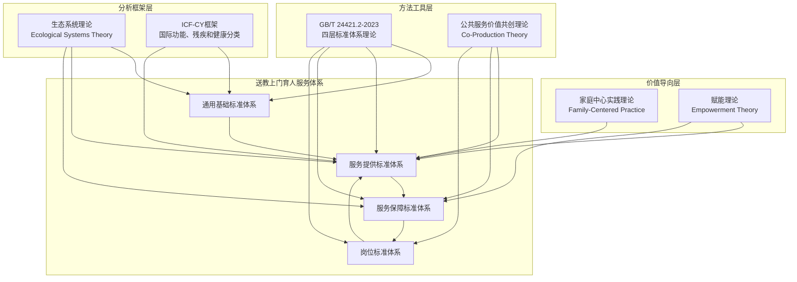

**图2-1 送教上门育人服务体系构建的理论整合框架**

在理论整合框架中，六大理论按照功能定位可以分为三个层次：

**价值导向层**：家庭中心实践理论和赋能理论共同构成了服务体系的价值基础和伦理准则。这两个理论回答了"服务体系为谁而建"这一根本问题——服务体系不是为了完成行政任务、也不仅是为了提升专业人员的服务绩效，而是为了支持重度残疾儿童的家庭，使家庭有能力促进儿童的参与和发展。家庭中心实践理论明确了"以家庭为中心"的服务立场，赋能理论明确了"赋能而非替代"的服务定位。这两个理论共同锚定了服务体系的人文关怀方向。

**分析框架层**：生态系统理论和ICF-CY框架共同提供了服务体系的需求分析和功能定位的分析工具。生态系统理论从"环境层次"的视角帮助识别影响服务效果的多元因素，确保服务体系设计的系统性和全面性；ICF-CY框架从"功能维度"的视角帮助界定服务需求和服务目标，确保服务方案的针对性和标准化。两者分别从"环境"和"个体"两个轴线建立了分析坐标，使服务体系的设计既有宏观视野又有微观精度。

**方法工具层**：GB/T 24421.2-2023四层标准体系理论和公共服务价值共创理论共同提供了服务体系构建的方法论和操作指引。四层标准体系理论为服务体系提供了"如何建立标准体系"的结构化方法——标准应当如何分类、各层标准之间如何关联、标准体系如何保持逻辑自洽和操作可行性；公共服务价值共创理论为服务体系提供了"如何设计服务过程"的过程性方法——服务应当如何从"单向供给"转向"双向共创"、家长和家庭应当以何种角色参与服务的全过程。两者共同将上层的价值理念和下层的分析框架"落地"为可操作、可实施的标准化服务体系。

三个层次之间呈现"价值引领—分析支撑—方法落地"的逻辑递进关系。价值导向层确立了体系构建的"应为"（ought to be），分析框架层提供了体系构建的"实然"（what is）认知，方法工具层给出了体系构建的"何以为"（how to do）路径。三者共同构成了一个理论逻辑完整、实践面向清晰的送教上门育人服务体系的理论基础框架。

在后续的章节中，本研究将基于这一理论整合框架，运用GB/T 24421.2-2023四层标准体系理论作为主要的结构化方法，以家庭中心实践理论、生态系统理论、ICF-CY框架和赋能理论作为价值导向和内容支撑，以公共服务价值共创理论作为过程和机制的设计指南，逐层构建送教上门育人服务的标准体系。

---

## 本章小结

本章围绕"国内外研究现状"和"理论基础"两条主线，系统梳理了与送教上门育人服务体系构建相关的学术成果和理论资源，形成以下核心认识：

在特殊教育标准化研究方面，国内GB/T 24421系列标准的修订标志着服务业标准化进入了体系化的新阶段，但特殊教育领域特别是送教上门的标准化研究尚处于起步阶段；国际上ISO 21001、澳大利亚NDIS实践标准、英国SEND Code of Practice和美国IDEA框架提供了多元化、多层次的标准化经验，其共同趋势是从"质量管理"走向"系统治理"、从"机构标准"走向"服务标准"、从"供给导向"走向"需求导向"。CRPD第24条和第4号一般性意见从国际人权法的高度提出了包容教育标准化的规范要求，为送教上门标准化建设提供了重要的价值坐标。

在送教上门质量研究方面，国内研究揭示了教师负担过重、家庭满意度中等、城乡差距显著、IEP形式化等突出问题；国际研究（美国、日本、韩国和中国台湾地区）同样反映了送教上门服务的共同困境——服务对象的残疾程度最重、需求最复杂，但相应的制度保障和专业支持反而最为薄弱。国内外比较分析进一步显示，中国送教上门研究亟需引入"标准化"这一制度化分析视角，将质量问题的解决提升到制度建设层面。

在核心理论基础方面，GB/T 24421.2-2023四层标准体系理论提供了标准体系构建的结构化方法，家庭中心实践理论和赋能理论共同确立了服务体系的价值立场，生态系统理论和ICF-CY框架提供了需求分析和功能定位的分析工具，公共服务价值共创理论提供了服务过程设计的范式指引。六大理论有机整合，构筑了本研究后续进行送教上门育人服务体系构建的理论基础和方法论支持。


---


# 第三章 我国送教上门服务标准化建设现状与结构性短板

送教上门标准化的逻辑起点，并非抽象的理论推演，而是对中国送教上门发展历程、政策演化轨迹与服务质量现状的系统检视。只有在充分理解送教上门"从何处来""现在何处"的基础上，才能回答标准体系"应往何处去"。本章从历史沿革、政策与标准梳理、服务质量调研分析和标准化建设的紧迫性四个层面，对我国送教上门服务标准化建设的现状与结构性短板进行系统考察。

## 3.1 我国送教上门服务发展历程

送教上门作为一项制度化教育实践，并非凭空而生，而是伴随我国特殊教育政策体系的演进和残疾儿童受教育权保障理念的深化，经历了一个从无到有、从自发探索到制度确认、从经验驱动到标准引领的渐进过程。纵观其四十余年的发展脉络，大致可以划分为三个递进阶段：起步阶段（1980年代至2000年代）、制度化阶段（2010年至2017年）和标准化探索阶段（2018年至今）。每一阶段的跃迁，都折射出我国特殊教育治理理念的深刻变迁——从"有学上"到"上好学"，从"覆盖面"到"高质量"。

### 3.1.1 起步阶段（1980年代至2000年代）：随班就读政策框架下的边缘探索

1980年代，我国特殊教育体系正处于重建与扩张时期。1986年《中华人民共和国义务教育法》的颁布，确立了适龄儿童少年接受义务教育的法定权利。然而，对于因重度残疾而无法到校就读的儿童，彼时的政策框架尚未形成专门的制度安排。这一时期，送教上门在官方文件中几乎不可见，其实践形态主要表现为两种路径：一是特殊教育学校和普通学校的教师基于人道主义关怀的自发上门探访与辅导，二是残联系统的社区康复工作者在开展居家康复服务时附带的教育性活动。这两种路径虽然在形式上具备了"上门"的外部特征，但缺乏稳定的师资配置、课程标准和质量监控机制，本质上属于一种非制度化的、依附性的公益行为。

1988年，第一次全国特殊教育工作会议召开，明确提出"以一定数量的特殊教育学校为骨干、以大量特教班和随班就读为主体"的发展格局。这一格局的形塑，使随班就读成为此后二十年特殊教育发展的核心议题，而无法随班就读的重度残疾儿童，则主要被归类为"免学缓学"对象，其受教育权长期处于制度性悬置状态。1990年《中华人民共和国残疾人保障法》虽然规定了"国家保障残疾人受教育的权利"，但该条款在实践层面更多指向能够进入教育机构的残疾人，重度居家残疾儿童的教育保障，仍缺少可供操作的实施路径。

1994年，国务院颁布《残疾人教育条例》，这是我国第一部专门针对残疾人教育的行政法规。该条例第十条规定："适龄残疾儿童、少年的父母或者其他监护人，应当依法使其子女或者被监护人接受义务教育。"但条例同时留出了"因身体条件不适宜到学校就读"的例外空间，实际上为重度残疾儿童"在家待学"提供了制度合法性。与此同时，部分地区开始尝试以民间力量或特殊教育学校志愿活动形式开展上门教育服务。例如，北京市部分特殊教育学校在1990年代中期即开始组织教师利用周末时间对重度残疾学生进行入户辅导，但这种行为更多依赖教师的个人职业热情，缺乏制度化的经费保障和质量规范。

进入21世纪，随班就读政策的深入推进逐步暴露出一个结构性矛盾：随班就读覆盖面越广，未能被覆盖的重度残疾儿童群体就越发凸显。2006年第二次全国残疾人抽样调查数据显示，全国6-14岁残疾儿童中，约有20%因残疾程度过重而无法进入任何形式的教育机构。这一数据像一面镜子，照出了我国特殊教育安置体系的结构性缺口——在普通学校随班就读和特殊教育学校集中就读之外，尚缺乏第三类制度化的教育安置方式。

2007年，教育部颁布《特殊教育学校义务教育课程设置实验方案》，首次在课程层面为送教上门的开展提供了部分参照依据。2009年，国务院办公厅转发教育部等八部门《关于进一步加快特殊教育事业发展的意见》，明确提出"对重度残疾儿童少年通过社区服务、送教上门等多种形式进行教育"。这是"送教上门"概念首次进入国家层面的政策文件，意味着这一长期处于边缘地带的教育实践开始被纳入正式的政策视野。然而，该文件对送教上门的表述仅为一个方向性提法，既未明确实施主体、经费渠道、师资标准和服务频次，也未建立相应的质量评价体系，送教上门的制度化进程尚处于"有方向而无路径"的阶段。

### 3.1.2 制度化阶段（2010年至2017年）：从政策倡导到法律确认

2010年至2017年，是我国送教上门从政策倡导走向法律确认的关键八年。这一时期，中央政策文件密集出台，送教上门逐步从一项"可做可不做"的倡导性活动，转变为一项"必须做"的制度性安排。

2010年，《国家中长期教育改革和发展规划纲要（2010-2020年）》将特殊教育列为教育改革发展的八大任务之一，明确提出"完善特殊教育体系""到2020年，基本实现市（地）和30万人口以上、残疾儿童少年较多的县（市）都有一所特殊教育学校"。这一目标虽然主要指向学校建设，但"完善特殊教育体系"的表述为送教上门的制度化预留了政策空间。2012年，党的十八大报告提出"支持特殊教育"，这一表述虽然简短，却标志着特殊教育在国家治理话语中的位置发生了根本性变化——从"发展"转向"支持"，暗含着对特殊教育多元安置方式的接纳。

2014年，国务院办公厅转发教育部等七部门《特殊教育提升计划（2014-2016年）》，这是我国第一个专门针对特殊教育的三年行动计划。《提升计划》明确提出"组织开展送教上门"，要求"县（市、区）教育行政部门要统筹安排特殊教育学校和普通学校教育资源，为确实不能到校就读的重度残疾儿童少年提供送教上门或远程教育等服务，并将其纳入学籍管理"。这一规定实现了三项关键突破：其一，明确了送教上门的责任主体是县级教育行政部门，解决了"谁来送"的组织归属问题；其二，将送教上门服务对象界定为"确实不能到校就读的重度残疾儿童少年"，建立了服务对象的认定标准雏形；其三，将送教上门纳入学籍管理，意味着接受送教上门的残疾儿童在法律身份上获得了与在校学生同等的"受教育者"地位。这三项突破，使送教上门初步具备了制度化运作的基本要件。

2016年，《"十三五"加快残疾人小康进程规划纲要》进一步提出"为不能到校就读的重度残疾儿童少年提供送教上门服务"，并将送教上门纳入残疾人基本公共服务的范畴。同年，教育部发布《盲校、聋校和培智学校义务教育课程标准（2016年版）》，为三类特殊教育学校的课程实施提供了标准化依据。虽然这些课程标准主要面向在校学生，但其课程理念、目标体系和内容框架，为送教上门教师的课程设计与教学实施提供了不可或缺的专业参照。

2017年，对送教上门的制度化进程而言，是具有里程碑意义的一年。经国务院第161次常务会议修订通过的《残疾人教育条例》（以下简称"新《条例》"）正式施行。新《条例》第十七条明确规定："适龄残疾儿童、少年能够适应普通学校学习生活、接受普通教育的，依照《中华人民共和国义务教育法》的规定就近到普通学校入学接受义务教育。适龄残疾儿童、少年能够接受普通教育，但是学习生活需要特别支持的，根据身体状况到特殊教育学校、普通学校附设特教班、残疾人中等职业学校、高等学校或者特殊教育机构接受教育。适龄残疾儿童、少年需要专人护理，不能到学校就读的，由县级人民政府教育行政部门统筹安排，通过提供送教上门或者远程教育等方式实施义务教育，并纳入学籍管理。"

这一规定具有根本性的法律意义。在此之前，送教上门的合法性仅建立在政策文件层面，法律效力层级较低，可执行性有限。新《条例》将送教上门明确列为义务教育的法定实施方式之一，使其获得了与随班就读、特教学校就读同等的法律地位。这意味着：第一，县级人民政府教育行政部门负有法定责任为不能到校就读的残疾儿童提供送教上门服务，不作为即构成违法；第二，接受送教上门是重度残疾儿童的法定权利，而非政府或学校的额外恩惠；第三，送教上门不再是特殊教育体系中的边缘性补充，而是构成我国特殊教育安置体系完整性的制度支柱之一——在某种程度上，它承担着"兜底"功能，使教育公平真正覆盖到"最后一公里"的最脆弱群体。

### 3.1.3 标准化探索阶段（2018年至今）：从"有没有"到"好不好"

2018年至今，我国送教上门进入了一个以"质量提升"和"标准建设"为关键词的新阶段。这一阶段的标志性特征在于：政策重心从"扩大覆盖面"转向"提升服务质量"，从"有人送"转向"送得好"，各省份开始主动探索送教上门的地方标准与服务规范。

2018年，教育部等四部门发布《关于加快发展残疾人职业教育的若干意见》，虽然不是直接针对送教上门，但其强调的"个别化支持"理念对送教上门的实践产生了深远影响。2020年，教育部印发《关于加强残疾儿童少年义务教育阶段随班就读工作的指导意见》，在强化随班就读质量的同时，也间接推动了送教上门服务对象的精准化识别——只有在充分评估后确实无法随班就读的儿童，才应被纳入送教上门范围，这有助于避免送教上门被滥用的风险。

2021年，国务院印发《"十四五"残疾人保障和发展规划》（国发〔2021〕10号），将"健全送教上门制度"列为保障残疾人受教育权的重要举措。同年，中共中央、国务院印发《国家标准化发展纲要》，明确提出推动标准化在社会管理和公共服务领域发挥基础性、引领性作用。这两份文件的叠加效应在于：《"十四五"残疾人保障和发展规划》提出了送教上门制度建设的方向性要求，而《国家标准化发展纲要》则为这一制度建设提供了方法论指引——标准化，而非简单的行政指令，应成为提升送教上门质量的核心路径。

2022年1月，教育部等七部门发布《"十四五"特殊教育发展提升行动计划》（国办发〔2021〕60号），这是送教上门标准化进程中最重要的政策文件之一。该计划明确要求"健全送教上门制度，推动各省（区、市）完善送教上门服务标准，科学认定服务对象，规范服务内容与形式，提高送教上门服务质量"。尤为值得关注的是，"推动各省完善送教上门服务标准"这一表述，不仅确认了标准的必要性，更将标准建设的责任下沉至省级层面，为各地因地制宜地探索送教上门标准提供了政策依据。同时，该计划提出了一项关键性的质量管控原则——"能够入校就读的残疾儿童不纳入送教上门范围"——旨在防止送教上门被异化为降低教育成本的替代手段，而背离其保障重度残疾儿童受教育权的制度初衷。

2022年11月，教育部印发《特殊教育办学质量评价指南》，首次将送教上门纳入特殊教育质量评价体系。该指南要求对送教上门服务进行"过程性评价"，关注"送教方案的针对性和适切性""教学过程的规范性和有效性""学生发展的进步程度"等质量维度。这一文件的意义在于：送教上门不再仅仅是一项"做了就好"的行政任务，而是一项需要"做好"的教育服务，其质量必须接受系统评价。

2023年，《国家基本公共服务标准（2023年版）》（发改社会〔2023〕1072号）发布，将"残疾儿童送教上门"正式纳入国家基本公共服务事项清单。这一纳入具有深远的制度效应：其一，国家基本公共服务标准的"刚性"属性，意味着各级政府必须将送教上门纳入财政预算予以保障，"有钱就做、没钱就不做"的随意状态在法律上被终结；其二，"基本"二字的限定表明，送教上门属于底线性的公共服务，各级政府的首要责任是保障其底线质量，在此基础上可以追求更高水平；其三，纳入基本公共服务标准意味着送教上门应当具备可衡量、可比较、可评价的质量标准——这正是标准化建设的核心诉求。

在地方层面，各省市积极响应国家政策，开启了标准化的多样化探索。福建省教育厅于2024年发布《关于进一步加强义务教育阶段重度残疾儿童少年送教上门服务工作的通知》（闽教基〔2024〕31号），提出了送教频次、服务时长、师资配备和档案管理的具体标准。浙江省以杭州市为试点，探索"互联网+送教"模式，通过数字化平台实现送教过程的标准化管理。北京市以海淀区为试验田，将个别化教育计划与送教上门相结合，建立了一对一的课程计划和教学评估体系。值得关注的是，新疆维吾尔自治区于2025年发布了DB65/T 4929-2025《儿童福利机构 义务教育阶段重度残疾儿童少年送教上门服务指南》，这是全国首个针对送教上门服务的省级地方标准，明确规定了服务原则、基本要求、服务内容、服务评价与改进、档案管理等核心要素，标志着送教上门标准化从"规范性文件"向"技术标准"的关键跃升。同期，民政部发布了MZ/T 209-2024《儿童福利机构特殊教育服务规范》，山东省发布了DB37/T 4397.1-2025《儿童福利机构教育服务规范 第1部分：特殊教育》，这些标准虽以儿童福利机构为主要适用对象，但其服务流程和质量规范为送教上门标准化提供了重要的参照基准。此外，2024年教育部遴选设立了61个国家特殊教育改革实验区，覆盖全国各省份，旨在通过区域性改革试点探索包括送教上门在内的特殊教育质量提升路径。这些地方实践虽然在标准内容和执行力度上参差不齐，但它们共同表明了一种趋势：送教上门的标准化已从顶层设计的倡导阶段，进入地方实践的落地阶段和标准制定阶段。

从起步阶段的零星探访，到制度化阶段的法律确认，再到标准化探索阶段的质量提升，我国送教上门经历了从"无"到"有"、从"有"到"法"、从"法"到"标"的三次跃迁。这三次跃迁不仅是政策文本的更迭，更是一种教育治理思维的根本转变：送教上门不再只是"好教师的自发善举"，而是一项需要系统标准保障的公共服务。然而，需要清醒认识的是，"标准化探索"仍处于"探索"而非"建成"阶段，现有标准无论在覆盖范围、内容深度还是执行力度方面，距离真正的标准化治理尚有相当距离。这一差距，正是本章后续各节所要重点展开的议题。

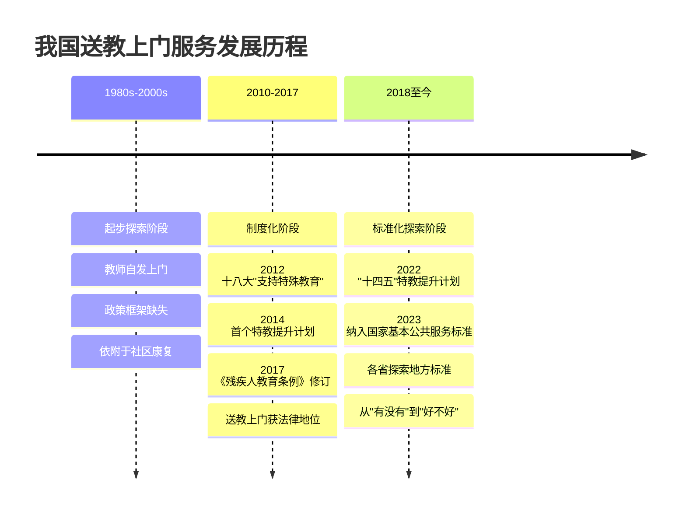


## 3.2 现有送教上门政策与标准梳理

本节系统梳理国家层面与省级层面涉及送教上门的政策法规与服务标准，通过纵向的法律效力层级分析与横向的区域比较，揭示当前送教上门标准化建设的总体格局与内在张力。

### 3.2.1 国家层面：政策框架的搭建与标准的系统性缺失

#### （一）法律层面：《残疾人教育条例》的制度定位

在法律效力层级上，《残疾人教育条例》（2017年修订）是目前送教上门领域位阶最高的规范性文件。前文已述，该条例第十七条将送教上门确认为义务教育的法定实施方式，规定了县级教育行政部门的统筹责任和纳入学籍管理的要求。然而，该条例的规范密度存在明显局限：它解决了"谁来做"和"为谁做"的归属问题，却未触及"怎么做""做多少""做多好"的质量问题。从立法技术角度看，该条款属于授权性规范与职责性规范的混合体——它既授予了县级教育行政部门实施送教上门的权力，也课予了其相应的义务，但对于义务的履行标准（送教频次、师资要求、课程内容、评价方式等），则保持了立法沉默。这种"原则立法-细则下放"的立法模式虽然为地方探索留出了制度空间，但也在客观上造成了标准缺失的"立法真空"——当地方未能及时填补这一真空时，送教上门的法定权利便有沦为"裸权利"的风险。

#### （二）规划层面：《"十四五"特殊教育发展提升行动计划》的标准推动

《"十四五"特殊教育发展提升行动计划》（2022年）是近年来送教上门标准化建设最重要的政策驱动力。该计划不仅在宏观层面提出"健全送教上门制度"，更在微观层面作出了若干具有标准化意涵的具体要求。这些要求可以归纳为四个维度：

**第一，服务对象标准。** 该计划提出"科学认定服务对象""能够入校就读的残疾儿童不纳入送教上门范围"，实质上是对服务对象提出了"精准识别"的标准化要求。这种识别的科学性依赖于多学科评估团队的参与，而非行政人员或教师的单方判断。然而，该计划并未就评估团队的组成、评估工具的选用、评估流程的规范等提供统一指引，各地在实践中的认定标准差异显著。

**第二，服务内容标准。** 该计划要求"规范服务内容与形式"，但仅作出了"提供合适的教育教学、康复训练等服务"的原则性表述，未就教育教学与康复训练的权重分配、内容选择标准、课程设计框架等作出具体规定。这种模糊性在现实中表现为两种极端：一些地区将送教上门简化为"上门聊天+教认字"，教育含量极低；另一些地区则对送教教师提出过高的康复治疗要求，超出教师的专业能力边界。

**第三，服务质量标准。** 该计划提出"提高送教上门服务质量"，这一表述标志着政策关注点从"数量覆盖"向"质量提升"的转变。但"质量"究竟指向什么？是服务频次的提高、教学效果的可测、家庭满意度的提升，还是学生功能性技能的进步？该计划未给出明确的定义框架，这为后续的标准化工作留下了巨大的概念填充空间。

**第四，标准建设路径。** 该计划明确"推动各省（区、市）完善送教上门服务标准"，将标准建设的责任主体设定为省级政府。这一制度设计体现了对地方差异的尊重——不同省份在特殊教育发展阶段、财政能力和服务需求方面存在显著差异，由国家统一制定刚性标准未必是最优选择。但省级分散制定标准也可能带来碎片化风险：各省标准的不一致，可能导致送教上门服务在全国范围内缺乏可比性，进而影响教育公平的实现。

#### （三）基本公共服务标准层面：从政策目录到标准化治理的跨越

2023年，《国家基本公共服务标准（2023年版）》将"残疾儿童送教上门"纳入服务清单，服务标准表述为："为确实不能到校就读的重度残疾儿童少年提供送教上门服务。"这一纳入的制度意义不容低估。在标准治理视域下，"基本公共服务标准"与"一般性政策文件"的关键区别在于其"刚性约束"属性：基本公共服务标准确立了政府必须提供的服务清单和底线要求，具有明确的支出责任与绩效考评机制。送教上门一旦进入这一清单，就意味着财政预算必须予以保障，服务质量必须接受监督，服务缺口必须限期补齐。

然而，对照基本公共服务标准的规范化要求，当前送教上门的标准表述存在明显的"空心化"倾向。以《国家基本公共服务标准（2023年版）》中相邻服务事项为参照，"残疾儿童及青少年教育"项下的"学前教育资助""义务教育阶段特殊教育"均有相对明确的实施标准和支出责任界定，而"送教上门"仅有一句概括性描述，缺乏对服务频次、师资配置、课时保障和经费标准的任何具体规定。这种"有名目而无标准"的现状，意味着送教上门虽然形式上已进入基本公共服务清单，但在实质上尚未完成从"政策倡导"到"标准治理"的跨越。换言之，它仍处于"目录清单式标准"向"内容规范式标准"过渡的中间地带。

#### （四）相关标准的间接参照

在缺乏送教上门专项国家标准的情况下，若干相关标准为实践提供了间接参照。《盲校、聋校和培智学校义务教育课程标准（2016年版）》虽然主要面向在校学生，但其课程理念——如生活化导向、功能性目标和个别化支持——对送教上门的教学内容设计具有重要参照价值。《特殊教育教师专业标准（试行）》对特教教师的专业知识与能力要求，也为送教上门师资的遴选与培训提供了部分依据。教育部2022年印发的《特殊教育办学质量评价指南》，则从评价维度为送教上门质量监控提供了框架性参考。

但这些间接参照存在三个显著的局限性。其一，它们并非为送教上门场景专门设计，无法覆盖送教上门服务中的家庭场域适应性、跨专业协作和远距离服务管理等特殊问题。其二，它们多为推荐性标准或指导性文件，缺乏强制性，在基层实践中容易被选择性执行或形式化应付。其三，它们彼此之间缺乏系统整合，未能形成一个涵盖服务提供、师资保障、质量评价和改进提升的完整标准链条。

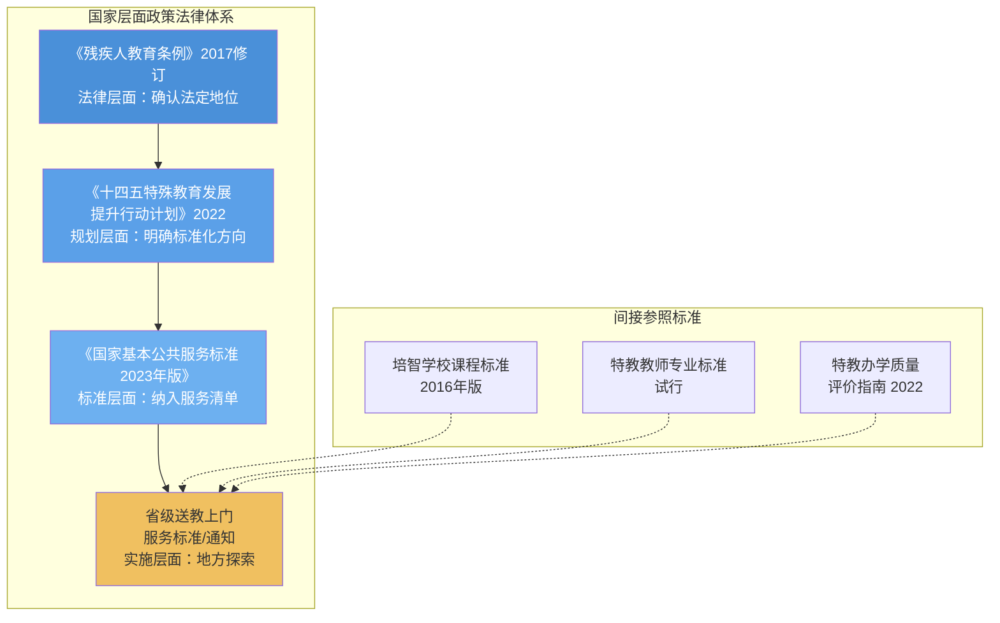

### 3.2.2 省级层面：标准探索的差异化图景与"碎片化"困局

自《"十四五"特殊教育发展提升行动计划》要求各省完善送教上门服务标准以来，各地积极响应，形成了省级标准制定的"第一波浪潮"。然而，由于缺乏全国统一的制定指南，各省标准在内容、深度和约束力方面呈现出显著差异，形成了一个值得系统审视的"碎片化"图景。

#### （一）服务频次标准：省级规范的核心差异

服务频次是送教上门标准中最基础也最具争议的指标。在全国各省已发布的送教上门规范性文件中，服务频次标准呈现出"高低悬殊、逻辑各异"的状态。

福建省教育厅2024年发布的闽教基〔2024〕31号通知要求："原则上每周送教不少于2次，每次不少于2课时（每课时30分钟）。"这一频次标准在全国处于较高水平，其背后体现了将送教上门视为一种"高频次、常态化"教育服务的理念。与之形成对照的是，部分省份（如中西部若干省份）仅笼统规定"每月不少于2次"或"每学期不少于6次"，与福建标准相比，频次差异可达四至八倍。更有一些地市在执行省级标准时出现了"标准降级"现象——福建泉州下辖的晋江市，在早期实践中将送教频次设定为"每周不少于1次"，虽然近期已进行调整，但这一现象揭示了一个值得警惕的问题：省级标准的刚性约束力在实际操作中可能被市级甚至县级自行"软化"。

频次标准的差异背后，是多重因素的交织作用。从客观因素看，经济发展水平决定了教育财政的负荷能力——福建省2023年人均GDP位居全国前列，其在送教上门领域的财政投入领先于大多数中西部省份。地理因素同样影响深远——东部沿海省份人口密度高、交通便利，高频送教的边际成本相对较低；而西部偏远省份地域广阔、交通不便，教师单次送教往返可能需要数小时甚至一整天，高频次送教在物理条件上的可行性受到严重制约。从主观因素看，各省对送教上门的"教育功能"定位存在认知差异：高频次标准更强调送教上门的教学连续性，视其为一种替代性教育形式；低频次标准则更多将其定位为"定期关怀+教学指导+家庭培训"的复合服务，对教师上门教学的依赖度较低。

#### （二）服务内容与课程标准：从"无米之炊"到"百家饭"

服务内容是送教上门标准中规范密度最低的维度。大多数省份的规范性文件对服务内容仅作原则性描述，如"提供文化知识教学、康复训练指导和生活技能培养"，但缺乏具体的课程框架、内容标准和教学指导意见。个别走在前列的省份（如浙江省）开始探索送教上门课程资源包建设，将教学内容模块化、任务化，供教师根据学生情况选择组合使用。但整体而言，送教教师仍高度依赖个人的专业判断和经验积累进行课程设计与内容选择，"百家饭"式的教学内容供应模式，是其质量的天然不稳定因素。

#### （三）师资标准：资格要求提升与专业培训不足的张力

在师资标准方面，各省规范性文件普遍要求送教教师应持有教师资格证，首选特殊教育专业背景的教师，并提倡组建由特教教师、康复治疗师、心理咨询师等专业人员组成的送教团队。然而，这一"理想标准"与"现实供给"之间存在巨大的落差。2023年全国教育统计数据表明，全国特殊教育专任教师约7.7万人，而送教上门服务对象虽无全国精确统计，但据各地不完全数据估算，数量在数十万量级。即便按每位教师负责3-5名送教学生的最低保有量估算，现有特教师资也远不能满足送教需求。在师资总量不足的刚性约束下，大量送教任务由普通学校教师兼任或由非教育专业人员承担，资格要求标准实际上被"软化"为一种不具备执行力的理想表述。

更值得注意的是教师培训标准。送教上门教师面临的场景与在校教师截然不同：他们需要在家庭环境中独立判断教学起点，需要处理"一生一案"的高度个别化需求，需要在缺乏专业团队即时支持下完成跨学科的综合服务，需要在家校边界模糊的私密空间中维持专业角色。这要求送教教师不仅具备通用教学能力，还须掌握家庭场域教学策略、简易康复训练技能、家校沟通技术和应急处理知识。然而，大多数省份的规范性文件并未就送教教师岗前培训和在职研修的内容、时长和考核作出明确规定。据部分地区的调研数据，仅约30%-40%的送教教师表示接受过专门针对送教上门的系统培训，近半数教师的培训经历仅限于"一次性的工作布置会"。这一培训缺位，意味着即便资格要求标准写得明确，实际履职能力却无法得到保障。

#### （四）经费保障标准：从"以人定费"到"以标定费"的转型之困

经费保障是送教上门标准化不可回避的硬约束。部分省份（以福建省为代表）在规范性文件中明确了送教上门的生均公用经费标准——参照特殊教育学校生均公用经费标准拨付，2023年该标准通常为6,000元/生/年。但这一"以人定费"模式在操作中产生了两个突出问题。

其一，经费与服务质量之间缺乏对应关系。"按人头拨款"仅解决了"钱有没有"的问题，却无法回答"钱用在哪里""钱花得值不值"的质量追问。部分地区出现了经费到账但服务缩水的现象——教育行政部门按照人头标准拨款至承担送教任务的学校，但学校受制于师资不足和考核缺位，实际提供的上门次数和教学质量并未达到应有水平。在这种机制下，经费标准与服务标准是脱节的，前者无法驱动后者的实现。

其二，经费标准的跨区域可比性不足。我国各地经济发展水平差异悬殊，东部沿海省份与西部欠发达省份在生均公用经费标准上的差距可达数倍。在此背景下，全国统一的最低经费标准一直未能出台，导致送教上门的经费保障水平高度依赖地方财政能力——在财政充裕地区，送教上门可以获得较为充分的经费支持；在财政困难地区，最低限度的经费保障都可能面临困难。这种"因地而异"的经费保障模式，与中国义务教育"均衡发展"的基本理念存在张力。

#### （五）地方创新案例：南安"云端学校"的标准先行者实践

在省级标准化探索中，若干地方的创新实践为送教上门标准建设提供了宝贵的"先行先试"经验，其中最具代表性的案例是福建省泉州市南安市的"云端学校"实践。南安市自2015年起针对重度残疾儿童构建了"特教老师上门+网络授课+康复师上门"三合一服务模式。该模式的核心创新在于三个方面：一是分工标准化，将教学、康复和技术支持分别交由特教学校教师、签约康复师和信息技术人员分角色承担，避免了对单一教师"全能型"角色的不切实际要求；二是课程标准化，开发了涵盖生活语文、生活数学、生活适应、康复训练等领域的送教上门专用课程资源包，使教师"有内容可教"而非"自编自演"；三是过程标准化，通过信息化平台记录每次送教的教学目标、实施过程和效果评估，形成可供追踪和评价的电子档案。至2024年，南安市已累计投入约1.2亿元用于送教上门和融合教育相关服务，建成了覆盖全市所有乡镇的送教上门服务网络。

南安实践的意义不在于其财政投入的规模，而在于它证明了一个命题：送教上门的标准化不是纸上谈兵，在具备组织能力、专业支持和持续投入的条件下，可以在中国基层县级行政区落地生根。但同时也应看到，南安的资源密集投入模式在多大程度上可被全国其他地区复制，尤其是在中西部欠发达县域，仍然是一个值得谨慎对待的问题。标准化的核心挑战之一，恰恰是在不同资源条件下寻找"底线质量"与"发展目标"之间的平衡点。

### 3.2.3 现有标准的结构性短板

通过对国家与省级两个层面政策与标准的系统梳理，可以归纳出当前送教上门标准化建设的四重结构性短板：

**第一，标准体系"有框架无内核"。** 国家层面的政策文件为送教上门标准化搭建了方向性的框架——要求完善标准、规范服务、保障质量——但框架内部缺乏可操作的指标体系和实施指南。各省标准虽然在一定程度上填充了这一空白，但其内容多以原则性表述为主，距离真正意义上的"标准"（即具有明确指标、可衡量、可评价的规范性文件）尚有较大距离。以GB/T 20000.1-2014《标准化工作指南 第1部分：标准化和相关活动的通用术语》对"标准"的定义——"通过标准化活动，按照规定的程序经协商一致制定，为各种活动或其结果提供规则、指南或特性，供共同使用和重复使用的文件"——来衡量，当前大多数省级送教上门规范性文件更接近"指导意见"而非"标准"。

**第二，标准内容"赋责有余赋能不足"。** 现有标准文件密集规定了送教教师"应当做什么"——应当定期上门、应当制定个别化教育计划、应当记录服务过程、应当开展家校沟通——但较少提供帮助教师"如何做到"的赋能性内容，如送教专用课程资源、教学策略指南、评估工具包和应急处理手册。这种赋责多于赋能的取向，容易使标准化沦为"指标摊派"而非"质量提升"，教师在被高密度要求的同时，并未获得相应的专业支持和资源保障。

**第三，标准衔接"纵向断裂横向冲突"。** 纵向层面，国家政策→省级标准→市级细则→校级规程之间缺乏一致性的传递链条。省级标准在将国家政策细化为地方可操作规范的过程中，大量具体指标实际上来源于文件起草团队的内部判断，而非基于对基层实践的系统调研和科学论证。横向层面，各省标准之间的差异缺少合理的解释框架——某些差异可以归因于地方实际，但更多差异似乎仅反映了不同起草团队的认知偏好，而非有意识的差异化设计。这种断裂与冲突，使其难以形成全国范围内可比较的质量基准，不利于从国家层面对送教服务质量进行统一监测。

**第四，标准执行"有规定无闭环"。** 已出台标准的省份普遍缺乏配套的标准实施评价机制。标准发布后是否被使用、是否被正确理解、是否产生了预期的质量提升效果，基本处于无人追踪的状态。按照GB/T 24421.4-2023关于标准实施及评价的要求，标准体系应当包含"实施计划→培训准备→检查评价→改进提升"的完整闭环。但在当前送教上门的标准化实践中，这一闭环几乎完全缺位——标准的制定（发布文件）即是终点，实施、评价与改进环节被系统性省略。这使标准化沦为"文本标准化"而非"实践标准化"，文件质量与服务质量之间的关联度极为薄弱。

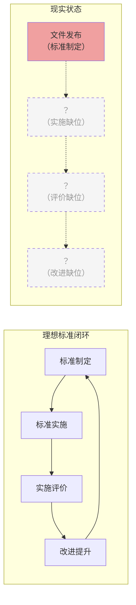


## 3.3 送教上门服务质量全国性调研分析

政策与标准文本的分析只能呈现"应然"图景，而送教上门服务质量的真实面貌，必须回归到"实然"层面加以审视。本节基于教育部历年教育统计数据、公开发表的实证研究成果以及福建等省份的送教上门专项调研数据，从服务规模、教师负担、教育过程质量和家庭满意度四个维度，对当前送教上门服务质量进行系统性分析。

### 3.3.1 服务规模与覆盖面的"数字繁荣"背后

从宏观数据看，我国特殊教育在过去十余年间取得了显著发展。教育部《2024年全国教育事业发展统计公报》显示，2024年全国共有特殊教育学校2,396所，专任教师8.13万人，在校特殊教育学生91.59万人（教育部，2025）。与2010年相比，特殊教育学校数量增长了约38%，在校学生数量增长了约121%。这些数据从总量上呈现出一幅特殊教育事业蓬勃发展的图景。

然而，宏观总量数据的增长并不能自动等同于送教上门服务质量的提升。在91.59万在校特殊教育学生中，究竟有多少学生实际接受了送教上门服务？根据教育部2023年教育统计数据（2025年1月发布），全国送教上门在校生共计184,617人，占特殊教育在校生总数的约20.2%，其中特殊教育学校承担送教75,987人，小学学校送教66,293人，初中学校送教42,337人。此外，2023年送教上门毕业生37,597人、招生30,813人（教育部，2025）。这是教育部首次在年度统计中发布送教上门分类数据，标志着送教上门正式进入国家教育统计体系。以这一数据推算，全国范围内接受送教上门服务的儿童数量已接近20万量级——这意味着送教上门并非少数特例，而是一个涉及近20万家庭、对教育公平和公共服务质量有深远影响的庞大系统。

更值得关注的是服务覆盖面的"结构性问题。在不少地区，送教上门的覆盖面存在显著的城乡差距和区域差距。城市地区由于特教资源相对集中、交通便利益于、信息传播充分，重度残疾儿童的送教上门需求满足率较高；而在农村地区，特别是偏远山区，部分重度残疾儿童即便已被纳入送教服务名单，实际接受服务的频次和质量也大打折扣。有调研指出，在西部若干省份的偏远乡镇，送教上门一度处于"名册上有、实际上无"的虚置状态——学生姓名被录入系统以应付上级检查，但教师因交通不便、经费不足或缺乏动力而未真正到访。这种覆盖面的"账面达标"与"实际虚置"并存的现象，是对送教上行标准化治理提出的严峻挑战：从"是否覆盖"到"覆盖是否真实有效"，标准化需要建立起一套能够穿透账面的质量验证机制。

### 3.3.2 送教教师负担与服务有效性的结构性矛盾

送教教师是服务质量的第一责任人，也是服务压力的直接承受者。对教师负担的系统分析，是理解送教上门服务质量困境的重要入口。

**（一）交通负担：时间耗损与精力消耗的双重挤压**

送教教师面临的首要负担是交通问题。与在校教学不同，送教教师必须前往分布在城市乡村各处的学生家中，交通时间往往远超教学时间。据福建省若干地市的调研数据，送教教师单次送教的门到门平均往返时间为2.5小时，最远个案可达5-6小时。在一次送教总耗时中，用在路上的时间通常占比50%-70%，而直接教学时间仅占30%-50%。以每次送教2课时的要求计算，教师实际上需要为此付出约4小时的总工作时间。如果按照福建省规定的每周不少于2次的标准，每位教师每周仅送教交通即需耗费5-10小时，这还不包括课前准备、课后记录和家长沟通的时间。

在时间资源总量固定的约束下，交通时间的巨大消耗必然挤占教学准备和专业发展的时间，形成一个"重送达、轻教学"的恶性循环：教师把大量精力投入"到达学生家中"这一物理行为，而对"到达之后教什么、怎么教"则缺乏充分准备。更严重的是，这种高交通负担会显著削弱教师长期从事送教工作的意愿，加速教师的职业倦怠和流失——这已被多地实践所证实。

**（二）专业能力缺口：教师"全能化"期待与现实本领的剪刀差**

送教教师被期待具备一种近乎"全能"的专业能力结构：既要能够教授文化知识课程，又要能够开展康复训练指导，还要能够进行行为干预、心理辅导和家庭支持，甚至在部分情形下还要兼具社会工作者的角色。然而，我国特殊教育教师的职前培养体系高度分科——培智教育、盲教育、聋教育的培养方案各不相同，且均未将送教上门作为专门的教学模块纳入课程体系。这意味着，绝大多数进入送教岗位的教师，是在缺乏专门准备的情况下"边做边学"。

多项实证调研揭示了这一专业能力缺口的严重性。在对全国多个省份送教教师的问卷调查中，超过60%的受访教师认为自己的"康复训练指导能力"不足以满足送教需求，约55%的受访教师表示"缺乏针对不同残疾类型学生的教学策略"，约40%的教师承认"不了解如何为重度多重障碍学生制定有效的教育目标"。更值得注意的是，教师的专业焦虑往往被"爱心话语"所遮蔽——在访谈中，教师反复使用"尽最大努力""多关心多陪伴""把课上好"等模糊表述来描述自己的工作，但当被进一步追问"什么是上好课""如何判断学生有进步"时，多数教师难以给出可操作的回答。这种模糊性本身就是质量标准缺位的表现。

**（三）家校沟通：情感劳动超载与专业界限模糊**

送教上门发生在家校边界高度模糊的家庭场域中，教师与家长（或其他家庭照护者）的互动远超一般家校沟通的复杂度。一方面，重度残疾儿童的家庭常常承受着巨大的照护压力、经济负担和心理创伤，家长不仅期望教师教授孩子知识，更可能寄希望于教师提供康复指导、政策咨询、心理安慰乃至事务协助。教师在这一情境中，被动或主动地承担了大量的情感劳动和非教育性协助工作，而这一部分劳动几乎完全不在任何标准或考核的计量范围之内。另一方面，部分家庭对送教上门缺乏配合意愿——家长不愿参与教学过程、不配合训练指导、甚至将教师上门视为"免费保姆服务"，使教师在上门后陷入"进得去门但上不了课"的尴尬境地。

一项针对福建省送教教师的调查显示，约48%的教师认为"家长配合度低"是影响送教质量的主要障碍之一，接近"专业能力不足"（约55%）的数据水平。这一发现揭示了一个重要的逻辑：送教上门的质量不是一个纯粹的教学质量问题，而是一个涉及家庭参与、家长能力和社会支持的生态系统问题。在标准化框架中，如果仅对教师提出要求而忽略家庭协同维度，质量提升的目标就难以实现。

### 3.3.3 教育过程质量的实证审视

如果说教师负担更多反映的是"供给侧"困境，那么对教育过程本身的审视，则直接指向送教上门"需求侧"的质量底色。本节聚焦于三个关键的实证发现。

**（一）个别化教育计划（IEP）的形式化危机**

个别化教育计划（Individualized Education Program, IEP）是特殊教育质量保障的核心工具。在送教上门中，IEP应当发挥"一案定教"的功能，即根据每个学生的障碍类型、能力水平和发展需求制定个别化的教育目标和教学方案。然而，多项调研揭示了IEP在送教实践中的严重形式化问题。

首先，IEP制定过程中的评估缺位。规范的IEP制定应以多学科评估为前提，由特教教师、康复治疗师、学校心理学家等共同参与完成。但在送教上门的基层实践中，IEP大多由送教教师独自填写，评估依据主要来自"初次上门观察"和"向家长简单询问"，缺乏标准化的评估工具（如儿童适应行为量表、粗大运动功能评估等）和多学科专业意见的支撑。由此产出的IEP，往往是一份涵盖"知识、技能、情感"三个维度的一般性教育计划，而非针对特定学生障碍特点和实际需求的、可操作的教学路线图。

其次，IEP执行过程中的"写做分离"。更严重的问题在于，即便是已制定的IEP，在后续的教学实施中也往往未能得到严格执行。一项针对多省送教教师的调查显示，约43%的受访教师坦承"有方案但未能完全按方案实施"，主要原因包括：学生的实际能力与IEP预期差距过大、家长不配合IEP规定的训练任务、教师每次送教间隔过长以致教学缺乏连续性。这意味着，IEP在大量案例中沦为一纸档案文件——其存在是为了满足行政检查和台账要求，而非真正指导教学实践。"写做分离"问题的根子在标准化——如果没有对IEP制定质量、过程执行和效果评价建立系统性标准，IEP就注定会从"质量工具"退化为"合规材料"。

**（二）教学过程的碎片化与低连续性**

送教上门服务质量面临的另一个深层挑战，是教学过程的碎片化。与在校学生每天接受系统性教学不同，接受送教上门的重度残疾学生学习机会天然受限——在低频次上门服务模式下，两次教学之间可能间隔数天甚至数周，其间缺乏持续的学习刺激和技能巩固机制。

这种碎片化在三个层面上产生影响。在认知层面，重度残疾学生特别是智力障碍学生存在显著的学习保持困难——新习得的技能若不经过高密度的练习和泛化，极易快速消退。在技能层面，日常生活技能和行为习惯的培养高度依赖时间上的连续性——每周一两次的集中教学难以替代逐日的、情景化的训练和引导。在关系层面，低频次拜访难以在师生之间建立起深层次的信任和依恋关系，而教育关系的浅表化又会反过来削弱教学互动的情感基础。正如戈夫曼互动仪式理论所提示的，教育活动的持续有效性依赖于师生互动的身体在场、共同关注和情感能量交换，而在送教上门所固有的低频次、短时长和碎片化模式中，这些条件都面临严峻挑战。

理论与实践的共同指向是：纯粹的教师上门教学无法独立承担保障教育质量的使命。在两次上门之间，必须有家长参与或远程技术支持的"教学延续机制"来弥合教学断层。而这一机制的建立和有效运行，正是标准化体系需要系统回应的核心问题。

**（三）城乡送教服务质量的结构性分化**

城乡差距是我国公共服务领域中一个绵延已久的结构性问题，在送教上门这一高度依赖人力资源、交通条件和财政投入的服务形态中，其展现尤为触目。

在服务频次方面，城市地区和县城城区由于学校布点密集、交通便利、教师调配灵活，送教上门月均服务次数普遍在4-8次之间；而在偏远农村和山区乡镇，月均服务次数可能仅有1-2次，冬季和雨季受路况影响还可能进一步缩水。在教学专业性方面，城市特教学校或随班就读资源中心一般有较完备的评估工具和课程资源可供送教教师使用，而农村教学点或乡镇中心校的送教教师往往无法获得任何形式的专业支持，基本依靠个人经验"摸着石头过河"。在辅助资源方面，城市送教服务更有可能链接到康复治疗师、社区医生、心理咨询师等多学科资源，而农村送教几乎全凭送教教师"单打独斗"。在信息获取方面，城市家庭的家长更有可能通过互联网和社交网络了解送教政策、查阅康复知识、寻求社会支持；农村特别是留守家庭中，信息不对称和渠道闭塞进一步制约了送教上门服务的质量和效果。

这些差距的本质，不仅仅是资源量的不足，更是系统性的标准缺位。如果在国家层面建立起了涵盖最低服务频次、基本师资配置、底线课程资源和兜底经费保障的"基准标准"，农村送教服务即使无法立刻达到城市水平，至少可以有一个清晰的"追赶目标"和向责依据。相反，在标准完全缺位的条件下，城乡差距就会在"自然发展"的路径下持续扩大，最终走向"有标准无标准、有差异无差异"的教育不公平。

### 3.3.4 家庭满意度与受益人感知的质量画像

从服务接受者视角审视服务质量，是公共服务标准化不可或缺的维度。本节基于部分地区的实证调研数据，呈现家庭满意度与服务质量感知的结构性特征。

**（一）满意度的"总体中等、维度分化"格局**

综合多项调研数据，家庭对送教上门服务的总体满意度处于"中等偏上"水平——在5分制量表上，总体满意度的均值大多落在3.5-4.0区间。但总体均值的"尚可"面貌下，隐藏着维度间的显著分化。

在教师服务态度维度，满意度均值通常最高（4.0-4.5区间）。家长普遍认可送教教师的责任心和关爱态度，"老师很耐心""老师对孩子很好"是家长访谈中出现频率最高的正向评价。这一发现具有双面意涵：积极的一面是送教教师的职业精神得到了家庭的认可和接纳；但另一面也引发追问——这种高度依赖于教师个人品德和情感付出的服务质量，是否具有可复制性和可持续性？如果某位"好教师"调动、退休或倦怠，下一个接手的教师能否提供同等质量的关怀？

在教学效果维度，满意度均值通常最低（2.8-3.5区间）。家长对孩子的"实际进步程度"普遍持谨慎评价，"孩子没啥大变化""老师来了就陪着玩一下""也不知道能学到啥"是访谈中高频出现的消极或中性表述。对教学效果的低满意度与对教师态度的高满意度之间的落差，某种程度上印证了前文提出的"服务在场而教育离场"的命题：教师的热心和用心，并未充分转化为学生可观察的、持续的学习效果。而这一落差的消除，不可能仅靠教师个人努力，而需要一套能够将"教学输入"与"学习产出"有效连接的质量标准体系。

**（二）家长"高位期望—低位参与"的认知偏差**

调研中出现的一个值得深思的发现，是家长在送教上门服务中呈现出"高期望与低参与"的双重特征。一方面，许多家长对送教上门寄予了超出教育范畴的复合期望——希望教师能"治好"孩子的残疾、帮助申请更多的政府补贴、协调社区资源解决实际困难；另一方面，在家长自身能够配合的教学延伸活动（如每日进行教师布置的家庭训练任务、使用简易辅助器具帮助孩子练习动作等）中，家长的持续参与率却普遍较低。据部分地区调研数据，在所有能独立完成家庭训练配合的家长中，能够坚持每天执行的不足20%，偶尔执行的约占50%，几乎不执行的约占30%。

这种认知偏差——"把希望全部寄托在教师身上，却不愿意或无力在自己的日常生活中参与教育促进"——对送教上门质量的影响是根本性的。前文已指出，送教上门的教学碎片化特征决定了仅靠教师上门无法保障教育连续性，家长是填补两次上门之间教学断层的最自然角色。如果家长在该角色上缺位，学生的技能巩固和泛化将无从实现，大量教学努力可能沦为"零存整取"——每次上门教学在缺乏日常强化的情况下都需从零开始，造成巨大的教育过程浪费。因此，送教上门的标准化不应仅规范"教师做什么"，还应覆盖"家长做什么"和"如何帮助家长做到"——这指向第六章将要详述的家庭场域嵌入与三元立体履职模型。

**（三）服务质量感知的"沉默螺旋"效应**

在满意度调研中还需要警惕一种"沉默螺旋"式的信息失真的问题。有研究指出，送教上门服务的接受者家庭多为社会弱势群体，部分家庭出于"怕得罪老师""怕失去服务"的心理，倾向于在调研中给出比实际感受更高的满意度评价。这种温和偏误意味着，即便是"中等偏上"的总体满意度数据，也可能被高估了相当幅度。而真正对服务质量不满但没有渠道表达或不敢表达的家庭，其声音很可能被淹没在总体均值的"好看"数据之下。对标准化治理而言，这意味着需要建立一个独立于服务提供者之外的、保护受访家庭匿名性的质量反馈机制，以确保服务质量评价不被权力关系扭曲。


## 3.4 送教上门标准化建设的紧迫性与必要性

基于前三节的历史梳理、政策分析和实证考察，一个核心命题日益清晰：我国送教上门服务正在经历从"制度建立"向"质量提升"的关键转型期，质量参差不齐的现状不是否定标准化的理由，恰恰相反，它构成标准化最深层、最紧迫的需求基础。本节从质量困境的内在需求、标准化倒逼机制的功能逻辑和国际比较三个层面，系统论证送教上门标准化建设的紧迫性与必要性。

### 3.4.1 质量参差不齐恰恰证明标准的必要性

在公共政策讨论中，存在一种对标准化的误读：有人认为送教上门服务对象高度异质、服务场景千差万别，"个性化需求无法用标准化方式满足"，因此标准化并不必要。这一观点的问题在于混淆了"标准化"与"统一化"两个截然不同的概念。标准化的目的从来不是消灭差异，而是通过建立一套公认的规则体系，使差异在可衡量、可比较、可改进的框架内有序存在。

送教上门标准化所要解决的核心问题，可以用"底线质量保障"与"质量差异合理化"两个概念来概括。前者要求：无论服务发生在何种地区、何种经济条件下、由何种背景的教师实施，每一个接受送教上门服务的残疾儿童都应获得不低于某个底线质量的教育服务。这是教育公平在送教领域的底线原则，也是国家基本公共服务标准的题中应有之义。后者要求：服务质量的差异性不应是任意的——不应因为某些偶然因素（如教师个人热心的程度、校长重视程度的差异、地方财政的丰俭程度）而出现巨大的质量落差，而应是合理的——基于学生个体需求的真实差异、基于经科学评估确定的个性化目标差异、基于有据可查的教学策略选择差异。

当前送教上门服务质量参差不齐的现状，恰恰表明这两个要求都远未实现。在缺乏底线标准的情况下，一个重度残疾儿童接受的送教服务可能是每周2次、每次2课时的系统教学，也可能是每月1次、每次半小时的象征性探视——两者都被归入"送教上门"之名，但教育含量悬殊如天地。在缺乏差异合理性框架的情况下，教师之间的教学质量差异几乎完全取决于个体因素——甲教师可能凭丰富的个人经验和出色的专业直觉提供了优质服务，乙教师可能因缺乏培训和指导而提供了低质量服务，而教育系统既无法有效识别这一差异，也无法系统性地缩小这一差异。这种无序的、不可解释的、不可干预的质量方差，正是标准所要消灭的对象。

### 3.4.2 从"个人英雄主义"到"制度保障"的质量范式转换

当前送教上门服务中存在一种非正式但影响深远的"质量生产模式"——可称为"个人英雄主义模式"。在这一模式下，服务质量高度依赖于个别优秀教师的超常付出：他们利用周末和休息时间不计成本地家访，自费购买教具和康复器材，花费大量业余时间研究个案、设计教学方案、与家长深度沟通。这些教师应当被尊重和表彰，但如果一个庞大的公共服务体系需要以此作为质量保障的主要机制，那就暴露出制度本身的脆弱性。

"个人英雄主义模式"存在三个致命的不可持续性。第一，它不可复制——优秀教师的培养周期长，且其超常付出的意愿和能力不具有普惠性和批量性。第二，它不可验证——当一个系统将质量寄托于个人的良知和热情时，质量就缺乏外部的、第三方的可验证标准，一旦个人良知消退或热情减退，质量滑坡将无声无息地发生。第三，它不可追责——当质量由个人而非标准来定义时，一旦服务质量出现问题（如学生发展停滞甚至退步），就无法区分是教师履职不力还是系统支持不足，追责和改进机制便无从建立。

标准化建设的根本意义在于推动送教上门从"个人英雄主义模式"向"制度保障模式"的范式转换。在制度保障模式下，质量不再依赖少数优秀教师超越职责要求的额外付出，而是通过一套系统性的标准——服务提供标准确立"做什么"和"做到什么程度"，服务保障标准确保"有人做"和"有资源做"，岗位标准界定"谁负责什么"，评价标准提供"效果怎么样"和"怎样改进"——来制度化地保障底线质量。优秀教师的超常贡献，在这样的体系中将不再是"补制度漏洞"的无奈之举，而是"在制度保障之上追求卓越"的锦上添花。

### 3.4.3 国际比较视角下的紧迫性：差距、教训与方向

将送教上门的标准化问题置于国际比较视域中审视，既可以发现我国面临问题的独特性，也能获得有价值的外部参照。

**（一）日本訪問教育的"标准缺失"教训**

日本特殊教育体系中的"訪問教育"与我国的送教上门具有高度相似性——两者均针对因重度残疾而难以到校就读的儿童，均由教师进入学生家中（或医院等设施）进行教育。然而，日本訪問教育在标准化方面面临与中国极为类似的问题。根据日本文部科学省的调查，至近年，全国约60%的市町村教育委员会未就訪問教育的实施标准制定任何相关规定，包括服务频次、授课时长、教师资格和教材配备等关键维度均缺乏标准化规范。这一"标准缺失"造成的结果是：訪問教育的实施质量几乎完全取决于学校校长的管理取向和个别教师的教学能力，地区之间、学校之间、教师之间的服务质量差异极大，部分訪問教育甚至沦为"每月一次、每次一小时"的低质量接触，与制度初衷严重背离。

日本訪問教育的经验对我国具有双重启示。警示方面：在不建标准的情况下放任自流，送教上门很容易滑向质量低下甚至名存实亡的边缘状态，这对于重度残疾儿童而言不是教育公平的达成，而是另一种形式的制度性放弃。建议方面：日本学界近年来越来越多地呼吁借鉴ISO 29993（学习服务标准）和ISO 21001（教育组织管理体系）等国际标准框架来重构訪問教育的质量保障体系，这一思路与本文所主张的以GB/T 24421为框架构建送教上门标准体系在方法论上是相通的——都强调以服务业标准化的系统思维来解决高度个性化的教育服务质量问题。

**（二）CRPD框架下的国家义务：第4号一般性意见的标准化启示**

联合国《残疾人权利公约》（Convention on the Rights of Persons with Disabilities, CRPD）是当代国际残疾人权利保障领域最具权威性的法律文件。CRPD第24条确立了"包容性教育"原则，要求缔约国确保残疾人不因残疾而被排斥于普通教育系统之外，并确保在各级教育中提供"合理便利"。第4号一般性意见进一步阐释了第24条的国别实施要求，其中多个要点对送教上门标准化建设具有直接的指导意义：

其一，CRPD委员会明确要求缔约国"分配足够预算资源推进包容教育系统"，否定以"资源不足"为借口回避教育公平义务的正当性。对于我国而言，这意味着送教上门的经费保障不能停留在"有条件就做、没有条件就不做"的随意状态，必须建立以标准为基准的预算核定和拨付机制。

其二，第4号一般性意见强调"为教师和所有相关工作人员提供包容教育岗前和在职培训"，将教师培训从一项自愿性进修活动提升为一项国家义务。对我国送教上门标准化而言，这意味着师资培训标准不是锦上添花的可选项，而是标准体系的必要组成部分——未接受充分培训的教师不应被安排承担送教任务，就如同未取得驾照的人不应被允许驾驶车辆一样的道理。

其三，CRPD委员会批判了以"隔离性教育安置"制度化排斥残疾人的做法，主张送教上门等措施必须是过渡性的，其终极目标应是将残疾学生逐步纳入包容性教育环境。这一立场提示：送教上门的标准化不应以固化隔离为目标，而应在标准体系中嵌入"转衔机制"——当接受送教上门的学生能力和社会适应水平发展到可接受校园教育的程度时，标准应明确规定转衔评估的节点、流程和标准，确保送教上门不会从一种"兜底补位"的手段异化为一种将残疾学生永久隔离在普通教育系统之外的工具。

**（三）国内实践的倒逼机制：标准化是"不得不为"的制度选择**

回到国内实践层面，对送教上门标准化建设的需求已不再仅仅是学术层面的理论预判，而是基层实践中日益尖锐的"倒逼机制"。这种倒逼力量来自多个方面。

行政问责方面，随着送教上门被纳入国家基本公共服务标准和各级政府绩效考核指标，教育行政部门面临着越来越大的问责压力，而问责的可行性和公正性，恰恰依赖于是否有可依据的标准——无标准的问责是任意的（想查谁查谁），有标准的问责才是规范的（标准面前人人平等）。

财政监管方面，随着送教上门经费保障逐步到位，财政部门对经费使用绩效的审查要求必然水涨船高——经费拨付的依据是什么？使用方向是否合理？投入产出比如何衡量？没有相应的标准体系，这些基本的财政监管问题将无从回答。

社会监督方面，随着残疾人权利意识的提升和社交媒体舆情的放大效应，送教上门服务中的质量事故、争议事件和舆论焦点日益增多。当一起事件引发社会关注时，公众追问的第一个问题往往是"有没有标准"——如果没有标准，则事件责任难以厘清，社会信任无从建立；如果有标准，则需回答"标准是否合理""执行是否到位""失范如何追责"等一系列连锁问题。

上述多方面力量汇集在一起，共同指明一个结论：在送教上门经历了"从无到有""从有到法"的历程之后，"从法到标"的转型不仅是合乎学理的方向，更是被现实压力推动的"不得不为"的制度选择。标准化不是一项锦上添花的质量美化工程，而是送教上门制度走向成熟、走向可持续、走向经得起检验的成人礼。


## 本章小结

本章从历史发展、政策标准、实证调研和必要性论证四个维度，对我国送教上门服务标准化建设的现状与结构性短板进行了系统考察。其核心发现可以归纳为四个方面：

第一，我国送教上门经历了起步探索（1980s-2000s）、制度化（2010-2017）和标准化探索（2018至今）三个发展阶段，已经完成了"从无到有""从有到法"的两次跃迁，目前正处于"从法到标"的第三次跃迁过程之中。这一跃迁能否顺利完成，取决于标准体系能否在保持框架完整性的同时，有效回应送教上门高度个性化、家庭化和碎片化的场景特征。

第二，现有政策与标准体系呈现"国家有框架但缺内核、省级有探索但缺统一、纵向有断裂、横向有冲突"的结构性短板。国家层面虽已搭建了法律（《残疾人教育条例》）、规划（《"十四五"提升行动计划》）和标准清单（《国家基本公共服务标准》）的三层政策框架，但框架内部缺乏可操作的质量标准指标；省级标准化探索呈现出显著的碎片化——服务频次、课程内容、师资要求和经费保障等核心维度在各省之间存在巨大差异，且缺乏合理的差异解释框架。更为严重的是，标准执行普遍缺乏"实施—评价—改进"的闭环机制，标准文件质量与服务质量之间的因果关联薄弱。

第三，实证调研揭示的服务质量困境——教师负担与专业能力缺口、IEP形式化与"写做分离"、教学过程的碎片化与城乡分化、家庭满意度的"态度高-效果低"背离——其深层根源均不同程度地指向标准体系的缺位与失效。这些困境的解决，无法仅靠增加资源投入或强化行政考核，而必须依赖一套系统的、可操作的、闭环运转的质量标准体系来提供制度保障。

第四，标准化建设的紧迫性不仅来自质量提升的内在需求，更来自多方力量的叠加式倒逼：国际经验（日本訪問教育的标准缺失教训、CRPD的国家义务要求）表明若不建立标准可能滑向质量失控；国内实践（行政问责、财政监管、社会监督）的压力汇集则表明标准化已是一个"不得不为"的制度选择。关键问题已不再是"是否需要标准"，而是"需要什么样的标准"以及"如何使标准真正落地"——这构成了论文第四至七章的核心任务。


---


# 第四章 送教上门公共服务属性与标准体系适配性辨析

送教上门作为保障重度残疾儿童少年受教育权利的特殊教育供给形式，其制度属性与治理逻辑一直是学界和实务界讨论的焦点。本章立足公共服务标准化建设的宏观政策语境，系统阐释送教上门的公共民生服务本质，回应将标准化体系引入送教上门领域所引发的学术争议，论证GB/T 24421服务业组织标准化工作指南系列标准适配送教上门服务的核心逻辑，进而提出场景化改造的必要性与基本方向，为后续标准体系的具体构建奠定理论基础。

## 4.1 送教上门的公共民生服务本质

### 4.1.1 从"慈善救济"到"法定权利"：送教上门的历史演进

送教上门在中国的实践可以追溯到20世纪80年代末期。彼时，部分地区的特殊教育学校和残联组织开始尝试为无法到校就读的重度残疾儿童提供上门教学服务。这一阶段的送教上门本质上是慈善性质的个别行为，依赖于教育工作者和志愿者的个人情怀，缺乏制度性保障和持续性的资源投入。

1994年，国务院颁布《残疾人教育条例》，首次以行政法规形式确立了残疾儿童少年接受教育的权利保障框架。然而，该条例在送教上门方面仅作了原则性宣示，未形成具体的实施机制。2006年修订的《中华人民共和国义务教育法》第十九条规定："县级以上地方人民政府根据需要设置相应的实施特殊教育的学校（班），对视力残疾、听力语言残疾和智力残疾的适龄儿童少年实施义务教育。"这一条款虽然未直接提及"送教上门"，但"根据需要设置"的开放性表述为后续送教上门的制度化发展预留了法律空间。

2014年，国务院办公厅转发教育部等七部门《特殊教育提升计划（2014—2016年）》，明确提出"为确实不能到校就读的重度残疾儿童少年提供送教上门或远程教育等服务"，这是国家层面首次将送教上门纳入特殊教育政策体系。此后，2017年修订的《残疾人教育条例》第十七条明确规定："适龄残疾儿童少年需要专人护理，不能到学校就读的，由县级人民政府教育行政部门统筹安排，通过提供送教上门或者远程教育等方式实施义务教育。"这一条款标志着送教上门完成了从"慈善救济"到"法定权利"的历史性转变——送教上门不再是教育系统的"额外善举"，而是政府必须履行的法定职责。

### 4.1.2 《国家基本公共服务标准（2023年版）》的制度确认

2023年，国家发展改革委等十部门联合印发《国家基本公共服务标准（2023年版）》（发改社会〔2023〕1072号）。该标准在"学有所教"领域明确将"残疾儿童送教上门"列为基本公共服务事项，服务对象为"因身心障碍无法到校就读但具有接受教育能力的适龄残疾儿童少年"，服务内容涵盖"提供送教上门服务，保障其接受义务教育"，服务标准为"根据残疾儿童少年实际情况制定个别化教育计划，提供适合的教育内容和康复训练"，支出责任由"中央财政和地方财政共同承担"。

这一制度确认具有三重标志性意义。第一，它意味着送教上门从教育领域的"特殊举措"上升为国家基本公共服务的"标准配置"，获得了与学前教育、义务教育、高中阶段教育等并列的制度地位。第二，服务内容从简单的"送知识上门"拓展为包含"教育内容"和"康复训练"的综合服务，体现了"医教结合""康教融合"的服务理念。第三，"中央和地方财政共同承担"的支出责任安排，从财政体制上保障了送教上门的可持续性，避免了因地方财力差异而导致的区域间服务质量落差。

2024年，国家标准化管理委员会等十八部门联合印发《基本公共服务标准体系建设工程工作方案》，进一步要求"加快残疾人服务标准建设"，明确指出要"制修订残疾人教育、就业、康复、托养、无障碍环境建设等领域标准"。这一政策文件从标准化建设角度为送教上门服务质量提升提供了新的制度工具，也构成了本文探讨GB/T 24421系列标准适配送教上门的重要政策依据。

### 4.1.3 送教上门公共性的四维分析框架

送教上门的公共民生服务属性可以从以下四个维度进行系统分析。

**第一，服务供给主体的公共性。** 送教上门的供给主体是县级人民政府教育行政部门及其统筹安排的执行机构（包括特殊教育学校、普通学校特殊教育资源中心、残联组织等），其运营经费来源于公共财政。这决定了送教上门在供给端具有典型的公共部门特征，其服务目标不以营利为导向，而以保障残疾儿童少年的教育权利、促进社会公平正义为根本旨归。

**第二，服务受益对象的普惠性。** 《国家基本公共服务标准（2023年版）》明确将送教上门列为"基本公共服务"，其最本质的特征是"基本"二字——即服务面向全体符合条件的适龄残疾儿童少年，不因家庭经济条件、户籍所在地、残疾类型和程度的差异而被排除在服务范围之外。2021年《"十四五"特殊教育发展提升行动计划》进一步提出"到2025年，适龄残疾儿童少年义务教育入学率达到97%以上"的目标，送教上门正是实现这一"一个都不能少"目标的关键制度安排。

**第三，服务内容的基础保障性。** 作为基本公共服务，送教上门所提供的教育内容应当保障残疾儿童少年获得最基本的认知发展、生活适应和身心康复支持，而非追求精英化的教育效果。《国家基本公共服务标准（2023年版）》在服务标准中强调"根据残疾儿童少年实际情况制定个别化教育计划"，这意味着"基础保障"的标准不是划一的教育内容，而是针对每个服务对象"实际情况"制定的个性化支持方案——这是送教上门作为公共服务与一般公共服务在内涵上的重要差异。

**第四，服务效果的社会正外部性。** 送教上门不仅直接服务于残疾儿童少年个体，其社会效应具有显著的溢出性。一方面，送教上门减轻了残疾儿童家庭的照护负担和心理压力，促进了家庭功能的正常运转；另一方面，通过早期干预和持续支持，送教上门有助于降低残疾儿童成年后对社会保障体系的依赖程度，从长远看提升了社会整体的福利水平。有研究表明，对特殊教育每投入1元，可在未来生命周期内产生1.5—3.5元的社会回报（Heckman & Masterov, 2007）。这种正外部性构成了送教上门作为公共民生服务的深层经济合理性。

### 4.1.4 送教上门与一般公共服务的差异：高度个性化与人本化

尽管送教上官在制度属性上属于基本公共服务范畴，但将其等同于医保报销、低保发放、户籍登记等一般性公共服务，则会导致对送教上门本质特征的严重误读。送教上门与一般公共服务的差异至少体现在以下三个层面。

**其一，服务对象需求的高度异质性。** 一般公共服务的服务对象通常具有某种程度的同质化特征——缴纳社保的劳动者、接受基础教育的学龄儿童、申领低保的低收入家庭等，其在服务需求上的差异往往居于次要地位，可以通过标准化的流程和统一的操作规范予以覆盖。但送教上门的服务对象——重度残疾儿童少年——在残疾类型（智力残疾、精神残疾、多重残疾等）、残疾程度（一级至四级）、伴随障碍（语言障碍、行为障碍、癫痫等）、家庭支持条件（照护者能力、经济状况、居住环境等）等方面的差异，使得每一个服务对象的需求图谱都是独特的。同一套教学内容、同一种教学方法、同一个干预方案，对A学生可能有效，对B学生可能完全无效，甚至可能产生负面效果。

**其二，服务过程的高度互动性与生成性。** 一般公共服务的服务过程往往可以在一定程度上进行"去情境化"的流程设计。送教上门则不同。教师进入的是残疾儿童的家庭生活空间，面对的不是一个抽象的教育对象，而是一个嵌在特定家庭关系、社区环境和心理状态中的完整生命。教学互动不仅发生在教师与儿童之间，还延伸至教师与家长之间、儿童与家长的互动引导。每一个送教场景都是独特的"教学现场"，教师需要在标准化的服务框架内进行大量的即时判断和动态调整。这种"情境生成性"使得送教上门不可能被完全纳入"输入—过程—输出"的线性标准化逻辑。

**其三，服务效果的多维度性与难以量化性。** 一般公共服务的产出往往可以通过客观指标进行衡量——医保报销率、政务办理时限、低保覆盖率等。但送教上门的效果体现在多个维度：认知能力的提升（可能极为缓慢）、生活自理能力的改善、情绪行为的稳定、社会参与度的提高、家庭功能的修复等。其中许多效果难以在短期内显现，更难以用统一的量化指标进行横向比较。一个学期下来，重度智力残疾儿童可能只学会了辨认自己的名字或独立用勺子吃饭——这在传统教育评价体系中几乎"不值一提"，但对于该儿童及其家庭而言却是里程碑式的进步。送教上门的评价逻辑必须超越"投入—产出"的效率思维，转换为"过程—意义"的质量思维。

## 4.2 "生硬套用"学术争议辨析

### 4.2.1 GB/T 24421系列标准的起源与定位

在尝试将GB/T 24421服务业组织标准化工作指南系列标准应用于送教上门领域时，首先需要准确理解该标准系列的历史起源和功能定位，以避免因"望文生义"而产生误解。

GB/T 24421系列标准（包括GB/T 24421.1—2023《服务业组织标准化工作指南 第1部分：总则》、GB/T 24421.2—2023《服务业组织标准化工作指南 第2部分：标准体系构建》、GB/T 24421.3—2023《服务业组织标准化工作指南 第3部分：标准编制》、GB/T 24421.4—2023《服务业组织标准化工作指南 第4部分：标准实施及评价》、GB/T 24421.5—2023《服务业组织标准化工作指南 第5部分：改进》）由国家标准化管理委员会归口管理，其前身可追溯至2009年首次发布的版本。该标准系列的设计初衷是为服务业组织建立和实施标准体系提供通用的方法论指导，其适用对象最初主要定位于商业服务业领域（如酒店、餐饮、物流、旅游、物业管理等），强调通过流程规范化来提升服务质量和顾客满意度。

然而，认为GB/T 24421是"商业服务标准"并据此否定其应用于公共教育服务的合法性，是一种严重的误读。首先，从标准的文本属性看，GB/T是"国家推荐性标准"，其法律效力来源于使用者的自愿采纳而非强制适用，这意味着即使将其应用于送教上门领域，也是一种基于理性选择的"自愿采标"行为，而非行政权力的"强制推行"。其次，从标准的适用范围看，2009版的"适用范围"确实偏重商业服务业，但2023版的修订明确将范围扩展为"适用于各类服务业组织"，没有对服务业的类型（商业性、公益性、公共服务性）作出限制。再次，从标准的实质内容看，GB/T 24421提供的是一套"元方法论"——告诉组织"如何建立标准体系"而非"建立什么样的标准体系"——这种方法论层面的通用性使得其跨领域应用具有内在可能性。正如ISO 9000最初面向制造业设计，后成功扩展至教育、医疗、政府等非制造业领域一样，标准的"出身"并不构成其"适用范围"的先验限制。

### 4.2.2 送教上门的核心特征与标准化张力

正确理解送教上官与标准化之间的张力，是辨析"生硬套用"争议的前提。送教上门具有以下四个核心特征，这些特征与传统的标准化逻辑之间存在不同程度的张力。

**第一，服务对象需求的完全独特性。** 如前所述，送教上门的服务对象是重度残疾儿童少年群体。这一群体的内部差异之大，远超一般教育服务对象群体。一个患有雷特综合征的七岁女童、一个因脑瘫导致四肢瘫痪但智力正常的十岁男童、一个重度智力残疾伴随自伤行为的十五岁少年——他们之间在认知起点、学习通道、行为模式、情感表达等方面的差异，可能比普通儿童群体与特殊儿童群体之间的差异还要大。这意味着，如果标准化被理解为"为所有人提供相同的服务"，那么这种标准化将不可避免地导致服务失效。

**第二，服务过程的高度情境依赖性。** 送教上门的实施场所是残疾儿童的家庭生活环境。与学校教室这一经过特殊设计的、可控的教育空间不同，家庭环境是一个充满了不可预知因素的复杂场域。家庭的物理空间布局（是否有适宜教学的桌椅和照明）、家庭成员的情绪状态（照护者的焦虑或倦怠）、家庭成员之间的互动模式（过度保护或忽视）、社区环境的支持程度（邻里对残疾儿童的接纳度）等，都构成了影响送教效果的"情境变量"。标准化的教学流程若不能在情境适应层面具备足够的弹性，将难以在真实的家庭场景中落地。

**第三，服务供给的专业复合性。** 高质量的送教上门服务不是单一的教育教学行为，而是教育、康复、心理、社会工作等多学科知识的综合运用。送教教师需要同时扮演教育者（策划和实施个别化教育计划）、康复训练师（协助进行物理治疗或言语训练）、家庭支持者（帮助家长建立积极的教育期待和日常干预策略）、个案管理者（协调学校、残联、社区等多方资源）等多重角色。这种专业复合性决定了送教上门的标准化不能简单比照"单任务—单流程"的服务标准化模式。

**第四，服务效果的长周期性与内隐性。** 重度残疾儿童的教育和康复是一个以"年"为单位的漫长过程，进步往往以极其缓慢的速度发生——从完全依赖他人喂食到能够用手抓取食物，从无意义的哭叫到发出一个有指向性的声音，从对他人的完全排斥到接受短暂的身体接触——这些在普通教育语境中"不值一提"的微小进步，恰恰是送教上门最为珍贵的教育成果。这意味着，试图用短期、外显、量化的指标来评价送教上门的效果，不仅在技术上不可行，在价值取向上也是错误的——它可能导致送教教师放弃那些"进步缓慢但真实需要"的儿童，转而服务于那些"容易出成果"的轻度障碍儿童。

### 4.2.3 与"反标准化"观点的学术对话

围绕将标准化引入教育活动是否合理，学术界存在不同观点。以下选择四种具有代表性的"反标准化"论点，逐一进行学术回应。

**论点一："教育是艺术，标准化会扼杀教师的创造性。"**

这一观点在教育哲学层面有其合理性——教育确实具有"艺术"的属性，优秀的教师需要根据学生的即时反应做出灵活的、创造性的教学决策，这是任何标准操作程序都无法穷尽的。然而，这一论点混淆了"标准化对象"和"非标准化对象"的边界。

标准化不是要替代教师的教学艺术，而是要为教师的创造性发挥划定"安全边界"和"质量基线"。正如建筑师的创造力不受建筑抗震标准的"扼杀"，医生的临床判断力不受诊疗规范的"扼杀"一样，送教教师的专业创造性同样不会因为存在服务标准的规范而受到削弱。恰恰相反，当教师不必为"该带什么教学用具""该记录哪些过程信息""遭遇突发情况如何处理"等基础性事务耗费过多认知资源时，他/她才可能将更多的精力投入到教学艺术的创造中。

更重要的是，送教上门领域面临的现实问题，不是"标准太多"，而是"标准缺失"。当前，送教上门实践中大量存在"送而不教""签到了事""走过场""流于形式"的现象，其根本原因恰恰在于缺乏基本的服务质量标准——没有底线标准，就没有质量问责，也就难以遏制应付式服务的蔓延。标准化的首要功能不是"提高上限"，而是"托住底线"，确保每一个接受送教上门服务的残疾儿童少年，无论身处哪个县区，无论面对哪位教师，都能获得最起码的、合格的教育服务。

**论点二："个性化服务无法标准化，标准化必然导致'一刀切'。"**

这一论点触及了标准化理论的核心问题，但其结论建立在对"标准化"的狭义理解之上。首先，标准化不等于"同一化"。GB/T 24421.1—2023在"总则"中明确提出："标准化工作应充分考虑组织的服务特性、顾客需求和期望，不应机械地套用统一模式。"这一表述说明，现代标准化理念已经超越了工业化时代的"统一规格"思维，承认并容纳服务场景的差异性。

其次，GB/T 24421.3—2023在"标准编制"部分专门增加了"需求分析"章节，要求标准编制者"识别并分析顾客和相关方的需求和期望"。这一新增条款为个性化需求的标准化响应提供了方法论入口。在送教上门的场景中，"需求分析"就是要回答：这个特定的残疾儿童需要的究竟是什么？其家庭能够提供的支持条件是什么？所在社区具备哪些可利用的资源？将"需求分析"作为标准化流程的起点，恰恰可以确保每一个送教服务方案都是从服务对象的真实需求出发，而非从教师或管理者的主观想象出发。

再次，个性化服务与标准化并非二元对立关系。以医疗服务为例，每一台手术都是高度个性化的，但外科诊疗规范、手术室管理标准、消毒灭菌标准等标准化体系并未"扼杀"手术的个性化。医生在标准化的手术室内，按照标准化的操作规范，针对每一个具体病例进行个性化的手术操作——标准化提供了安全的"基础平台"，个性化在这个平台上展开。送教上门同样可以遵循这一逻辑：通过标准化提供"基础平台"（包括人员资质底线、服务流程框架、风险防控机制、过程记录规范等），在此基础上实现针对每个残疾儿童的个性化教育方案设计。

**论点三："标准会加重基层负担，教师的主要精力应该放在教学而不是填写表格上。"**

这一论点源于基层教育工作者对"形式主义"的正当担忧，具有现实关怀的价值。在教育治理实践中，"填表式管理""台账式迎检""留痕式考评"等异化现象确实给一线教师造成了不应有的负担。如果送教上门的标准化建设最终演变为又多了一套需要填写的表格，这不仅是标准化的失败，更是对送教教师专业尊严的伤害。

然而，将"标准化"等同于"填表"是一种以偏概全的推理。真正的标准化建设不是增加表格，而是减少无序和重复。当前，许多地区的送教上门教师在开展服务时面临的一个普遍困境是：缺乏系统的服务流程指引，同一个问题每次都要"从零开始"思考；缺乏统一的过程记录规范，期末总结时大量信息已经遗忘或丢失；缺乏明晰的质量参照标准，不知道自己的工作做到什么程度算"合格"。这些无序和重复恰恰消耗了教师大量的时间和精力。标准化的价值正在于：将那些已经被实践证明为有效的服务流程、过程记录模板、质量评价指标进行系统化整理，使教师不必在每次服务中都"重新发明轮子"，从而将更多精力释放到与儿童的直接互动和教学设计的创造性工作中。

好的标准不是负担，而是工具。关键在于标准设计的质量——简洁、实用、有弹性的标准是赋能性的；冗长、僵化、脱离实际的标准才是负担性的。

**论点四："送教上门服务太特殊了，没有任何现成标准可以套用。"**

这一论点将"没有现成标准可套用"等同于"标准化不可能"，在逻辑上混淆了手段与目的。诚然，送教上门因其服务对象的特殊性、服务过程的情境依赖性、服务效果的内隐性，无法直接"套用"任何一个领域现有标准的具体条款。但这并不意味着标准化方法论本身不适用——它意味着，需要基于标准化方法论，结合送教上门的领域特性，进行专门的标准体系构建（即"场景化改造"，详见4.4节）。

国际上已有诸多先例证明，高度个性化的社会服务同样可以通过精心设计的标准化体系实现质量治理。澳大利亚的"国家残疾保险计划"（National Disability Insurance Scheme, NDIS）是全球最大的个性化残疾服务资助体系之一。NDIS的核心理念是"以参与者为中心"（participant-centred），为每一个参与者制定个别化支持计划，并根据计划提供灵活的资金支持。表面上看，NDIS的运作高度个性化——每一个参与者的计划内容和预算分配都不同。但NDIS能够有效运转的基础，恰恰是一整套精心设计的标准体系：服务质量标准（NDIS Practice Standards）、服务提供者注册标准（Provider Registration Standards）、支持计划的编制标准、服务效果的评估框架等。正是这些标准确保了：无论参与者的计划内容多么个性化，其接受的服务都至少达到了可接受的质量底线；无论服务提供者是谁，其服务行为都受到统一的核心规范约束。

英国2014年《特殊教育需要和残疾实践守则》（SEND Code of Practice: 0 to 25 years）同样为高度个性化的特殊教育服务提供了标准化治理的范例。SEND Code的核心理念是"每个孩子都是独特的，教育、健康和照护计划（EHCP）必须以儿童的个人需求为中心"。但SEND Code同时又规定了：EHCP的编制必须遵循法定的评估流程（§9），EHCP必须包含法定的内容要素（§9），地方政府必须在法定的时间框架内完成评估和计划制定（§9），年度审查的程序和标准也有明确规定（§9）。这种"程序标准化+内容个性化"的二元结构，为送教上门的标准体系设计提供了重要启示。

NDIS和SEND Code的实践证明：高度个性化的服务并非标准化的对立面，恰恰相反，正是通过"结果导向标准"（outcome-oriented standards）和"程序标准"（procedural standards）的合理运用，个性化服务才可能从"美好的理念"转化为"可操作、可监督、可持续的制度实践"。送教上门的标准化建设，完全可以从这些国际经验中汲取方法论养分。

### 4.2.4 小结

综合以上分析，"生硬套用"的争议本质上反映的是对"标准化"的狭义理解和误解，而非标准化本土上不适配送教上门。标准化并非工业生产中"流水线统一规格"的原始形态，而是现代社会治理中一种灵活的质量管理方法论。将GB/T 24421引入送教上门领域，不应被理解为"把商业服务标准强加于教育服务"，而应被理解为"借助成熟的标准化学方法论，为送教上门构建符合其自身规律的服务标准体系"。换言之，借用的是"方法论"，构建的是"领域专属标准"，两者之间的"场景化改造"环节，正是确保标准化本土上服务于送教上门的质量提升而非遏制其个性化本质的关键。

## 4.3 GB/T 24421框架适配送教上门的核心逻辑

### 4.3.1 方法论层面与技术条款层面的区分

在论证GB/T 24421适配送教上门时，首先必须进行一项重要的理论澄清：区分标准的"方法论层面"与"技术条款层面"。

所谓"方法论层面"，是指GB/T 24421所提供的关于"如何开展标准化工作"的一般性原则、流程和方法。例如：标准体系的基本结构框架（服务通用基础标准体系、服务提供标准体系、服务保障标准体系、服务评价与改进标准体系）、标准化工作的PDCA循环逻辑（策划—实施—检查—改进）、标准的编制规范（GB/T 1.1的编写规则）、标准的实施与评价机制等。这些方法论层面的内容回答的是"如何做标准化"的问题，具有跨领域的可迁移性。无论是对一家酒店、一所医院、一个政务服务中心，还是一个特殊教育资源中心进行标准化建设，这些方法论都能够提供有效的指导。

所谓"技术条款层面"，是指标准文本中对特定服务事项的具体技术指标和操作规定。例如：酒店客房卫生打扫的频次和标准、餐饮服务中食品处理的温度和时间、物流服务中包裹分拣的差错率上限等。这些技术条款层面的内容回答的是"服务做到什么标准"的问题，具有领域特定性。餐饮服务的卫生标准不能直接适用于医疗服务，同样，任何领域的现成技术条款也不能直接"搬用"到送教上门领域。

进行这一区分的重要意义在于：当提出"将GB/T 24421应用于送教上门"的命题时，所主张的是方法论层面的迁移——即借用GB/T 24421所提供的标准化工作方法论（包括标准体系的总体框架、标准编制的规范流程、标准实施与评价的机制等），在充分分析送教上门服务特性和需求的基础上，构建属于送教上门领域自身的、符合其规律的技术标准体系。这与"将酒店卫生标准套用到送教上门"有本质区别。

### 4.3.2 四层结构作为框架性方法论的本质

GB/T 24421.2—2023提出的服务业组织标准体系四层结构——服务通用基础标准体系、服务提供标准体系、服务保障标准体系、服务评价与改进标准体系——是该标准系列最具理论价值和实践影响力的内容之一。理解这一四层结构的本质，是论证其适配送教上门的关键。

第一，四层结构是一种"框架性"而非"内容性"的安排。GB/T 24421.2并未规定任何一个层次中应该包含哪些具体标准，而是提供了一个逻辑框架——告诉标准化工作者，一个完整的服务标准体系应该包含哪几个功能模块，以及这些功能模块之间的逻辑关系是什么。这种框架性本质使得四层结构能够"装载"任何领域的具体标准内容。

第二，四层结构的逻辑来源是"服务管理的一般规律"而非"商业服务的特殊规律"。服务通用基础标准体系解决的是"标准化工作的基础条件"问题（如术语标准、符号标准、服务分类标准等）；服务提供标准体系解决的是"服务如何实施"的问题（如服务流程标准、服务方法标准、服务质量标准等）；服务保障标准体系解决的是"服务资源如何配置和管理"的问题（如人员资质标准、设施设备标准、安全应急标准等）；服务评价与改进标准体系解决的是"服务质量如何监控和提升"的问题（如满意度测评标准、服务审核标准、持续改进标准等）。这四个功能模块的逻辑关联——准备好基础条件，规范好服务流程，配置好保障资源，建立起评价改进闭环——适用于任何领域的服务管理，无论这一服务是营利性的还是公益性的，是面向普通人群的还是面向特殊人群的。

第三，GB/T 24421的四层结构在方法论上具有国际标准化领域的"家族相似性"。国际标准化组织ISO发布的管理体系标准——无论是面向质量的ISO 9001、面向环境的ISO 14001，还是面向教育的ISO 21001——在结构上均采用了基于"策划—实施—检查—改进"（PDCA）循环的框架性安排，而非规定具体的技术指标。GB/T 24421的四层结构同样可以通过PDCA视角进行理解：基础标准体系和服务保障标准体系对应"策划"（P），服务提供标准体系对应"实施"（D），服务评价体系对应"检查"（C），改进体系对应"改进"（A）。这种与国际标准化体系的"家族相似性"进一步印证了四层结构的方法论通用性。

### 4.3.3 2023版修订对适配性的增强

GB/T 24421系列标准在2023年经历了重大修订（替代2009版），这一修订显著增强了该标准系列对送教上门等个性化服务领域的适配性。以下是2023版修订中几个与送教上门适配密切相关的关键变化。

第一，**增加"需求分析"专门章节。** GB/T 24421.3—2023在标准编制部分新增了"需求分析"相关内容，要求标准编制者"开展需求分析，识别并分析顾客和相关方的需求和期望"，并明确"需求分析的结果应作为标准编制的重要依据"。这一变化对于送教上门而言意义重大——它意味着按照GB/T 24421方法论编制送教上门服务标准时，第一步不是"搬用现成标准条款"，而是深入分析送教上门服务对象（重度残疾儿童）、相关方（家长、照护者、送教教师、特教学校、教育行政部门等）的真实需求和合理期望。这种"需求驱动"的标准编制逻辑，在方法论层面上内在地要求送教上门标准体系必须以服务对象的个性化需求为出发点。

第二，**强调标准体系的"适宜性"。** 2023版在多个条款中反复强调标准体系应"适宜于组织的特点"，不应机械照搬。GB/T 24421.1—2023在第4章"基本原则"中提出"适宜性原则"，要求"标准化工作应与组织的战略方向、服务特性、管理水平和资源能力相适宜"。这一原则从方法论层面否定了将任何领域的现成标准条款"生硬套用"到送教上门的做法，同时也为送教上门标准体系的场景化改造预留了充分的空间——送教上门的服务特性（如前述的高度个性化、情境依赖性等）正是"适宜性原则"要求重点考量的事项。

第三，**从"运行"到"提供"的话语转变。** 与2009版偏重"服务运行"（operation）的表述不同，2023版在多个地方使用了"服务提供"（provision）的概念。这一话语转变具有深刻的内涵：它标志着该标准系列的关注点从服务组织内部的运行管理扩展至服务最终送达服务对象手中的全过程。对于送教上门而言，"服务提供"概念的重要性在于——它使标准化的关注焦点前移至教师踏入残疾儿童家庭的那一刻，后延至服务结束后的持续跟踪和支持，覆盖了"上门"这一特殊服务形态的全部环节。

第四，**引入"应急管理"和"风险管理"理念。** 2023版增强了对应急管理和风险管理的要求。对于送教上门而言，这一变化具有直接的实践指导意义：送教教师独自进入残疾儿童家庭开展服务，面临着交通安全风险、家庭环境的物理风险（如无障碍设施不足）、服务对象的突发健康状况（如癫痫发作）等多种风险。按照GB/T 24421的方法论，送教上门标准体系应当包含专门的风险防控标准（属于服务保障标准体系），为送教教师的自身安全和残疾儿童的服务安全提供制度性保障。

### 4.3.4 跨领域应用的实践先例

GB/T 24421系列标准自2009年首次发布以来，已在我国数以万计的服务业组织中得到了广泛应用。更重要的是，其应用领域已经从最初的商业服务业（酒店、餐饮、物流、旅游等）显著扩展至公共服务和社会服务领域。这些跨领域应用的成功实践为送教上门的标准化建设提供了有益的经验参照。

在政务服务领域，GB/T 24421的方法论被广泛应用于政务服务中心、公共资源交易中心等机构的标准化建设中。2017年，原国家质检总局、国家标准委联合印发的《政务服务中心标准化工作指南》系列标准（GB/T 32170）在方法论上大量借鉴了GB/T 24421的服务标准体系构建思路。政务服务的标准化实践表明，即使面对"办事流程各异""服务对象多样""政策法规多变"的复杂治理环境，标准化方法论工具同样能够为服务质量的提升提供系统化支撑。

在养老服务领域，GB/T 24421的方法论同样得到了成功运用。《养老服务标准体系建设指南》（GB/T 37276—2018）和《养老机构服务质量基本规范》（GB/T 35796—2017）等标准在制定过程中采用了GB/T 24421的服务标准体系构建方法。养老服务的特殊性——服务对象需求的高度个性化（不同老人的身体状况、认知水平、家庭支持条件差异极大）——与送教上门具有较强的相似性。养老服务的标准化经验表明：个性化服务不仅不排斥标准化，反而需要通过标准化来保障个性化的实现——没有基本的人员配备标准，就没有充足的照护人力来满足个性化需求；没有标准的服务需求评估程序，就不知道老人真正的个性化需求是什么；没有统一的服务记录规范，就无法评估个性化服务方案的实施效果。

在教育服务领域，GB/T 24421的方法论也开始逐步应用。2015年发布的《教育服务标准化工作指南》（GB/T 31726—2015）在方法论上参考了GB/T 24421的体系框架思路。近年来，多个地区的教育局和学校在推进教育服务质量标准化建设的过程中，也自觉或不自觉地运用了GB/T 24421所提供的标准化方法论。

这些跨领域应用实践共同证明了一个基本结论：GB/T 24421的四层结构和方法论原则具有足够的方法论弹性，能够容纳不同服务领域的特殊性。送教上门的标准化建设完全可以站在这些先行者的经验基础上，进行符合自身特性的场景化改造。

### 4.3.5 GB/T 24421与ISO 21001双标参照论证

前述论证主要从方法论层面说明了GB/T 24421适配送教上门的逻辑基础。然而，仅凭方法论层面的论证，仍难以完全消除一个深层次的合法性焦虑——将一个"出身"于商业服务业领域的标准系列引入送教上门这样一个具有鲜明教育属性的公共服务领域，是否在标准类型上存在"错配"？引入ISO 21001作为双标参照体系，可以有效回应这一关切。

ISO 21001:2018《教育组织管理体系——管理体系要求及使用指南》（Educational organizations — Management systems for educational organizations — Requirements with guidance for use）是国际标准化组织专门为教育领域制定的管理体系标准。该标准的设计理念是：以ISO 9001质量管理体系的方法论为基础，结合教育领域的特殊性进行专门化改造，为各类教育组织（从学前教育到高等教育，从普通教育到特殊教育）建立和改进管理体系提供框架性指导。

ISO 21001对特殊教育的专门关注，是将其引入送教上门标准化讨论的核心依据。ISO 21001:2018在多个条款中直接或间接涉及特殊教育相关问题：第5.1.3条款要求"最高管理者应确保将学习者（包括有特殊教育需求的学习者）的需求和期望纳入管理体系的策划"；第7.2.2条款要求"组织应确定和提供为满足学习者（包括有特殊教育需求的学习者）需求所需的能力"；第8.1.2条款要求"组织应策划、实施和控制为满足服务提供要求所需的过程，包括为有特殊教育需求的学习者提供合理便利（reasonable accommodation）"。这三个条款共同确立了一个基本原则：特殊教育需求不是管理体系的"例外事项"，而是需要在管理体系策划阶段就纳入考量的"内在要素"。

更为重要的是，ISO 21001所确立的"学习者中心"（learner-centred）原则，为送教上门的标准化提供了价值锚定。ISO 21001在其引言中明确指出："本文件的基础是'学习者中心'原则，即教育组织应以满足学习者需求和其他受益方需求为核心来策划和实施其管理体系。"这一原则与送教上门以残疾儿童个别化需求为导向的服务理念高度一致。当我们将GB/T 24421的四层结构应用于送教上门时，ISO 21001的"学习者中心"原则可以作为"价值校准器"——确保标准体系的每一个层次、每一项标准条款的制定，都以是否有利于满足残疾儿童少年的真实教育需求为最终判断标准，而不是以是否有利于管理者的管控便利为出发点。

GB/T 24421与ISO 21001的双标参照，在方法论上形成了互补结构。GB/T 24421提供了"服务业组织标准化工作的通用方法论"（告诉我们如何构建标准体系），而ISO 21001提供了"教育组织管理体系的领域专门化要求"（告诉我们在构建标准体系时需要关注哪些与教育相关的核心议题）。两者的结合——以GB/T 24421作为标准体系建设的方法论框架，以ISO 21001作为教育特殊性的价值校准参照——既利用了GB/T 24421的成熟方法论工具，又避免了"商业服务标准套用教育服务"的合法性焦虑，还为将来送教上门标准体系走向国际互认预留了接口。

从标准体系的演进趋势看，"管理体系标准"与"服务标准"之间的界限正在变得日益模糊。ISO在2012年发布了"附件SL"（Annex SL），统一了所有管理体系标准的高层结构（HLS），包括ISO 9001（质量）、ISO 14001（环境）、ISO 45001（职业健康安全）、ISO 21001（教育）等。这意味着，现代标准化体系已经从根本上消解了"商业管理标准"与"教育服务标准"之间的二元对立——它们共享同一套方法论基础，只是在不同领域呈现出差异化的具体内容。在这一背景下，送教上门的标准化建设采用GB/T 24421与ISO 21001双标参照策略，不仅不存在标准类型错配的问题，反而体现了对国际标准化最新趋势的积极回应。

## 4.4 场景化改造的必要性与基本方向

### 4.4.1 场景化改造的理论必要性

经过前三节的论证，一个基本结论是：GB/T 24421的方法论层面对送教上门具有适用性，但其技术条款层面需要结合送教上门的服务特性进行专门化改造。这种改造不是对GB/T 24421的"偏离"，而恰恰是对GB/T 24421所倡导的"适宜性原则"的忠实贯彻。

场景化改造的深层理论依据在于：标准化方法论是"形式性的"，始终需要在具体服务场景中填充"实质性的"内容。就如同"语法"只有在具体"言语"中才能实现其表意功能，标准化方法论也只有在具体服务场景中才能实现其质量治理功能。当我们将GB/T 24421提供的"语法"（标准体系构建方法论）与送教上门的"语料"（服务需求、服务特征、服务资源、服务约束等）相结合时，生成的将是一个独属于送教上门领域的服务标准体系。

场景化改造面临的挑战在于：送教上门不是某个现成标准化模板的一个"简单变体"，而是具有一系列独特服务特征（如4.2.2节所述）的独立服务类型。这意味着场景化改造不能仅仅是对现有标准进行"微调"或"补充"，而是需要在保留方法论框架的前提下，对该框架的每一层次进行深度再创造。

### 4.4.2 "保留—调整—新增"三分类改造思路

基于对GB/T 24421四层结构与送教上门服务特性的交叉分析，本文提出场景化改造的"保留—调整—新增"三分类思路。

**第一类：保留——可整体迁移的方法论要素。**

以下要素因其方法论的通用性，在送教上门的标准体系构建中可整体保留：

（1）**四层总体框架**。GB/T 24421.2—2023提出的服务通用基础标准体系、服务提供标准体系、服务保障标准体系、服务评价与改进标准体系的四层框架结构，作为一套完整的标准体系构建方法论，在送教上门领域具有完全的适用性。送教上门的标准体系构建仍应以这四大功能模块为基本架构。

（2）**标准编制流程**。GB/T 24421.3—2023规定的标准编制流程——需求分析、标准起草、征求意见、审查批准、发布实施——是标准文本生产环节的通用规范，不受服务类型的限制，在送教上门领域可直接沿用。

（3）**标准实施与评价改进机制**。GB/T 24421.4和GB/T 24421.5规定的标准实施、监督检查、评价审核、持续改进等机制，作为完整的PDCA闭环管理工具，是标准化工作的"基础设施"，在送教上门领域同样可以整体迁移。

（4）**通用基础标准体系的核心构成**。术语标准、符号与标志标准、信息分类与编码标准等通用基础标准，虽然在具体内容上需要结合特教领域进行编制，但该子体系的结构性定位和功能逻辑在送教上门标准体系中保持不变。

**第二类：调整——需要结构性改造的体系层面。**

以下要素因其在送教上门领域的特殊性，需要在原框架基础上进行结构性调整：

（1）**服务提供标准体系的结构性扩展。** GB/T 24421.2—2023在服务提供标准体系中列出了服务流程标准、服务方法标准、服务质量标准、服务信息标准等子体系。在送教上门领域，该体系需要进行以下调整：一是增加"个别化教育计划（IEP）编制标准"作为服务提供标准体系的核心子体系。IEP是送教上门的"服务设计蓝图"，其编制过程（评估—研判—计划—审批—沟通）的技术规范直接决定了送教服务的质量。将IEP编制标准独立设置为一个子体系，可以凸显送教上门以"个别化设计"为起点的服务特征。二是将"服务方法标准"扩展为"教学实施标准"和"康复支持标准"两个并行的子体系，以反映送教上门"医教结合""康教融合"的服务内涵。三是增加"家庭指导标准"子体系，将教师对家长的指导——包括日常康复训练方法指导、行为管理策略指导、辅助沟通技术使用指导等——纳入标准化范畴。

（2）**服务保障标准体系的维度扩展。** GB/T 24421.2—2023中的保障标准体系主要关注组织内部的资源保障（人员、设施、环境、安全等）。在送教上门领域，"保障"的内涵需要在两个维度上进行扩展。一是"组织外保障"维度。送教上门需要来自家庭、社区、残联、卫健等多方资源，这些外部资源的对接和协同对于送教服务能否顺利实施具有关键影响。因此，在服务保障标准体系中需要增加"多部门协同保障标准"子体系，规定教育行政部门、残联、卫健部门、民政部门等在送教上门中的职责边界和协同机制。二是"家庭场域保障"维度。送教上门的实施场所是残疾儿童的家庭生活空间，家庭环境的安全性和适宜性直接关乎服务质量和师生安全。需要在保障标准体系中增加"家庭场域基本条件标准"子体系，规定家庭开展送教教学所需的基本物理条件（如照明、通风、安全防护等）和支持性心理条件（如家长配合意愿和基本能力等）。

（3）**服务评价标准体系的结构性重构。** 基于送教上门服务效果的难以量化性和长周期性，评价标准体系需要从"以定量为主"转变为"定量底线+定性评价+过程记录"的多元评价结构。具体而言，定量方面，设置必须达到的服务过程底线指标（如每学年送教次数不得少于规定次数、每次送教时长不得低于规定时长、IEP制定完成率必须达到100%等），这些指标评价的是"服务有没有做到位"而非"孩子有没有学会"。定性方面，建立基于服务过程的质性评价框架——以送教记录、家访日志、个案研讨记录等质性材料作为主要评价证据，重点关注教师在过程中的专业判断力、反思能力和调整能力。过程记录方面，完善送教服务过程记录的标准化模板，为服务质量追溯和个案研究提供系统化的数据基础。

**第三类：新增——送教上门领域专属的标准体系模块。**

以下模块因其在送教上门领域的独特重要性和现有标准化框架中的缺失，需要在四层框架基础上全新构建：

（1）**家庭场域标准体系。** 送教上门的最大特殊性在于——教学场域从学校转换到了家庭。这一场域转换所带来的不仅是物理空间的改变，更是教育关系和权力结构的重构。在家庭场域中，教师不再是空间的主人，而是一名"客人"；家长不仅是教育的"配合者"，更是教育过程的"在场者"和"协助者"；教学秩序不仅由教师建立，还受到家庭成员互动模式的深刻影响。现有GB/T 24421的框架没有专门涉及"家庭场域"这种非组织化服务空间的管理问题，因此需要为送教上门专门新增"家庭场域标准体系"。该体系至少应涵盖以下内容：教师进入家庭场域的行为规范标准（尊重家庭隐私、遵守家庭生活习惯、维护家庭尊严等）、家庭场域教学环境的安全评估标准、教师与家庭成员之间的互动边界标准、家庭场域服务的伦理规范标准（防止家庭对教师的过度依赖、防止教师对家庭的过度干预等）。

（2）**三元协同规范体系。** 送教上门的高质量实施离不开"学校（特教学校或资源中心）—家庭—社区"三方的有效协同，这是送教上门区别于学校场域教育的另一个核心特征。在学校场域中，教育责任主要由学校和教师承担，家庭和社区的教育参与往往是"辅助性"的。但在送教上门中，教师每周仅上门若干小时，其余大量的教育支持需要由家长在日常照护过程中落实，需要社区提供就近的辅助性康复资源和社交机会。因此，需要新增"三元协同规范体系"，明确"学校—家庭—社区"三方在送教上门中的角色定位、职责分工、沟通机制、信息共享规范和协作流程，使协同从"个人化的人际关系"走向"制度化的系统协作"。

（3）**多部门联动标准体系。** 送教上门的政策执行涉及教育、残联、卫健、民政、财政等多个职能部门。当前各地在送教上门的实践中普遍面临"部门壁垒"问题——教育部门负责"送教"，残联负责"送康"，卫健部门负责"送医"，但三者之间的信息不共享、资源不统筹、服务不衔接，导致残疾儿童家庭需要面对多头对接、反复说明情况的困境。因此，需要新增"多部门联动标准体系"，在以下关键环节建立部门间协同的标准化流程：适龄残疾儿童少年入学评估中的跨部门信息共享标准（教育部门与残联、卫健部门的数据互通）、送教上门对象的跨部门联合评估标准（教育评估+医学评估+康复评估的整合机制）、特殊教育资源的跨部门统筹配置标准（特殊教育学校、残联康复机构、社区医疗资源的协同调度）、送教上门服务转衔的跨部门衔接标准（从送教上门过渡到特殊教育学校就读或走向社会的转衔规划）。

### 4.4.3 改造后标准体系的结构总览

经过上述"保留—调整—新增"三分类的场景化改造，送教上门服务标准体系的总结构可以勾勒如下：

```mermaid
graph TD
    A[送教上门服务标准体系] --> B[通用基础标准体系<br/>保留]
    A --> C[服务提供标准体系<br/>调整]
    A --> D[服务保障标准体系<br/>调整]
    A --> E[服务评价与改进标准体系<br/>调整]
    A --> F[家庭场域标准体系<br/>新增]
    A --> G[三元协同规范体系<br/>新增]
    A --> H[多部门联动标准体系<br/>新增]

    B --> B1[术语标准]
    B --> B2[符号与标志标准]
    B --> B3[信息分类与编码标准]

    C --> C1[IEP编制标准<br/>新增子体系]
    C --> C2[教学实施标准]
    C --> C3[康复支持标准<br/>扩展子体系]
    C --> C4[家庭指导标准<br/>新增子体系]
    C --> C5[服务质量标准]
    C --> C6[服务信息标准]

    D --> D1[人员资质与能力标准]
    D --> D2[设施设备标准]
    D --> D3[安全与应急标准]
    D --> D4[多部门协同保障标准<br/>扩展子体系]
    D --> D5[家庭场域基本条件标准<br/>扩展子体系]

    E --> E1[过程记录标准]
    E --> E2[定量底线评价标准]
    E --> E3[定性评价标准]
    E --> E4[改进标准]

    F --> F1[教师入户行为规范]
    F --> F2[家访环境安全评估标准]
    F --> F3[师生—家庭互动边界标准]
    F --> F4[家庭场域服务伦理标准]

    G --> G1[学校—家庭协同标准]
    G --> G2[学校—社区协同标准]
    G --> G3[家庭—社区协同标准]
    G --> G4[三方信息共享标准]

    H --> H1[跨部门信息共享标准]
    H --> H2[联合评估标准]
    H --> H3[资源统筹配置标准]
    H --> H4[服务转衔衔接标准]
```

### 4.4.4 场景化改造的基本原则

在推进送教上门标准体系的场景化改造过程中，应遵循以下基本原则，以确保改造的方向正确、路径合理、效果可期。

**原则一：底线保障原则。** 送教上门的标准化建设首先应定位于"托住底线"——保障每一个接受服务的残疾儿童少年都能获得达到基本合格水平的服务。标准的力量不在于设多高的目标，而在于设一个什么样的底线，并确保底线不被突破。底线保障原则要求：标准条款应聚焦于"不可不为"的事项（如安全要求、资质要求、流程要求），而非"力求做到"的事项（如教学效果的优秀程度）。

**原则二：学习者中心原则。** 以ISO 21001所确立的"学习者中心"原则为价值引领，确保标准体系的每一项设计都以满足残疾儿童少年的真实教育需求为出发点和归宿。在标准的制定过程中，应充分征询服务对象及其家庭的意见，在标准的实施过程中，应建立服务对象反馈的常规化机制，在标准的评价过程中，应将服务对象的满意度作为核心评价维度之一。

**原则三：因地制宜原则。** 我国幅员辽阔，不同区域之间在教育资源、经济发展水平、特殊教育基础、公共服务能力等方面存在显著差异。送教上门的服务标准体系应在结构层面保持全国统一性的同时，在具体指标层面预留地区差异化的空间。例如，送教频次的标准可以设置为"每学年不少于X次"，由各县（市、区）根据本地交通条件、师资力量等实际情况在规定的区间内确定具体数值——这是在"全国统一性"与"地方灵活性"之间的必要平衡。

**原则四：动态演进原则。** 送教上门的标准化建设不应是一蹴而就的"一次性工程"，而应是一个持续演进的过程。随着特殊教育理念的发展、国家财力的增强、师资队伍的壮大、社会支持体系的完善，送教上门的服务标准也应在定期审查和评估的基础上进行渐进式的提升。GB/T 24421.5—2023所规定的"改进"机制——包括持续改进、纠正措施和预防措施——正是这一动态演进原则的方法论保障。

**原则五：简约实用原则。** 送教上门标准体系的设计应充分考虑基层执行者的实际负担和使用体验，力求简洁、清晰、易用。标准文件的数量不宜过多，标准文本的篇幅不宜冗长，标准条文的表述应当明确易懂，尽量避免抽象模糊的表述。标准体系应以"对教师有用"为第一标准来衡量其成功与否，而非以"对管理者好用"为标准。

### 4.4.5 本章小结

本章系统论述了送教上门标准化的理论基础。首先，从政策演进、法律依据、公共性分析和差异化特征四个层面，论证了送教上门的公共民生服务本质，确立了其作为基本公共服务的制度定位。其次，针对将标准化引入送教上门可能引发的学术争议，从标准化的现代内涵、送教上门的核心特征、国际经验借鉴等角度进行了逐一回应，澄清了对标准化的狭义理解，阐明了标准化与个性化之间并非二元对立而是层次协同的关系。再次，通过方法论层面与技术条款层面的区分、四层结构的方法论本质分析、2023版修订适配性增强的论证以及GB/T 24421与ISO 21001双标参照策略的提出，全面论证了GB/T 24421框架适配送教上门的核心逻辑，为场景化改造奠定了方法论基础。最后，基于"保留—调整—新增"三分类改造思路，提出了送教上门标准体系的场景化改造方案，勾勒了改造后的标准体系总结构，明确了改造的五大基本原则。

本章的核心论点是：送教上岗的标准化建设并非将商业服务标准"生硬套用"于教育服务，而是以GB/T 24421提供的标准化方法论为"骨架"，以ISO 21001确立的"学习者中心"原则为"灵魂"，以送教上门的服务特性和实际需求为"血肉"，通过系统的场景化改造，构建一个独属于送教上门领域的、符合其自身规律的、能够切实促进服务质量提升的标准体系。这一理论基础的确立，将为后续章节中送教上门各项具体标准的编制提供方法论指导和价值遵循。


---


# 第五章 基于GB/T 24421的送教上门四层标准体系构建

送教上门作为保障重度残疾儿童少年平等接受教育权利的基本公共服务供给方式，其服务质量与可持续发展高度依赖于标准化的制度设计。当前，我国送教上门实践面临的核心困境之一，即在于缺乏一套系统、完整、可操作的标准体系——各地在术语使用、对象认定、服务流程、内容供给、师资配置、经费保障等方面各自为政，导致服务质量参差不齐、资源配置效率低下、主体责任边界模糊。本章基于GB/T 24421《服务业组织标准化工作指南》所确立的"通用基础标准—服务提供标准—服务保障标准—岗位工作标准"四层标准体系框架，结合送教上门服务的特殊性与复杂性，构建送教上门四层标准体系。在此基础上，对第四层"岗位工作标准"进行创新性拓展，形成"组织内岗位+家庭/社区岗位"双维度岗位履职标准，并系统阐述四层标准之间的逻辑关系与联动运行机制。

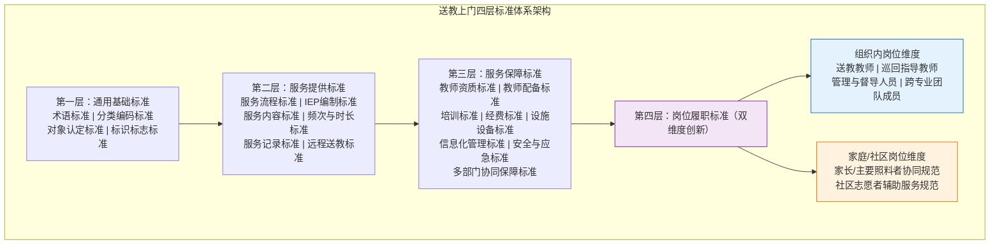

**图5-1 基于GB/T 24421的送教上门四层标准体系架构**

## 5.1 通用基础标准：统一行业底层规范

通用基础标准是送教上门标准体系的基石层，其功能在于为整个标准体系提供统一的概念基础、分类框架、认定规则和标识系统。通用基础标准的建立，旨在解决当前送教上门领域"各说各话"的碎片化困境，为跨区域、跨层级、跨部门的标准化协作提供共同语言和基本遵循。

### 5.1.1 送教上门术语标准

术语标准是标准体系中最基础、最优先的部分。送教上门领域长期以来术语使用不规范——"送教上门""送教服务""居家教育""上门教学"等概念混用，导致政策文本解读歧义、统计数据口径不一、学术研究对话困难。术语标准的建立，应当遵循GB/T 10112《术语工作 原则与方法》和GB/T 15237.1《术语工作 词汇 第1部分：理论与应用》的基本原则，对送教上门核心术语进行规范化定义。

**（一）"送教上门"的术语定义**

"送教上门"（Homebound Education Service Delivery）是指由教育行政部门统筹，以特殊教育学校、普通学校特殊教育资源中心或特殊教育指导中心为实施主体，组织专业教师及跨专业团队成员，对因重度残疾、多重残疾等客观原因无法到校接受学校教育的适龄残疾儿童少年，以定期入户为主要形式，辅以远程教学、社区集中教学等方式，提供的个别化教育教学与康复训练服务。《残疾人教育条例》第十七条明确规定："适龄残疾儿童、少年需要专人护理，不能到学校就读的，由县级人民政府教育行政部门统筹安排，通过提供送教上门或者远程教育等方式实施义务教育，并纳入学籍管理。"术语标准应当在法规基础上，进一步明确送教上门的本质属性：第一，它是一种教育安置形式，而非临时性帮扶措施；第二，它以"无法到校"为适用前提；第三，它包含教育教学与康复训练的双重功能；第四，它采用多元化的服务送达方式。

**（二）"送教服务"的术语定义**

"送教服务"（Homebound Education Service）是送教上门的同义规范术语，指送教上门所涵盖的全部教育教学、康复训练、发展支持及相关辅助服务的总称。在标准文本中，"送教服务"与"送教上门"可互换使用，但"送教服务"更侧重于服务内容和供给过程维度，而"送教上门"更侧重于教育安置形式维度。在政策文件和服务规范中使用"送教服务"，有利于凸显其公共服务属性，与公共服务标准化体系对接。

**（三）"送教教师"的术语定义**

"送教教师"（Homebound Education Teacher）是指经教育行政部门认定，具备特殊教育专业背景或经过系统培训，承担送教上门教育教学任务的专业人员。送教教师的范围不限于特殊教育学校在编教师，还包括普通学校资源教师、巡回指导教师中参与送教服务的专业人员。术语标准应明确三个层次：第一层次为"送教教师"（核心实施者），指直接承担入户教学任务的专业人员；第二层次为"巡回指导教师"（专业支持者），指为送教教师提供专业指导、评估支持和资源协调的特殊教育专业人员；第三层次为"跨专业团队成员"（协同服务者），指参与送教服务的康复治疗师、心理咨询师、社会工作师、言语治疗师等相关专业人员。

**（四）"服务对象"的术语定义**

"服务对象"（Service Recipient）是指经县级特殊教育专家委员会评估认定，因重度残疾、多重残疾或其他客观原因无法到校接受学校教育，需要送教上门服务的适龄残疾儿童少年。术语界定须明确三个要件：其一，对象为"适龄残疾儿童少年"，即处于义务教育阶段（6-15周岁，经批准可适当延长）；其二，须经法定程序由专家委员会认定"无法到校"；其三，"重度残疾、多重残疾或其他客观原因"是导致无法到校的直接原因。该定义将送教服务的适用范围锚定在"义务教育阶段的最弱势群体"，防止服务的泛化使用和资源稀释。

**（五）"个别化教育方案"的术语定义**

"个别化教育方案"（Individualized Education Program，IEP）是指由送教教师、巡回指导教师、跨专业团队成员、家长或主要照料者共同参与，依据服务对象的残疾类型与程度、发展水平、教育需求、家庭环境等综合评估结果，为其量身制定的包含长短期教育目标、教学内容与方法、康复训练方案、支持性服务安排及预期达成时限的书面教育方案。该术语定义应强调四个关键特征：个别化（以服务对象的独特需求为中心）、参与性（多方协作制定）、计划性（有明确的目标和时限）、动态性（定期评估和适时调整）。我国《第二期特殊教育提升计划（2017—2020年）》已明确要求"为每名送教上门学生制定个别化教育方案"，但未对IEP的构成要素和实施规范作出统一规定，术语标准为进一步制定IEP编制标准奠定概念基础。

**（六）其他相关术语**

术语标准还应规范以下辅助术语："送教服务周期"（Service Cycle），指从评估认定到阶段评估完成的一个完整服务时间段；"送教频次"（Service Frequency），指单位时间内的送教服务次数；"送教课时"（Service Hour），指每次送教服务的教学时间单位，每课时原则上为40-45分钟；"远程送教"（Remote Homebound Education），指依托信息技术手段，以视频连线、在线平台等方式实施的送教服务形式；"集中送教点"（Centralized Service Site），指在社区或乡镇设立的可供多名服务对象集中接受送教服务的固定场所。

### 5.1.2 服务对象分类与编码标准

服务对象的科学分类与统一编码，是实现送教服务精准化管理和资源配置优化的重要前提。当前，各地对送教对象的分类维度单一、编码规则不一，难以支撑大规模、跨区域的标准化管理和数据分析。

**（一）分类维度的确定**

服务对象分类应当采用多维度交叉分类方法，核心维度包括三个：残疾类别、残疾等级和年龄阶段。这三个维度分别回答"是什么类型""有多严重""处于什么发展阶段"三个基本问题，共同构成对服务对象的立体画像。

残疾类别维度参照GB/T 26341-2010《残疾人残疾分类和分级》国家标准，涵盖视力残疾、听力残疾、言语残疾、智力残疾、肢体残疾、精神残疾和多重残疾七大类。在送教上门实践中，鉴于部分服务对象同时存在两种及以上残疾类别，应单设"多重残疾"类别，并在编码系统中予以标识。需要特别指出的是，GB/T 26341-2010中的残疾分类标准主要基于医学-功能视角，在送教服务场景中，还应根据特殊教育的需求特点，增补以下分类维度作为辅助参考：自闭症谱系障碍（ASD）、注意缺陷多动障碍（ADHD）、学习障碍、情绪行为障碍等发展性障碍类别。这些类别虽未全部纳入GB/T 26341-2010的分类体系，但在送教服务实践中具有显著的教育干预差异，应当作为补充分类维度纳入标准体系。

残疾等级维度参照GB/T 26341-2010的四级分级标准：一级（极重度）、二级（重度）、三级（中度）、四级（轻度）。鉴于送教上门服务的适用对象原则上为残疾等级一级、二级的重度残疾儿童少年，以及部分三级但存在其他客观困难无法到校者，服务对象分类中的残疾等级维度应重点覆盖一级和二级，三级作为扩展层级。

年龄阶段维度根据儿童发展心理学和教育阶段特征，划分为三个年龄段：低龄段（6-9岁，对应小学低年级）、中龄段（10-12岁，对应小学高年级）、高龄段（13-15岁及以上，对应初中阶段）。年龄阶段的划分不仅影响教育目标和内容的选择，也影响康复训练的侧重点和社会适应能力的培养方向。

**（二）编码规则的设计**

服务对象编码采用"类别码-等级码-年龄段码-顺序码"四级层次编码结构，编码总长度为10位数字，格式为：XX-XX-XX-XXXX。具体编码规则如下：

类别码（第1-2位）：01-视力残疾，02-听力残疾，03-言语残疾，04-智力残疾，05-肢体残疾，06-精神残疾，07-多重残疾，08-自闭症谱系障碍，09-其他发展性障碍。

等级码（第3-4位）：01-一级，02-二级，03-三级。送教对象原则上限于01和02两个码值。

年龄段码（第5-6位）：01-低龄段（6-9岁），02-中龄段（10-12岁），03-高龄段（13-15岁及以上）。

顺序码（第7-10位）：0001-9999，为该类别、等级、年龄段内的流水编号。

例如，编码"04-01-02-0015"表示：智力残疾、一级、中龄段、该细分类别下的第15位服务对象。编码"07-02-03-0003"表示：多重残疾、二级、高龄段、该细分类别下的第3位服务对象。

该编码规则的优势在于：第一，编码本身携带服务对象的完整分类信息，无需查询数据库即可获取关键特征；第二，层次化结构便于统计分析和管理查询；第三，预留了充足的扩展空间，可随时增加新的残疾类别码值。

**（三）分类编码的信息化管理**

分类编码标准应与送教服务信息化管理平台深度集成。在平台架构设计中，服务对象的分类编码应作为基础数据字段，与学籍信息、评估信息、IEP信息、服务记录信息等建立关联。通过统一编码，可以实现以下管理功能：按残疾类别统计送教服务的覆盖率、按等级分析服务强度和资源需求、按年龄段追踪教育效果和发展轨迹、跨区域比对服务质量和服务标准执行情况。统一编码也为全国层面的送教服务大数据分析和政策决策提供了标准化的数据基础。

### 5.1.3 服务对象认定标准

服务对象的认定是送教服务的人口管理环节，直接决定服务资源分配的公平性和精准性。当前，多地存在认定主体不明确、认定程序不规范、认定工具不统一、认定周期不合理等问题，导致"该送未送"和"不该送而送"并存，资源错配现象突出。

**（一）认定主体**

送教上门服务对象的认定主体应当是具有法定资质的县级特殊教育专家委员会（以下简称"专家委员会"）。《残疾人教育条例》第二十条规定："县级人民政府教育行政部门应当会同卫生行政部门、民政部门、残疾人联合会，建立由教育、心理、康复、社会工作等方面专家组成的残疾人教育专家委员会，对适龄残疾儿童、少年的身体状况、接受教育的能力和适应学校学习生活的能力进行评估，提出入学、转学建议。"该规定赋予专家委员会法定的评估与建议权，是送教服务对象认定的制度基础。

专家委员会的组成应当体现多学科协作原则，至少应包括以下领域的专业人员：特殊教育专家（不少于2人）、临床医学或康复医学专家（不少于1人）、心理学专家（不少于1人）、社会工作专家（不少于1人）、教育行政管理人员（不少于1人）。对于存在争议的认定个案，应建立专家委员会全体会议表决机制，实行三分之二以上多数通过的原则。县级教育行政部门依据专家委员会的认定意见作出最终的送教服务安排决定。

**（二）认定程序**

认定程序应当遵循"申请—受理—评估—认定—公示—建档"六步工作法，确保程序的公开、公正、规范。

第一步，申请：由家长或主要照料者向户籍所在地或居住证所在地的县级教育行政部门提出书面申请，填写《送教上门服务申请表》，并提供残疾证明、医疗诊断证明等相关材料。对于已在校就读但因病情加重无法继续到校的残疾学生，由所在学校协助家长提出申请。对于未入学的适龄残疾儿童，由乡镇（街道）教育干事、社区残疾人专职委员等协助摸排并引导申请。

第二步，受理：县级教育行政部门在收到申请后5个工作日内完成材料初审，对材料齐全的予以受理并出具受理通知书；对材料不齐全的，一次性告知需要补正的全部材料。对于明显不符合送教上门条件（如残疾等级仅为四级、具备到校学习能力者）的申请，应当书面说明理由并告知其他教育安置选项。

第三步，评估：受理后15个工作日内，由专家委员会组织开展综合评估。评估内容包括：医学评估（身体功能、健康状况、医疗需求）、教育评估（认知水平、学习能力、学业基础）、心理评估（心理发展水平、情绪行为特征）、社会适应评估（日常生活能力、社会交往能力）、家庭环境评估（家庭支持条件、主要照料者能力）。

第四步，认定：专家委员会根据综合评估结果，作出是否认定为送教上门服务对象的决定，并出具《送教上门服务对象认定意见书》，内含认定结论、认定依据、建议的教育安置形式（入户送教、远程送教、集中送教或组合形式）、建议的服务周期等。认定意见书应送达申请人，并告知申诉权利和申诉渠道。

第五步，公示：对于认定通过的服务对象名单，应在保护个人隐私的前提下（隐去姓名中第二个字，如"张某某"），在县级教育行政部门网站或政务公开栏进行公示，公示期不少于5个工作日，接受社会监督。

第六步，建档：公示无异议后，县级教育行政部门将服务对象信息录入送教服务管理信息系统，建立电子档案和纸质档案，纳入学籍管理体系。档案内容包括申请材料、评估报告、认定意见书、IEP文件、服务记录、阶段评估报告等全过程文件。

**（三）认定工具**

认定评估应采用标准化的评估工具组合，以保证评估结果的客观性、可比性和可重复性。推荐工具组合包括但不限于以下内容：

医学评估：以指定医疗机构的诊断证明和功能评估报告为基础，辅以《世界卫生组织残疾评定量表2.0》（WHODAS 2.0）进行功能受限程度评估。WHODAS 2.0从认知、移动、自我照料、与人相处、生活活动、社会参与六个维度对功能受限程度进行标准化测量，内部一致性信度α系数在0.82-0.98之间，在国际特殊教育评估领域广泛应用。

教育评估：采用《特殊儿童发展评估量表》或省级以上教育行政部门认可的教育评估工具，对认知、语言、运动、社会情绪、生活自理五大发展领域进行发展年龄和发展商数测量。对于年龄较大的服务对象，还可采用《适应行为量表》（Adaptive Behavior Scale，ABS）评估其适应性行为水平。

心理评估：根据服务对象的年龄和功能水平，选用适当的标准化心理评估工具。对具备一定语言理解能力的服务对象，可采用《韦氏幼儿智力量表（第四版）》（WPPSI-IV）或《韦氏儿童智力量表（第五版）》（WISC-V）进行智力评估；对于语言能力严重受限的服务对象，可选用《瑞文渐进矩阵测验》（Raven's Progressive Matrices）或《莱特国际操作量表》（Leiter International Performance Scale）等非语言智力测验。

家庭环境评估：采用《家庭环境量表》（Family Environment Scale，FES）和《家庭支持需求评估表》（Family Support Needs Assessment），从家庭结构、经济状况、照料者能力、居住条件、社区支持等多个维度评估家庭的服务支持条件。

**（四）认定周期**

服务对象认定实行"初次认定+定期复评"制度。初次认定的有效期为1-2年（视服务对象的年龄和残疾状况确定）。在认定有效期届满前30日，专家委员会应当对服务对象进行复评，以确定是否需要继续提供送教服务，或是否需要调整服务形式和内容。复评的重点在于：服务对象的功能变化情况（是否有能力返校学习）、教育干预效果、服务形式的适宜性。对于在送教服务期间发生重大病情变化、家庭情况变化或其他可能影响服务安排的情形，可申请提前复评。

### 5.1.4 送教上门标识标志标准

统一的标识标志系统是送教服务标准化形象建设的重要内容，有助于提升送教服务的社会辨识度、增强服务对象的归属感和认同感，也有利于服务管理与督导评估。送教上门标识标志标准应包括以下要素：

**（一）基本标识**

基本标识由图形符号和文字两部分构成。图形符号设计应体现以下核心意象：一是"到达"（一支延伸到居所的教育之手），二是"包容"（开放怀抱接纳差异），三是"成长"（幼苗在关怀中成长）。图形符号宜采用简洁、现代、无障碍友好的设计风格，主色调建议采用暖色系（如橙色或橙红色），传达温暖、关怀、积极的视觉感受。文字部分为"送教上门"四字，建议采用无衬线字体，确保在不同尺寸和应用场景下的清晰可读性。

**（二）应用规范**

标识在以下场景中应规范使用：送教服务车辆标识（车身喷涂或贴膜）、送教教师工作证件、服务记录文件页眉和封面、服务对象家庭挂牌（经家庭同意）、集中送教点门牌和指示牌、信息化管理系统界面、送教服务宣传材料。标识的标准色彩、最小尺寸、安全间距、禁止使用情形等应在标准中明确规定。

**（三）辅助视觉系统**

在基本标识之外，可以设计辅助视觉系统用于不同服务形式的区分：入户送教（基本标识+房屋图形辅助元素）、远程送教（基本标识+屏幕图形辅助元素）、集中点送教（基本标识+群体图形辅助元素）。辅助视觉系统采用基本标识的同一色系，保持视觉统一性。

## 5.2 服务提供标准：规范一线服务流程

服务提供标准是送教上门四层标准体系的核心层，直接规范送教服务的一线实施过程，是决定服务质量的关键环节。GB/T 24421.1-2009将服务提供标准定义为"规定服务提供过程、方法和程序的标准"，涵盖服务流程、服务内容、服务方法、服务质量控制等方面。送教上门服务提供标准的设计，应当遵循"底线标准+弹性空间"的核心理念——底线标准确保服务的基本质量和公平性底线，弹性空间尊重个别化教育的内在要求，为送教教师和跨专业团队保留基于服务对象实际需求进行灵活调整的余地。

### 5.2.1 送教服务流程标准

送教服务流程标准是服务提供标准的基础性子标准，确立了从需求识别到质量改进的完整服务闭环。基于PDCA循环（计划-执行-检查-改进）的质量管理思想，结合送教服务的专业特性，应将服务流程标准化为"评估—计划—实施—记录—反馈—改进"六个核心环节，形成螺旋式上升的持续改进闭环。

**（一）评估环节**

评估是送教服务的起点（初次评估）和调整依据（阶段评估），贯穿于整个服务周期。初次评估由专家委员会完成（详见5.1.3节），其结果作为服务对象认定的依据和IEP制定的基础。阶段评估由送教教师和巡回指导教师共同完成，在每学期末或每个服务周期结束时进行。阶段评估重点包括：对照IEP目标评估教育干预成效、评估服务对象的适应性行为变化、评估服务形式的适宜性、评估家庭环境和照料者支持能力的变化、评估是否需要调整IEP或变更服务安置。阶段评估结果应当形成书面评估报告，作为下一阶段IEP调整的依据。

**（二）计划环节**

计划环节的核心产出是个别化教育方案（IEP）。IEP的编制应在初次评估或阶段评估完成后15个工作日内完成。IEP编制过程应当包括以下步骤：第一，信息汇总——将评估环节获取的医学、教育、心理、社会适应、家庭环境等多维度信息进行整理和综合；第二，需求分析——基于信息汇总，识别服务对象在教育、康复、发展支持等方面的优先需求；第三，目标设定——根据需求分析，制定长期目标（学年目标）和短期目标（学期或季度目标）；第四，策略选择——选择与目标相匹配的教学策略、康复训练方法和支持性服务安排；第五，方案讨论——召开IEP会议，由送教教师、巡回指导教师、跨专业团队成员、家长或主要照料者共同参与讨论和确认。IEP的编制标准将在5.2.2节详细阐述。

**（三）实施环节**

实施环节是将IEP转化为实际服务行动的关键环节。实施环节应遵循以下操作规范：第一，实施前准备——送教教师应在每次送教前完成教案准备和教具/辅具准备，巡回指导教师应提供必要的教学指导建议；第二，入户教学——按照预定时间和内容开展入户教学，教学过程中应关注服务对象的反应和参与度，灵活调整教学节奏和方法；第三，康复训练——对于需要康复训练的服务对象，由跨专业团队成员按计划开展康复训练，并指导家长进行家庭康复；第四，即时记录——每次服务完成后当场完成服务记录的初步填写，记录主要服务内容、服务对象的反应、存在的问题、后续建议等。

**（四）记录环节**

记录环节是送教服务的档案化管理过程，其功能不仅在于留存工作痕迹，更在于为后续评估、决策和研究积累数据。记录内容包括：每次送教服务的日期、时长、地点（入户/集中点/远程）、参与人员、服务内容（教学/康复/心理支持等）、服务对象的参与情况和反应、送达的教学材料或辅具、家长反馈、后续跟进事项。记录应当使用标准化的记录表单（详见5.2.5节），纳入送教服务信息化管理系统。

**（五）反馈环节**

反馈环节是连接服务实施与质量改进的关键中介。反馈的维度包括：第一，服务对象维度——通过观察、评估和沟通了解服务对象的需求满足程度和发展变化；第二，家长/照料者维度——定期征求家长对送教服务的意见建议，了解家庭对服务的满意度和新增需求；第三，送教教师维度——送教教师在服务过程中发现的困难和问题，对IEP合理性的反思；第四，跨专业团队维度——各专业人员从各自专业视角对服务效果的反馈；第五，管理维度——督导人员通过听课、查阅档案、访谈等方式对服务质量的评估反馈。反馈环节应建立制度化的信息汇总和分析机制，每学期至少进行一次综合反馈分析。

**（六）改进环节**

改进环节是确保送教服务质量持续提升的机制保障。基于反馈环节的信息，改进环节应当完成以下工作：修订和完善IEP（调整目标、优化策略、增减服务内容）；优化服务形式配置（调整入户/远程/集中送教的比例）；加强薄弱环节的资源配置（如增加康复训练频次、配置辅助技术设备）；提供针对性的教师培训和专业支持；完善管理制度和服务流程。改进结果应形成书面改进报告，纳入服务质量管理档案。

整个服务流程应建立时限管理制度：从评估完成到IEP制定的时限不超过15个工作日；从IEP制定到启动服务的时限不超过10个工作日；阶段反馈分析的时限不超过学期结束后15个工作日；改进方案的制定和启动时限不超过反馈分析完成后10个工作日。时限管理确保服务流程的高效运转，避免因流程迟滞导致服务对象的等待和需求积压。

### 5.2.2 个别化教育方案（IEP）编制标准

个别化教育方案（IEP）是送教服务的核心文件，是教师在送教过程中的行动纲领，也是评估送教服务质量的直接依据。IEP编制标准的设计遵循一条关键原则：**标准规定"框架"，内容保持"弹性"**。这意味着标准应当明确规定IEP必须包含哪些结构性要素，以确保所有服务对象的IEP在完整性、规范性和可比性上达到统一底线；但同时，标准不应规定每个要素的具体内容应当是什么——具体内容的确定应由IEP团队根据服务对象的个别化评估结果和实际需求灵活制定，以保留个别化教育的弹性空间。

**（一）IEP的必备要素**

一份符合标准的IEP应当包含以下十个必备要素：

第一，服务对象基本信息。包括姓名、性别、出生日期、残疾类别和等级、分类编码、户籍地址、现居住地址、主要照料者姓名和联系方式、其他家庭成员情况等。此项要素为IEP的身份识别基础。

第二，综合评估摘要。将初次评估或阶段评估的核心结果进行摘要呈现，包括医学评估的主要结论、教育评估的发展年龄和发展商数、心理评估的主要发现、社会适应评估的核心指标、家庭环境的优势和挑战。综合评估摘要不是评估报告的简单复制，而是经过分析整合后对服务对象整体发展状况的概括性描述，为后续目标设定提供依据。

第三，现有发展水平描述。这是IEP中最关键的信息要素之一，要求采用具体、可测量的语言描述服务对象在各个功能领域（认知、语言沟通、运动、生活自理、社会适应、情绪行为等）的当前发展水平。"具体"意味着避免使用"较差""一般""较好"等模糊描述，而应使用"能认读50个常用汉字""能用2-3个词的简单句表达需求""能在辅助下完成穿脱外套"等具体行为描述。"可测量"意味着发展水平的描述为后续目标的达成度检验提供了基准参照。

第四，长期目标（学年目标）。长期目标是服务对象在一年或一个完整服务周期内预期达成的教育和发展成果，通常设置4-8个长期目标，覆盖认知发展、语言沟通、运动康复、生活自理、社会适应等主要发展领域。长期目标的表述应当符合SMART原则：具体（Specific）、可测量（Measurable）、可达成（Achievable）、相关（Relevant）、有时限（Time-bound）。

第五，短期目标（学期/季度目标）。短期目标是长期目标的分解，即在一个学期或季度内预期达成的阶段性成果。每个长期目标应分解为2-4个短期目标，短期目标之间应呈现递进关系或并列关系。短期目标的达成是检验长期目标推进进度的重要标志。

第六，教学内容与方法。针对每个短期目标，明确列出相应的教学内容（如识字教学、数概念教学、精细动作训练、社交技能训练等）、教学策略（如任务分析法、链锁教学法、结构化教学法、辅助沟通策略等）、教学材料和辅助技术手段（如视觉提示卡、沟通板、平板电脑辅助沟通程序等）。教学内容与方法的选择应当有循证实践的依据，优先选择在特殊教育领域经过实证研究验证有效的干预方法。

第七，康复训练方案（如适用）。对于需要康复训练的服务对象，IEP中应包含来自康复治疗师的专业训练方案，包括训练目标、训练内容和频次、训练方法、评估节点等。康复训练方案应当与教育教学目标相互配合，避免康复训练与教育教学的割裂。

第八，支持性服务安排。支持性服务是指为确保IEP顺利实施而提供的辅助性服务，包括但不限于：辅助技术设备和辅具的配置（如轮椅、助行器、沟通辅具、视听辅具等）、交通支持（如送教教师入户的交通保障）、家长培训和家庭指导（如定期家庭康复指导、家庭教育讲座）、心理咨询和社会工作服务（如对服务对象或家庭成员提供心理健康支持）、转衔服务（如从送教上门转衔到特殊教育学校或随班就读的过渡支持）。每项支持性服务的提供者、频次和评估方式应在IEP中明确。

第九，服务安排说明。明确服务接受形式（入户送教、远程送教、集中点送教及其组合）、服务频次和时长（入户送教每周几次、每次几课时；远程送教每周几次、每次多长时间；集中点送教每周几次、每次多长时间）、服务人员安排（送教教师姓名、巡回指导教师姓名、参与的跨专业团队成员姓名及各自负责领域）。

第十，IEP团队签名与日期。IEP应由参与制定的全体团队成员签名确认，包括：送教教师、巡回指导教师、参与制定的跨专业团队成员（如康复治疗师、心理咨询师、社会工作师等）、家长或主要照料者、服务对象本人（在能力允许的情况下）。签名确认意味着各方对IEP内容的知情同意和共同承诺。

**（二）IEP的评估与修订**

IEP不是一成不变的文件，应建立定期评估与修订机制。评估频次：短期目标每学期评估一次（学期末），长期目标每学年评估一次（学年末）。评估结果记录在IEP文件的对应目标后，标注"已达成""部分达成""未达成"三种状态，并附简要说明。修订触发条件：当大量短期目标在评估中显示"未达成"时（超过预期数的三分之一），或服务对象发生重大功能和环境变化时，或家长提出合理修订建议时，应及时启动IEP修订程序。IEP的任何修订均应经过IEP团队讨论并签名确认，修订后的IEP替代原IEP作为后续服务的依据。

**（三）IEP编制中的"弹性空间"说明**

"标准规定框架、内容保持弹性"的原则在IEP编制标准中的具体体现是：标准规定了IEP必须包含哪些"栏目"（如基本信息、评估摘要、发展水平、长期目标、短期目标等），但每个"栏目"中填写什么具体内容，由IEP团队根据服务对象的个别化需求自主决定。标准不规定具体的教学目标数量、教学内容选择、教学方法运用——这些属于专业判断的范畴，应当尊重送教教师和跨专业团队的专业自主权。标准的作用在于：第一，确保所有服务对象的IEP都具备完整的结构要素，不遗漏关键信息；第二，确保IEP之间在形式上具有可比性，便于督导评估和数据汇总；第三，为缺乏经验的送教教师提供明确的编制指引，降低IEP编制的质量和效率差异。

### 5.2.3 送教服务内容标准

送教服务内容标准提供的是服务内容的"参考框架"，而非"硬性规定"。其功能在于为送教教师和跨专业团队提供系统化的内容领域地图，确保服务的全面性和结构化，同时保留基于服务对象个别化需求进行内容选择和重点调整的弹性空间。服务内容参考框架涵盖五大功能领域：认知发展、语言沟通、运动康复、生活自理和社会适应。

**（一）认知发展领域**

认知发展领域的内容框架包括以下子领域和参考内容要点：

感知觉发展：视觉追踪与辨别的训练、听觉定位与辨别的训练、触觉感知与辨别的训练、前庭觉和本体感觉的统合训练。对于存在感觉处理障碍的服务对象，应优先开展感觉统合训练。

注意力发展：注视追踪能力的训练、选择性和持续性注意力的训练、注意转移的训练。注意力训练应遵循由短到长、由简单刺激到复杂刺激、由一对一环境到多刺激环境的递进原则。

记忆力发展：即时记忆和延迟记忆的训练、视觉记忆和听觉记忆的训练、序列记忆的训练、工作记忆的训练。记忆训练材料的选择应与服务对象的日常生活经验建立关联。

思维发展：分类与归纳能力的训练、因果关系的理解与推理训练、问题解决策略的训练、数与量的概念建立和简单运算训练。思维训练应在具体、形象、可操作的情境中进行，逐步过渡到半抽象和抽象水平的训练。

学前/学科技能：对于具备一定认知基础的服务对象，应参照国家课程标准和特殊教育学校课程标准的要求，选择性地开展语文（识字、阅读）、数学（数概念、计算、生活中的数学）、常识（自然、社会、安全）等学科内容的教学，为服务对象将来可能的转衔到学校教育做好准备。

**（二）语言沟通领域**

语言沟通领域的内容框架包括以下子领域：

语言理解：对日常指令的理解训练、对简单故事和情境描述的理解训练、对情绪词汇和社交用语的理解训练。

语言表达：从单字、单词到短语、简单句的表达训练、命名和指认物品的表达训练、描述事件和表达需求的口语训练。对于口语表达能力严重受限的服务对象，可使用辅助与替代性沟通（AAC）策略。

沟通功能：请求和拒绝的功能性沟通训练、分享信息和表达感受的沟通训练、发起对话和维持对话的社交沟通训练。

辅助沟通：对于不具备功能性口语能力的服务对象，应当纳入辅助与替代性沟通（AAC）服务。AAC策略包括"无辅助技术"（如手势、表情、身体语言、手语）和"有辅助技术"（如图片交换沟通系统PECS、语音输出沟通设备、平板电脑沟通应用程序）。AAC的选择和实施应当由言语治疗师进行专业评估和指导，送教教师和家长在日常互动中配合使用。

**（三）运动康复领域**

运动康复领域的内容框架包括以下子领域：

粗大运动：头部控制训练、翻身训练、坐位保持和平衡训练、爬行训练、站立和转移训练、行走和步态训练、上下楼梯训练。对于完全丧失移动能力的服务对象，应注重体位管理和被动关节活动度维持，预防关节挛缩和肌肉萎缩。

精细运动：抓握和释放训练、双手协调训练、手指灵活性训练（如捏、拧、穿、插、剪等）、书写前技能训练（如握笔、涂鸦、描线等）、辅助器具操作训练（如使用特制食具、穿衣辅具等）。

口部运动：对于存在构音障碍或进食吞咽困难的服务对象，应在言语治疗师指导下开展口部运动训练，包括口腔感知觉刺激、唇舌下颌的运动功能训练、咀嚼和吞咽功能训练。

运动康复训练应遵循医学和康复学的专业规范，由康复治疗师制定训练方案并定期评估训练效果。送教教师在获得康复治疗师的培训和指导后，可在入户教学中配合开展常规性、维持性的运动训练。

**（四）生活自理领域**

生活自理领域是送教服务中极为重要的内容组成，直接关系到服务对象的生活质量和尊严。内容包括：

饮食自理：手抓食物进食训练、使用食具（勺、筷、杯等）训练、饮水训练、饮食安全和餐桌礼仪训练。

如厕自理：如厕信号表达训练、如厕动作训练、便后清洁训练、如厕辅助器具使用训练。

穿脱衣物：穿脱鞋袜训练、穿脱上衣和裤子训练、系扣和解扣训练、拉拉链训练。

个人卫生：洗手和洗脸训练、刷牙训练、梳头训练、洗澡辅助参与训练、青春期卫生指导。

居家安全：对危险物品和危险情境的辨识训练、求助意识和求助方式训练、简单急救知识教育、家电安全使用指导。

生活自理能力训练应遵循"最少辅助原则"——在确保安全的前提下，为服务对象提供完成任务所需的最少辅助，最大限度地促进其独立性的发展。训练可以在送教时段进行，但更重要的是指导家长在日常生活中进行持续的泛化训练和自然情境教学。

**（五）社会适应领域**

社会适应领域的内容框架包括：

情绪认知与管理：识别和命名基本情绪（高兴、难过、生气、害怕等）、表达情绪的适当方式训练、情绪调节策略（如深呼吸、寻求帮助、转移注意力等）、对他人情绪的识别和共情能力培养。

社会交往技能：基本社交礼仪（问好、道别、道谢、道歉等）、轮流与等待训练、分享与合作训练、遵守简单规则训练、同伴互动和友谊建立的支持。

社区参与：认识社区环境和公共设施、使用社区服务（如超市购物、社区医院就诊、公共图书馆借书等）、乘坐公共交通工具的技能、参与社区文化娱乐活动。

休闲娱乐：培养适龄的个人兴趣爱好、参与简单的游戏和体育活动、欣赏音乐、美术等艺术活动、参与家庭休闲活动。

自我决定：在能力范围内进行选择和表达偏好、参与自身事务的决策（如参与IEP会议、表达对服务安排的意见）、建立积极的自我认知和自我价值感。

社会适应领域的训练应充分利用社区真实情境进行"在社区中教学"，而非局限于入户环境中的模拟训练。集中送教点的设立为社会适应训练提供了重要的群体互动和社区参与机会。

**（六）五大领域的整合与侧重**

五大功能领域不是相互割裂的独立模块，而是相互交织、相互促进的有机整体。在送教服务实践中，应当注重领域的整合实施：例如，在一次阅读教学（认知发展）中融入社交对话（语言沟通）、情绪讨论（社会适应）和翻书动作（精细运动）；在一次烹饪活动中同时训练数概念（认知）、流程描述（语言）、食材处理（精细运动）、安全操作（生活自理）和合作完成（社会适应）。

各领域的侧重点因服务对象的残疾类型、功能水平和年龄阶段而异。例如，对于重度智力残疾的低龄服务对象，生活自理和感知运动可能占据更大的服务比重；对于肢体残疾但认知功能较好的中高龄服务对象，学科知识教学和辅助技术使用可能成为服务重点；对于自闭症谱系障碍的服务对象，语言沟通和社会适应领域的内容编排需要更为系统和结构化。

### 5.2.4 送教频次与时长标准

送教频次与时长标准是服务提供标准中具有刚性约束力的底线标准。当前，部分地区的送教服务存在"蜻蜓点水"式的服务模式——每月一次甚至每季度一次，每次不足一课时，导致教育干预效果微乎其微。频次与时长的底线设置，旨在为送教服务的"量"划定不可逾越的最低标准，确保送教服务能够产生实际的教育效果。

**（一）底线标准**

送教服务的频次与时长底线标准为：

集中送教（含入户送教和集中点送教）：每周不少于2次，每次不少于2课时（每课时40-45分钟，即每次不少于80-90分钟）。按每学年40周计算，每学年集中送教不少于160课时。

远程送教：每周不少于1次，每次不少于30分钟的有效互动时间。远程送教作为集中送教的补充形式，不能完全替代集中送教。

组合送教形式：对于采用"集中送教+远程送教"组合形式的服务对象，每周集中送教不少于1次（每次不少于2课时），每周远程送教不少于1次（每次不少于30分钟）。

这一底线标准的设定依据如下：第一，从学习心理学角度看，每周2次的接触频率是维持教育干预效果的最低频率要求，低于此频率将难以形成持续的学习积累；第二，从国际比较角度看，日本訪問教育的标准频次为每周2-3次，英国"在家教育服务"（Education Other Than at School，EOTAS）的标准为每周不少于15小时，我国的底线标准已充分考虑国情实际；第三，从实证研究角度看，送教频次与教育成效之间存在显著的正相关关系，频次过低将导致干预效果的"稀释"。

**（二）弹性调整机制**

底线标准不排斥基于个别化需求的向上调整。对于功能水平较低、需求更为迫切的服务对象，可以适当增加送教频次，如每周3-4次集中送教。对于功能水平有所提升、家庭照料能力较强的服务对象，可在保持底线标准的前提下，调整送教形式组合（如增加远程送教比例）。频次的向上调整应在IEP中明确记载，并作为资源配置和经费核算的依据。

**（三）特殊情况下的豁免与替代**

对于因居住偏远、交通困难导致送教教师入户成本过高的情况，经县级教育行政部门批准，可以采用以下替代方案之一：（1）"集中送教点"模式——在交通相对便利的乡镇或社区设立集中送教点，服务对象由家长送至集中点接受服务，将送教教师入户频次降低为每周1次，集中点送教增加至每周1-2次；（2）"远程送教为主+定期入户为辅"模式——对于具备基本网络条件和家庭支持的服务对象，以远程送教为常规形式（每周3-4次），辅以每月1-2次的入户送教进行面对面评估和指导。任何豁免和替代方案均须经专家委员会评估审批，并在IEP中详细记载。

### 5.2.5 送教服务记录标准

送教服务记录是送教服务的档案化留存，是服务质量追溯、效果评估和督导考核的基础依据。标准化的服务记录表单设计，应当兼顾完整性（记录服务的全貌）和实用性（不给一线教师增加过重负担）。

**（一）服务记录的核心要素**

标准化的送教服务记录表应当包含以下核心要素：

第一，基础信息栏：服务对象姓名和编码、送教教师姓名、记录日期。

第二，服务信息栏：本次服务的日期、开始时间和结束时间（精确到分钟）、服务地点（入户/集中点/远程）、服务形式（个别化教学/小组教学/在线教学）、本次服务的参与人员（含跨专业团队成员、旁听/观摩人员等）。

第三，服务内容栏：本次服务涉及的主要领域（勾选：认知发展□ 语言沟通□ 运动康复□ 生活自理□ 社会适应□ 其他____）、本次服务对应的IEP短期目标编号或描述、本次服务的具体活动内容和过程（简要记录，建议200-500字）。

第四，服务对象反应栏：服务对象的参与程度（勾选：积极□ 一般□ 被动□ 拒绝□）、目标达成情况（针对本次服务对应的IEP短期目标，勾选：达成□ 部分达成□ 未达成□）、特别表现或异常情况记录。

第五，教学调整栏：是否对预定的教学计划进行了调整（是□ 否□），如有调整，说明调整内容和原因。

第六，家庭协作栏：是否向家长/照料者提供了指导和反馈（是□ 否□），指导反馈的主要内容、家长/照料者的回应和配合情况。

第七，后续安排栏：下次服务的预定时间和主要内容、本次服务布置的家庭练习或任务、需要向巡回指导教师或跨专业团队反馈的问题、需要协调解决的事项。

第八，签名确认栏：送教教师签名、家长/照料者签名（确认服务已提供）、日期。

**（二）记录的规范要求**

服务记录应当遵循以下规范要求：第一，记录的及时性——每次服务完成后24小时内完成记录的整理和提交，避免信息遗忘和积压；第二，记录的客观性——基于事实和行为进行记录，避免主观臆断和情绪化描述；第三，记录的连续性——每次记录应与前次记录在内容上保持衔接，使服务记录序列能够反映服务对象的发展轨迹；第四，记录的隐私保护——服务记录属于个人隐私信息，应当按照信息安全相关规定进行存储、使用和传输。

**（三）记录的信息化管理**

标准化服务记录应与送教服务信息化管理系统直接对接。送教教师在完成入户服务后，通过移动终端（平板电脑或手机）填报电子服务记录表，系统自动关联服务对象档案和IEP数据，实现服务记录的数字化管理和实时汇总分析。信息化管理可大幅降低手工填写的重复劳动和数据整理的时间成本，使一线教师将更多精力投入到教学活动中。

### 5.2.6 远程送教服务标准

远程送教是送教上门服务的重要补充形式，特别是在交通条件不便、突发公共卫生事件等情境下，远程送教可以发挥不可替代的作用。远程送教服务标准涵盖平台技术标准、线上线下融合模式标准和数据安全标准。

**（一）线上教学平台技术要求**

用于远程送教的线上教学平台应当满足以下基本技术要求：第一，适用性——平台界面应简洁、易用，充分考虑送教教师和服务对象家长的数字素养差异，提供一键进入课堂、大字体显示、语音导航等无障碍功能；第二，稳定性——视频通话应支持在3G/4G网络条件下的稳定连接，音频清晰度应满足教学对话的需求；第三，互动性——平台应支持屏幕共享、电子白板、文件传输、即时消息等教学互动功能；第四，适应性——平台应支持多种终端设备（手机、平板电脑、电脑）的接入，以适应不同家庭的设备条件。

**（二）线上线下融合模式**

线上线下融合送教是指将面对面的入户/集中点送教与远程在线送教有机结合的服务模式。融合模式的标准框架包括：第一，比例分配——明确线上线下服务的配比，常规配比为"线下为主（占60%-70%）、线上为辅（占30%-40%）"，具体比例在IEP中根据服务对象需求和家庭条件确定；第二，内容分工——线下服务侧重需要直接肢体辅助的操作性内容（如运动康复、精细动作训练）和需要实物教具的教学内容，线上服务侧重语言沟通、知识讲解、远程指导和家长培训；第三，衔接机制——线下和线上服务在内容上保持连贯，线上服务内容和要求基于线下服务的进展和反馈确定，形成线上线下互补衔接的服务链条。

**（三）数据安全标准**

远程送教涉及视频、音频、文字等多种形式的个人数据采集和传输，必须建立严格的数据安全标准。数据安全标准应涵盖：第一，传输加密——视频通信应采用端到端加密技术，防止数据在传输途中被截取或窃听；第二，存储安全——教学录像、截屏记录等数据应存储在符合等保三级要求的服务器上，设置严格的访问权限；第三，隐私保护——禁止未经授权将服务对象的影像、声音用于非教学目的，禁止在社交媒体传播服务对象的教学录像；第四，知情同意——在采集和使用教学录像之前，应获得家长的书面知情同意，告知数据的使用目的、存储期限和删除权利。

### 5.2.7 底线标准+弹性空间的设计原则

本节集中阐述服务提供标准的核心设计原则——"底线标准+弹性空间"——这一原则不仅是服务提供标准的方法论基础，也是整个送教上门标准体系的价值底色的集中体现。

**（一）原则的内涵**

"底线标准"是指标准对送教服务的关键环节和核心要素设定不可突破的最低要求，以此保障服务的公平性底线和基本质量水平。底线标准具有强制性，所有服务提供主体必须遵守。在送教服务提供标准中，底线标准主要体现在：服务流程的六个环节必须全部完成（不可省略任一环节）、IEP文件必须包含十个必备要素、集中送教频次不得低于每周2次每次2课时、服务记录必须在24小时内完成等。

"弹性空间"是指标准在底线之上，赋予服务提供主体基于服务对象的个别化需求进行灵活调整的自主权，以此保障服务的适切性和专业化水平。弹性空间具有选择性，服务提供主体可根据实际情况自主决定。在送教服务提供标准中，弹性空间主要体现在：IEP中各要素的具体内容由团队自主确定、五大领域的侧重点因服务对象而异、送教频次可在底线之上根据需求增加、教学方法和策略的选择尊重教师专业判断等。

**（二）原则的理论依据**

"底线标准+弹性空间"原则的理论依据来源于两个方面。第一是教育公平理论中的"充足性"（adequacy）原则——教育公平不仅意味着资源的均等分配，更意味着每个学习者都应获得"充足"的教育资源以达到基本的教育结果水平。底线标准的设置正是"充足性"原则在送教服务领域的操作化——通过设定服务的最低标准，确保每个送教对象都能够获得"足够"而非"同等"的服务。第二是特殊教育领域的"个别化"核心原则——特殊教育的本质在于根据每个特殊儿童的独特需求提供针对性的教育服务，这天然要求服务标准保留灵活性和弹性空间。僵化的统一标准与个别化教育的内在要求是相悖的。

**（三）原则的运行保障**

"底线标准+弹性空间"原则的有效运行，需要配套的制度保障。在督导评估层面，应建立"底线必查、弹性不干涉"的督导原则——督导人员重点检查服务提供主体是否满足底线标准，对于属于弹性空间范畴的专业决策，应当尊重而非强制干预。在质量管理层面，应建立底线标准的达标预警机制——当服务提供主体的某项底线指标出现下滑趋势时，管理系统自动预警，提示管理者和督导人员及时介入。在教师培训层面，应帮助送教教师理解底线标准和弹性空间各自的依据和边界，提升教师在弹性空间内进行专业决策的能力。

## 5.3 服务保障标准：完善支撑体系建设

服务保障标准是送教上门四层标准体系的第三层，其功能在于为服务提供标准的高效执行提供资源、条件、制度、技术等多维度的支撑和保障。服务保障标准的完善程度，直接决定了服务提供标准的可执行性和可持续性。依据GB/T 24421.1-2009的规定，服务保障标准涵盖人员、经费、设施设备、信息、安全、环境等方面。结合送教服务的行业特性，本节将服务保障标准细化为：送教教师资质标准、送教教师配备标准、送教教师培训标准、送教服务经费标准、送教设施设备标准、信息化管理标准、安全与应急标准、多部门协同保障标准八个子标准。

### 5.3.1 送教教师资质标准

送教教师是送教服务的核心人力资源，其专业资质水平直接影响服务质量。当前，我国送教教师队伍的专业化水平整体偏低——部分送教教师由普通学校教师兼任，缺乏特殊教育专业背景；部分送教教师虽来自特殊教育学校，但缺乏针对重度、多重残疾儿童的教学经验。送教教师资质标准的建立，旨在为送教教师的准入划定专业门槛，稳步提升队伍的专业化水平。

**（一）基本资质要求**

送教教师应当满足以下基本资质要求：第一，持有国家认可的教师资格证书（特殊教育专业优先）；第二，具有大专及以上学历；第三，身心健康，能够胜任入户送教的体力和心理要求；第四，无违法犯罪记录，无虐待、侵害未成年人等不良记录。

**（二）专业资质要求**

在基本资质之上，送教教师还应满足以下专业资质要求：第一，具有特殊教育、康复治疗、心理学、社会工作或相关专业背景，或通过送教教师岗前培训并考核合格；第二，掌握至少一种残疾类型儿童的教育教学方法和康复训练技能；第三，具备个别化教育方案（IEP）制定和实施的能力；第四，具备与重度、多重残疾儿童沟通互动的基本技能；第五，能够操作辅助技术和辅助沟通设备。

**（三）国际参照**

在送教教师资质标准的制定中，可以参考以下国际经验：

日本訪問教育教師资格制度：日本《学校教育法》规定，担当訪問教育的教师必须具备普通教育教师执照和特别支援学校教师执照的"双执照"。此外，訪問教育教师还需要完成文部科学省规定的訪問教育专门研修课程，内容包括：重度・重複障碍儿童的心理与教育、医疗护理基础知识、辅助沟通技术、家庭支援方法等。日本的"双执照+专门研修"模式为我国的送教教师资质标准提供了"通用+专长"的借鉴思路——送教教师既需要特殊教育的基本专业素养，也需要针对重度障碍儿童的专门知识和技能。

美国特殊儿童委员会（CEC）标准：CEC制定的《特殊教育教师培养标准》从七个维度规定了特殊教育教师的专业标准：学习者的学习发展与个体差异、学习环境、学科内容知识、教学性评估、教学规划与策略、专业学习与伦理实践、协作。美国的个别化家庭服务方案中，早期干预师（Early Interventionist）负责为0-3岁障碍婴幼儿提供以家庭为中心的上门服务，其资质标准要求具备：婴幼儿发展专业知识、家庭系统理论与家庭中心实践能力、跨专业团队协作能力、自然情境教学能力。这些标准为送教教师的专业能力框架提供了重要参照。

### 5.3.2 送教教师配备标准

**（一）师生比标准**

送教教师配备标准的核心指标是师生比。基于送教服务的入户性质（一师对一生的个别化教学是主要形式）、送教频次要求（每周至少2次每生）和教师的有效工作时间测算，合理的送教师生比应在1:3至1:5之间。具体测算如下：一名全职送教教师每周可用于入户送教的有效工作时间为3-4天（其余时间用于备课、IEP制定、会议、培训、交通等），按每天入户2-3户、每户2课时计算，每周可承担6-12户的入户送教任务，即师生比约为1:3（按每生每周2次）至1:5（按部分学生采用小组或集中点教学）。

低于1:3的师生比将导致教师工作负荷过重，影响服务质量和教师的身心健康；高于1:5的师生比则可能导致每生的接触时间和关注度不足，稀释教育干预效果。在制定地方标准时，可根据当地的地理交通条件、服务对象居住分散程度等因素，在1:3-1:5的区间内确定适用标准。

**（二）跨专业团队配备标准**

送教服务不应是送教教师的"单打独斗"，而应当是跨专业团队的协同作战。跨专业团队的最低配备标准为：每20名服务对象至少配备1名巡回指导教师、1名康复治疗师（物理治疗师或作业治疗师）、1名心理咨询师/社会工作师；每50名服务对象至少配备1名言语治疗师。跨专业团队成员的职责以巡回指导、专业评估、IEP制定参与、复杂个案干预和家长培训为主，不要求对每个服务对象提供每次入户的专业服务。

**（三）团队结构优化**

送教教师队伍的团队结构应当注重两个方面的优化：第一，区域分布均衡——在县域范围内，送教教师的配置应向偏远乡镇倾斜，确保最需要服务的地区和群体不被"选择性忽略"；第二，专业背景多元——送教教师团队应涵盖智力障碍教育、听力障碍教育、视力障碍教育、自闭症谱系障碍教育、康复治疗等多种专业背景，以适应服务对象残疾类型的多样性。

### 5.3.3 送教教师培训标准

教师培训是提升送教服务质量的长效机制。送教教师培训标准应涵盖职前认证培训（岗前培训）和在职持续教育（继续教育）两个阶段，为送教教师的专业成长提供终身化的培训支持体系。

**（一）岗前培训标准**

所有拟从事送教上门工作的教师，应在正式上岗前接受不少于40学时的集中岗前培训。岗前培训的课程体系应包括以下模块：

基础知识模块（不少于10学时）：残疾人权利公约与中国残疾人保障法律法规、特殊教育基本理论与政策、各类残疾的成因与特征、残疾儿童的心理发展特点、送教上门服务的性质与伦理要求。

评估技能模块（不少于8学时）：教育评估的基本原理与方法、标准化评估工具的操作与解读（WHODAS 2.0、发展评估量表、适应行为量表等）、非标准化评估方法（观察、访谈、作品分析等）、评估报告的撰写。

IEP制定模块（不少于8学时）：IEP的结构要素与编制流程、长期目标和短期目标的制定技术、教学方法与策略的选择与匹配、IEP会议的主持与协作技能。

教学与康复技能模块（不少于10学时）：重度多重障碍儿童的教学策略（任务分析、链锁教学、辅助与消退等）、辅助与替代性沟通（AAC）的基本技能、基本的感觉统合训练和运动康复技能、生活自理能力的训练方法、挑战性行为的评估与正向行为支持策略。

家庭协作与安全模块（不少于4学时）：与残障儿童家庭有效沟通的方法、为家长/照料者提供指导和支持的技能、入户服务的安全防护知识、突发情况的应急处置技能。

岗前培训应实行"培训—考核—认证"的闭环管理。培训结束后进行理论和实操考核，考核合格者颁发"送教教师岗前培训合格证书"，作为上岗执教的必备条件。

**（二）继续教育标准**

在岗送教教师每年应参加不少于24学时的继续教育培训。继续教育的内容应当体现"补短板、强专长、跟前沿"的原则，围绕教师在实际服务中遇到的具体困难和发展需求进行定向赋能。继续教育的形式可以多样化，包括集中培训、线上学习、专题工作坊（如AAC深度工作坊、运动康复实操工作坊）、跟岗学习（到先进地区特殊教育学校或康复机构观摩和实习）、案例研讨（围绕典型或复杂个案进行团队研讨和专家指导）。

继续教育学时应纳入教师继续教育学时管理体系，作为教师年度考核和职称评审的依据之一。

### 5.3.4 送教服务经费标准

送教服务的可持续运行离不开充足的经费保障。送教服务经费标准应明确经费来源、经费标准、经费使用范围和经费管理规范。

**（一）经费来源**

送教服务经费应纳入县级财政预算保障，执行"特殊教育学校生均公用经费标准"的拨款制度。根据国务院办公厅转发教育部等七部门《"十四五"特殊教育发展提升行动计划》的要求，义务教育阶段特殊教育学校生均公用经费标准应达到每生每年7000元以上（有条件的地区可根据需要适当增加）。送教上门学生的生均经费标准应不低于同地区特殊教育学校在校生的生均经费标准，并应根据送教服务的入户成本（交通、教具耗材、教师补贴等）适当上浮。中央和省级财政应通过特殊教育专项转移支付，对经济欠发达地区的送教服务经费给予补助。

**（二）经费标准**

送教服务生均经费的建议标准为不低于每生每年8000-10000元，在特殊教育学校生均经费标准基础上适当上浮，以覆盖入户服务的额外成本。生均经费的使用范围应包括：送教教师入户交通补贴（按实际公里数或次数补贴）、送教教具和教学材料购置、辅助技术设备购置和租赁、服务对象学习用品和康复辅具补贴、跨专业团队成员劳务报酬、集中送教点运行费用、送教教师培训费用、信息化管理平台运维费用等。

**（三）经费管理**

送教服务经费实行专款专用、独立核算。县级教育行政部门应建立送教服务经费使用台账，每年对经费使用情况进行审计，确保经费使用的合规性和效益性。送教教师入户交通补贴的发放应建立规范的签收制度，送教教具和辅助设备的采购应纳入政府采购管理。

### 5.3.5 送教设施设备标准

**（一）送教车辆保障**

送教教师的入户交通是送教服务面临的突出实际困难之一。送教设施设备标准应明确：县级教育行政部门应为送教教师提供交通保障，可选择配备专用送教车辆、安排公务用车或实报实销交通费用等方式。送教车辆应喷涂统一的服务标识（参见5.1.4节），配备基本的急救物资和教学辅助设备收纳空间。

**（二）教学与康复设备配置**

送教教师应配备包含以下基本教具和评估工具的"送教工具箱"：便携式发展评估工具、基础的感知觉训练教具（触觉板、听觉训练器、视觉追踪卡片等）、精细运动训练材料（插板、串珠、嵌板等）、认知教学卡片和学具、辅助沟通材料（图片交换沟通卡片、简单沟通板等）、平板电脑（安装辅助沟通软件、教学互动软件等）、基本急救包。

**（三）辅助技术设备配置**

对有需求的服务对象，应根据IEP中的支持性服务安排，为其配置或协调配置必要的辅助技术设备。辅助设备的配置应以评估为基础，避免"一刀切"的发放。常见辅助技术设备包括：移动辅具（轮椅、助行器、站立架等）、沟通辅具（语音输出沟通设备、平板电脑及沟通程序）、视听辅具（助听器、放大镜、盲文写字板等）、生活辅具（特制食具、穿衣辅具、洗澡辅具等）、姿势维持辅具（体位垫、坐姿矫正椅等）。辅助设备的采购、适配、维护和更新应纳入服务经费保障体系。

### 5.3.6 信息化管理标准

信息化管理标准旨在运用信息技术手段提升送教服务的管理效率、服务质量和数据治理水平。

**（一）送教服务管理信息系统功能标准**

送教服务管理信息系统应包含以下核心功能模块：服务对象管理模块（含基本信息、分类编码、评估记录、认定文件）、IEP管理模块（含IEP编制、版本管理、目标追踪、阶段评估）、服务记录模块（含电子服务记录填报、查询、统计）、排课与行程管理模块（含送教教师排课、入户路线规划、服务提醒）、资源管理模块（含教具辅具管理、培训资源管理、知识库）、数据统计与分析模块（含服务覆盖率统计、频次达标率统计、目标达成率分析、教师工作量统计等）、安全与预警模块（含底线标准达标预警、服务异常预警、应急处置联动）。

**（二）数据标准与互联互通**

送教服务管理信息系统应遵循统一的数据标准，包括数据字段标准、数据交换格式标准和数据接口标准。系统应实现与全国适龄残疾儿童少年义务教育入学情况监测系统、全国中小学生学籍信息管理系统、残疾人人口基础数据库等相关系统的数据互联互通，消除"信息孤岛"，减少基层的重复录入工作。

**（三）移动端应用标准**

送教服务管理信息系统应当配套开发移动端应用程序（手机APP或微信小程序），满足送教教师在外入户服务时的移动办公需求。移动端应支持离线填报（在无网络连接的偏远地区进行服务记录填报，待恢复网络后自动同步数据）、GPS定位与签到（记录入户服务的到达和离开时间及地点）、教学资源随身调取（IEP、教案、教具清单等一键查阅）等功能。

### 5.3.7 安全与应急标准

安全标准是送教服务保障标准的底线保障，涵盖服务对象安全和送教教师安全两个维度。本节参照澳大利亚国家残疾保险计划（NDIS）"安全环境"（Safe Environment）框架的理念和方法，构建送教服务的安全与应急标准。

**（一）服务对象安全标准**

服务对象安全标准应涵盖：第一，物理安全——入户教学环境的安全评估（由送教教师在首次入户时完成安全环境评估表，识别居家环境中的安全隐患，并向家长提出改善建议）、教学和康复活动中的安全操作规范（特别是运动康复训练中的保护手法和操作禁忌）、辅助技术设备和辅具的安全使用和定期检查；第二，人身安全——禁止任何形式的体罚、变相体罚、语言暴力和情感虐待、禁止任何形式的性骚扰和性侵害（送教教师应接受强制性的未成年人保护培训）、送教教师入户服务时原则上应有服务对象家庭成员在场（个别特殊情况需单独与服务对象相处时应保持房门开放）；第三，健康安全——送教教师在传染病流行期间应做好个人防护和健康监测、对于需要医疗护理的服务对象，医疗行为必须在具备执业资质的医疗专业人员指导下进行（送教教师不得从事注射、插管等医疗操作）、服务过程中如服务对象出现突发健康状况，应启动应急救护程序并立即联系120急救和监护人。

澳大利亚NDIS"安全环境"框架的启示在于：安全管理不应仅是事后的"事故应对"，更应是事前的"风险预防"。NDIS要求服务提供者必须建立"风险管理计划"（Risk Management Plan），系统识别服务中的潜在风险、评估风险等级、制定风险控制措施和应急响应预案。这一理念应当在送教服务安全标准中得到体现——送教服务管理信息系统中应内嵌安全风险评估模块和应急预案管理模块，将安全管理纳入常态化的服务管理流程。

**（二）送教教师安全标准**

送教教师入户服务面临交通安全风险、人身安全风险和职业倦怠风险。送教教师安全标准应涵盖：第一，交通安全——送教教师不应在恶劣天气和夜间时段入户（恶劣天气应以远程送教代替）、送教教师驾驶自有车辆入户时应购买足额的车辆保险、长途入户（单程30公里以上）应安排两人同行或由单位安排专职司机；第二，人身安全——建立送教教师入户服务的"安全签到"制度（到达和离开服务对象家庭时在移动端签到，超时未签到的系统自动向管理人员发送预警）、对于入户环境中存在人身安全风险（如家庭暴力、精神障碍家庭成员行为不稳定）的情况，应安排双人入户或由社区人员陪同；第三，心理健康——将送教教师的心理健康纳入职业健康管理体系，每年进行一次职业心理健康评估，为送教教师提供定期的团体心理辅导和个别心理咨询服务（送教教师长年面对重度残疾儿童的困境和家庭悲情，容易出现"替代性创伤"和职业倦怠）。

**（三）应急响应标准**

送教服务应建立分层级的应急响应标准：第一层级（现场应急处置）——送教教师应接受基本急救培训并取得急救员证书，入户服务时随身携带基本急救包，遇到轻微伤害（擦伤、轻微磕碰等）可进行现场处理；第二层级（紧急救援联动）——遇有严重伤害或突发疾病，立即拨打120，同时通知服务对象监护人和送教服务管理机构，机构启动应急响应程序；第三层级（重大事件处置）——发生涉及人身安全的重大事件（如服务对象或送教教师遭受严重伤害、发生安全事故导致死亡等），机构应在一小时内向上级教育行政部门报告，启动重大事件应急处置预案，配合相关部门的调查和处理，同时启动心理危机干预程序。

### 5.3.8 多部门协同保障标准

送教服务涉及教育、残联、卫健、民政、财政、人社、交通等多个政府部门和社会组织，任一部门职责的缺位都可能影响服务的完整性。多部门协同保障标准的功能在于，将跨部门协作从"个案协调"升级为"制度安排"，建立权责清晰、运行顺畅、监督有力的多部门协同保障机制。

**（一）各部门职责分工**

教育部门：作为送教服务的主管部门，负责送教服务的统筹规划、组织实施、质量管理和督导评估。具体职责包括：送教服务对象的认定管理、送教教师的配备和培训、送教服务的管理和监督、送教服务经费的管理和使用、送教服务信息系统的建设和管理。

残联：负责协助教育部门开展适龄残疾儿童的摸排和信息核查、提供残疾儿童的康复服务资源和辅助器具资源、协助进行送教服务的宣传和家庭动员、为送教服务对象的家庭提供残疾人福利政策对接。

卫健部门：负责为送教服务对象的医学评估和康复需求评估提供医疗资源支持、为送教教师的医疗护理和康复训练技能培训提供专业资源、将送教服务对象的康复医疗需求纳入基本公共卫生服务和家庭医生签约服务范围。

民政部门：负责将符合条件的送教服务对象家庭纳入社会救助和福利保障范围、为送教服务对象的社区融合和社会参与提供支持、动员和引导社会组织参与送教服务的辅助性工作。

财政部门：负责将送教服务经费纳入同级财政预算、按时足额拨付送教服务经费、对送教服务经费的使用进行财政监督和绩效评价。

人社部门：负责将送教教师岗位纳入特殊教育教师岗位管理体系、为送教教师的职称评审、绩效考核、薪酬待遇提供政策支持。

交通部门：为送教教师入户服务的交通提供便利和支持，协助优化偏远地区的送教交通方案。

**（二）协同运行机制**

多部门协同保障应建立以下制度化运行机制：

联席会议制度：建立由县级人民政府分管领导为召集人，教育、残联、卫健、民政、财政、人社等部门分管领导为成员的送教服务联席会议制度，每学期至少召开一次全体会议，研究解决送教服务中的重大问题，协调推进重点工作。

信息共享制度：建立送教服务相关信息的多部门共享机制。教育部门的送教服务对象信息、残联的残疾人基础信息、卫健部门的医疗健康信息、民政部门的社会救助信息在依法保护个人隐私的前提下，实现安全共享和交叉核验，减少家庭的重复申报和部门的重复调查。

服务资源整合机制：将送教服务资源与残联的残疾人康复资源、卫健的基本公共卫生服务资源、民政的社区服务资源进行整合，避免资源"各自为阵"，实现"一次入户、多项服务"的综合性服务送达——送教教师的入户服务可以与社区医生的家庭医生签约服务、残联的康复治疗师入户康复指导等在时间安排和服务内容上协调配合。

联合督导评估机制：建立多部门联合督导评估制度，每学年对送教服务的实施情况进行一次联合督导，覆盖送教教师配备、经费保障落实、服务质量成效、多部门协同情况等关键指标。联合督导评估结果作为对相关部门和地方政府年度绩效考核的参考依据。

## 5.4 岗位履职标准：明确多方主体责任

岗位履职标准是送教上门四层标准体系的第四层，也是本研究的创新突破点。在GB/T 24421标准体系中，第四层标准称为"岗位工作标准"，旨在规定"岗位的职责与权限、工作内容与要求、检查与考核"。本研究基于送教上门服务的特殊性质，将传统的单一组织内部岗位标准扩展为**"组织内岗位+家庭/社区岗位"双维度岗位履职标准**——前者规范教育系统内部各岗位的履职要求，后者明确家庭和社区有关主体在送教服务中的协同责任。这一扩展的理论依据在于：送教上门本质上是一种"嵌入家庭"的教育服务形式，其服务场域从学校组织延伸至家庭空间，服务质量不仅取决于教师的专业能力，也高度依赖于家庭照料者的配合和社区环境的支持。因此，仅对组织内岗位进行标准化是不够的，必须将家庭和社区岗位纳入标准体系，实现"校内标准"与"家中标准"的有效衔接。

### 5.4.1 组织内岗位维度

组织内岗位维度涵盖送教服务体系中教育系统内部的四类核心岗位：送教教师、巡回指导教师、管理与督导人员、跨专业团队成员。各岗位的履职标准参照美国特殊儿童委员会（CEC）的七大专业标准维度进行系统化设计：伦理法律框架、理解个体发展需求、学科内容与课程知识、评估与数据驱动决策、有效教学、社会情感行为支持、团队协作。CEC七大标准为特殊教育从业者勾勒了完整的专业素养框架，将其适配于我国送教服务情境，可以为各岗位的履职标准提供国际参照和专业化支撑。

**（一）送教教师岗位规范**

送教教师是送教服务的直接实施者，其岗位规范是岗位履职标准的核心组成部分。

伦理法律框架维度：送教教师应熟悉《残疾人保障法》《残疾人教育条例》《未成年人保护法》《新时代中小学教师职业行为十项准则》等法律法规和职业规范，遵守特殊教育职业道德，维护服务对象的尊严和权利。严禁歧视、体罚、变相体罚、忽视或虐待服务对象。尊重服务对象及其家庭的隐私，未经授权不得泄露服务对象和家庭的个人信息。在专业实践中遵循知情同意原则——IEP制定和修订、教育评估、影像采集等事项应在获得家长知情同意后进行。

理解个体发展需求维度：送教教师应掌握残疾儿童发展的基本理论和知识，了解各类残疾对儿童认知、语言、运动、社会情绪发展的影响。能够运用正式和非正式评估方法，全面了解服务对象的现有发展水平、学习特质、优势能力和支持需求。理解残疾与家庭、社区、文化等环境因素的交互影响。尊重服务对象的个体差异，不以单一的"缺陷视角"看待服务对象，注重发掘服务对象的潜能和优势。

学科内容与课程知识维度：送教教师应掌握国家课程标准和特殊教育学校课程标准的基本内容和要求，具备将课程标准中的学科内容适配和转换为适合重度、多重残疾服务对象的学习内容的课程调适能力。熟悉功能性课程（Functional Curriculum）的设计理念——为服务对象选择和设计与日常生活密切相关的、具有实际功能价值的学习内容。掌握生活自理、社会适应、职业技能预备等领域的教学内容和教学方法。

评估与数据驱动决策维度：送教教师应掌握教育评估的基本方法，能够独立或在巡回指导教师协助下完成服务对象的教育评估。能够基于评估数据为IEP的制定和修订提供实证依据。在服务过程中持续采集和记录服务对象的反应数据，以数据驱动教学决策——通过数据判断教学策略的有效性、目标的达成进度和教学调整的必要性。CEC特别强调的"数据驱动决策"理念对于送教服务尤为重要：面对重度、多重残疾儿童，教学效果的显现往往缓慢且不显著，更需要通过精细化的数据采集和分析来捕捉微小的进步，增强教学信心。

有效教学维度：送教教师应掌握适用于重度、多重残疾儿童的有效教学策略，包括但不限于：任务分析法（将复杂技能分解为小步骤教学）、链锁教学法（前向链锁、后向链锁、完整任务呈现）、辅助策略（身体辅助、示范、手势、口语提示、视觉提示）与辅助消退策略（由多到少、延时辅助、渐进式引导）、强化策略（正强化、负强化、代币经济）、泛化教学策略（在不同情境、不同材料、不同人员下进行技能泛化训练）、辅助与替代性沟通（AAC）在教学中的嵌入使用。在每次入户教学中，根据服务对象的即时状态灵活运用上述策略。

社会情感行为支持维度：送教教师应具备为服务对象提供社会情感支持和行为干预的能力。具体包括：建立安全、温暖、可预期的教学互动关系；识别服务对象的情绪状态和行为功能（行为的功能性行为评估——寻求关注、逃避任务、获取实物、感官刺激）；运用正向行为支持（PBS）策略预防和应对挑战性行为；在教学中融入社会情绪技能训练（情绪命名、情绪表达、情绪调节、社交礼仪等）。

团队协作维度：送教教师应与巡回指导教师、跨专业团队成员、家长/照料者、社区志愿者等建立有效的协作关系。积极参加IEP会议和个案研讨，在多学科团队中清晰表达自己的专业观察和判断。在学校-家庭协作中，善于倾听家长的声音，以合作伙伴的姿态与家长沟通，避免"专家对家长"的单向指导模式。

**（二）巡回指导教师岗位规范**

巡回指导教师是送教服务体系的专业技术支持者，其岗位规范在CEC七大维度上的特色要求不同于送教教师——巡回指导教师的工作重点是"指导"而非直接"教学"。

伦理法律框架维度：除与送教教师一致的基本伦理要求外，巡回指导教师还应特别关注专业边界的伦理问题——在指导送教教师时，保持客观、尊重的态度，不越权代替送教教师作出专业决策，而是通过引导和支持帮助教师提升自主决策能力。

理解个体发展需求维度：巡回指导教师应比送教教师具有更广、更深的专业知识——不仅要熟悉某一种残疾类型，还要能跨越多种残疾类型进行专业指导和评估。对于本区域内送教服务对象的整体特征和突出问题，巡回指导教师应具有系统和前瞻的把握能力。

评估与数据驱动决策维度：巡回指导教师应精通多种标准化和非标准化评估工具，能够主导复杂个案的评估工作，培训送教教师掌握基本的评估技能。在数据驱动决策方面，巡回指导教师应能够整合多来源的数据（教育、医学、心理、社会等），进行跨个案的数据比较分析，为区域层面的送教服务质量改进提供决策支持。

团队协作维度：巡回指导教师应承担多学科团队的"协调者"角色——负责组织IEP会议、协调跨专业团队成员的参与、沟通教育系统和医疗康复系统的资源对接。在团队内部出现意见分歧时，巡回指导教师应能够有效调解和引导，确保团队协作的顺畅和高效。

**（三）管理与督导人员岗位规范**

管理与督导人员包括县级教育行政部门的送教服务管理人员、特殊教育学校或资源中心的分管领导、专职督导人员。其岗位规范的核心是在理解送教服务专业特性的基础上，履行组织管理、资源配置、质量监督和制度保障的职责。

伦理法律框架维度：管理人员应精通与送教服务相关的法律法规和政策规定，确保本地区送教服务的制度设计和管理实践符合法律要求和政策导向。在资源分配和机会供给中践行公平正义原则，防止资源向"易到达""易见效"的服务对象倾斜而忽视最偏远、最困难的服务对象。

理解个体发展需求维度：管理人员虽不直接从事教学，但必须具有基本的特殊教育专业素养，理解送教服务对象的多元需求和服务提供的复杂性，避免"外行管内行"的管理困境。管理人员应定期深入一线听课、入户走访、参与IEP会议，保持对服务现实的感知和理解。

评估与数据驱动决策维度：管理人员应善于运用送教服务管理信息系统中的汇总数据，进行区域层面的质量分析——服务覆盖率分析、服务频次达标率分析、经费使用效率分析、教师队伍结构分析、服务对象发展成效分析等——以数据驱动区域层面的管理决策和资源调配。

团队协作维度：管理人员应具有跨部门协调能力，能够有效推动多部门联席会议、信息共享等机制的实际运行。在与基层学校、送教教师沟通时，保持"服务型管理"的姿态——管理的目的是服务和支持一线，而非单纯的控制和考核。

**（四）跨专业团队成员岗位规范**

跨专业团队成员包括参与送教服务的康复治疗师（物理治疗师、作业治疗师、言语治疗师）、心理咨询师、社会工作师等专业人员。跨专业团队成员的岗位规范应参照各自行业的执业标准和伦理规范，同时针对送教服务的特殊性提出附加要求。

伦理法律框架维度：各专业人员应持有本专业有效的执业资格证书，并在执业范围内从事专业活动。在送教服务团队中，各专业人员应遵守团队伦理——尊重其他专业成员的判断和贡献，在交叉领域寻求互补和协作。对于超出自身专业范围的评估和干预需求，应及时转介。

学科内容与课程知识维度：各专业人员应了解特殊教育的基本理念和IEP的运作流程，以便将各自的专业评估和干预（如康复训练目标、心理辅导方案）有效地融入IEP的整体框架，而不是各自独立运作、与教育目标相割裂。CEC强调特殊教育是跨学科的综合服务，各专业人员应当具备在跨学科团队中相互理解和沟通的"共通知识基础"（Common Knowledge Base）。

社会情感行为支持维度：心理咨询师应主导团队在心理健康领域的专业工作，包括：对服务对象进行心理健康评估和干预、对服务对象家庭成员（特别是主要照料者）进行心理支持和辅导、为送教教师团队提供心理健康支持和压力管理指导。

团队协作维度：跨专业团队成员应理解送教服务的入户性质和家庭中心取向，在入户评估和干预中，尊重家庭的文化、价值和隐私。在IEP会议中，各专业人员应使用团队其他成员能够理解的语言解释专业评估结果和建议，避免使用高度专业化的术语造成沟通障碍。

### 5.4.2 家庭/社区岗位维度

家庭/社区岗位维度是本研究的核心创新点。传统的岗位工作标准将视角局限在组织内部，忽略了送教上门作为"嵌入家庭的教育服务"的独特场域特性——在送教服务的空间中，家长和社区志愿者不是被动的"服务接受方"，而是积极的"服务协作者"。将家庭/社区岗位纳入标准体系，既是对送教服务实践现实的回应，也是从"以学校为中心"的服务范式向"以家庭为中心"的服务范式转变的制度落点。

**（一）家长/主要照料者协同规范**

家长（或主要照料者）是送教服务中不可替代的协同教育者。送教教师的入户时间毕竟是有限的（每周数小时），而家长与服务对象朝夕相处，是服务对象日常生活中最主要的教育和康复伙伴。家长协同规范的目标是在尊重家长角色和家庭差异的前提下，明确家长在送教服务中可以发挥的辅助性作用。

知情参与：家长应积极参与IEP的制定和评估过程。家长最了解服务对象的日常表现、兴趣爱好和行为特点，这些信息是教师进行精确评估和制定适切IEP的宝贵资源。家长在IEP会议中不仅是信息提供者，也是教育决策的共同参与者——标准应当保障家长在IEP会议中的平等参与权，IEP必须经由家长签名确认方可实施。

家庭延伸：家长应在送教教师的指导下，在日常家庭生活中延伸和巩固送教服务中的教学和康复训练内容。例如，送教教师在入户时教了穿脱衣物的技能，家长应在日常起居中鼓励和辅助服务对象练习该技能，而非包办代替；送教教师在入户时进行了词语认读教学，家长可以在日常生活中指认家中的物品帮助服务对象复习。家庭延伸的内容和方式应由送教教师在每次服务后向家长具体说明（记录在服务记录表的"家庭协作"栏中），避免对家长提出超越其能力的过高期望。

环境营造：家长应为服务对象营造安全、支持、鼓励的家庭学习环境。具体包括：在家中为送教教学安排一个相对固定和整洁的空间区域；妥善存放和管理送教教学材料和辅助设备；在家中营造积极的情感氛围，以鼓励和肯定为主，避免因能力不足而批评和否定服务对象；关注服务对象的身体健康和营养状况，良好的身体状态是有效学习和康复的基础。

沟通协作：家长应与送教教师保持定期的沟通。及时向送教教师反馈服务对象在非送教时段的表现和变化（包括进步和退步、新出现的行为问题、身体健康变化等）。对送教服务中遇到的问题和困难，家长应以建设性的态度与教师协商解决，而非沉默忍受或冲突对抗。

能力提升：家长应积极参加学校和残联组织的家长培训活动，持续学习特殊教育和家庭康复的基础知识和基本技能，提升自身协助服务对象学习和康复的能力。家长培训活动的内容应当实用、可操作，避免空泛的理论讲授。

**（二）社区志愿者辅助服务规范**

社区志愿者是送教服务体系中的重要辅助力量。在送教教师资源和专业康复资源有限的现实条件下，经过适当培训和组织的社区志愿者可以在陪伴、交通协助、社区活动组织等方面发挥补充作用。

社区志愿者的参与范围：社区志愿者的辅助服务应当在以下范围内开展：陪同送教教师入户（作为交通陪伴和安全保障，不参与专业教学活动）、在集中送教点协助课堂管理和活动组织、为服务对象提供陪伴性的游戏和休闲活动、协助组织社区融合活动和社会实践活动、协助服务对象家庭的临时性事务（如协助就医、物资领取等）。社区志愿者不得独立从事送教教学、康复训练、心理咨询等专业活动。

社区志愿者的基本条件：年满18周岁，身心健康，无违法犯罪记录；有爱心、耐心和责任心，尊重残障人士的尊严和权利；完成送教服务志愿者岗前培训；征得服务对象家庭的同意。鼓励大学生（特别是特殊教育、社会工作、康复治疗等相关专业的大学生）、退休教师、社区居民等参与送教服务志愿者工作。

社区志愿者的培训要求：志愿者在上岗前应接受不少于8学时的培训，内容涵盖：残疾和特殊教育的基本常识、与残障儿童互动的基本原则和方法、入户服务的礼仪和安全规范、个人隐私和保密要求、突发情况的应急处理。

社区志愿者的管理保障：送教服务管理机构应为志愿者提供必要的保险保障（人身意外伤害保险），对志愿者的服务时间进行记录和认证（可作为志愿服务时间证明），定期对优秀志愿者进行表彰和激励。

### 5.4.3 CEC标准参照框架的综合应用

美国特殊儿童委员会（CEC）七大标准为送教上门岗位履职标准的制定提供了一个系统化的参照框架。本节将CEC标准框架在送教服务各岗位的应用进行综合说明，并阐述框架的适切性和局限性。

**（一）框架的适切性**

CEC七标准框架对于送教上门岗位履职标准的适切性体现在以下方面：第一，CEC标准是一个"元标准"（meta-standards）——它规定的是特殊教育从业者应当具备哪些维度的专业素养，但不规定每个维度的具体内容，这与本研究"底线标准+弹性空间"的设计理念高度契合。第二，CEC标准覆盖的七个维度——伦理法律、个体发展、课程知识、评估决策、有效教学、行为支持、团队协作——完整勾勒了特殊教育从业者（包括教师和各类相关专业人员）的综合素养框架，与送教服务的实践需求高度对应。第三，CEC标准已经在国际上被广泛接受和采用，作为岗位履职标准的质量保障框架具有公认的权威性。

**（二）框架的局限与本土化调整**

CEC标准框架在直接应用于国内送教服务岗位履职标准时，也存在一定的局限，需要进行本土化调整。第一，CEC标准是以美国特殊教育制度和法律框架为基础制定的，其中某些具体条款（如对IDEA法案具体条款的援引）不能直接移植。在我国的本土化应用中，应将CEC标准中的法律和伦理条款转换为对我国《残疾人保障法》《残疾人教育条例》等法律法规的援引。第二，CEC标准最初是为学校场景中的特殊教育教师设计的，对"入户服务""家庭中心服务""居家教学"等送教上门的独特场景缺乏专门考量。在适配中，应增补入户服务所特有的伦理要求（如隐私保护、家庭关系处理）、教学要求（如入户环境下的教学空间利用、教具携带和收纳）和安全管理（如入户交通安全、居家环境安全评估）。第三，CEC标准对家庭和社区参与者的岗位角色关注不足，而送教上门服务恰恰高度依赖于家庭的参与和社区的支持。本研究在5.4.2节增设家庭/社区岗位维度，正是对CEC标准这一局限的回应和补充。

## 5.5 四层标准体系的联动运行机制

送教上门四层标准体系不是四个独立标准层的简单叠加，而是一个具有内在逻辑关系、运行规则和动态调整能力的有机整体。如果说5.1至5.4节分别建构了四层标准的"静态架构"，本节则致力于阐述四层标准体系的"动态运行"——回答四层标准之间如何相互关联、如何协同运作、如何随着实践发展和需求变化进行动态调整、以及信息化技术如何支撑标准体系的运行。

### 5.5.1 四层标准的逻辑关系与运行规则

**（一）四层标准的层次关系**

四层标准之间不是并列的平面关系，而是一个从下到上、逐层支撑、递进关联的层次化结构。其逻辑关系可以概括为：金字塔式的层级支撑模型。

底层：通用基础标准（5.1）。通用基础标准为整个标准体系提供概念基础、分类框架、认定规则和标识系统，是其他三层标准的共同基础。没有术语和分类的统一，服务提供、服务保障和岗位履职标准就缺乏共同的语言和参照系。

中层-核心：服务提供标准（5.2）。服务提供标准是四层标准体系的核心层，直接规范送教服务的流程、内容、频次和质量，是服务质量的决定性环节。服务保障标准和岗位履职标准均以支撑服务提供标准的有效执行为目标。服务提供标准中的"底线标准+弹性空间"原则也是整个标准体系的方法论原则。

中层-支撑：服务保障标准（5.3）。服务保障标准为服务提供标准的高效执行提供人员、经费、设施、信息、安全、协同等多维度的资源支撑和制度保障。服务保障标准的完善程度直接影响服务提供标准的可执行性。如果说服务提供标准回答了"应当做什么"，那么服务保障标准则回答了"凭什么能做到"。

顶层：岗位履职标准（5.4）。岗位履职标准规定了各类岗位（组织内和家庭/社区）在送教服务体系中的职责、规范和要求，是将服务提供标准和服务保障标准"落地到人"的操作化载体。岗位履职标准回答的是"由谁做、怎么做、做到什么程度"。通过岗位履职标准的作用，服务提供标准和服务保障标准才从"纸面上的标准"转化为"行动中的标准"。

**（二）四层标准的运行规则**

四层标准的联动运行遵循以下四条基本规则：

规则一：逐层传导规则。上层标准为下层标准的制定提供依据和框架，下层标准是对上层标准的具体化和操作化。例如，通用基础标准中的术语定义和分类编码，为服务提供标准中的IEP编制和服务记录提供了统一的术语和编码基础；服务提供标准中的频次和内容要求，为岗位履职标准中的送教教师工作规范提供了任务依据。

规则二：底线约束规则。每一层标准均设有底线标准（不可突破的最低要求），四层底线标准共同构成送教服务的"安全网"。通用基础标准的底线：服务对象认定必须经过专家委员会评估、分类编码必须统一；服务提供标准的底线：服务流程六个环节不可省略、IEP必备要素不可缺失、送教频次不低于每周2次每次2课时；服务保障标准的底线：送教教师须持证上岗（岗前培训合格）、生均经费不低于底线标准、安全管理措施必须到位；岗位履职标准的底线：送教教师须遵守职业道德和伦理规范、不得体罚或虐待服务对象、家长须参与IEP的签名确认。底线约束规则确保了无论各地资源和条件如何差异，送教服务的基本质量和伦理底线得到保障。

规则三：信息流驱动规则。四层标准之间的联动运行，在操作层面依赖于信息的有序流动。信息流动的路径是从操作层向决策层的"自下而上"的信息汇聚和服务记录、服务评估、督导反馈等数据从一线实践（服务提供层）向上逐层汇总至管理决策层（服务保障层和岗位管理层），为质量改进和标准修订提供数据支持。同时，信息也从决策层向操作层"自上而下"地传达——标准修订信息、培训信息、资源配置调整信息从管理层向下传达至一线教师。信息流的畅通是标准体系联动运行的技术前提。

规则四：动态调适规则。标准体系不是一成不变的固定文本，而应具有根据实践反馈、政策变化和研究进展进行动态调适的机制和能力。这一规则将在5.5.2节详细阐述。

### 5.5.2 标准体系的动态调整机制

**（一）调整触发机制**

标准体系的动态调整由以下情形触发：第一，法律法规和政策更新——当国家层面颁布新的残疾人教育法律法规、修订特殊教育政策或出台新的保障标准时，送教上门标准体系应进行相应的更新和修订，确保与国家法律法规和政策的衔接和一致。例如，当特殊教育学校生均公用经费标准从每生每年6000元调整至7000元时，送教服务经费标准也应相应调整。

第二，实践反馈数据——通过送教服务管理信息系统的运行数据分析和督导评估发现，当底线标准的某些指标在实际执行中出现大面积达标困难（如部分偏远山区确因交通成本过高无法实现每周2次入户）或明显偏低（如多数地区送教频次远超底线标准），应启动标准的评估和修订程序。实践反馈数据为标准修订提供了实证依据，避免标准制定的主观随意性。

第三，国际标准和先进实践的引入——当国际上特殊教育和送教服务领域出现新的标准框架、干预技术和质量管理方法时，应在评估其本土适用性的基础上，选择性地融入我国的送教服务标准体系。例如，世界卫生组织发布的《国际功能、残疾和健康分类》（ICF）为残疾评估提供了生物-心理-社会的整合模式，如引入ICF框架可提升送教服务评估标准的科学性和全面性。

第四，突发事件和重大事件的驱动——在发生与送教服务相关的安全事故、舆情事件或重大投诉后，应针对暴露出的标准缺陷和管理漏洞进行专项评估和标准修定。

**（二）调整程序**

标准体系的动态调整应遵循规范的程序：第一步，问题识别——通过上述触发机制识别需要调整的标准条款；第二步，调研论证——对需要调整的标准条款进行专项调研，收集相关数据、实践经验、专家意见和利益相关方（特别是送教教师和服务对象家庭）的意见；第三步，草案修订——在调研论证的基础上形成标准修订草案；第四步，征求意见——将修订草案向送教教师、巡回指导教师、管理人员、跨专业团队成员、家长代表、特教专家等广泛征求意见；第五步，试行验证——对涉及底线调整或重大变更的修订内容，应先在小范围内试行验证，评估修订的可行性和效果；第六步，正式发布——修订标准经送教服务联席会议审议通过后正式发布，并配套开展新标准的宣贯培训。

**（三）调整周期**

标准的常规性评估和修订建议每年进行一次（在学年结束后），基于上一学年的运行数据进行系统评估。局部性、紧迫性的修订可随时启动应急修订程序。每三至五年，应对送教上门标准体系进行一次全面的复审和系统修订，以适应这一时期特殊教育领域的整体发展和变化。

### 5.5.3 标准实施的信息化支撑

信息技术的深度应用是四层标准体系从"建起来"到"用起来"的关键推动力。如果说标准文本是标准体系的"骨架"，那么信息化管理系统就是标准体系的"血脉"——它将标准从静态的文本转化为动态的工具，将散落的标准条款连接为有机的运行网络。

**（一）标准条款的信息化内嵌**

标准化条款不应仅停留在文本层面，而应"内嵌"到送教服务管理信息系统的各个功能模块中，使标准的执行"无感化"（在完成日常工作的同时自然实现标准的遵守）。具体而言：IEP编制模块应将IEP的十个必备要素内嵌为表单的必填字段，使教师在编制IEP时自然遵循IEP编制标准；服务记录模块应内嵌服务记录的规范性要求（24小时内填报、核心要素不可缺失），系统自动检测和提醒；排课与行程管理模块应内嵌频次底线标准，系统自动统计每生的送教频次并在濒临底线时发出预警；安全与预警模块应内嵌安全标准的各项要求，自动监测和预警安全风险。

**（二）标准执行的实时监测**

信息化管理系统应建立标准执行情况的实时监测仪表盘（Dashboard），以可视化方式展示关键标准指标的运行状态：各层次底线标准的达标率（用绿/黄/红三色标示达标、预警和未达标状态）、各服务对象的服务频次统计和达标情况、各送教教师的工作负荷和完成率、经费使用的进度和合规情况、IEP制定和评估的及时率、安全事件的记录和处理状态等。监测仪表盘面向不同层级的用户提供不同颗粒度的信息展示：送教教师查看自己所负责服务对象的个体数据，学校管理层查看本校送教教师的汇总数据，县级教育行政部门查看全县范围的汇总数据。

**（三）标准体系的迭代优化**

信息化管理系统积累的运行数据，为5.5.2节所述的标准动态调整机制提供数据基础。通过数据挖掘和分析，可以识别标准执行中的共性困难和区域差异、发现标准条文与实际需求之间的不匹配、评估标准修订的效果。信息化系统应当具备数据导出和分析功能，支持年度标准评估报告的自动生成（包含各项标准的达标率统计、异常指标分析、改进建议等）。通过信息化手段赋能标准的迭代优化，使标准体系保持"与时俱进"的生命力，避免标准制定后"束之高阁"的形式化困境，真正实现送教上门服务的标准化治理。

**（四）区块链存证与可信追溯**

作为信息化支撑的创新方向，可以考虑在送教服务管理信息系统中引入区块链技术，实现关键服务数据的可信存证和不可篡改追溯。将服务对象的认定意见书、IEP文件、服务记录的关键摘要信息等上链存证，确保这些关键数据的真实性和完整性不受人为篡改。区块链存证机制既是对服务对象的权益保障（服务记录不可被事后修改，杜绝"补记录""造假记录"），也是对送教教师的权益保障（教师的实际服务和付出有不可否认的技术证明），同时为督导评估和争议处理提供了公信力基础。

## 本章小结

本章基于GB/T 24421《服务业组织标准化工作指南》确立的四层标准体系框架，系统构建了送教上门服务标准体系。四大标准层各司其职、相互支撑：通用基础标准以术语统一、分类编码和认定规范为整个体系奠定共同基础；服务提供标准以服务流程、IEP编制、服务内容、频次时长的标准化为核心，确立"底线标准+弹性空间"的方法论原则；服务保障标准以师资、经费、设施、信息、安全、协同的全方位保障为服务提供标准的高效执行提供条件支撑；岗位履职标准以"组织内岗位+家庭/社区岗位"双维度扩展的创新设计，将标准体系的运行落地到人，实现标准的操作化。

本章蕴含的核心学术思想可以凝练为三个命题：第一，送教上门的标准化治理不是对个别化教育的"束缚"，而是对个别化教育的"保障"——标准规定的是"必须做什么"的底线框架，弹性空间保护的是"可以怎么做"的专业自由，二者是相生而非相克的关系。第二，送教上门的岗位标准不应局限于学校组织内部的岗位，必须扩展到家庭和社区维度，这是送教上门"入户"这一独特服务场域的内在要求——标准只有延伸到家庭空间，才能真正实现送教服务的全程覆盖和实效保障。第三，标准体系的建设不是一次性的文本编制工作，而是一个嵌入信息化平台、接受实践检验、持续动态优化的治理过程——标准化建设的终极目标不是"写出一套好标准"，而是"形成一种标准化的治理能力"。


---


# 第六章 家庭场域嵌入的三元立体履职模型

前文第五章基于GB/T 24421系列标准的四层架构，构建了涵盖通用基础标准、服务提供标准、服务保障标准与岗位履职标准的送教上门育人服务标准体系。其中，岗位履职标准子体系的"双维度扩展"——将标准边界从组织内部延伸至家庭场域——初步触及了送教上门区别于普通学校教育的本质特征。然而，这一扩展要真正从制度设计走向实践落地，亟需在理论层面回答一个根本性问题：当标准化的教育服务被嵌入家庭这一非标准化场域时，教师、儿童与家长三者之间的履职关系如何被重新定义？三者的权责边界如何划定？三者之间的互动如何被标准化框架有效引导而非刚性规制？

本章即围绕上述问题展开。首先从生态系统理论与国际家庭中心实践双重视角，论证家庭场域在送教上门服务中的核心支撑作用（6.1）；继而提出"教师供给—儿童接收—家长协同"三元立体履职模型，系统阐释其理论根基、结构要素与运行机制（6.2）；在此基础上，深入分析三元主体的权责边界与冲突协调机制（6.3）；最后，论证三元立体履职模型与四层标准体系之间的嵌入关系，回答"关系导向的三元模型何以兼容规范导向的标准体系"这一难点问题（6.4）。

## 6.1 家庭场域在送教上门服务中的核心支撑作用

### 6.1.1 场域转换：送教上门区别于学校教育的根本特征

送教上门与普通学校教育的本质区别，不在于教育目标——二者均以促进儿童全面发展为宗旨；不在于教育内容——二者均涵盖认知、语言、运动、社会适应等基本领域；也不在于教育主体——教师始终承担专业供给者的核心角色。二者最根本的区别在于：教育服务发生的场域从学校转移至家庭。

这一场域转换带来的结构性影响是深远的。在学校场域中，教师处于制度化的专业权威地位：课程表由学校统一制定，教室空间为教育活动专门设计，教学秩序得到制度性保障，学生行为受学校规则的约束。学校是一个高度结构化的教育环境，其物质空间、时间节律、人际关系和规章制度共同构成了一套有利于教育活动展开的"支持性基础设施"。然而，在家庭场域中，教师们发现他们失去了这些结构性支撑：家庭空间的物理布局不是为教学而设计的，家庭生活的时间节律不会围绕教学安排运转，家庭内部的人际关系——亲子关系、代际关系、夫妻关系——远比师生关系复杂且深刻。教师必须在家庭客厅的一角、在厨房餐桌旁、在卧室床前开展教育活动，必须将教学内容嵌入家庭日常生活的节奏之中，必须在不干扰家庭正常运转的前提下实现教育目标。

更关键的是，场域转换意味着权力关系的重新配置。在学校场域中，教师是被社会赋予法定权威的专业主体，家长进入学校就意味着接受学校的制度安排。但在家庭场域中，家长是空间的拥有者、生活的组织者和行为的最终裁决者——教师进入的是"他人的领地"。教师所携带的专业权威未必自动转化为家庭场域中的有效权力，家长的配合程度在很大程度上决定了教育服务能否顺利交付。正如Bourdieu（1990）所指出的，场域不仅是一个物理空间，更是一个由权力关系和象征资本构成的竞争空间[1]。送教上门中的场域转换，实质上迫使教师在一个其原有象征资本（专业知识、制度权威）未必能够自动兑现的情境中重新建立有效的工作关系。

这一认识并非要否定教师的专业价值，而是要揭示送教上门服务供给中一个被长期忽视的核心命题：**家庭场域不是送教上门的"实施障碍"或"环境缺陷"，而是送教上门的原生场域和基础资源。** 只有当标准化体系的设计充分认识到家庭场域的这一特殊地位，标准化的教育服务才能从家庭场域中获得必要的情境支持，而非与之产生冲突。

### 6.1.2 生态系统理论视角：家庭是儿童发展的核心微观系统

Bronfenbrenner的生态系统理论（Ecological Systems Theory）为理解家庭场域在送教上门中的核心地位提供了坚实的理论框架。该理论将个体发展理解为一个嵌套式、多层级的生态系统：最内层的微观系统（Microsystem）是儿童直接参与和互动的直接环境，包括家庭、学校、同伴群体等；中层的中间系统（Mesosystem）是各微观系统之间的联结与互动关系；外层的宏观系统（Macrosystem）是社会文化、政策制度、价值观等广泛的社会结构；最外层的历时系统（Chronosystem）则是时间维度上的环境变迁[2]。

在该理论框架下，一个根本性的洞察浮现出来：对于重度残疾儿童而言，家庭是其日常生活中最核心、最稳定、持续时间最长的微观系统。普通儿童每日在学校和家庭两个微观系统之间往返，学校系统对其发展的塑造力至少与家庭系统持平甚至更高。但重度残疾儿童由于身体条件的限制，其绝大部分时间在家庭微观系统中度过，学校系统对他们的触达是间歇性的、偶发性的——送教教师每周可能仅上门1至2次，每次1至2小时。这意味着，家庭微观系统在重度残疾儿童发展中的权重远远高于普通儿童。

这一理论洞察直接指向一个实践命题：如果家庭微观系统是重度残疾儿童发展的主导性场域，那么送教上门服务的有效性就在很大程度上取决于它能否有效激活和优化家庭微观系统的教育功能。送教教师不仅是教育服务的"直接提供者"，更应当是家庭微观系统的"赋能者"——通过专业介入帮助家长改善家庭环境中的教育条件、优化亲子互动中的教育质量、将日常生活场景转化为教育契机。

然而，生态系统理论也揭示了中间系统（Mesosystem）的脆弱性问题。当儿童所处的不同微观系统之间存在良好的联结和协调时——例如，家庭的价值取向与学校一致，家长与教师保持有效沟通，家庭环境支持学校的教育目标——儿童的发展将获得"跨系统一致性"的增强效应。反之，当不同微观系统之间存在冲突或断裂时——例如，学校要求与家庭习惯不一致，家长不理解或不认同教师的教学方法，家庭环境无法为学校教育提供延续性支持——儿童发展将面临"跨系统消解"的削弱效应。对于送教上门服务而言，教师所在的学校系统与儿童所在的家庭系统之间的联结尤为重要：这两个微观系统的协调程度，直接决定了教育服务从"送达"到"育人"的转化效率。

### 6.1.3 国际证据：家庭中心实践已成为早期干预领域的主流范式

将家庭置于早期干预与特殊教育服务核心位置的理念，在国际学术界和实践中已形成广泛共识，并经历了从边缘位置到主流范式的演进历程。

家庭中心实践（Family-Centered Practice, FCP）的兴起可追溯至20世纪70年代末期。在此之前，早期干预领域的主流范式是"专业中心模式"（Professional-Centered Model），其核心假设是：专业人员掌握关于儿童发展的科学知识，家长是被动的信息接收者和方案执行者，干预效果取决于专业决策的准确性。然而，研究者逐渐发现，这一模式忽视了家庭作为儿童发展主导情境的基本事实——即便最优秀的专业人员也无法在一周数次、每次数十分钟的干预中替代家庭环境对儿童的持续影响。这一认识推动了从"专业中心"向"家庭中心"的范式转换。

Rosenbaum等（1998）在对已有文献进行系统梳理的基础上，将FCP的核心要素概括为三个相互关联的原则：第一，**优势导向**（Strength-Based Approach）：聚焦于家庭已有的资源和能力，而非缺陷和不足；第二，**家庭选择与控制**（Family Choice and Control）：尊重家庭在服务决策中的主体地位，确保家庭能够自主决定服务的目标、方式和节奏；第三，**专业人员—家长协作关系**（Collaborative Professional-Family Relationship）：将专业人员与家长的关系重新定义为平等的合作伙伴关系，而非单向的专家—案主关系[3]。

Dunst等（2007）通过元分析对FCP的实证效果进行了系统检验，其研究结果令人信服：家庭中心实践不仅显著提升了家长对服务的满意度，更重要的是，它切实改善了儿童的发展结果——接受FCP服务的儿童在认知、语言、社会情感等领域均展现出比接受传统专业中心服务的儿童更为显著的发展进步。Dunst进一步指出，FCP发挥作用的机制不是专业人员直接干预儿童，而是专业人员通过赋能家长、改善家庭环境和优化亲子互动，间接促进儿童发展[4]。这一机制解释具有重要的政策含义：送教上门服务的资源投入不应当全部集中于"增加教师上门频次"，而应当有相当比例用于"提升家长协同教育能力"和"优化家庭教育环境"。

在国际政策层面，家庭中心理念已被多个发达国家的特殊教育与早期干预制度所吸收，成为其标准实践模式的制度性组成部分。

英国在2017年发布的NICE指南《儿童与青少年家庭支持：需求评估与计划》（NG23）中，明确要求面向残疾儿童和特殊教育需求儿童的服务应当"以家庭为中心"进行规划和提供。该指南的具体建议包括：服务提供者应以家庭成员为信息来源和决策参与者；应评估家庭整体的优势和需求，而非仅评估儿童的障碍与不足；应确保家庭能够获得充分的信息以做出知情选择；服务计划的制定应以家庭的优先事项为导向，而非仅以专业人员的判断为导向[5]。值得一提的是，NG23是英国国家健康与临床优化研究所（National Institute for Health and Care Excellence, NICE）专门面向"家庭支持"领域发布的首部正式指南，其本身即标志着家庭中心原则从学术理念走向制度规范的里程碑。

澳大利亚国家残疾保险计划（National Disability Insurance Scheme, NDIS）将"参与者选择与控制"（Participant Choice and Control）确立为其质量框架的核心原则之一。根据该原则，残疾人和家庭有权自主选择服务提供者、服务类型和服务方式，有权决定资金的使用方向，有权参与服务计划的制定与调整。在NDIS的质量指标框架中，"参与者和家庭赋权"被列为独立的质量维度，包含信息获取、决策参与、自主选择、投诉机制等具体指标[6]。NDIS的实践表明，即使在高度个性化和灵活化的公共服务体系中，通过标准化的质量指标框架来保障家庭的主体地位和选择权，不仅是可行的，而且是提升服务质量的关键手段。

美国《残疾人教育法》（Individuals with Disabilities Education Act, IDEA）在1997年和2004年两次重大修订中，持续强化了家长参与在特殊教育服务体系中的地位。IDEA明确规定，个别化教育计划（IEP）的制定必须包括家长参与，学区有义务确保家长能够有意义地参与IEP会议和相关决策过程。家长有权获取所有关于儿童评估、安置和服务的书面记录，有权对学区决策提出异议并通过正式程序获得救济。2020年，美国特殊儿童委员会（Council for Exceptional Children, CEC）发布的《特殊教育者专业道德与实践标准》更将"尊重家庭差异并促进家庭参与"列为特殊教育者专业标准的七大核心领域之一[7]。

上述国际证据共同指向一个核心结论：**家庭中心实践不是某种可选的、补充性的服务策略，而是特殊教育服务质量保障体系中不可缺失的基础性组成部分。** 中国送教上门服务在标准化建设过程中，如果不将家庭场域的系统性嵌入作为基础性设计要素，就难以跨越"服务在场"与"教育离场"之间的鸿沟。

### 6.1.4 家庭场域的教育功能再认识

综合上述分析，需要对家庭场域在送教上门服务中的功能进行再认识。长期以来，在送教上门的制度设计中，家庭场域被默认理解为"教育服务的实施地点"——一个被动容纳服务活动的物理空间。然而，生态系统理论和国际家庭中心实践共同表明，这一理解是远远不够的。家庭场域在送教上门服务中至少承担着以下五重不可替代的功能：

第一，**持续养育功能**。家庭为重度残疾儿童提供日常生活照料、情感支持和安全保障，这是儿童身心健康的基础。送教教师的教育介入只能在家庭养育的"基底"之上发生，而非凭空建构。

第二，**情境认知功能**。家庭是儿童最熟悉的情境，家庭成员最了解儿童的行为模式、偏好习惯、能力水平和需求变化。这种基于日常亲密互动的情境认知，其丰富性和精细度往往超过专业评估在短时间内所能获取的信息。

第三，**技能迁移功能**。在家庭场域中习得的技能——无论是生活自理能力、语言沟通能力还是社会交往能力——天然具有生态效度：它们是在真实生活情境中习得并直接服务于真实生活的。教师在家庭场域中开展教学，更容易将教学内容与儿童的日常生活经验相联结，从而促进学习迁移。

第四，**泛化巩固功能**。教师在送教中引入的知识和技能，需要通过反复练习才能内化为儿童的稳定能力。这一泛化巩固过程不可能在教师每周数小时的上门时间内完成，它必须由家庭成员在日常生活的点滴中进行持续的引导、复习和延伸。因此，家长不是教师教学效果的"旁观验收者"，而是一线教学的自然延伸者和巩固者。

第五，**赋权中介功能**。当家庭被赋予充分的信息、恰当的指导和有效的支持，家长能够成为儿童利益的积极代言者和教育服务的选择与退出的决策者。这种赋权不仅是提升服务质量的手段，也是保障残疾儿童受教育权利的制度安排。

这五重功能的系统认识，构成了本章构建三元立体履职模型的经验基础和逻辑起点。接下来，本章将进入模型建构的核心环节。

## 6.2 "教师供给—儿童接收—家长协同"三元立体履职模型构建

### 6.2.1 模型的提出：从二元供给到三元协同

既有送教上门制度设计隐含着一个二元供给模型：教师作为供给方，儿童作为接收方，家长处于两者之外的辅助性、配合性位置。在这一模型中，质量的评判标准主要是"供给侧"指标——教师是否具备资质、是否按规定上门、是否完成教学计划——而接收方（儿童）的真实发展状态和场域支持方（家庭）的教育参与水平，均未被充分纳入标准化的质量保障框架。

这一二元模型存在两个结构性缺陷。其一，它忽视了送教上门的"双向信息不对称"：不仅儿童（及其在家庭中的表现）对于教师而言是信息不充分的，教师所掌握的专业知识对于家庭而言同样是信息不透明的。在二元框架下，两种信息不对称都无法得到制度化的缓解。其二，它将教育过程简化为单向的"传授—接受"关系，未能容纳家长这一"日常在场者"的教育中介作用——家长的协同水平既影响教师教学效果的巩固转化，也影响儿童发展需求的准确表达。

因此，本文提出从"二元供给"向"三元协同"的范式转换，构建"教师供给—儿童接收—家长协同"三元立体履职模型。该模型包含三个履职主体，分别承担不同性质的履职任务，彼此之间通过制度化的互动机制形成稳定的协作关系。其"立体"属性体现在：三个主体的互动不是平面的信息流转，而是不同层次——专业层次、发展层次和情境层次——之间的跨层次协同。

### 6.2.2 理论基础：四重理论锚定的整合框架

三元立体履职模型并非无本之木，而是建立在以下四重理论传统的坚实基础之上。这四个理论从不同维度为模型的核心命题提供了学理支撑，相互补充，共同构成了一个内外嵌套、上下贯通的解释框架。

**（一）家庭中心实践（Family-Centered Practice, FCP）——模型的核心价值取向**

如6.1.3节所述，FCP的核心主张是将家庭从服务的"被动接收者"转变为"主动参与者"，这直接定义了三元履职模型的根本价值取向。在这个意义上，FCP回答的是"为什么家庭应当被纳入履职体系"的规范性问题。Dunst（2002）进一步提出了FCP的四维度操作框架：关系性实践（建立积极的专业人员—家庭关系）、参与性实践（家庭在服务各环节的实质性参与）、信息共享实践（专业人员向家庭充分传递专业知识）、赋能实践（帮助家庭发展独立应对问题的能力）[8]。这四个维度为三元履职模型中家长维度的具体规范设计提供了操作化指引。

**（二）共同生产理论（Co-Production Theory）——模型的核心运行逻辑**

共同生产理论（Co-Production Theory）源于公共管理学领域，由Ostrom（1996）等学者在重新检视公共服务供给模式的基础上提出。该理论的核心论断是：许多公共服务的有效产出并不仅仅取决于服务提供者的专业投入，而关键性地依赖于服务使用者（及其周围人）的共同参与和配合[9]。医疗健康领域中，患者的遵医嘱行为直接影响治疗效果；教育领域中，学生的主动学习行为是教育成效的必要条件；社区治理中，居民的主体参与是治理有效性的基础。在这些情境中，如果服务使用者仅仅充当消费终端，服务产出就必然是不充分的。

将共同生产理论应用于送教上门，一个核心判断浮现出来：**送教上门的"最终产出"——重度残疾儿童的真实发展——不是教师单方面可以"生产"的，它必须经由教师、儿童和家长三方的共同"生产"才能实现。** 教师提供专业方案和教学实施，家长提供日常贯彻和情境支持，儿童内部的发展动力在此过程中被激活和维持。任何一方的履职缺失，都会导致共同生产链的中断。

这一理论视角对于标准化体系设计具有直接的方法论启示。传统标准化的思路是规范"生产方"的行为（教师的资质、流程、频次等），共同生产理论的引入则要求标准体系同时规范"共同生产机制"——不仅规范教师如何提供，还要规范教师如何赋能家长、如何获取儿童反馈、如何组织三方协作。这正是三元履职模型超越传统岗位标准的理论界限所在。

**（三）国际功能、残疾与健康分类（儿童及青少年版）（ICF-CY）——模型的一致性语言框架**

世界卫生组织（WHO）于2007年发布的《国际功能、残疾与健康分类（儿童及青少年版）》（International Classification of Functioning, Disability and Health for Children and Youth, ICF-CY）为描述儿童功能状态提供了一个多维度、跨专业的通用语言框架[10]。ICF-CY不是从"缺陷"（impairment）的角度定义残疾，而是从"功能"（functioning）的角度理解儿童——任何儿童的功能状态都是健康状况、身体功能与结构、活动能力、社会参与以及环境因素和个人因素之间复杂交互作用的结果。

ICF-CY对于三元履职模型的独特价值在于：它为三方提供了一个共同的话语平台。在没有统一框架的情况下，教师以教育术语描述儿童发展，家长以生活语言描述儿童表现，医疗人员在康复话语体系中评估儿童功能——三方的"语言不通"本身就是有效协同的主要障碍之一。ICF-CY提供的标准化描述框架（涵盖身体功能、活动与参与、环境因素等核心领域）使得教师、家长和跨专业人员能够围绕同一套概念体系讨论儿童的发展状况，从而大幅度降低因语言不统一导致的信息失真和沟通障碍。

值得特别指出的是，ICF-CY的环境因素分类在三元履职模型中具有特殊意义。ICF-CY将环境因素分为产品与技术、自然环境与人为环境、支持与关系、态度、服务体系与政策五个章节。在这些环境因素中，"支持与关系"章节涵盖直系亲属、扩大家庭成员、朋友、熟人、同伴、处于权威地位者、个人照料提供者与个人助手、卫生专业人员及其他专业人员等多元主体。这一分类体系为三元履职模型划定各方"履职范围"提供了国际通用的参照标准——家庭在"支持与关系"维度扮演核心角色，教师在"服务、体系与政策"维度发挥专业功能，两者在"态度"维度上共同塑造儿童发展的社会环境。

**（四）赋权理论（Empowerment Theory）——模型的根本目标和方向标**

赋权理论（Empowerment Theory）强调的不是专业人员"替"家庭解决问题，而是专业人员"帮助"家庭发展出独立应对问题、自主做出决策、有效获取资源的能力[11]。在赋权理论视角下，干预的核心目标从"消除缺陷"转向"增强能力"，干预的效果标准从"问题被解决"转向"家庭自己能解决问题的能力得到提升"。

将赋权理论引入三元履职模型，对模型的核心运作方向产生了根本性的影响。在传统的"替代型服务"（Substitutive Service）模式中，专业人员替代家庭完成其应当完成的任务——教师替家长制定方案、替家长做出决策、替家长承担教育责任。这种模式的短期效率或许较高（专业方案优于家长方案），但其长期效果存在严重隐患：家长对专业人员的依赖性不断增强，自主能力和信心逐步萎缩，一旦专业支持撤出或减弱，教育干预随之迅速消退。

赋权理论要求从"替代型服务"走向"赋能型支持"（Empowerment-Based Support）——教师的角色从"替家长做事"转变为"助家长成事"。具体而言，赋能型支持包含三个递进层次：第一层次是**信息赋能**，即向家长充分、清晰、可理解地传递关于儿童发展状况、服务方案内容、资源获取途径等方面的专业信息，使其具备做出知情选择的能力；第二层次是**能力赋能**，即通过示范、指导、反馈等方式，帮助家长学习和掌握在日常生活中促进儿童发展的基本方法和技能；第三层次是**心理赋能**，即帮助家长克服无力感、建立效能感，使其相信自己有能力促进儿童的发展，从而自觉投入到协同教育中。

赋能型支持的这三个递进层次构成了三元履职模型中"教师→家长"方向的履职核心内容。它不是对"教师专业供给"的削弱，而是对教师专业能力的更高要求——要求教师不仅具备"对儿童的"教学能力，还要具备"对家长的"赋能能力。

综上所述，四重理论基础的协同效应可概括如下：

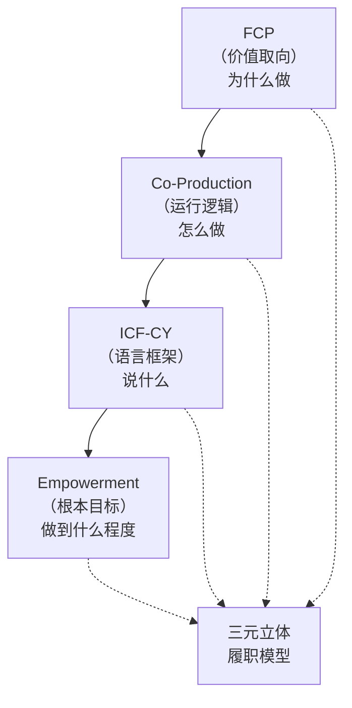

FCP确立价值取向，指明"家庭在场"是送教上门的原生条件而非附设要素；Co-Production Theory揭示运行逻辑，阐明教师、儿童、家长三方如何通过制度化协作实现育人服务"共同生产"；ICF-CY提供语言框架，为三方跨角色沟通建立一致性概念体系；Empowerment Theory设定根本目标，确保模型的运行方向始终指向"提升家庭自主能力"而非"强化家庭对外部支持的依赖"。四重理论层层叠进、环环相扣，共同锚定了三元立体履职模型的学理根基。

### 6.2.3 三元主体的角色定位与履职内容

三元立体履职模型包含三个履职主体，每个主体承担明确而差异化的履职角色与内容。

**（一）教师：专业供给方**

教师在三元模型中承担"专业供给方"的基本角色。这一角色定位既赋予教师专业决策的权威性，又对其履职能力提出多维度的要求。

教师的履职内容涵盖以下四个核心维度：

第一，**评估维度**。教师负责对服务对象的身体功能、活动能力、参与水平、认知发展、语言沟通、社会适应等进行全面评估。评估应当以标准化评估工具（如ICF-CY核心组合）为基础，同时综合运用观察记录、访谈家长、查阅医疗报告等多元信息采集手段。评估不是一次完成即告终结的，而应贯穿服务全过程——初始评估确定基线与发展目标，过程性评估监控进展与调整方案，终结性评估评价效果与规划后续。

第二，**教学维度**。教师负责基于IEP为儿童提供个别化的教育服务，涵盖认知发展、语言沟通、生活技能、社会适应、运动康复等领域的综合教学与训练。教学方法需根据儿童的功能水平、学习风格和环境条件进行个性化选择。教师承担着将课程标准转化为生活化、情境化教学活动的专业责任。

第三，**康复维度**。对于有康复需求的儿童，教师在自身专业能力范围内或通过跨专业协作（与物理治疗师、作业治疗师、言语治疗师等协作），为儿童提供相应的康复训练支持，帮助其改善或维持身体功能。

第四，**指导维度**。教师负责对家长提供家庭教育指导，包括：向家长解释儿童的发展状况和IEP目标；示范和教授在家中可实施的辅助训练方法；帮助家长识别日常生活中的教育契机；指导家长如何观察和记录儿童的发展变化；为家长提供心理支持和外部资源衔接建议。指导维度是教师履职从"对儿童的"扩展至"对家庭的"的关键体现，也是赋能型支持的核心实施渠道。

**（二）儿童：发展主体与接收方**

儿童作为"发展主体与接收方"的角色定位具有双重性。一方面，儿童是教育服务的接收对象——教师的教学和家长的协同最终都服务于促进儿童的发展。另一方面，儿童不应被简化为被动的服务终端，而应当在自身能力范围内被视作拥有能动性的发展主体：儿童的进步、困难、偏好和需求变化是其向教师和家长发送的"反馈信号"，这些反馈信号的质量和可解读性直接影响教学方案的优化和调整。

儿童的"履职内容"体现在以下三个维度：

第一，**发展进步维度**。在教师和家长的支持下，儿童在认知、语言、运动、生活自理、社会交往等领域表现出可观测的进步。即使进步的速度和幅度因个体差异而不同，持续的、方向性的进步趋势是检验教育服务有效性的最终标准。

第二，**困难表达维度**。儿童通过行为反应向教师和家长传达其面临的困难和不适——可能是对某些教学方式的不适应，可能是特定技能领域的学习障碍，可能是身体不适或情绪困扰。这些困难信号需要被教师和家长敏感地捕捉和正确地解读，然后转化为调整服务方案的依据。

第三，**需求变化维度**。重度残疾儿童的功能状态不是一成不变的——随着生长发育、健康状况变化和干预效果的累积，儿童的需求会发生结构性改变。这种需求变化可能是积极的（如能力提升使得之前不适宜的目标变得可行），也可能是需要警惕的（如功能退步、并发症出现等）。及时识别需求变化并相应调整服务方案，是儿童"需求信号"能够有效进入服务决策的前提。

**（三）家长：日常协同方**

家长在三元模型中承担"日常协同方"的角色。不同于二元模型中家长的被动位置，三元模型赋予家长明确而重要的履职责任。

家长的履职内容涵盖以下三个核心维度：

第一，**家庭表现反馈维度**。家长是儿童在家庭环境中日常表现的主要观察者和记录者。教师每周上门服务的时间极为有限，无法全面了解儿童在家庭真实生活中的功能状态和行为表现。家长有责任系统性地观察并向教师反馈儿童在家庭生活中的发展变化——包括进食、穿衣、如厕等生活自理能力的变化，与家庭成员及其他的亲子交往、同伴交往能力的变化，情绪行为状态的变化，以及对教学内容的在家迁移和泛化情况。

第二，**环境变化沟通维度**。家庭环境不是静态不变的。家庭成员的变化（如照顾者更替、家庭结构变动）、居住条件的变化（如搬家）、经济状况的变化、健康事件的发生（如家人生病或儿童病情波动），都可能对儿童的发展和教育服务的实施产生实质性影响。家长有责任将此类变化及时告知教师，使教师能够据此调整服务方案。

第三，**照料困难陈述维度**。家长在日常照料中遇到的具体困难——某些行为问题不知如何应对，某些能力发展迟滞不知如何促进，某些辅助器具不知如何使用——如果得不到及时的帮助和指导，将逐步积累为家庭照护负担，严重影响家长持续参与协同教育的意愿和能力。家长有责任将这些困难真实地表达出来，教师则有责任据此提供针对性的指导和支持。

### 6.2.4 三元互动关系与信息流模型

三元立体履职模型区别于传统二元模型的关键，不仅在于"增加了一个主体"，而在于重新定义了三方之间的互动关系。传统的二元模型仅存在教师→儿童的单向信息流（教师输出教学内容，儿童被动接收），模型的信息结构简单且缺乏反馈回路。三元模型则建立了一个包含六个信息流道的闭环互动网络：

**信息流一：教师→儿童（专业输出流）**

教师通过上门教学、康复训练、活动指导等方式，向儿童输出专业化的教育服务。这是三条信息流中唯一真正"在场"实施的——教师在儿童面前、在家庭空间中开展教育活动。该信息流的质量取决于教师专业能力与儿童个别化需求的匹配程度。

**信息流二：儿童→教师（发展反馈流）**

儿童在教师教学中表现出的行为反应——包括积极回应、被动接受、抗拒排斥、情感表达等——构成向教师的发展反馈。这一反馈流是教师判断教学效果、调整教学策略、识别新需求和新困难的主要信号来源。然而，重度残疾儿童的自我表达能力可能受到身体或认知条件限制，使得这一信息流的质量存在较大的个体差异。当儿童的直接反馈信号不清晰时，教师需要借助家长的观察和解读来获取间接反馈。

**信息流三：儿童→家长（发展表现流）**

儿童在家庭日常生活中的行为表现——远超过教师上门教学的短暂时段——持续地向家长释放发展信号。这一信息流具有"全天候覆盖"的特征，其信息量远大于教师可直接观测的范围。然而，家长对儿童发展表现的观察和解读能力存在较大差异：有的家长能够敏锐察觉细微变化并以结构化方式记录，有的家长则可能忽视重要信号或做出不准确的归因判断。

**信息流四：家长→教师（情境信息流）**

家长将观察到的儿童家庭表现、家庭环境变化和自身照料困难等信息，向教师进行反馈。这一信息流是教师获取"不在场时期"儿童发展信息的主要渠道，其完整性、准确性和及时性直接影响教师对儿童整体发展状况的判断和对服务方案的调整。从共同生产理论的视角看，这条信息流的存在使得教师不再仅凭自身上门时的观察做出决策，而是基于更全面的信息基础进行专业判断。

**信息流五：教师→家长（赋能支持流）**

教师向家长提供专业指导、技能示范、信息分享、心理支持等赋能服务。这不仅是"教师→儿童"教学活动的必要性补充，更是三元模型区别于二元模型最显著的制度创新——在二元模型中，教师与家长的互动是自发的、非结构化的；在三元模型中，赋能支持是教师履职的有机组成部分，其内容和频次应纳入岗位标准进行规范化管理。

**信息流六：家长→教师（需求表达流）**

家长根据自身的观察、判断和期望，向教师表达服务需求和期望调整意见。这一信息流赋予了家长在服务决策中的话语权。家长期望可能基于对儿童发展前景的家庭愿景，可能基于家庭实际条件的现实考量，可能基于个人价值观下的教育偏好。家长期望未必总是与教师的专业判断一致（这一冲突将在6.3节详细分析），但家长的期望表达本身是赋权型支持的题中应有之义——只有首先让期望被"听见"，才有可能实现期望与专业方案之间的有效对话。

六个信息流道构成一个完整的闭环。值得强调的是，这一闭环的运转不是自发的——它需要制度化的机制来保障每一个流道的通畅。这正是6.3节将要解决的核心问题。

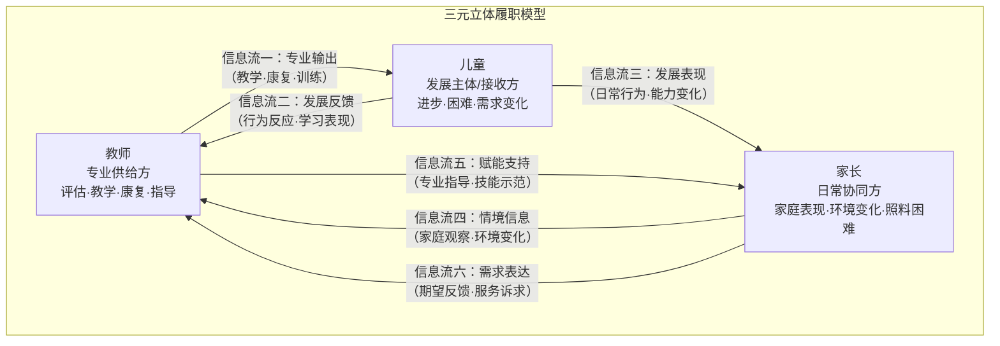

### 6.2.5 模型的"立体"属性：跨层次协同机制

三元模型的"立体"属性需要特别阐释。它不是三个主体在同一水平面上的三向沟通，而是三个主体在三个不同层次上的跨层次协同。

第一层次是**专业层次**，以教师为主导者。在这个层次上，教师基于专业知识和标准化工具，对儿童进行发展评估、制定IEP目标、实施教学活动、监测发展进展。专业层次的质量取决于教师的专业能力、标准化工具的适用性和评估信息的全面性。

第二层次是**发展层次**，以儿童为主体。在这个层次上，儿童的发展变化——进步、停滞或退步，新能力的出现或既有能力的丧失，新需求的形成——构成所有干预活动的根本依据和最终检验标准。发展层次的"信号质量"受多重因素影响：儿童的障碍程度和表达方式、教师和家长对信号的识别和解读能力、三方信息渠道的汇通程度。

第三层次是**情境层次**，以家长为在场者。在这个层次上，家庭的日常生活构成教育干预发生的真实背景——家庭的物理环境（空间布局、辅助器具配备）、人际环境（家庭成员构成与关系、互动模式与情感氛围）、信息环境（家长的知识储备和技能水平）。情境层次既是教育干预的"约束条件"（必须适应而非抗拒的客观现实），也是教育干预的"资源库"（可以被激活和调用的支持力量）。

三个层次之间的协同并非自然而然发生的，它们之间存在天然的"层次壁垒"。例如，教师在专业层次上制定了一个科学合理的IEP方案，但这个方案可能与情境层次上的家庭条件不兼容——家庭没有实施该方案的物理条件（缺乏合适的训练器材），或没有相应的知识准备（家长不理解方案要求），或没有相应的时间安排（家中有更年幼的孩子需要照料）。此时，专业层次的决策需要在充分考虑情境层次约束条件的基础上进行"情境验算"，然后发展层次上的教育干预才能有效启动。

三元立体履职模型的"立体"属性正体现在：它将专业层次、发展层次和情境层次的对接从"自发磨合"提升为"制度化安排"。图6.2（此处示意，非正式图表）呈现了这一跨层次协同机制的垂直结构。教师处于专业层次顶端，但其专业决策依赖于从发展层次（儿童反馈）和情境层次（家长信息）获取的信息输入；家长处于情境层次的在场者位置，但其协同效能依赖于从专业层次（教师指导）获取的能力支持；儿童处于发展层次的核心，但其发展信号的释放和接收受到专业层次（评估工具的准确性）和情境层次（家庭环境的安全感）的双重影响。

## 6.3 三元主体权责划分与冲突协调机制

### 6.3.1 权责划分的基本框架

任何多主体协作模型如果不能清晰界定各方的权责边界，就难以避免角色模糊、责任推诿和协作失序的问题。三元立体履职模型在赋予家长和儿童明确的履职地位的同时，必须建立与其角色相适应的权责划分框架。

**（一）教师的权责边界**

教师拥有以下权利：第一，**专业决策权**。基于专业知识和评估信息，自主制定和调整IEP方案，选择教学方法和辅助工具，确定教学进度和节奏。家长和儿童对专业方案提出的调整需求应得到尊重和回应，但最终的专业性决策（如某项干预是否具备科学依据、某项康复训练的禁忌事项）应由教师基于专业知识做出。第二，**信息获取权**。有权向家长了解儿童在家庭环境中的发展表现、家庭条件变化和相关困难信息，有权要求跨专业团队成员提供必要的评估和咨询支持。第三，**安全保障权**。有权在入户安全受到威胁时中止或调整服务，有权在服务过程中获得必要的人身安全保障和工作条件保障。

教师承担以下责任：第一，**教学质量责任**。确保所提供的教育服务达到专业标准，教学目标的设定既具挑战性又切实可行，教学方法的选择符合儿童的身心发展特征。第二，**信息透明责任**。向家长充分、清晰、可理解地解释评估结果、IEP内容、教学方法和预期进展，确保家长具备做出知情判断的信息基础。第三，**赋能指导责任**。为家长提供与儿童发展需求相匹配的家庭教育指导，帮助家长提升观察、记录、辅助教学和应对日常困难的能力。第四，**协同联络责任**。在必要时协调跨专业团队成员（康复治疗师、社工、心理咨询师等）参与服务供给，保持多方信息的通畅流转。

**（二）儿童的权责边界**

由于重度残疾儿童的法律行为能力可能不完全，其权责边界的划定需要通过代行机制来实现——对于年幼或无独立表达能力的儿童，由家长作为法定监护人代为表达和行使权利。但即便如此，在条件允许的情况下（儿童具备一定的认知和沟通能力），应当尽可能让儿童在自身能力范围内直接参与与其相关的决策过程。这一主张符合联合国《残疾人权利公约》（CRPD）第7条"确保残疾儿童有权在与其他儿童平等的基础上，就一切影响本人的事项自由表达意见"的要求，也被澳大利亚NDIS的"有尊严的风险"（Dignity of Risk）理念所支持——允许服务使用者在一定风险范围内自主决策，是尊重其人权的体现[12]。

儿童的权利包括：第一，**受服务权**。有权获得与其教育需求相匹配的送教上门服务，服务的质量应当达到国家和地方规定的底线标准。第二，**被尊重权**。在教学互动、评估记录、信息使用等环节中，儿童的人格尊严应当得到充分尊重，不得因其残疾程度而被轻视或标签化。第三，**表达权**。在自身能力允许的范围内，有权表达自己的偏好、意愿和困难，其表达应当被教师和家长认真听取并尽可能在可行范围内予以回应。

**（三）家长的权责边界**

家长拥有以下权利：第一，**知情权与参与权**。有权获取关于儿童评估结果、IEP内容和实施进展的完整信息，有权参与IEP制定和服务方案调整的讨论和决策过程。第二，**选择权与退出权**。有权在可选项范围内表达对服务提供者、服务类型和服务方式的偏好，有权在合理理由下要求调整或中断特定服务内容。第三，**申诉权**。当认为服务质量未达标或自身权利受到侵害时，拥有向行政主管部门提出申诉的正式渠道和程序保障。

家长承担以下责任：第一，**信息提供责任**。客观、及时地向教师反馈儿童在家庭中的发展表现、家庭环境变化和自身照料困难。第二，**协同实施责任**。在自身能力范围内，配合教师的指导，在家庭日常生活中持续性地辅助儿童练习、巩固和迁移学校所学的知识和技能。第三，**资源保障责任**。在条件许可范围内，为儿童的在家教育和康复训练提供基本的物质条件（如安全的活动空间、必要的辅助器具）和情感支持。第四，**持续学习责任**。积极参与家庭教育指导活动，主动学习促进儿童发展的基本方法和技能，逐步提升自身的协同教育能力。

### 6.3.2 三种典型冲突及其协调机制

三元主体之间的互动并非总是和谐顺畅的。不同主体在信息占有、利益偏好、角色认知和价值取向上的差异，可能导致三类典型的冲突。三元模型的制度设计必须为这些冲突提供制度化的协调机制，而非仅依赖于相关方的善意和自觉。

**（一）目标冲突：教师专业目标与家长期望之间的张力**

教师从专业角度设定的教育目标，可能与家长对儿童的期望之间存在不一致。典型的冲突场景包括：

教师基于功能性评估（如ICF-CY）和实证研究，将本阶段的教育目标设定为"提升生活自理能力"——如自主进食、如厕训练的巩固。然而，家长可能更期望教师教授学术性内容——认字、数数——因为这在家长的价值认知中更接近"上学"的本质意义。另一种常见情况是：教师根据儿童的功能水平将目标设定为"维持现有能力不退化"，但家长期望看到的是"不断进步"，对"维持性目标"缺乏认可。

此类目标冲突如果处理不当，将导致严重后果：家长可能认为教师"不认真""在敷衍"，从而降低对服务的信任度和对自身协同责任的投入度；教师可能认为家长"不切实际""缺乏专业知识"，从而疏于与家长的沟通和解释，进一步强化家长的误解。

协调目标冲突的制度机制是**IEP协商机制**。该机制包含以下关键要素：

第一，**信息对称化**。在IEP制定会议上，教师有责任向家长系统性地呈现评估结果——包括儿童在哪些领域达到或超过了同龄残疾儿童的预期水平、在哪些领域存在显著落后、当前干预的优先目标应为何、选择这些目标而非那些目标的专业依据是什么。信息应当以家长能够理解的语言和形式呈现，避免过度使用专业术语造成沟通障壁。

第二，**期望校准化**。教师应当耐心听取家长的期望，理解这些期望背后的价值关怀和现实关切，并在专业范围内评估哪些家长期望是可以被整合进IEP的、哪些期望需要被调整或延后。例如，如果家长强烈期望儿童学习认字，教师可以在IEP中纳入一个"功能性识字"目标——将认字与日常生活情境（认食品包装、识交通标志等）相结合，既尊重了家长的关切，又确保了教学内容的功能性导向。

第三，**方案渐进式调整**。当协商仍无法完全弥合分歧时，可采用"尝试性方案"——在一个较短周期内（如2至3个月）试行某一项争议目标，并在周期结束时通过客观评估数据来判断该目标的适宜性。数据化的反馈往往比口头论证更具说服力。

第四，**第三方协调**。当教师与家长的冲突无法通过上述方式解决时，应当引入第三方协调机制——由送教服务管理机构（特教指导中心或区县级特教资源中心）派出协调员，主持正式的协调会议，依据标准化程序和专业准则做出裁决性建议。

**（二）角色冲突：教师主导与家长自主之间的张力**

角色冲突根植于送教上门场域的特殊性。在家庭环境中，家长是"主人"，教师是"客人"；但在教育服务关系中，教师是"专家"，家长是"协同者"——两种身份之间的张力构成了角色冲突的结构性土壤。

一种极端表现为"教师主导过度"：教师以专业权威的姿态进入家庭，对家庭生活习惯、教养方式和环境布置进行指挥性干预，忽视了家长在自身家庭空间中的自主权，导致家长产生抵触、排斥或敷衍情绪。另一种极端表现为"家长自主过度"：家长以"主人"自居，将教师定位为"请来的家庭教师"，要求教师按照家长的意愿而非专业判断开展教学，使得教师的专业权威无从发挥。

更深层地看，角色冲突的实质是"替代型服务"与"赋能型支持"两种服务范式之间的冲突。在替代型服务范式中，专业人员承担主要责任,"替"家庭完成教育任务——教师替家长制定方案、替家长做出决策、替家长承担后果。这种范式隐含着一个家长无能的假设，不仅贬低了家长的主体地位，也使得教育干预的可持续性完全依赖于专业支持的持续在场。在赋能型支持范式中，专业人员的角色从"替代者"转向"赋能者"——教师不再"替"家长做事，而是"帮助"家长学会如何自己做事。这种范式转变需要教师和家长双方在角色认知上进行根本调整：教师需要接受自己不再是唯一决策者，家长需要接受自己不再是被动的配合者。

协调角色冲突的制度机制是**"四步赋能循环"**。这一机制的设计逻辑源自赋权理论和共同生产理论，意在将"赋能"从一个抽象口号转化为可操作的标准化流程。四步赋能循环包含以下四个递进环节：

**第一步：评估协作（Assessment Collaboration）**。教师和家长共同对儿童的功能状态进行多维评估。教师贡献的是专业评估工具和标准化知识（如使用ICF-CY框架描述儿童的功能概况），家长贡献的是基于日常亲密互动的情境观察和独到发现（如哪些活动是儿童感到愉悦并主动参与的，哪些情境会引发儿童的回避或焦虑行为）。双方信息的汇合能够产生超出任何一方独立评估所能达到的全面性。评估协作的关键制度要点在于：评估报告不是教师单方面撰写后"告知"家长的，而是教师和家长共同完成的——家长的观察报告是评估文件的正式组成部分，其权重在综合判断中得到制度性的承认。

**第二步：方案共制（Plan Co-Development）**。在综合评估的基础上，教师和家长共同制定IEP方案。教师提供专业框架——发展目标的优先级排序、教学方法的科学依据、进度安排的合理性判断；家长提供情境验算——方案在家庭日常生活中的可实施性、家庭自身的资源和限制条件、家长的偏好和优先关切。方案共制的制度要点包括：IEP文件须包含"家庭参与认定的教育目标"专门板块，明确记录家长认可的方案内容和家长承担的具体协同任务；方案制定过程的讨论记录是IEP文件的法定附件，以备后续跟踪检查。

**第三步：实施协同（Implementation Collaboration）**。在方案实施过程中，教师和家长以各自的方式同步参与。教师负责上门时的直接教学和专业干预，家长负责在家庭日常生活中的辅助练习和情境泛化。实施协同的制度要点在于：教师不是"布置作业"后等待家长"汇报结果"，而是将协同实施视为一个需要持续指导和反馈的互动过程——教师在每次上门服务时，花一定时间了解家长上周协同实施的情况、遇到的困难和需要调整的问题，并在必要时对家长的辅助策略进行现场纠正和示范。

**第四步：反馈共评（Feedback Co-Evaluation）**。在评估和调整周期（一般为每学期或半学期）结束时，教师和家长共同参与对服务效果的评估。教师提供标准化评估数据（GAS目标达成度评分、标准化量表前后测对比等），家长提供家庭端的真实变化感知（哪些能力在日常生活中肉眼可见地改变了、哪些方面依旧薄弱需要加强）。反馈共评的制度要点在于：家长满意度问卷不应仅是简单的李克特量表勾选，而应包含开放性问题——如"您认为本阶段最有价值的改变是什么""您认为最遗憾的未实现目标是哪一个""您对下一阶段的期望是什么"——以便真正捕捉到家长的实质性评价。

四步赋能循环的运行逻辑可概括为：**评估协作解决"我们从哪里出发"的共识问题；方案共制解决"我们要去哪里"的方向问题；实施协同解决"我们怎么一起去"的路径问题；反馈共评解决"我们走到了哪里、接下来怎么走"的迭代问题。** 这一循环不是一次完成即告终结的，而是随着儿童的成长、家庭条件的变化和服务经验的积累不断迭代演进的。

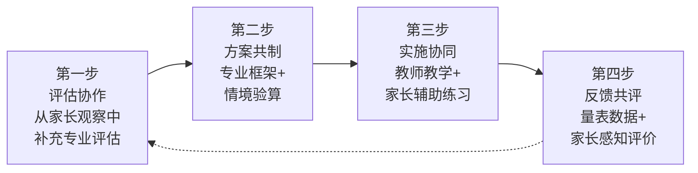

**（三）信息冲突：教师专业信息与家长情境信息之间的不对称**

如6.2.4节所分析的六个信息流道所示，三元模型面临两种方向的信息不对称。教师对儿童在家庭中的日常表现了解不足（"场景盲区"），家长对儿童的发展评估结果和专业干预方案了解不充分（"知识盲区"）。这两种不对称都会导致方案偏离实际、效果偏差和协作关系恶化。

协调信息不对称的制度机制是**定期沟通制度+共享决策平台**。

定期沟通制度的制度要点包括：第一，频次标准化——每次送教服务结束后，教师须在服务记录中填写"家长沟通纪要"板块，摘要记录本次服务中与家长沟通的主要内容（家长反馈的儿童表现、教师提供的指导建议、双方达成的共识或分歧）。第二，内容结构化——学期初的初始沟通聚焦于IEP介绍和家长期望收集；学期中和学期末的过程性沟通聚焦于进展评估和方案调整；突发事件的即时沟通（如儿童健康状况急剧变化、家庭重大变故等）不受固定频次限制，但需在设计好的应急沟通渠道中进行。第三，形式灵活化——对于文化程度较低或方言交流障碍的家长，沟通形式可从书面报告转为面对面口头沟通或电话微信语音形式，确保信息的可达性而非仅追求格式的标准化。

共享决策平台的制度要点是：所有与儿童发展和服务方案相关的重要决策——包括IEP的制定和修订、服务内容或频次的重大调整、转介至其他服务资源的建议、服务终止的评估——必须经过正式的共同决策程序。这一程序不意味着家长拥有与教师同等的专业技术裁决权，而是确保家长的声音在决策过程中被"制度化地听见和回应"。具体而言，共享决策程序的运行规则包括：第一，任何重要决策在正式生效前，须给予家长不少于一周的知情和意见反馈期；第二，教师对家长提出的意见反馈，无论是否采纳，均须在服务记录中书面回应并说明理由；第三，如果家长对教师的回应不认可，可启动6.3.2（一）中所述的第三方协调机制。

### 6.3.3 从"替代型服务"到"赋能型支持"的范式转型

综合上述三类冲突的协调机制，可以看到一个共同的底层逻辑贯穿其中——三元立体履职模型的根本方向是从"替代型服务"向"赋能型支持"的范式转型。这一转型不是对教师专业角色和专业责任的稀释，而是对教师专业能力的重新定义和更高要求。表6.1（示意）对比了两种范式的核心差异。

| 对比维度 | 替代型服务 | 赋能型支持 |
|---------|----------|----------|
| 核心假设 | 家长能力不足，需求由专业代行 | 家长具备发展潜力，可通过赋能提升能力 |
| 专业人士角色 | 决策者、主要执行者 | 引导者、赋能者、质量保障者 |
| 家长角色 | 被动接受者、配合者 | 主动协同者、共同决策者 |
| 信息流向 | 单向：专业→家庭 | 双向循环：专业↔家庭 |
| 效果标准 | 教师服务质量（做了什么） | 儿童发展效果+家庭能力提升（改变了什么） |
| 可持续性 | 依赖专业支持的持续在场 | 家庭能够逐步自主应对 |
| 标准化难点 | 标准化程度高但易"水土不服" | 标准化与个性化之间的动态平衡 |

赋能型支持的最终目标可以概括为三个递进层次：个体层面，促进重度残疾儿童的功能改善和全面发展；家庭层面，提升家庭自主应对和持续支持的能力；制度层面，建立教师与家长之间可持续的协作伙伴关系，使送教上门服务在标准化保障下产生持久的育人实效。

## 6.4 三元模型与四层标准体系的嵌入关系

### 6.4.1 核心难点："规范导向"的标准体系与"关系导向"的三元模型何以兼容

本章前三节构建的三元立体履职模型具有清晰的"关系导向"特征——模型的核心价值在于重新定义教师、儿童和家长之间的互动关系，通过制度化的沟通和协作机制实现三方的高效协同。然而，第五章构建的四层标准体系本质上是"规范导向"的——它通过明确的条款、指标和程序来约束和指导送教上门服务的各个环节。一个自然产生的疑问是：强调关系弹性、强调动态协商的三元模型，能否真正"嵌入"强调规范性、强调刚性约束的标准体系？二者的兼容基础何在？

这一疑问并非空穴来风。在国际公共服务标准化实践中，"规范"与"关系"之间的张力是一个反复出现的核心议题。英国SEND体系的改革经验表明，当标准化程序过于刚性和繁琐时，教育者将大量精力耗费在"应对程序要求"而非"建立有效教育关系"上，反而削弱了教育质量[13]。澳大利亚NDIS在实施过程中发现，独立性监管机构（NDIS Quality and Safeguards Commission）的标准化审查机制虽然有效保障了服务质量底线，但也引发了服务提供者对"照章办事"的消极依赖，挤压了与服务对象建立个性化、灵活性关系的空间[14]。

但在方法论层面，"规范导向"与"关系导向"之间的对立并非不可化解。关键在于识别和利用标准化体系的层次性特征。第五章建立的四层标准体系并非铁板一块——通用基础标准层是高度规范的（术语、分类、认定标准必须统一），服务保障标准层是中度规范的（经费、师资、安全须设定底线但允许区域差异），服务提供标准层是框架规范的（规定流程环节和IEP要素但不规定具体内容），岗位履职标准层则是在前三层框架约束下的角色规范（规定谁做什么、怎么协作、如何评价而非规定怎么做）。正是这种"强—中—弱—框架"的差异化标准化程度，为三元模型的嵌入预留了结构性空间。

更根本地看，三元模型与标准体系之间的关系不是"顺应"或"嵌入"的单向关系，而是一种**双向建构关系**。一方面，三元模型的运行需要获得标准化的制度支撑——没有标准的约束和保障，三方协作容易退化为自发的、不稳定的、难以监督的人际互动。另一方面，标准体系——尤其是岗位履职标准子体系——的内容充实和制度细化需要以三元模型为理论依据——没有三元模型提供的角色关系和互动机制分析，岗位履职标准的"家庭/社区维度"就缺乏实质性内容。这一双向建构关系的认识，是理解6.4.2节嵌入路径选择的关键前提。

### 6.4.2 嵌入路径一：三元模型嵌入岗位履职标准的"家庭/社区岗位维度"

第五章"岗位履职标准子体系"部分提出了"双维度扩展"的结构设计：将传统的组织内岗位标准扩展为"组织内岗位维度+家庭/社区岗位维度"。这一扩展为三元模型的嵌入提供了天然的制度入口。具体而言，三元模型对岗位履职标准的嵌入从以下四个方面展开：

**第一，家长协同规范作为岗位履职标准的正式组成部分。**

在传统标准化视野中，"岗位"是一个仅限于组织内部的概念——只有签约受雇于组织的人员才拥有"岗位"，才需要被岗位标准规范。将"岗位"概念从组织内部扩展至家庭场域，是一步关键的制度创新。它意味着：送教上门服务的"岗位"不再仅有教师岗、巡回指导岗、管理督导岗和跨专业协作岗，还新增了"家长协同岗"。

但这里必须做出一个严谨的理论区分。家长的"协同岗"与教师的组织内岗位在性质上根本不同：教师岗位是职业性岗位，受劳动法律关系的调整，违反岗位标准可能面临职业性处罚（如考核降等、取消资质）；家长的"协同岗"是参与性角色，受公共服务伦理关系的调整，违反协同规范仅意味着其家庭获取部分增值型服务（如额外康复指导、优先资源对接）的资格可能受到影响，而非受到行政处罚。这一区分至关重要——它确保了家长协同规范的性质是"赋能"和"激励"的，而非"管制"和"惩罚"的。

家长协同规范的核心内容依据三元模型6.2.3节和6.3.1节的论述，主要涵盖以下方面：（1）信息反馈规范：规定的信息反馈频次和内容格式（如按月填写《家庭表现观察记录简表》），确保"信息流四"（家长→教师的情境信息流）的制度化通畅；（2）协同实施规范：规定的协同实施最低要求和参考指南（如在日常生活中辅助儿童练习、巩固教学内容的注意事项），确保"信息流五"（教师→家长的赋能支持流）的成果能够得到家庭端的有效落地；（3）沟通参与规范：规定的沟通参与要求和退出机制（如参加IEP会议的义务、对教师反馈做出回应的时限等），保障"信息流六"（家长→教师的需求表达流）的规范性运作。

**第二，教师赋能支持规范与家长协同规范的对偶设计。**

三元模型的六个信息流道中，"信息流五"（教师→家长的赋能支持）与"信息流四"（家长→教师的情境信息）构成一组对偶关系：教师的赋能输出质量直接影响家长的协同输入质量，反之亦然。岗位履职标准的设计应当体现这种对偶性——教师的岗位履职标准中应当包含对"赋能性指导"的明确要求（不仅仅是"是否向家长解释了IEP"的形式要求，还应包括"是否进行了现场操作示范""是否对家长的辅助练习方法提供了反馈性指导"等实质要求），家长的协同规范中应当包含对"指导效果反馈"的明确规定（如"是否理解了教师本次提供的指导""在家庭实施中遇到了哪些具体困难"）。通过对偶设计，标准体系不是孤立地规范教师或家长，而是规范二者之间的"协同关系"本身。

**第三，儿童主体地位在岗位履职标准中的体现。**

三元模型中儿童是"发展主体/接收方"，其发展反馈信号是连接教师和家长的核心信息桥梁。岗位履职标准应当将"儿童反馈信号的采集和记录"明确为教师和家长双方的共同责任——教师的履职标准中应包含"通过观察和行为记录采集儿童在教学和互动中的发展反馈"的要求，家长的协同规范中应包含"在日常生活中观察和记录儿童的典型行为表现并定期提交供教师参考"的要求。同时，对于具备一定认知和沟通能力的儿童，应当在其能力允许的范围内保障其直接表达意见的权利——这一点体现了CRPD第4号一般性意见所强调的"包容教育并非简单将残疾儿童置于普通教育环境，而是确保教育的全过程——从决策到实施到评价——均以儿童的最大利益为出发点"的核心理念[12]。

### 6.4.3 嵌入路径二：三元协同规范作为新增标准子体系

除了利用既有的"岗位履职标准子体系"进行嵌入，三元模型的系统运行还需要一套专门的、横切的协同规范作为新增标准子体系。该子体系不是对特定岗位的规范，而是对三元主体之间的"协同关系"本身的规范——它规定了协同的频率、形式、内容、记录和效果评价标准。其与岗位履职标准的关系类似于"流程标准"与"角色标准"的关系：岗位履职标准规定"谁做什么"（角色规范），三元协同规范规定"各方如何一起做"（流程和互动规范）。

三元协同规范作为新增标准子体系的主要内容框架如下：

**（1）协同组织规范**。规定三元协同的基本组织方式，包括：IEP制定会议的召集程序、参与人员、议事规则和记录要求；学期初的协同启动会议、学期中和学期末的过程性协同评估会议的组织要求；紧急事项的即时协同启动条件和响应时限。

**（2）信息共享规范**。规定三元之间的信息共享原则、渠道、内容和保护机制，包括：教师有义务向家长全面告知评估结果、IEP内容和实施进展（信息的"向下流动"规范）；家长有义务向教师及时反馈儿童的家庭表现、环境变化和照料困难（信息的"向上流动"规范）；所有信息共享行为必须遵守儿童隐私保护的相关法律法规，敏感信息的传递应当采用安全的渠道和授权方式。

**（3）决策参与规范**。规定涉及儿童发展和服务方案的重大决策的参与程序，包括：哪些事项界定为"须经共同决策的重大事项"（如IEP的重大修订、服务内容的实质性变更、服务提供者的更换建议、服务终止的评估判断）；共同决策的基本程序（提报→知情→意见反馈与回应→形成决策→记录存档）；意见分歧的协调和上诉机制。

**（4）协同效果评价规范**。规定三元协同效果的评价维度和评价方法，包括：协同的完备性（规定的协同事件是否均已完成）、协同的及时性（信息反馈和决策回应是否在规定的时限内完成）、协同的实质性（协同是否真正达到了信息共识和方案协商的效果，而非仅完成了纸面程序）、协同的满意度（各方对协同过程的感知满意程度）。

### 6.4.4 嵌入关系的整体图景

综合两种嵌入路径，三元模型与四层标准体系之间的整体嵌入关系可用以下结构呈现：

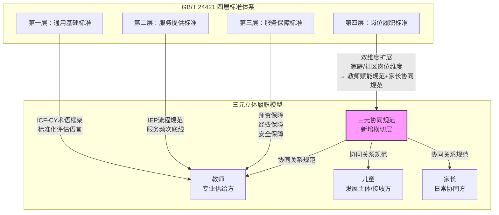

在该嵌入关系中，第一层至第三层标准体系主要规范专业供给方（教师）的工作条件和行为准则，为三元模型的教师履职维度提供了标准化的制度环境。第四层岗位履职标准通过"双维度扩展"——组织内岗位维度+家庭/社区岗位维度——为三元模型的家长和儿童履职维度提供了制度入口。新增的"三元协同规范"横向切过三个主体的履职关系，为三元之间的信息流道和协作机制提供了专门性的标准规范。由此，四层标准体系与三元模型之间形成了"纵向分层保障—横向协同贯通"的完整嵌入格局。

### 6.4.5 国际参照：日本"三层次支援"模式的验证

为了进一步确证三元立体履职模型与标准化体系之间的嵌入关系在理论上的合理性与实践中的可行性，有必要引入一个国际参照案例。日本文部科学省在特殊教育领域推行的"三层次支援"模式（三層支援モデル）提供了一个有价值的参照框架。

日本"三层次支援"模式的主要内容如下[15]：第一层次"通常支援"面向所有儿童，由班级教师在普通班级内通过通用教学设计（Universal Design for Learning, UDL）和差异化教学策略满足多样化需求，这是公共服务"基本保障"层的标准化供给；第二层次"补充支援"面向有额外需求的儿童，通过校内资源教室、补习辅导、小团体社会技能训练等形式，在通用于全体儿童的基本保障之上提供针对性的补充服务；第三层次"个别支援"面向有特殊需求或极重度障碍的儿童，通过特殊教育学校、访问教育（訪問教育，日本对"送教上门"的对应制度安排）、个别化支援计划等形式，提供高度个别化的深度服务。

日本经验的启示在于以下几个方面。首先，"三层次支援"模式不是根据儿童的残疾种类或程度来机械分类，而是根据"儿童当下实际需要的支援强度"来动态分层——儿童可能在某个学科领域处于第一层次而在另一个领域处于第三层次，也可能随着时间推移在不同层次之间流动。这种"需求导向的动态分层"与送教上门标准体系的分层设计逻辑（强标准化—中度标准化—个性化）是一脉相承的——前者在服务供给上做"需求分層"，后者在标准设计上做"约束分层"，二者从不同侧面回应了个性化服务的标准化难题。其次，日本访问教育的实践中，尽管服务是在学生家庭中进行的，但教师的履职标准、学生的个别化支援计划和家长的协同配合责任均在制度层面有明确规定——包括访问频次（每周1至2次）、每次访问的活动内容记录、家长签阅确认和学期进展报告等。这些制度安排的功能与传统送教上门的"台账管理"相似，但其与个别化支援计划的目标深度绑定（记录的目的是追踪目标达成而非证明服务发生），从而避免了"重记录、轻育人"的异化倾向。第三，日本通过法律和行政指导将"访问教育"确立为一种正式的特殊教育安置方式（而非临时性补救措施），使其获得了标准化的制度保障——经费保障、师资配备保障、服务质量监督均纳入整体特殊教育财政和行政管理的标准化框架之中。

日本"三层次支援"模式对三元模型的参照验证，核心在于证明了以下命题的有效性：**一个以家庭为服务场域、以个别化支持为核心特征的公共服务，可以通过"分层标准设计+制度化协同机制"实现标准化与个性化的兼容，且这种兼容需要以对家庭角色的制度化承认为前提。** 尽管日本并未明确使用"三元模型"这一概念，但其访问教育制度中教师、学生和家庭三方关系的制度安排——教师的专业指导义务、学生的个别化支援权利、家庭的协同配合责任——在实质上构成了一种隐性的三元关系。这为中国将三元立体履职模型正式纳入送教上门标准体系提供了国际经验的佐证。

### 6.4.6 嵌入关系的风险预警与制度保障

三元模型与标准体系的嵌入关系虽然理论上成立、国际上可参照，但在未来实施中仍面临若干风险，制度设计中须前瞻性地内置防范和缓解机制。

**风险一：标准刚性挤压关系弹性。** 如果三元协同规范的规定过于细致和刚性（如强制规定沟通的精确次数、固定格式、标准时长），可能导致协同行为退化为机械化的"完成指标"——教师和家长为满足规范要求而进行沟通，但沟通的内容空洞、浮于表面，未能真正达到信息对称和决策共识的效果。这对策应回归本文第四章已论述的"标准的目的不是让所有服务变得一模一样"的基本立场——三元协同规范应当定位为"促进性标准"而非"约束性标准"，侧重规定协同的"应然"和"最低要求"，为各方根据实际情况灵活调整具体方式保留充分空间。建议在标准条文中明确区分"必须达成"（如IEP制定须有家长参与的过程记录）、"鼓励达成"（如建议每月至少一次深入的家庭沟通）和"自主决定"（如具体沟通方式由教师根据家长偏好灵活选择）三个约束强度层次。

**风险二：家长协同能力不足导致的"名义赋权、实质不公"。** 家长的受教育程度、信息素养、经济条件和时间安排存在巨大差异，统一设定的"家长协同规范"可能对有良好教育背景和社会资源的家庭十分友好，对那些文化程度低、经济拮据、日常生活压力大的家庭反而构成新的负担。对此，三元协同规范的设计必须体现"差异化适配"原则：基础性要求（如出席IEP会议）适用于所有家庭，但在具体实施方式上为处于弱势的家庭提供更多的制度性辅助——包括语言翻译支持（方言或少数民族语言）、简化的信息呈现形式（口述替代书面）、定位于家长偏好的沟通时间和地点、以及为缺乏替代照料人的家庭提供临时照料安排，使其能够脱身参加必要的协同活动。在更深层面上，这一风险还提示：三元模型的"赋能导向"不是一次性的制度宣告就可以实现的，它需要配合持续的、有资金保障的家庭教育指导服务体系和社区支持网络来逐步推进——赋权如果不同时提供赋能所需的基础条件和持续性支持，就可能沦为形式主义的"空头支票"。

**风险三：主管部门的能力缺口与组织惯性。** 将家长协同规范和三方协同机制纳入标准体系，显著增加了教育行政部门和相关机构的管理复杂度和执行压力。基层管理者可能因缺乏相关经验和知识准备而产生"执行回避"或"形式化应付"的倾向。对此的缓解对策包括：在三元协同标准的试点实施阶段，为试点地区的主管部门提供系统性的培训和咨询支持；建立标准实施的效果监测和问题反馈通道，及时收集基层实施中的困难和经验；利用数字化技术搭建跨角色的信息共享和协同平台，以技术手段降低协同的组织成本和记录负担。

## 本章小结

送教上门的根本特殊性在于其教育服务发生在家庭场域而非学校场域，这一场域转换意味着标准化体系的设计不能以学校教育为默认为模板，而必须将家庭场域的结构性特征纳入标准化的基础性设计之中。本章围绕这一核心命题，完成了从理论论证到模型构建再到标准嵌入的完整逻辑链条。

第一，家庭场域在送教上门服务中具有核心支撑作用。这一命题得到生态系统理论、国际家庭中心实践证据和家庭场域五重教育功能的系统支持，表明家庭不是送教上门的"实施障碍"，而是其"原生场域和基础资源"。家庭中心实践在国际特殊教育领域已从学术理念发展为制度性标准实践模式（英国NICE指南NG23、澳大利亚NDIS质量框架、美国IDEA家长参与条款），中国送教上门标准化建设如果忽视这一命题，将难以突破当前"服务在场"而"教育离场"的困局。

第二，"教师供给—儿童接收—家长协同"三元立体履职模型是本章的核心理论创新。该模型以FCP、共同生产理论、ICF-CY和赋权理论四重理论传统为基石，将送教上门服务的履职体系从"教师—儿童"二元供给扩展为"教师—儿童—家长"三元协同。三元主体各承担明确的履职任务，彼此之间通过六个信息流道形成闭环互动网络。模型的"立体"属性体现在专业层次（教师主导）、发展层次（儿童主体）和情境层次（家长在场）之间的跨层次协同机制。

第三，三元模型的制度生命力依赖于对三类典型冲突——目标冲突、角色冲突和信息冲突——的有效协调。IEP协商机制、四步赋能循环（评估协作→方案共制→实施协同→反馈共评）和定期沟通+共享决策平台构成了三元冲突协调的制度工具箱。这些协调机制的共同方向是从"替代型服务"向"赋能型支持"的范式转型，使送教上门的专业性同时体现在"服务儿童"和"赋能家庭"两个维度。

第四，三元模型与四层标准体系之间的嵌入关系通过两种路径实现：利用既有岗位履职标准的"双维度扩展"将家长协同规范纳入岗位标准体系；新增"三元协同规范"标准子体系对三方互动关系进行横切式规范。这一嵌入克服了"规范导向"与"关系导向"之间的张力——通过识别和利用标准体系的层次性特征（强—中—弱—框架的四层差异化标准化程度），使规范的"刚性"与关系的"弹性"在不同层次上发挥各自的功能。日本"三层次支援"模式为这一嵌入方案提供了国际经验的参照验证。

三元立体履职模型的提出，将送教上门标准化建设的理论视野从"如何规范教师"扩展至"如何系统性地激活家庭的教育功能"。这既是对国家政策中"家校协同育人"方向的学术回应，也是对国际上家庭中心实践趋势的中国化创生。模型的实践效力有待试点验证和持续改进，但其理论前景在于：它试图在公共服务的规范取向和特殊教育的人本取向之间，找到一条兼顾质量保障和个性尊重的可行路径。

---

[1] Bourdieu, P. (1990). *The Logic of Practice*. Stanford University Press.

[2] Bronfenbrenner, U. (1979). *The Ecology of Human Development: Experiments by Nature and Design*. Harvard University Press.

[3] Rosenbaum, P., King, S., Law, M., King, G., & Evans, J. (1998). Family-centred service: A conceptual framework and research review. *Physical & Occupational Therapy in Pediatrics*, 18(1), 1-20.

[4] Dunst, C. J., Trivette, C. M., & Hamby, D. W. (2007). Meta-analysis of family-centered helpgiving practices research. *Mental Retardation and Developmental Disabilities Research Reviews*, 13(4), 370-378.

[5] National Institute for Health and Care Excellence. (2017). *Children and Young People's Continuing Care: Families and Carers* (NICE Guideline NG23). London: NICE.

[6] National Disability Insurance Agency. (2021). *NDIS Quality and Safeguarding Framework*. Canberra: NDIA.

[7] Council for Exceptional Children. (2020). *Special Educator Professional Ethical Principles and Practice Standards*. Arlington, VA: CEC.

[8] Dunst, C. J. (2002). Family-centered practices: Birth through high school. *The Journal of Special Education*, 36(3), 141-149.

[9] Ostrom, E. (1996). Crossing the great divide: Coproduction, synergy, and development. *World Development*, 24(6), 1073-1087.

[10] World Health Organization. (2007). *International Classification of Functioning, Disability and Health: Children & Youth Version (ICF-CY)*. Geneva: WHO.

[11] Zimmerman, M. A. (2000). Empowerment theory: Psychological, organizational and community levels of analysis. In J. Rappaport & E. Seidman (Eds.), *Handbook of Community Psychology* (pp. 43-63). Springer.

[12] United Nations Committee on the Rights of Persons with Disabilities. (2016). *General Comment No. 4 on the Right to Inclusive Education* (CRPD/C/GC/4). Geneva: United Nations.

[13] Department for Education. (2021). *SEND Review: Right Support, Right Place, Right Time*. London: UK Government.

[14] Productivity Commission. (2017). *National Disability Insurance Scheme (NDIS) Costs*. Canberra: Australian Government.

[15] 文部科学省. (2013). 『教育支援資料：障害のある子供の就学手続と教育支援の在り方について』. 東京：文部科学省初等中等教育局特別支援教育課.


---


# 第七章 标准分阶段实施与质量保障机制

送教上门标准的制定只是起点，确保标准从"纸面文本"走向"实践场景"并发挥预期效用，需要科学的分阶段实施策略、系统化的质量评价机制以及全方位的综合保障体系作为支撑。本章从实施路径、质量评价、保障机制和典型案例四个维度，构建送教上门标准的落地运行框架。

## 7.1 标准分阶段实施步骤

公共服务标准的推行不能一蹴而就，需要遵循"试点—推广—全覆盖—持续优化"的渐进路径。基于我国区域经济社会发展水平的客观差异、特殊教育资源的非均衡分布以及送教上门服务对象的特殊性和复杂性，本研究提出"四阶段递进式"实施策略，将标准的落地过程划分为试点起步、推广扩展、全面铺开和优化迭代四个阶段，每个阶段设定明确的重点任务、关键节点和评估指标，确保标准实施的稳步推进和持续优化。

### 7.1.1 试点起步阶段（第1—2年）

试点起步阶段的总体目标是验证标准的可行性和适应性，积累实践经验，为后续推广奠定基础。

**试点地区选择**。在省级教育行政部门的统筹协调下，选取3—5个具有代表性的区县作为首批试点单位。试点地区的选择应遵循以下原则：其一，地域代表性原则，兼顾东部发达地区、中部地区和西部地区，确保试点经验具有跨区域的可参照性；其二，基础条件适中性原则，优先选择送教上门工作已有一定基础但不处于全国领先水平的地区，避免出现"强者恒强"的试点偏差；其三，参与意愿强烈原则，试点地区应具备积极主动的改革意愿和较强的组织实施能力。建议选择2个东部地区区县、1—2个中部地区区县和1个西部地区区县，涵盖城市主城区、城乡结合部和农村偏远地区等不同社会经济发展水平的地域类型。以省级特殊教育指导中心为试点工作的牵头单位，各试点区县成立由教育行政部门分管领导任组长的试点工作领导小组，明确工作职责和协调机制。

**建立区县级标准体系**。各试点区县依据本研究提出的四层标准体系框架（通用基础标准、服务提供标准、服务保障标准、标准实施与改进标准），结合本地特殊教育资源配置状况和服务对象实际需求，制定本区县的送教上门服务标准实施细则。细则应至少涵盖以下内容：送教对象的评估与准入标准、送教教师的资质与配比标准、送教课程的内容与课时标准、送教服务的流程与规范标准、送教质量的监测与评价标准。在制定过程中，应组织特殊教育专家、送教教师代表、家长代表和残疾人社会组织代表共同参与，通过座谈会、听证会和意见征集等方式，确保标准的科学性和适用性。各试点区县的实施细则经省级特殊教育指导中心审核备案后正式实施。

**培训送教教师队伍**。以试点区县为单位，对送教教师开展系统的标准培训。培训内容应涵盖四个模块：一是标准认知模块，使送教教师全面理解标准体系的内涵、结构和要求，明确标准实施的意义和价值；二是专业技能模块，围绕个别化教育计划（IEP）的制定与执行、居家康复训练技术、辅助沟通系统应用、行为干预策略等送教核心技能进行专项提升；三是伦理规范模块，重点培训居家服务伦理守则、隐私保护规范和家校沟通技巧；四是信息化工具模块，培训教师使用送教信息管理平台、线上教学工具和远程评估系统。培训形式采取集中培训与分散研修相结合、理论讲授与实操演练相结合的方式，每学期不少于40学时，并建立培训考核与持证上岗制度。

**建立基线数据库**。试点启动阶段，应对各试点区县的送教上门服务现状进行全面的基线调查，建立涵盖服务供给、服务质量和儿童发展的多维度数据库。基线数据采集内容应包括：送教服务对象的数量、分布、残疾类型和程度；现有送教教师队伍的数量、结构、资质和培训状况；送教服务的频次、时长、内容和形式；送教对象的家庭环境、经济状况和照护人力；送教儿童的认知、运动、语言、社会交往等发展领域的功能水平。采用标准化评估工具（如《儿童适应性行为量表》《Gesell发展诊断量表》等）进行统一评估，确保数据的可比性和科学性。基线数据库的建立将为后续标准实施效果的评估和改进提供对照依据。

**阶段性评估与反馈**。试点第一年末，各试点区县应提交试点工作进展报告，省级特殊教育指导中心组织开展中期评估。试点第二年末，进行全面的试点工作总结评估，重点分析标准在实践中的适用性、存在的困难和基层的改进建议，形成《送教上门标准试点实施评估报告》，为下一阶段的推广扩展提供决策依据和经验参考。

### 7.1.2 推广扩展阶段（第3—4年）

推广扩展阶段的总体目标是在总结试点经验的基础上，将标准实施范围扩大至更多区县，同步修订完善标准体系，建立信息化管理平台，初步启动系统化的质量评价。

**扩大实施范围**。依据试点评估报告提出的改进建议，修订和完善省级送教上门服务标准，制定全省统一的送教上门服务标准实施办法。将标准实施范围由首批3—5个试点区县扩展至10—15个区县，力争覆盖全省各地级市至少1个区县。推广过程中，应注重发挥试点区县的示范带动作用，组织试点区县与新增区县之间的"一对一"结对帮扶，通过现场观摩、经验交流、师资培训和远程指导等方式，加快标准的迁移和落地。新增区县在正式实施标准前，应完成本区县送教上门现状的基线调查和标准实施细则的制定，并经省级审核备案。

**修订完善标准体系**。基于试点阶段积累的实践数据和反馈意见，对标准体系进行首次系统性修订。修订工作应重点关注以下方面：一是标准指标的合理性，对于试点中反映难以操作或不符合实际的指标进行调适；二是标准要求的差异性，考虑不同残疾类型、不同程度、不同年龄段儿童的特殊需求，适当增加分类指导性标准；三是标准表述的清晰性，消除歧义和模糊之处，增强标准的可理解和可执行性。修订后的标准体系需经过专家论证、基层征求意见和省级行政部门审定等程序，以修订版本形式发布实施。建立标准版本管理制度，明确版本号和修订记录，为后续持续优化奠定基础。

**建立信息化管理平台**。开发和部署省级统一的送教上门服务信息化管理平台，实现送教服务的在线调度、过程记录、质量监测和数据分析。平台应具备以下核心功能模块：一是服务对象管理模块，建立送教儿童电子档案，记录基本信息、评估结果、IEP计划和服务进程；二是送教任务管理模块，支持送教任务的在线派发、路径规划、工时记录和服务确认；三是资源调配模块，管理送教教师、教学资源、辅助设备和康复器材的配置和使用；四是质量监测模块，实时采集送教服务的过程数据，生成质量指标的可视化仪表盘；五是数据分析模块，支持多维度数据统计、趋势分析和报告生成；六是家校互动模块，提供家长端入口，支持服务预约、过程查看、意见反馈和满意度评价。平台建设应遵循"统一标准、分级部署、互联互通"的原则，与全国特殊教育信息管理系统和省级教育大数据平台实现数据对接。在推广扩展阶段，优先在扩大的区县范围内上线运行，并及时收集用户反馈进行系统迭代优化。

**启动系统化质量评价**。在推广扩展阶段，正式启动送教上门服务质量的全周期评价工作。制定年度质量评价方案，明确评价对象、评价周期、评价方法和评价标准。每个实施区县每学期进行1次自评，省级主管机构每年度进行1次全面质量评价。质量评价采用"结构—过程—结果"三维评价框架（详见7.2节），综合运用量化指标监测、质性案例分析和第三方评估等多种方法。建立"红黄绿"三级预警机制：绿色表示质量达标且持续改进，黄色表示存在风险需关注，红色表示质量不达标需限期整改。评价结果与年度考核、经费拨付和教师评优挂钩，形成有效的激励约束机制。各实施区县应建立质量问题台账，对于评价中发现的问题，制定整改方案并跟踪落实。

**培育服务品牌与典型示范**。在推广扩展阶段，有意识地培育一批具有示范意义的送教上门服务品牌和典型案例。对于标准实施成效显著、创新亮点突出的区县，授予"送教上门服务标准化建设示范单位"称号，并给予专项经费奖励和资源配置倾斜。同时，组织开展跨区域的观摩学习和研讨交流活动，推广先进经验和成功做法，营造标准引领、比学赶超的良好氛围。

### 7.1.3 全面铺开阶段（第5—6年）

全面铺开阶段的总体目标是实现送教上门标准在全省（或全国）范围内的全覆盖和常态化运行，建立成熟的监测评价和报告机制。

**全省（国）推广覆盖**。在充分总结前两阶段经验的基础上，将送教上门服务标准推广至全省所有区县，实现标准实施的地域全覆盖、服务对象的全覆盖和服务流程的全覆盖。对于中西部欠发达地区和农村偏远地区，应制定差异化的推进方案，在标准要求的达成时间和达标程度上给予适当弹性空间，同时加大中央和省级财政的转移支付力度，确保标准"兜底不减配"。各级教育行政部门应将送教上门标准化建设纳入特殊教育事业发展年度工作计划和政府履职考核范围，确保标准实施的常态化、制度化和长效化。建立省级标准实施的"包片指导"制度，由省级特殊教育指导中心和高等院校特殊教育专业团队分片负责，提供持续性的技术指导和支持。

**建立常态化质量监测机制**。在全面铺开阶段，将送教上门服务质量监测从定期评价升级为常态化运行。依托信息化管理平台，实现送教服务核心质量指标的自动采集、实时监测和智能预警。建立月度数据报送、季度质量分析和年度综合评估的"月—季—年"监测节奏：各区县每月向省级平台上传送教服务基础数据，省级机构每季度发布区域送教服务质量分析简报，每年编制全省送教上门服务质量年度报告。质量监测指标应覆盖结构质量、过程质量和结果质量三个维度，采用关键绩效指标（KPI）和目标达成量表（GAS）相结合的评估方法。

**形成年度质量报告制度**。参照国家义务教育质量监测的做法，建立送教上门服务年度质量报告制度。年度报告应包含但不限于以下内容：全省送教服务覆盖率、送教对象人口学特征分布、送教教师队伍结构与培训状况、服务经费投入与使用效率、IEP制定与完成情况、服务频次与时长达标率、儿童发展进步评估结果、家长满意度调查结果、区域间质量差异分析、存在问题与改进措施等。年度报告经省级教育行政部门审核后向社会公开发布，接受公众监督。各市、县（区）参照省级做法，编制本地区的送教服务质量年度报告，形成自下而上的质量报告体系。年度报告的数据和信息同时也是下一轮标准修订和政策调整的重要依据。

**完善多元参与的治理格局**。全面铺开阶段应着力构建政府主导、部门协同、专业支撑、社会参与的送教上门服务治理格局。在政府层面，建立由教育部门牵头，残联、民政、卫健、财政等多部门参与的送教上门服务联席会议制度，统筹协调政策措施和资源配置。在专业支撑层面，依托高等院校、科研院所和专业机构，建立送教上门服务质量监测与评估专家库，为标准的实施与改进提供智力支持。在社会参与层面，鼓励公益慈善组织、企业社会责任项目和志愿者团队参与送教上门服务，拓展服务资源的来源渠道。同时，保障家长和残疾人社会组织的知情权、参与权和监督权，将家长满意度作为服务质量评价的核心指标之一。

### 7.1.4 优化迭代阶段（第7年及以后）

优化迭代阶段的总体目标是建立送教上门标准的动态优化和持续改进机制，使标准体系始终保持与事业发展阶段相匹配的先进性和适用性。

**基于数据的持续优化**。充分运用信息化管理平台积累的多年度质量监测数据，对标准体系的实施效果进行深度数据挖掘和系统分析。重点分析以下问题：各项标准指标的达成率和发展趋势，不同区域、不同类型、不同程度服务对象的标准适用情况，标准实施对儿童发展成效和教育质量提升的实际贡献，标准执行中的异化现象和形式主义问题。通过数据的"穿透式"分析，揭示标准体系中需要调整和优化的关键节点，为标准的循证迭代提供实证依据。

**定期修订标准体系**。建立标准体系的定期修订制度，原则上每3—5年对送教上门服务标准体系进行一次全面修订。修订工作应综合考虑以下驱动因素：送教上门服务实践的最新经验和发展需求、特殊教育领域的政策法律变化和改革方向、特殊教育学科研究的理论进展和实践创新、信息化技术和辅助技术在送教领域的应用发展、服务对象及其家庭的期望和需求变化、国际特殊教育领域的最新理念和实践趋势。修订过程应遵循开放、民主、专业的原则，广泛征求各方意见和建议，经过专题研究、文本起草、专家论证、公开征求意见和行政部门审定等标准化程序，确保修订工作的科学性和权威性。

**应对新需求和新挑战**。随着特殊教育事业的深入发展和送教上门服务覆盖面的持续扩大，新的服务需求和挑战将不断涌现。标准体系需保持足够的弹性和前瞻性，及时回应以下新兴议题：重度多重障碍儿童的送教服务模式优化、大龄重度残疾青少年的职业教育与转衔服务、偏远农村地区儿童的远程送教质量保障、人工智能和虚拟现实技术在送教场景中的应用、送教教师的心理健康支持和职业倦怠预防、后疫情时代线上线下融合送教的新常态等。建立标准体系的"前瞻性修订"机制，定期开展送教上门服务发展趋势研究，提前研判和布局未来5—10年的标准需求。

**国际比较与经验借鉴**。在优化迭代阶段，加强送教上门服务标准的国际比较研究，系统梳理发达国家在居家教育（Homebound Education）、医院教育（Hospital Education）和远程教育服务标准化方面的先进经验。重点关注以下维度的国际比较：服务标准的法律地位和约束力层级、质量评价的指标体系和方法学特征、经费保障的机制设计和分担比例、教师队伍的专业标准和培训体系、家长参与和权益保障的制度安排、教育技术应用的标准和规范。通过比较研究，识别我国送教上门标准的优势与不足，在保持中国特色的前提下积极借鉴国际先进经验，提升标准体系的国际化水平和学术影响力。

## 7.2 三维质量评价与迭代机制

质量评价是送教上门标准实施的核心环节，也是标准持续改进的动力来源。本研究借鉴Donbedian（1988）提出的"结构—过程—结果"医疗服务质量评价模型，结合特殊教育送教上门的服务特性和育人目标，构建适配送教上门的"三维质量评价"框架，并设计相应的评价工具组合和基于PDCA循环的迭代改进机制。

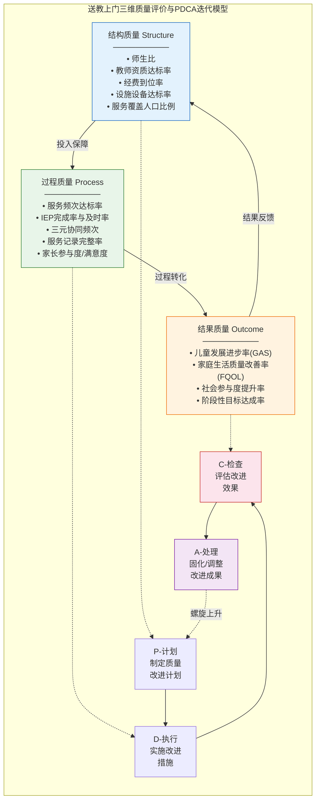

**图7-1 送教上门三维质量评价与PDCA迭代改进模型**

### 7.2.1 结构质量评价

结构质量指向送教上门服务系统的资源配置和组织条件，反映服务的"潜在能力"。结构质量是服务质量的基础前提，回答的是"具备什么样的条件来提供服务"的问题。

**师生比**。送教教师与送教服务对象的比例是衡量服务资源配置合理性的基础指标。基于送教上门服务的特殊性——教师需耗费大量时间用于路途往返和一对一教学，建议送教教师与送教对象的配比标准不低于1:8（即每名全职送教教师服务的重度残疾儿童不超过8名）。对于农村偏远地区，考虑到路途时间成本更高，建议配比标准适度提高至1:5。计算方式为：区域内送教服务对象总数除以区域送教教师（折算为全职人力）总数。达标标准为实际师生比不低于建议标准。

**教师资质达标率**。送教教师具备所要求专业资质的比例。资质包括：具备特殊教育或康复相关专业本科及以上学历、持有特殊教育教师资格证书、完成送教上门专项培训并考核合格。计算方式为：具备规定资质的送教教师人数除以送教教师总人数乘以100%。达标标准为资质达标率不低于90%。

**经费到位率**。送教上门专项经费的实际拨付金额与预算安排金额的比率。送教上门经费应涵盖教师劳务补贴、交通费用、教学材料费、康复器材费、培训费和评估费等。依据"十四五"特殊教育发展提升行动计划，义务教育阶段特殊教育生均公用经费补助标准已于2025年正式提高至每生每年7,000元以上（中国残联，2025）。送教上门学生的生均经费标准应不低于此基准，有条件地区可适当提高。中央财政特殊教育补助资金重点支持中西部地区向重度残疾儿童提供送教上门服务。计算方式为：实际拨付经费总额除以预算安排经费总额乘以100%。达标标准为经费到位率不低于100%，且生均经费不低于7,000元。

**设施设备达标率**。区县级特殊教育资源中心和送教服务所必需的设施设备的配置达标率。设施设备涵盖：送教专用车辆（或交通补贴保障）、便携式评估工具包、移动教学设备（如平板电脑）、辅助沟通装置、基本康复训练器材、远程教学设备等。计算方式为：实际配置达标的设施设备种类数除以应配置的设施设备种类总数乘以100%。达标标准为核心设备配置达标率不低于95%，辅助设备配置达标率不低于80%。

**服务覆盖人口比例**。送教上门服务实际覆盖的重度残疾适龄儿童少年人数与应覆盖人数的比率。应覆盖人数应依据残联和教育部门的联合摸底数据确定，确保"应送尽送、不落一人"。计算方式为：实际接受送教服务的适龄残疾儿童少年人数除以摸底确认需送教服务的适龄残疾儿童少年总人数乘以100%。达标标准为覆盖率不低于98%（考虑到个别家庭主动放弃服务的极端情况）。

### 7.2.2 过程质量评价

过程质量指向送教上门服务的实施过程和交互行为，反映服务的"实际运行"。过程质量是连接结构质量和结果质量的中介环节，回答的是"服务是如何提供的、是否规范和有效"的问题。

**服务频次达标率**。送教教师每月实际提供的送教服务次数与标准规定次数的比率。综合考虑送教服务的高消耗特性，建议标准设定为：每名送教对象每月送教不少于4次（即每周至少1次），每次服务时间不少于90分钟（不含路途时间）。对于偏远地区如每周1次难以保障的，可采用"集中送教+远程辅导"的模式，保证每月累计服务时间不少于360分钟。计算方式为：统计周期内实际服务频次不低于标准频次的送教对象人数除以送教对象总人数乘以100%。达标标准为服务频次达标率不低于90%。

**IEP完成率与及时率**。个别化教育计划（IEP）的制定和实施质量是送教上门过程质量的核心指标。IEP完成率指学期内按照IEP计划完成教学和训练目标的比例。计算方式为：实际完成的IEP目标数除以IEP设定的目标总数乘以100%。达标标准为IEP完成率不低于80%。IEP及时率指在规定时间节点内完成IEP制定、中期评估和期末总结的比例。规定时间节点为：开学后两周内完成IEP制定，学期中完成中期评估和调整，学期末完成期末总结。达标标准为IEP及时率不低于95%。

**三元协同频次**。送教教师、家长（或照护者）和其他相关专业人员（如康复治疗师、心理咨询师、社工）之间的协同沟通和服务衔接频次。三元协同是送教上门区别于普通学校教育的关键特征，体现的是跨专业、跨场景的整合服务理念。建议标准为：每名送教对象的IEP团队（至少包括送教教师和家长，视需要纳入其他专业人员）每月至少进行1次正式的协同沟通（线上或线下），每学期至少进行1次面对面的综合会诊。计算方式为：统计周期内三元协同频次不低于标准的送教对象人数除以送教对象总人数乘以100%。达标标准为三元协同达标率不低于85%。

**服务记录完整率**。送教教师在每次服务后及时、规范地记录服务过程和效果的比例。服务记录应涵盖：服务时间、地点、内容、方法、儿童的参与状态和反应、阶段性目标的达成情况、家长的反馈和建议、下次服务的计划调整等。依托信息化管理平台，可设定服务记录的必填字段和完整性校验规则，实现对记录完整率的自动监测。计算方式为：统计周期内服务记录完整规范的服务次数除以服务总次数乘以100%。达标标准为服务记录完整率不低于95%。

**家长参与度与满意度**。家长在送教上门过程中的参与程度和满意水平是过程质量的重要表征。家长参与度可从以下维度衡量：参与IEP制定和评估的比例、参与送教课堂活动的频次、在送教教师指导下开展居家延伸训练的频次和质量、加入家长培训或支持小组的比例。家长满意度可通过专项问卷调查获取，采用李克特五级量表设计，涵盖送教服务整体满意度、送教教师的专业水平和态度、送教内容的适切性、送教频率和时间安排的合理性、孩子的进步感知、家校沟通的充分性等维度。达标标准为家长总体满意度不低于85分（百分制），且"不满意"和"非常不满意"的比例合计不超过5%。

### 7.2.3 结果质量评价

结果质量指向送教上门服务对服务对象及其家庭所产生的实际影响和效果，反映服务的"最终价值"。结果质量是质量评价的终极判据，回答的是"服务带来了什么改变"的问题。

**儿童发展进步率**。送教对象在认知、运动、沟通、社会交往、生活自理等发展领域的进步程度。鉴于送教服务对象的残疾类型、程度和起点水平差异极大，不宜采用统一的绝对标准进行评价，而应采用基于个体起点的相对进步评价方法。具体而言：依据IEP设定的学期目标和基线评估数据，在学期末采用相同的评估工具进行复测，计算各发展领域的进步量（Effect Size或进步百分比），并综合判定儿童是否在主要发展领域取得了临床和教育意义上显著的进步。计算方式为：学期评估显示在至少2个主要发展领域有显著进步的送教对象人数除以送教对象总人数乘以100%。达标标准为儿童发展进步率不低于75%。

**家庭生活质量改善率**。送教上门服务对送教对象家庭整体生活质量的改善程度。家庭生活质量是衡量送教服务"育人"成效的综合指标，不仅是儿童发展的支持性环境变量，也是送教上门服务的重要目标之一。采用家庭生活质量量表（Family Quality of Life Scale, FQoL）进行前后测评估，评估维度涵盖：家庭互动质量、养育效能、身体健康与安全、物质生活保障、社区参与与支持等。计算方式为：学期末FQoL总分较学期初有显著提升（p<.05或提高一个以上标准差）的家庭数量除以送教对象家庭总数量乘以100%。达标标准为家庭生活质量改善率不低于60%。

**社会参与度提升率**。送教对象参与家庭活动、社区活动和社会生活的能力和程度的改善。社会参与度是衡量送教服务促进残疾儿童回归家庭和社区的重要指标。评价指标可包括：参与家庭日常生活的频率和范围、走出家门的频率、参与社区融合活动的次数、与家庭以外人员的社会互动频率和质量等。计算方式为：学期末社会参与核心指标较学期初有显著改善的送教对象人数除以送教对象总人数乘以100%。达标标准为社会参与度提升率不低于50%。

**阶段性目标达成率**。送教对象IEP中设定的阶段性教育康复目标的实际达成程度。采用目标达成量表（Goal Attainment Scaling, GAS）进行个体化目标达成评价。GAS方法允许为每个儿童设定个性化的、具体可测量的行为目标，并在统一量尺上评估达成程度（-2至+2分制，或转化为T分数），使得不同儿童的达成程度具有可比性。计算方式为：GAS T分数达到50分及以上的送教对象人数除以送教对象总人数乘以100%（T分数50分表示达成了期望水平）。达标标准为阶段性目标达成率不低于70%。

### 7.2.4 评价工具组合与应用

评价工具的选择直接关系到评价结果的科学性、可靠性和可比性。本研究推荐以下标准化评价工具组合，各工具在评价维度上形成互补，共同构成完整的送教上门服务质量评价工具体系。

**目标达成量表（Goal Attainment Scaling, GAS）**。GAS由Kiresuk和Sherman于1968年开发，是一种个体化的目标设定和达成度评价方法，特别适用于服务对象的异质性极高的领域。在送教上门质量评价中，GAS定位于IEP目标的达成评估。操作流程为：第一步，在学期初的IEP制定过程中，由送教教师、家长和相关专业人员共同为每名送教对象设定3—5个具体、可测量、有时限的个性化目标；第二步，为每个目标设定从"远低于预期"（-2）到"远高于预期"（+2）的五级达成量表，并明确每一级别的操作性定义；第三步，在学期末依据前后评估数据，对每个目标的达成级别进行评定，计算GAS T分数。GAS的优势在于能够充分尊重个体差异，避免"一刀切"的统一标准带来的评价扭曲；其关键挑战在于目标设定的质量控制和评分的一致性。

**加拿大作业表现量表（Canadian Occupational Performance Measure, COPM）**。COPM由Law等于1990年开发，是一种以服务对象为中心的功能性评价工具。在送教上门场景中，COPM用于评估送教对象（及其家长）所关注的重要日常生活活动的表现水平和满意度。COPM采用半结构化访谈的形式，由评估者引导送教对象家长识别儿童在日常自理、功能活动和休闲活动中的困难和期望改进的领域，并对每项活动的当前表现和满意度进行评分（1—10分）。COPM在学期初和学期末分别施测，通过前后表现评分和满意度评分的变化来判断送教服务的有效性。COPM的优势在于将服务对象（及其家庭）的主观体验和期望置于评价的核心位置，体现了以人为本的服务理念。

**国际功能、残疾和健康分类儿童青少年版（ICF-CY）**。ICF-CY由世界卫生组织于2007年发布，是描述儿童青少年功能和健康状况的国际通用分类框架。ICF-CY从身体功能与结构、活动和参与、环境因素三个维度，对儿童的功能状态进行系统化描述和编码。在送教上门质量评价中，ICF-CY定位于送教对象功能状态的系统性评估和纵向追踪。具体应用方式为：依据ICF-CY的核心组套（Core Sets）选择与送教场景最为相关的分类项目，对每名送教对象的功能状态进行标准化描述和限值评定，形成儿童功能画像。通过学期前后的ICF-CY评定变化，判断送教服务对儿童功能和参与的多维度影响。ICF-CY的优势在于其国际通用性和跨学科共享性，有利于多专业团队的协同评估和信息交换。

**家庭生活质量量表（Family Quality of Life Scale, FQoL Scale）**。FQoL Scale由美国Beach Center on Disability开发，后经多个国家修订和本土化，用于评估残疾儿童家庭的生活质量水平。在送教上门场景中，FQoL Scale定位于评价送教服务对家庭系统的整体影响。量表通常涵盖家庭互动、养育效能、情感健康、身体健康与安全、物质生活保障和社区参与与支持等多个维度。量表由送教对象的家长或主要照护者填写，在学期初和学期末分别施测，通过维度分数和总分的前后变化判断送教服务对家庭生活质量的改善效果。FQoL Scale的应用有助于将送教服务的评价视野从"儿童个体"拓展至"家庭系统"，体现送教上门育人的全面性。

**SERVQUAL服务质量评价模型**。SERVQUAL由Parasuraman、Zeithaml和Berry于1988年提出，是服务质量管理领域的经典评价模型。该模型从可靠性（Reliability）、响应性（Responsiveness）、保证性（Assurance）、移情性（Empathy）和可感知性（Tangibles）五个维度，测量顾客对服务质量的期望值与实际感受值之间的差距。在送教上门场景中，SERVQUAL模型经过场景化改造后可用于评价送教服务的整体质量和家长满意度。具体操作方式为：设计送教上门SERVQUAL问卷，将五个维度转化为送教服务的具体评价题项（如"送教教师按约定时间准时到达"对应可靠性维度，"送教教师能够根据孩子的状态灵活调整教学内容"对应响应性维度），由家长分别评价"期望的服务水平"和"实际感受到的服务水平"，计算服务质量差距分数。SERVQUAL的优势在于能够识别服务质量改进的优先领域，当某个维度的差距分数显著偏低时，即意味着需要重点关注和改进的方向。

**评价工具的组合使用原则**。上述五种工具各有侧重，组合使用时遵循以下原则：其一，互补原则，不同工具覆盖评价的不同维度和视角，GAS和ICF-CY侧重儿童发展结果，COPM侧重服务对象的主观体验，FQoL Scale侧重家庭系统的变化，SERVQUAL侧重服务过程质量的感知，形成"个体客观+个体主观+家庭系统+过程感知"的完整评价链；其二，匹配原则，根据送教对象的特点（如年龄、障碍类型和程度）选择和调整适用工具，不强求所有工具对每个对象的普适使用；其三，简效原则，在保证科学性的前提下，控制评价工具的总施测时间和操作复杂度，减轻送教教师和送教对象家庭的评估负担；其四，标准化原则，所有工具的使用需经过统一的培训和质量控制，确保评估数据的信度和效度。

### 7.2.5 基于PDCA循环的迭代改进机制

三维质量评价不仅是对送教服务质量的"测量"和"判断"，更是推动标准体系和送教实践持续改进的"引擎"。本研究引入质量管理领域的PDCA循环（计划—执行—检查—处理，Plan—Do—Check—Act），构建送教上门服务质量的迭代改进机制，实现从"评价质量"到"改进质量"的闭环管理。

**计划阶段（Plan）**。依据上一周期的质量评价结果和年度送教服务质量报告，识别当前送教服务中存在的优先改进领域和关键质量问题。基于数据分析，诊断问题产生的原因，制定针对性的质量改进计划。质量改进计划应包含：明确的改进目标（SMART原则）、具体的工作任务和责任人、预期的时间节点和里程碑、所需的资源支持、预期的效果指标和验证方法。区县层面的质量改进计划应报省级特殊教育指导中心备案，重点问题和区域性共性问题由省级层面统筹制定改进方案。

**执行阶段（Do）**。按照质量改进计划组织实施改进措施。执行过程中应注重以下几个方面：一是充分动员和培训，确保所有参与人员理解改进的目标和方法；二是过程跟踪和记录，通过信息化平台实时记录改进措施的推进情况和阶段性效果；三是跨部门协同，对于需要多部门配合的改进措施，建立协调工作机制；四是试点先行的策略，对于涉及面较广、不确定性较高的改进措施，可在小范围内先期试点，验证效果后推广。

**检查阶段（Check）**。对质量改进措施的实施效果进行评估和验证。检查的内容包括：改进计划是否按方案要求落实到位，各项改进措施是否产生了预期的效果，改进过程中是否出现了新的问题或意料之外的副作用。检查的方法包括：定量指标的对比分析（改进前后的质量指标变化）、过程数据的审查（改进措施的落实率）、利益相关者的调查反馈（送教教师和家长的体验和评价）、典型案例的深入剖析（改进前后的个案对比）。检查结果应形成专题评价报告，明确指出哪些改进措施有效、哪些效果不彰、哪些需要调整。

**处理阶段（Act）**。基于检查阶段的分析结果，对质量改进的效果进行制度化处理。对于经过验证确实有效的改进措施，将其制度化、规范化，纳入修订后的送教上门服务标准或操作规程，使其成为新的"常态化"实践标准；对于效果不佳或出现问题的改进措施，分析原因，总结经验教训，重新进入下一个PDCA循环的规划阶段，调整改进策略；对于改进过程中发现的系统性问题，提交至省级特殊教育指导中心和标准修订工作组，作为标准体系整体优化的参考依据。

PDCA循环在送教上门服务质量改进中的运作并非一次性事件，而是螺旋上升、持续推进的过程。每个循环周期的末端——经过"处理"阶段固化的改进成果——又构成下一个循环周期启动时的更高起点。通过多个PDCA循环的叠加和累积效应，送教服务标准体系和质量水平将在持续迭代中不断提升。

**PDCA循环的运作周期**。建议将PDCA循环与送教服务的学期周期和学年周期进行节奏耦合。具体而言：以学期作为PDCA单次循环的基本周期，每学期初制定本期质量改进计划（P），学期中执行改进措施（D），学期末进行质量检查（C）和改进成果固化（A），形成"学期式"快速迭代；以学年作为PDCA完整循环的中周期，学年末进行全面的质量评价和标准体系修订，形成"学年式"深度迭代；以3—5年的标准修订周期作为PDCA循环的长周期，对标准体系进行结构性、全局性的审视和优化，形成"周期式"战略迭代。短—中—长三个周期相互嵌套、协同运转，确保送教服务质量改进既具有日常的敏捷响应能力，也具有中长期的战略纵深。

### 7.2.4 评价工具的系统整合与应用

三维质量评价框架的有效运行，离不开科学、可靠、可操作的评价工具作为技术支撑。送教上门服务效果的评价面临两大特殊困难：其一，重度残疾儿童的进步往往极其缓慢，以年为单位衡量的微小变化难以被常规标准化测验所捕捉；其二，不同服务对象的起点、需求和目标截然不同，统一的评价指标无法公平地反映每个儿童的个体发展轨迹。因此，送教上门需要一套兼顾标准化与个性化、涵盖量化与质性、覆盖儿童与家庭的多层次评价工具组合。

**（一）目标达成量表（Goal Attainment Scaling, GAS）**

GAS由Kiresuk和Sherman于1968年首次提出，是一种针对个体设定个性化目标并追踪目标达成程度的评价方法，被世界卫生组织推荐用于康复和特殊教育领域的成效评价。GAS的操作流程包括四个步骤：第一，在服务起始阶段，由送教教师、家长和其他相关人员共同为服务对象设定3—5个具有临床/教育意义的个性化目标，每个目标覆盖送教服务的核心领域（如认知发展、生活自理、沟通能力、社会参与等）；第二，对每个目标定义五个达成等级：远低于预期（-2）、略低于预期（-1）、达到预期（0）、略高于预期（+1）、远高于预期（+2），每个等级都需用可观察的具体行为或表现进行描述；第三，在一个评价周期（通常为一个学期或学年）结束后，由评价者根据实际表现对照预设等级进行评分；第四，将各目标的达成分数转换为标准化的T分数（均值为50，标准差为10），实现不同个体之间评价结果的可比性。

GAS对送教上门评价的特殊价值在于：它完美地解决了"标准化评价"与"个性化目标"之间的固有矛盾——目标是完全个性化的（每个儿童的目标不同），但评价的计量框架是标准化的（统一的五个等级和T分数转换）。例如，对于重度智力残疾儿童A，GAS目标可能是"能够在提示下独立使用勺子进食"（-2：完全依赖他人喂食，+2：能够独立使用筷子进食）；对于脑瘫儿童B，GAS目标可能是"能够在辅助下完成从床到轮椅的转移"；对于孤独症儿童C，GAS目标可能是"能够与送教教师进行5秒以上的目光接触"。三个儿童的目标完全不同，但都可以通过GAS框架进行标准化评价和跨个案比较。这种"个性化的标准化"特征，使GAS成为送教上门结果质量评价的理想工具。

**（二）加拿大作业表现量表（Canadian Occupational Performance Measure, COPM）**

COPM由Law等于1990年开发，是一种以服务对象（或其主要照料者）自我报告为核心的功能表现评价工具。其核心理念是：服务对象自己最了解日常生活中哪些功能领域存在问题，哪些改善对其生活质量最为重要。COPM采用半结构化访谈的方式，引导服务对象（在送教上门情境中通常由家长代理）识别其在自理活动（如进食、穿衣、如厕）、生产性活动（如学习、游戏）和休闲活动（如社交、娱乐）三大领域中存在的具体困难，然后对每项困难的重要性（1—10分）、当前表现水平（1—10分）和表现满意度（1—10分）进行评分。服务周期结束后，再次评分以评估变化。

COPM对送教上门评价的价值体现在两个层面。在个体层面，COPM将家长的评价视角系统整合进质量评价框架，直接对应三元履职模型中"家长协同"的维度——家长不只是评价的被动对象，而是服务效果的主动判断者。在系统层面，COPM为"赋权"和"家庭中心"理念提供了可量化的工具支撑：家长的满意度分数和表现改善分数的变化，本身就是送教服务质量的核心指标。国际研究表明，COPM在残疾儿童康复和教育领域具有良好的信效度，适用于多种文化背景。

**（三）国际功能、残疾和健康分类（儿童青少年版）（ICF-CY）**

世界卫生组织于2007年发布的ICF-CY（International Classification of Functioning, Disability and Health: Children & Youth Version）为送教上门提供了一个标准化的"功能语言"体系。ICF-CY不是一种评价量表，而是一个多维度的分类框架，将个体的功能和健康状况从身体功能与结构（b）、活动与参与（d）、环境因素（e）和个人因素四个维度进行编码和描述。在送教上门评价中，ICF-CY的作用是提供统一的概念基础：不同地区、不同教师对"送教对象的功能水平"的描述可以在ICF-CY框架下统一编码，使跨个案、跨区域的比较和汇总分析成为可能。ICF-CY的环境因素维度（e编码）尤其适用于送教上门——它将家庭物理环境（e155：私人建筑物的设计、建造及建筑产品和科技）、家庭支持关系（e310：直系亲属家庭；e315：大家庭家庭）、社会态度（e460：社会的态度）等环境变量系统纳入功能评价，直接支撑了三元模型中对家庭场域的关注。

**（四）家庭生活质量量表（Family Quality of Life Scale, FQOL）**

送教上门的效果评价不能仅关注儿童个体的发展，还须将家庭整体功能的改善纳入视野——正如本研究第六章所论证的，家庭场域是送教上门服务的核心支撑系统。FQOL量表由Beach Center on Disability开发，从家庭互动、养育方式、情感健康、物质福利和残疾相关性支持五个维度评价残疾儿童家庭的生活质量。FQOL已由多国研究者进行了跨文化验证，中文版在中国特殊儿童家庭中表现出可接受的信效度（胡晓毅等，2012）。在送教上门评价中，FQOL的引入将"家庭生活质量改善率"（见前文结果质量指标）从口号转化为可操作的量化指标，并且通过不同时间点的重复测量，可以追踪送教服务对家庭功能的长期影响。

**（五）SERVQUAL服务质量评价模型**

SERVQUAL模型由Parasuraman等（1988）提出，通过测量服务接受者的期望服务质量与感知服务质量之间的差距（服务质量差距模型）来评价服务品质。SERVQUAL包含五个维度：有形性（服务设施和人员的物理特征）、可靠性（准确可靠地履行服务承诺的能力）、响应性（帮助服务对象的意愿和及时性）、保证性（服务人员的知识和礼貌及其赢得信任的能力）和移情性（对服务对象的关怀和个性化关注）。在送教上门评价中，SERVQUAL特别适用于过程质量的评价——通过家长问卷测量家长对送教服务的期望值与实际感受值之间的差距，可以精确识别服务短板。中国学者已尝试将SERVQUAL模型应用于特殊教育服务质量评价，证明其在中国语境中具有适用性。

**（六）评价工具的组合应用策略**

上述五种工具各有侧重、互为补充，不宜孤立使用，而应按评价维度和评价目的进行系统整合。建议的组合方案如下：

```
送教上门综合评价工具组合
├── 结构质量评价
│   ├── 行政统计数据（师生比、经费到位率等）
│   └── 教师档案审查（资质达标率）
├── 过程质量评价
│   ├── 送教记录标准化表单（频次、时长、内容）
│   ├── SERVQUAL问卷（家长版/教师版，服务质量差距）
│   └── IEP完成率审查
├── 结果质量评价
│   ├── 儿童发展：GAS目标达成量表（个性化）+ ICF-CY功能分类（标准化编码）
│   ├── 家庭生活：Family QoL Scale（家庭层面）
│   └── 社会参与：自编社会参与度评估量表
└── 数据采集方式
    ├── 量化数据：信息化平台自动采集（频次、时长、出勤率等）
    └── 质性数据：人工采集（发展案例、满意度访谈、教学叙事等）
```

工具组合应用应遵循三个原则：第一，**适度性原则**，评价工具的选取应考虑应用场景的实际条件和基层的执行负担，优先采用短版量表和核心条目，防止"评价过载"；第二，**参与性原则**，评价过程应吸纳送教教师、家长和服务对象的多元视角，评价结果应向所有利益相关方反馈，形成"评价—反馈—改进"的闭环；第三，**发展性原则**，评价的根本目的是促进服务改进和服务对象的发展，评价结果不应被用作简单的排名、奖惩或问责工具，而应转化为个别化教育方案的调整依据和教师专业发展的支持资源。

---

## 7.3 综合保障体系

送教上门标准的有效实施和质量评价的持续推进，离不开系统化的综合保障体系。本研究从政策保障、师资保障、资源保障和监督保障四个维度构建送教上门标准的综合保障框架，并针对标准实施过程中可能面临的伦理隐私、数字鸿沟、财政可持续性和标准异化四类风险提出应对策略。

### 7.3.1 政策保障

**纳入地方基本公共服务实施标准**。将送教上门服务明确纳入各省（自治区、直辖市）基本公共服务实施标准体系，作为基本公共教育服务的组成部分。依据《国家基本公共服务标准（2021年版）》和习近平总书记关于"基本公共服务要实现均等化"的重要指示，将重度残疾儿童少年送教上门服务确立为地方政府的法定基本公共服务责任，明确服务对象、服务内容、服务标准和经费保障的刚性要求。建议在地方基本公共服务标准中明确以下条款：送教上门服务的法定义务主体为区县级人民政府，服务对象为经评估确需提供送教上门的6—15岁（条件允许可延伸至学龄前和高中阶段）重度残疾儿童少年，服务内容包括教育教学、康复训练和生活适应能力培养，最低服务标准为每月不少于4次、每次不少于90分钟，经费来源为中央和地方财政共同保障。

**设立专项经费保障机制**。建立中央、省、市、县四级财政分级负担的送教上门专项经费保障机制。中央财政通过特殊教育专项补助资金对中西部地区和欠发达地区给予倾斜支持，省级财政承担统筹协调和兜底保障职责，市县级财政负责本地区送教上门经费的预算安排和规范使用。专项经费应实行独立科目核算和专款专用，纳入预算绩效管理。经费标准方面，送教上门残疾学生生均公用经费标准不低于现行特殊教育学校生均公用经费标准，2025年起全国统一标准为每生每年不低于7,000元，有条件的地方可适当提高。经费使用范围应明确涵盖：送教教师交通补贴和劳务报酬、教学和康复耗材、评估工具和服务记录设备、教师培训和专业发展、送教对象辅具适配等。建立经费使用的透明化管理和年度审计制度，确保每一笔经费的可追溯和可问责。

**纳入政府履职考核体系**。将送教上门标准化建设的推进情况和送教服务质量评价结果纳入地方政府教育履职考核和政绩评价体系。在省级政府教育履职评价指标中，增设送教上门服务覆盖率和质量达标率作为考核指标，赋予适当权重。对标准实施成效突出的地区和单位给予表彰和奖励，对推进不力和弄虚作假的予以通报批评和问责。建立送教上门服务质量与教育资源（包括经费、编制、项目等）配置的联动机制，形成"高质量—多资源"的正向激励循环，引导各级政府和相关主体将资源和精力投入到质量改进和标准落实上。

### 7.3.2 师资保障

**师范院校增设送教上门课程模块**。推动师范院校的特殊教育专业（或融合教育方向）增设送教上门相关课程和实践教学模块。课程设置应涵盖：送教上门服务的理论基础与政策法规、重度残疾儿童的身心特点与教育需求、居家环境中教育教学和康复训练的方法与技术、个别化教育计划的制定与实施、家校合作与家长指导实务、辅助技术与远程教育的应用等。建议本科阶段将送教上门模块纳入"个别化教育""特殊教育课程与教学"等核心课程的实践环节，研究生阶段可设置"送教上门理论与实践"专题研讨课程。通过师范教育阶段的系统培养，使未来的送教教师具备必要的专业素养和实践能力。同时，探索在特殊教育免费师范生培养计划中设立送教上门专项名额，吸引和鼓励优秀人才从事送教上门工作。

**建设职后培训体系**。建立送教教师职后培训的常态化、体系化机制。按照"全员培训、分层提升、学分管理"的原则，构建送教教师"入职培训—岗位培训—骨干研修—名师培养"四阶递进的培训体系：入职培训以掌握送教上门的基本规范、核心技能和伦理要求为目标，培训学时不少于120学时；岗位培训以更新知识、提升技能和解决实践问题为目标，每年培训学时不少于72学时；骨干研修以培养专业带头人和区域指导者为目标，通过专题研讨、课题研究和跨区域交流等方式提升专业引领能力；名师培养以培育具有全国影响力的送教专家为目标，通过高端研修、国际交流和学术讲习等方式培育理论素养和实践创新能力。培训可采取集中面授、在线学习、校本教研、跟岗研修和实践督导等多种形式，充分运用信息化手段拓展培训的覆盖面和灵活性。

**保障送教教师待遇和职业发展**。建立与送教上门工作的特殊性和艰苦性相匹配的待遇保障和职业发展机制。在薪酬待遇方面，送教教师在享受普通特殊教育学校教师工资福利待遇的基础上，应设立送教上门专项岗位津贴，标准可参照山区学校或农村边远地区教师津贴水平；保障送教教师的交通补贴，对使用私家车送教的教师提供必要的车辆运行补贴；送教教师在节假日和恶劣天气条件下因工作需要出行的，应给予额外的劳动保护和生活关怀。在职称评定方面，将送教上门服务的工作量和实际成效纳入教师职称评审的业绩考量范围，畅通送教教师的职称晋升通道；对于长期从事送教上门工作表现突出的教师，在评先评优和专业晋级中给予适当倾斜。在职业健康方面，关注送教教师的心理健康和职业倦怠问题，建立定期的心理健康普查和团体辅导制度，提供心理咨询支持服务，营造关心关爱送教教师的组织文化氛围。

### 7.3.3 资源保障

**建设县级特殊教育资源中心**。按照《第二期特殊教育提升计划（2017—2020年）》和《"十四五"特殊教育发展提升行动计划》的要求，在每县（市、区）建设并运行好一所特殊教育资源中心，将送教上门服务的管理、指导和支持纳入资源中心的核心职能。县级资源中心在送教上门方面的功能和职责应包括：协调统筹本区县送教上门服务的规划、组织和调度；开展送教服务对象的评估鉴定和IEP审核指导；为送教教师提供专业指导和咨询支持；管理送教上门教学资源、康复器材和辅助设备的储备和流转；组织送教教师培训和教研活动；开展送教服务质量的监测和数据报送。资源中心应配备至少2—3名具备特殊教育专业背景的专职人员和若干名巡回指导教师，具备必要的办公场所、评估室、培训室和资源共享空间，并与本区县特殊教育学校、普通学校资源教室形成功能互补的联动关系。

**建设信息化管理平台**。开发和运维省级统一的送教上门信息化管理平台（在7.1.2节已有详细阐述），并持续进行功能迭代和体验优化。在资源保障层面的重点工作包括：确保平台的软硬件基础设施投入和技术运维经费的可持续性，避免因经费断档导致平台停摆；保障平台数据的安全存储和容灾备份，建立数据安全等级保护制度；推进平台的移动化、轻量化和无障碍化设计，确保偏远地区教师和家长能够通过手机等移动终端便捷使用；推动平台与全国特殊教育信息管理系统、省级教育大数据平台和残联信息系统的数据互联互通，消除"信息孤岛"。

**配置标准化送教工具包**。为每名（组）送教教师配备标准化的送教上门教学和康复工具包，降低送教教师自行准备教学材料的门槛和负担，同时保证送教服务内容和质量的基本统一。工具包内容建议包括：基础教学类（便携式白板或磁性教学板、常用教具和学具、基本文具和手工材料、数字学习终端等），评估记录类（便携式评估量表和记录用表、照相机或录音设备、便携打印机等），康复训练类（大肌肉和小肌肉训练器材、感知觉刺激材料、平衡和协调训练用具等），辅助沟通类（图片交换沟通系统卡片、基础辅助沟通应用软件等），安全防护类（随身急救包、手消毒用品、简易防护用品等）。工具包应定期补充和更新，并根据不同送教对象的特殊需求进行个性化调整。

### 7.3.4 监督保障

**引入第三方评估机制**。建立送教上门服务质量的独立第三方评估制度，委托高等院校、科研院所或专业社会机构作为评估主体，对送教上门标准的实施情况和送教服务质量开展定期的第三方评估。第三方评估的核心功能包括：一是客观性保障，避免政府部门"既当运动员又当裁判员"的利益冲突，增强评估结果的公信力；二是专业性保障，依托评估机构的学术研究和方法学专长，提升评估工作的科学性和严谨性；三是外部视角提供，从独立于实施系统之外的立场，识别服务体系中政府自查不易发现的盲点和问题。第三方评估可采取每两年一次的频率，评估结果向社会公开发布，接受舆论和公众监督。同时，建立第三方评估机构的质量准入和退出机制，确保评估机构的资质和独立性。

**建立年度质量报告制度**。依据7.1.3节提出的年度质量报告制度，在省、市、县三级分别编制和发布送教上门服务质量年度报告。年度报告既是质量监督的工具，也是公共服务透明性的体现。报告应采用规范化、标准化的体例和指标框架，确保跨年度和跨区域的可比性。报告发布后，教育行政部门应及时回应报告中反映的问题和公众关切，制定整改措施并向社会公开整改结果。

**畅通家长投诉和监督渠道**。建立健全送教上门服务的家长投诉和监督机制，保障家长作为送教服务直接利益相关方的知情权、参与权和监督权。具体措施包括：设立送教上门服务家长热线电话和在线投诉平台，确保投诉渠道的便捷性和可及性；建立投诉处理的"接诉即办"机制，设定投诉受理、调查、处理和反馈的标准时限（如一般投诉5个工作日内办结、复杂投诉15个工作日内办结）；建立投诉案例的定期汇总分析和通报制度，将投诉反映的共性问题和典型案例作为服务改进的重要参考；引入家长代表参与送教服务质量的监督评议活动，在年度质量评价中纳入家长满意度调查和焦点小组访谈等质性反馈方式。

### 7.3.5 风险应对

#### 7.3.5.1 伦理与隐私风险

送教上门服务涉及教师进入残疾儿童家庭的私人空间开展教育教学活动，这一特殊的服务场景使得伦理和隐私风险更加突出。

**入户伦理守则**。制定和推行《送教上门服务入户伦理守则》，对送教教师进入家庭场景的行为规范和伦理边界作出明确规定。守则内容应涵盖：尊重家庭成员的隐私和尊严，未经允许不得查阅、拍摄或外传家庭的私人信息和物品；维护服务过程中的专业边界，避免与家庭成员产生超越职业关系的私人交往或利益往来；尊重家庭的文化习俗和生活方式，不将自己的价值观强加于服务家庭；在服务过程中如发现家庭存在虐待、忽视或其他危害儿童安全的情况，应依照法定程序报告，同时注意保护儿童的合法权益；送教教师应保持专业的着装、言行和态度，体现教育工作者和康复专业人员的职业形象。入户伦理守则应作为送教教师入职培训和年度培训的必修内容，并通过伦理宣誓、案例研讨和伦理督导等方式强化实践中的落实。

**数据隐私保护**。送教上门服务全程产生的个人数据（包括儿童的残疾信息、评估数据、家庭住址和成员信息、影像资料等）属于个人敏感信息，必须受到严格的隐私保护。具体要求包括：遵循《中华人民共和国个人信息保护法》的相关规定，对送教服务对象个人信息的采集、存储、使用和共享进行全生命周期的隐私合规管理；建立信息分级管理和访问控制机制，限定不同岗位人员对所接触送教服务对象信息的范围和权限；对送教服务信息管理平台实施等级保护（建议不低于等保三级），采取加密传输、加密存储、操作审计等技术手段保障数据安全；涉及送教对象的面部图像和视频资料的采集、存储和传播必须取得监护人的书面知情同意，并严格限定使用范围；在学术研究、案例报告和媒体报道中使用送教服务案例信息时，必须进行充分的数据脱敏处理，消除可识别个人身份的标识信息。建立数据隐私泄露事件的应急响应预案和追责机制。

#### 7.3.5.2 数字鸿沟风险

随着信息化管理平台、远程送教和数字教学资源在送教上门服务中的广泛应用，不同地区和不同家庭之间的数字鸿沟问题可能成为影响服务公平性和质量的新风险来源。

**最低硬件保障**。对于经济困难家庭和农村偏远地区家庭，应提供送教所需的基本数字化硬件设备的最低标准保障。保障方式可包括：由县级特殊教育资源中心统一采购移动学习终端（如平板电脑）、通信设备和网络接入设备，以租借或配发的方式提供给有需要的送教对象家庭；由地方政府协调通信运营商，为困难家庭提供优惠或免费的移动数据套餐，或争取将送教对象家庭纳入"宽带乡村""网络扶贫"等政策的覆盖范围；推进送教管理平台的离线功能开发，确保在网络条件不稳定地区，教师和家长仍可在离线状态下完成教学互动，并在恢复网络连接后自动同步数据。

**数字无障碍设计**。送教对象涵盖不同残疾类型和程度的儿童，部分儿童可能在使用数字化设备时面临特殊的障碍。信息化平台和教学资源的设计、开发和采购应遵循数字无障碍（Digital Accessibility）原则，参照《Web内容无障碍指南》（WCAG 2.1）和我国《信息技术 互联网内容无障碍可访问性技术要求与测试方法》等标准，确保平台的感知性、可操作性、可理解性和鲁棒性。无障碍措施可包括：为视障儿童提供屏幕阅读器兼容和语音交互功能，为听障儿童提供字幕和视觉提示支持，为智力障碍和肢体障碍儿童提供简化的用户界面和替代输入方式，为认知能力较低的儿童提供图式化和多媒体化的非文字信息表达方式等。

#### 7.3.5.3 财政可持续性风险

送教上门服务的持续运行需要稳定和充足的财政资源保障。然而，受经济周期波动、地方财政能力和政策优先序变动等因素影响，送教上门经费可能存在可持续性风险。

**差异化达标策略**。承认和尊重不同地区经济发展水平和财政能力的客观差异，在标准实施中实行差异化的达标策略。具体而言：对于东部经济发达地区，可以设定较高的标准指标值（如生均经费上浮标准、教师配比提高标准、设施设备配置升级标准等），鼓励其在实现"保基本"的基础上追求"高质量"；对于中部地区，按照标准体系的基本要求执行，确保服务质量的全面达标；对于西部欠发达地区和贫困地区，允许在标准达成的时限上给予适当延长（如将全面达标时间由第6年延长至第8年），在经费保障方面加大中央财政的转移支付力度，同时对"软指标"（如教师培训、标准认知、制度建设等）坚持统一要求，避免出现"低水平均衡"陷阱。差异化策略的精髓在于"标准不降、路径不同、节奏有异"，以时间换空间，最终实现全国范围内的基本服务均等化。

**中央转移支付保障**。对于财政困难的中西部地区、革命老区、民族地区、边疆地区和贫困地区，中央财政应通过特殊教育专项补助资金、地方转移支付等渠道加大送教上门经费的支持力度，确保这些地区送教上门服务"有人送、有钱送、送得好"。建议在中央财政的特殊教育专项经费中，设立送教上门专项补助子项目，采用因素法（考虑送教对象数量、地方人均财力、地理交通条件等因素）进行科学测算和公平分配。同时，探索建立送教上门经费的"兜底"机制：对于经科学测算后地方财力确实无法完全承担的送教经费缺口，由省级和中央财政按一定比例予以兜底补齐。

#### 7.3.5.4 标准异化风险

标准异化风险指的是标准在实施过程中偏离其设计初衷，出现"唯指标论""填表主义""一刀切"等形式主义和教条主义倾向，使标准从服务于质量提升的"工具"异化为阻碍质量提升的"枷锁"。

**标准异化的主要表现**。送教上门标准实施中的异化现象可能表现为以下几种形式：其一，量化指标刚性化，将标准中设定的各项数据指标（如服务频次、记录完整率、培训学时等）当作硬性考核任务，忽视指标背后的质量内涵，出现了"凑数"而忽视教学实效的现象，例如送教教师为满足"每月4次"的频次要求而频繁安排短时间的"过场式"送教；其二，过程记录过度化，将服务记录从质量保障手段异化为教师负担来源，教师花费大量时间在填写表格、拍摄照片和录入系统上，挤占了本应投入教学和与儿童互动的核心工作时间；其三，标准化操作的教条化，将标准中推荐的教学方法和流程当作不可变通的教条，忽视了送教场景中儿童状态、家庭环境和教师专业判断的动态性和复杂性；其四，评价工具使用功利化，将质量评价简化为"填量表"和"报数据"的工作，忽视了对评价结果的深入分析和教学改进的实质应用。

**标准异化预警机制**。建立标准异化风险的早期预警和纠偏机制。预警信号可包括：送教服务过程记录的完备率异常偏高而儿童发展进步率没有相应提升（"记录达标而效果不达标"的表征模式）、送教教师反应行政事务性工作时间占比持续上升、各类质量检查评比活动的频次密度超出了教师和基层可承受的范围、送教人员和基层管理人员普遍反映"为了应付标准而送教"的倦怠感等。当预警信号出现时，省级特殊教育指导中心应及时开展专项调研，分析标准异化的具体表现形式和深层原因，制定纠偏措施。

**质性评价与量化评价的平衡**。防止标准异化的根本之道在于坚持质性评价与量化评价的平衡。量化指标是必要的，它提供了可测量、可比较、可追踪的质量管理基础；但量化指标的局限也是明显的——它难以完全捕捉送教服务中的人本关怀、专业智慧、情感投入和创造性实践等"质"的维度。因此，在送教服务质量评价中，应始终为质性评价保留充分空间：鼓励送教教师撰写教学叙事和个案反思，组织送教案例的深度研讨和同行评议，开展基于课堂（居家）观察的专业督导评价，收录家长的质性反馈和生命故事分享。通过定量与定性评价的协同互补，使标准始终作为"提升质量的助手"而非"束缚教育的绳索"。

## 7.4 典型地区试点案例分析

标准体系的构建和实施必须根植于中国特殊教育送教上门的现实土壤之中。本节选取三个具有不同特征的典型地区送教上门实践案例，分析其经验做法和存在问题，为本研究提出的标准体系提供实践参照和优化启示。

### 7.4.1 北京海淀区送教上门标准化实践

北京市海淀区是我国特殊教育事业的先行区和示范区，其送教上门工作的标准化实践走在全国前列，具有较强的示范和借鉴意义。

**实践背景**。海淀区作为首都功能核心区的重要组成部分，辖区内既有高校和科研院所云集的科教资源优势，也存在城市低收入社区和外来务工人员聚居区的特殊教育服务需求。海淀区特殊教育指导中心（挂靠海淀区特殊教育研究与指导中心）自2012年起系统开展送教上门工作，经过十余年的探索和积累，逐步形成了较为成熟的送教上门标准化运行体系。

**标准化主要做法**。一是建立了完善的送教对象评估与准入标准。由区特殊教育指导中心组建评估专家组，采用标准化评估工具（包括《韦氏儿童智力量表》《儿童适应性行为量表》《Gesell发展诊断量表》等）对申请送教的儿童进行综合评估，依据评估结果确定是否纳入送教服务范围、服务类型和频次等级，确保送教资源的精准配置和"应送尽送"。二是形成了个别化教育计划的标准化制定与审核流程。每位送教对象的IEP须经过"评估诊断—目标拟定—集体研讨—家长确认—中心审核"五个环节，确保IEP的科学性和个性化；区指导中心每学期对在运行的IEP进行不少于20%的抽查审核，对发现的问题进行指导和纠正。三是建立了送教教师培训与考核的标准化体系。每年组织不少于两次送教教师专项培训，培训结束进行理论与实操考核，考核合格方可继续承担送教任务；建立送教教师"师徒制"，由资深送教教师带教新教师。四是实施了送教服务过程的标准化管理。制定《海淀区送教上门工作手册》，对送教准备、课堂实施、课后反馈、家校沟通和档案记录等各环节作出明确规范；推行"送教任务单"制度，每次送教后由教师和家长双向签名确认。

**主要成效与不足**。成效方面，海淀区送教上门服务覆盖率接近100%，送教教师资质达标率超过95%，家长满意度多年保持在90%以上，送教对象的IEP目标达成率平均在75%以上。不足方面，由于海淀区送教对象分布范围广、城市通勤压力大，送教教师路途时间占比仍然较高（部分教师路途时间占工作总时间的40%以上），影响了有效送教时间的保障；标准化管理在一定程度上增加了教师的文档记录负担，教师对过多的表格填写和材料报送存在一定的倦怠情绪。

### 7.4.2 浙江杭州市"智慧送教"模式

浙江省杭州市依托数字经济和信息技术产业发达的区域优势，在全国率先探索了"互联网+送教上门"的智慧送教模式，为送教上门的数字化转型提供了有价值的实践样本。

**实践背景**。杭州市是浙江省省会和长三角南翼的中心城市，以数字经济为特色的产业结构为教育信息化提供了深厚的技术基础和应用场景。杭州市自2016年起依托智慧城市建设，在特殊教育领域推进数字化转型，送教上门服务的智慧化成为其中的亮点工程。

**智慧送教主要做法**。一是建设了全市统一的送教上门信息化管理平台。平台集送教任务智能调度、教学过程在线记录、儿童发展动态追踪、质量数据自动汇总和家校在线互动等功能于一体，实现了送教服务的全流程数字化管理。送教教师在移动终端上即可完成排课查看、路线导航、课堂记录、照片上传、评估填写等全部操作，大幅减轻了纸质文档工作量。二是试点了远程送教补充模式。对于因疾病加重、恶劣天气或偶发情况无法进行面对面送教的儿童，通过视频会议系统进行远程实时教学，保障教学和康复不中断。部分轻度障碍儿童的送教频次中，远程送教与上门送教的比例可达1:1，在维持服务质量的同时降低了路途成本。三是建设了数字化教学资源库。组织全市骨干送教教师开发了一批适合居家教学场景的数字化课程资源和康复训练视频（涵盖认知、语言、运动、生活自理等领域），送教教师和家长均可通过平台使用，同时支持根据儿童需要进行个性化推送。

**主要成效与不足**。成效方面，杭州市送教上门的服务效率显著提升，送教教师平均路途时间减少了约25%，文档记录时间减少了约60%；远程送教使得100余名因各种原因难以接受常规上门送教的儿童得到了教育服务的有效补充。不足方面，部分送教教师对新技术的适应和掌握存在困难，智慧送教的"技术红利"在不同年龄段和信息技术基础不同的教师群体中分布不均；远程送教的质量管控面临新的挑战，特别是在线上教学过程中如何有效评估儿童的参与度和注意力、如何保障操作性和互动性较强的康复训练的线上执行质量等，仍需进一步探索。

### 7.4.3 福建南安"云端学校"

福建省南安市"云端学校"是全国特殊教育送教上门领域极具创新性和辨识度的实践模式，以其独特的"三合一"服务模式和显著的资金投入力度引起了全国的广泛关注。

**实践背景**。南安市是福建省泉州市下辖的县级市，属于沿海经济较发达的县级区域。截至2025年，南安全市共有适龄重度残疾儿童少年约300余人分布在市区和28个乡镇（街道、开发区）。面对送教服务对象地理分布分散、专业师资不足和服务形式单一等现实挑战，南安市于2020年起创新性地提出了"云端学校"送教上门服务模式，从根本上重构了送教服务的供给方式和资源配置格局。

**"三合一"服务模式**。"云端学校"模式的核心是"特教老师上门教学+网络教师远程授课+康复治疗师上门康复"的三合一服务模式。具体而言：每一位送教服务对象由以下三类专业人员共同负责：一是特教教师，负责每月2—3次的常规上门教学，重点围绕生活适应能力、认知发展和基础学业进行个性化教学；二是网络授课教师，负责通过云端教学平台每月提供2—3次的远程实时互动课程，内容侧重于知识拓展、兴趣培养和社会认知等；三是康复治疗师，负责每月1—2次的上门康复训练，针对儿童的肢体运动、言语沟通、感知觉统合等方面的康复需求进行专项干预。三类人员通过云端平台实现信息共享、计划协同和效果联评，形成了物理空间和虚拟空间交互、教育教学和康复训练融合的立体化送教服务体系。

**基础设施建设与信息化支撑**。截至2025年，南安市"云端学校"项目累计投入约1.2亿元用于基础设施建设和系统开发。主要建设内容包括：一是智慧教学与评估中心，作为"云端学校"的核心枢纽，集成排课调度系统、资源管理系统和大数据展示平台，其中大数据展示平台实时呈现送教覆盖率、服务频次、儿童发展变化趋势、家长满意度等关键指标的动态可视化数据；二是"云端课堂"远程教学系统，支持高清视频直播教学、在线互动白板、虚拟教具操作和课程录播回放等功能，并与送教对象的移动学习终端实现无缝对接；三是送教服务App（教师端和家长端），教师端App实现排课查看、路线导航、到岗打卡、课堂记录、评估录入和教学资源调用等一站式功能，家长端App支持服务预约、在线反馈、居家训练指导和视频连线等功能；四是送教服务计时打卡系统，采用GPS定位和生物特征识别技术，对送教教师的到岗、离岗时间和服务时长进行客观记录和自动统计，为服务过程管理和劳务计酬提供可靠依据。

**主要成效**。南安"云端学校"模式实施以来成效显著。一是服务覆盖率大幅提升，全市送教服务覆盖率从项目实施前的约75%提升至接近100%，基本实现了"应送尽送"的全覆盖目标。二是服务质量显著改善，送教对象IEP目标的平均学期达成率从实施前的约55%提升至70%以上，家长满意度从约78%提升至91%。三是服务效率明显提高，"三合一"模式通过线上与线下、教学与康复的合理分工和协同配合，使每位送教对象获得的总服务时间从原来的每月约6小时提高至约10小时以上，同时降低了单位服务时间的人力成本。四是教师职业吸引力增强，"云端学校"模式下送教教师不再是"单兵作战"，而是获得了远程协同团队和信息平台的有力支撑，职业的孤独感和无助感有所减轻。

**面临的挑战**。南安"云端学校"在取得显著成效的同时，也面临一些值得关注的挑战。一是资金可持续性问题，1.2亿元的高额累计投入主要依赖地方财政的一次性建设经费和专项项目资金，在项目建成进入常态化运行后，如何保障运维经费和人员经费的可持续投入，需要从制度层面建立长效机制。二是模式的可复制性问题，南安的经济实力和财政投入能力在全国县级区域中处于较高水平，直接复制南安模式对于中西部欠发达地区存在较大困难，需要提炼模式的核心要素和"瘦身版"推行方案。三是网络教学的深度和效果仍受技术条件制约，部分偏远乡镇移动通信网络覆盖和带宽不足，影响了远程教学的流畅体验；重度障碍儿童在视频教学中的注意力维持和主动参与存在固有困难，如何提升网络教学的互动性和有效性仍需持续探索。

### 7.4.4 案例启示与优化建议

综合以上三个典型地区的送教上门标准化实践案例，可以提炼出以下启示和优化建议。

**标准化是送教上门服务质量提升的基础路径**。海淀区案例表明，建立系统完善的评估准入标准、IEP标准、教师培训标准和过程管理标准，是保障送教服务质量可预期、可测量、可改进的前提条件。标准体系为送教实践提供了"规范动作"的明确参照，降低了因教师个体经验差异导致的送教质量波动。

**信息化是实现送教服务效率提升的重要手段**。杭州案例表明，依托信息化平台和智能移动终端，可以有效降低送教服务的行政管理成本、减轻教师的文档负担、提高家校沟通便利性，将教师的时间和精力从繁杂的行政事务中解放出来，集中投入核心的教育教学工作。远程送教的探索也为传统面对面送教模式提供了有益的补充和弹性。

**模式创新是突破送教服务瓶颈的关键杠杆**。南安案例表明，"三合一"的复合送教模式突破了传统"一名教师包揽全部"的单兵作战模式，通过专业化分工和多类型人员的协同配合，实现了送教服务在育人深度和专业广度上的双重提升。该模式对于送教对象数量较多、专业资源相对丰富的地区具有较强的参考价值。

**因地制宜是标准实施的根本原则**。三个案例虽然均处于我国东部发达地区，但在具体的实践路径和资源配置方式上各具特色。这启示我们：送教上门标准体系在提供统一规范和底线要求的同时，必须为地方实践留有因地制宜的弹性空间。标准化不是"同一化"，而是在保证基本服务质量和公平性的前提下，尊重和支持地方根据自身实际条件探索最优的实现路径。

**家长参与和教育康复融合是质量提升的核心要素**。三个案例均从不同角度强调了家长参与在送教上门中的关键作用。标准体系应将家长能力的提升和家庭系统的支持作为送教服务的重要组成部分，而不仅仅作为送教教学质量的影响因子。

## 本章小结

本章从实施路径、质量评价、保障机制和典型案例四个维度，系统构建了送教上门标准体系的落地运行框架。在实施路径方面，提出了"试点起步—推广扩展—全面铺开—优化迭代"四阶段递进式策略，明确了每个阶段的重点任务和关键节点。在质量评价方面，以Donabedian"结构—过程—结果"三维质量模型为理论框架，构建了包含结构质量（师生比、经费到位率等）、过程质量（IEP完成率、三元协同频次等）和结果质量（儿童发展进步率、家庭生活质量改善率等）的系统评价指标体系，并引入GAS、COPM、ICF-CY、SERVQUAL和FQOL五种国际通用评价工具，实现了"个性化目标与标准化计量"的有机统一。在迭代机制方面，将PDCA循环嵌入送教服务质量改进全过程，建立了"学期—学年—标准修订周期"短中长三级嵌套的迭代改进机制。在保障机制方面，提出了政策、师资、资源、监督四位一体的综合保障体系，并对伦理隐私、数字鸿沟、财政可持续性和标准异化四类实施风险进行了系统预警和制度性回应。在案例分析方面，通过对北京海淀、浙江杭州和福建南安三个典型地区的深入剖析，提炼了标准落地的共性规律与地方特色。这些实施框架和保障机制，为送教上门标准从"纸面文本"走向"实践场景"提供了系统化的行动指南。

# 第八章 结论与展望

## 8.1 核心研究结论

本研究以公共服务标准化为理论视域，以国家标准GB/T 24421《服务业组织标准化工作指南》系列标准为方法论框架，围绕"如何构建系统化、可操作的送教上门育人服务体系"这一核心问题，展开了从理论基础到标准设计、从体系架构到实施路径的系统性研究。研究的主要结论可归纳为以下四个方面。

**第一，送教上门服务具有明确的公共民生服务属性，应以基本公共服务均等化为价值目标进行标准化建设。** 送教上门是我国保障重度残疾儿童少年受教育权利、推进特殊教育普惠发展的重要制度安排。从公共服务理论视角审视，送教上门服务具备受益的非排他性、消费的非竞争性和效用的社会外溢性等公共服务的基本特征，理应纳入基本公共教育服务的范畴，作为底线民生保障的内容之一予以标准化配置。将送教上门纳入公共服务标准体系，不仅是特殊教育公平发展的内在要求，也是国家基本公共服务均等化战略在残疾儿童教育领域的具体落实，是新时代特殊教育从"有学上"向"上好学"转型的必然选择。当前，全国各省已将送教上门纳入地方基本公共服务实施标准或"十四五"特殊教育发展提升行动计划，但在服务标准的精细化程度、经费保障的刚性程度和质量评价的系统性方面仍存在较大提升空间。

**第二，GB/T 24421服务业组织标准化框架经过场景化改造，对送教上门服务具有良好的方法论适切性。** GB/T 24421系列标准是我国服务标准化领域的核心指导性文件，提供了服务组织标准化的系统性方法论。本研究的研究表明，该框架对送教上门服务具有多维度的适切性：首先，送教上门在本质上是专业化的教育服务活动，具备服务标准化的一般属性，适用服务标准化的共性原则；其次，送教上门服务的多主体参与、多场景切换和多环节衔接的特征，与GB/T 24421强调的全过程标准化和系统性思维高度契合；再次，GB/T 24421提供的"服务通用基础标准—服务提供标准—服务保障标准—标准实施与改进标准"四维标准体系框架，为送教上门标准的体系化设计提供了清晰的结构化蓝图。当然，GB/T 24421作为服务业的通用方法论框架，在应用于送教上门这一特殊教育领域的专业性服务时，需要针对送教服务的特殊性和专业性进行场景化的调适和补充，包括纳入特殊教育的专业标准内容、考量残疾儿童的特殊需求以及适应家庭服务场景的规范约束等。

**第三，四层标准体系与三元履职模型共同构成结构完整、逻辑自洽的送教上门育人服务标准化体系。** 本研究构建的送教上门育人服务标准体系包含两个核心构件：其一，四层标准体系框架，由服务通用基础标准、服务提供标准、服务保障标准和标准实施与改进标准四个层次构成，分别解决送教服务的"基础规范""核心运行""条件保障"和"持续改进"四大功能需求，形成了纵向贯通、横向覆盖的标准化治理结构。其二，三元履职模型，将送教服务过程解析为教学育人履职链、康复训练履职链和关爱赋能履职链三条并行的专业服务链，每条履职链均包含明确的主体、对象、内容、标准和评价五个要素，实现了从"谁来做、为谁做"到"做什么、做成什么样、如何评价"的履职闭环。四层标准体系和三元履职模型的内在关联在于：前者提供了送教服务的制度规范和资源保障等"条件性框架"，后者建构了送教服务的专业过程和协同机制等"行动性框架"，二者一"静"一"动"、相辅相成，共同构成一个结构完整、功能明确、逻辑自洽的送教上门育人服务标准化体系。

**第四，送教上门标准的有效落地需要分阶段渐进实施的策略支撑和全要素综合保障的机制护航。** 标准的生命力在于实施。本研究提出的"试点起步—推广扩展—全面铺开—优化迭代"四阶段递进式实施策略，基于对我国特殊教育资源分布不均衡和发展阶段差异的客观认识，遵循公共服务标准推广的渐进逻辑，为不同区域和不同阶段的标准实施提供了清晰的时间表和路线图。与此配套的"结构—过程—结果"三维质量评价框架和基于PDCA循环的持续改进机制，为标准的实施效果监测和动态优化提供了科学的评价工具和管理方法。政策保障、师资保障、资源保障和监督保障四位一体的综合保障体系，则从制度、人才、物资和监督四个维度为标准实施提供了条件支撑。值得特别关注的是，标准实施过程中面临的伦理隐私、数字鸿沟、财政可持续性和标准异化四类风险，需要在标准推行之初即予以充分的制度预埋和应对准备，防止标准在实施中偏离其"提升服务质量、保障儿童权益"的初心。

## 8.2 研究不足

本研究的局限性主要体现在以下三个方面。

**第一，实证数据的深度和广度有待加强。** 本研究主要以理论建构和标准设计为主，虽然借鉴了部分地区的送教上门实践经验和相关统计数据，但未开展大规模的实证调研和数据采集。送教上门服务的全国性基线数据（包括不同地区的经费投入、人员配置、服务质量和发展成效等）仍然较为缺乏，制约了标准体系设计中部分量化指标的科学验证和精细校准。此外，在质量评价工具的本土化研制和信效度检验方面，本研究以推荐和整合国际通用工具为主，尚需开展针对中国送教上门服务语境的专项工具研制和本土化验证研究。

**第二，地方实践的覆盖面和代表性仍有不足。** 7.4节选取的三个典型案例均位于我国东部经济较发达地区，虽然案例自身具有较强的典型性和借鉴价值，但对于中西部地区、农村偏远地区和民族地区的送教上门实践情况的覆盖仍然不足。我国地域广袤、区域发展差异显著，不同地区在送教上门的经费保障能力、师资供给状况、服务组织形式和面临的主要挑战等方面可能存在较大差异，本研究所构建的标准体系和实施策略对不同区域类型的适用性，尚需在更广泛的区域中进行实践检验和调适。

**第三，国际比较研究的深度可以进一步加强。** 本研究在理论框架构建和服务模式设计中参考了部分国际经验和文献，但尚未形成系统的送教上门服务国际比较研究。家庭或医院场景下的个别化教育服务（Homebound/Hospital Education）在欧美发达国家普遍存在，在教学模式、法律保障、经费机制、质量监管和专业标准等方面积累了丰富的经验。对国际先进经验的系统梳理和批判借鉴，对于提升我国送教上门标准的科学性和前瞻性具有重要价值，但由于篇幅和研究时间所限，这方面的研究未能充分展开。

## 8.3 未来研究方向

基于本研究的结论和研究不足，提出以下四个未来研究方向。

**第一，送教上门标准体系的动态优化与循证迭代研究。** 标准体系不是一劳永逸的静态文本，而是需要随着实践发展不断优化的动态系统。未来研究应重点关注：建立送教上门标准实施效果的大规模实证追踪研究，采集多年度、多区域的质量监测面板数据，运用纵向数据分析方法检验标准的实施效果和影响因素；开展标准指标的敏感性和预测效度研究，识别和筛选最能有效反映送教服务质量的关键核心指标，精简冗余指标，提升评价指标体系的精简性（Parsimony）和实用价值；基于循证研究（Evidence-based Research）的成果，对标准的周期性修订提供科学依据，推动标准从"经验导向"向"数据与经验双重驱动"转型。

**第二，数字化和智能化送教服务的教学模式与标准研究。** 随着人工智能、虚拟现实、自适应学习和大数据学习分析等技术的快速发展，送教上门正面临数字化转型的技术机遇。未来研究应探索：基于人工智能的送教服务个性化教学系统，通过智能诊断、自适应推荐和智能反馈，为每名送教对象提供更加精准的教育康复支持；虚拟现实（VR）和增强现实（AR）技术在送教场景中的应用模式，为居家和卧床儿童创设模拟的课堂环境和社区体验；大数据学习分析技术在送教质量监测中的应用，探索从"抽样评价"向"全量数据驱动的实时监测"跨越的技术路径；同步研究数字化送教的伦理边界、适用条件和质量保障标准，确保技术应用始终服务于育人目标而非取代育人本质。

**第三，送教上门服务的跨区域比较和模式推广研究。** 我国送教上门服务的另一个重要发展方向是加强对不同区域送教实践的实证比较和研究。未来研究可从以下方面展开：组织全国性或大区域范围的送教上门服务现状调查和质量评估，绘制我国送教上门服务的"全景画像"和区域分布地图；开展东部与中西部、城市与农村、汉民族地区与民族地区的送教上门模式比较研究，识别不同情境下的有效经验模式及其适用条件；开展典型创新模式（如南安"云端学校"模式、杭州"智慧送教"模式等）的深度案例研究和推广性研究，提炼模式的核心要素、推广条件和成本效益；探索跨区域送教合作和资源共享的机制，尤其是在人口流出地区和师资短缺地区通过远程协作实现的送教服务新形态。

**第四，送教上门服务成效的长期追踪与生命周期评价研究。** 送教上门的根本目的是促进重度残疾儿童少年的全面发展和生活质量的持续改善，其成效不能仅仅以短期的教育教学指标来评价。未来研究应开展送教对象的长期追踪研究，关注以下问题：送教服务对象从中小学送教阶段过渡到成年的转衔质量和长期发展状况，包括就业、社区生活和独立生活能力；送教上门对于残疾儿童家庭的长期影响，包括家庭经济负担的变化、家庭成员的心理健康和家庭功能的长期演化；送教服务的社会投资回报率（Social Return on Investment, SROI）分析，从经济和社会效益的综合视角评估送教服务的长期价值；构建送教服务对象的全生命周期服务支持体系，将送教上门服务与早期干预、义务教育、职业教育和成年生活照护等不同生命阶段的服务系统进行衔接和贯通。
