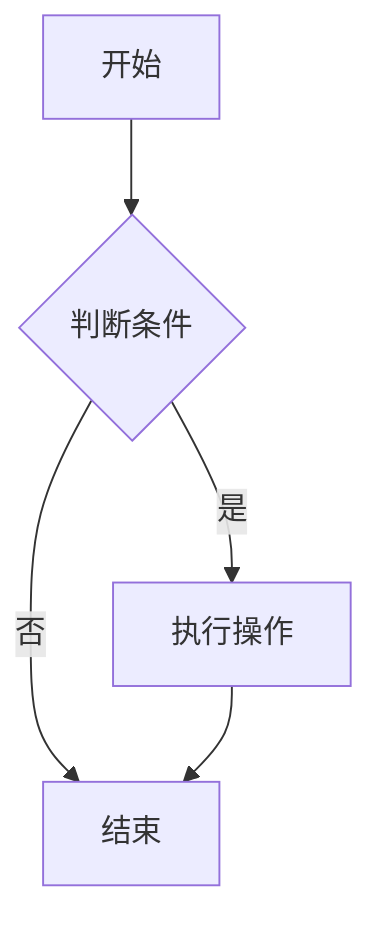

# Markdown & Mermaid to DOCX 转换器

[](https://github.com/xlight/md-mermaid-toDocx/stargazers)
[](https://github.com/xlight/md-mermaid-toDocx/network/members)
[](https://github.com/xlight/md-mermaid-toDocx/issues)
[](https://github.com/xlight/md-mermaid-toDocx/blob/main/LICENSE)

一个基于 Web 的在线工具，支持将 Markdown 文档和 Mermaid 图表转换为 DOCX 格式文件。提供实时预览和左右对照编辑功能。

> **⭐ 如果这个项目对你有帮助，请点击右上角的 Star 支持一下！**

## ✨ 功能特性

- 📝 **Markdown 编辑器**：支持完整的 Markdown 语法
- 📊 **Mermaid 图表**：支持流程图、时序图、类图等多种图表类型
- 👀 **实时预览**：编辑内容即时渲染预览
- 🔄 **同步滚动**：编辑器和预览区域同步滚动，方便对照
- 📱 **响应式布局**：宽屏时左右布局，窄屏时上下布局
- 🌍 **多语言支持**：自动检测浏览器语言，支持简体中文和英文界面切换
- 🎨 **丰富字体**：支持 20+ 种中英文字体选择
- 📄 **DOCX 导出**：一键生成 Word 文档
- 🖨️ **打印预览**：支持浏览器打印功能

## 🚀 在线使用

访问 GitHub Pages 部署的在线版本：

**🔗 [立即使用 https://xlight.github.io/md-mermaid-toDocx/](https://xlight.github.io/md-mermaid-toDocx/)**

> 💡 提示：首次访问可能需要几秒钟加载 CDN 资源

## 💻 本地运行

由于使用了 ES 模块和 Fetch API，需要通过 HTTP 服务器运行：

```bash
# 使用 Python
python -m http.server 8000

# 或使用 Node.js
npx serve

# 或使用 PHP
php -S localhost:8000
```

然后在浏览器中访问 `http://localhost:8000`

## 📖 使用说明

### 基本使用

1. 在左侧编辑器中输入 Markdown 内容
2. 右侧会实时显示渲染预览
3. 选择所需的字体
4. 点击"生成 DOCX"下载 Word 文档

### 多语言界面

应用会自动检测浏览器语言设置：
- 如果浏览器语言为中文，默认显示简体中文界面
- 如果浏览器语言为其他语言，默认显示英文界面
- 可以通过右上角的"语言"选择器手动切换语言
- 语言偏好会保存在浏览器本地存储中

### Mermaid 图表语法

在 Markdown 中使用代码块标记 Mermaid 图表：

````markdown

````

### 支持的 Mermaid 图表类型

- **流程图**：`graph` / `flowchart`
- **时序图**：`sequenceDiagram`
- **类图**：`classDiagram`
- **状态图**：`stateDiagram`
- **甘特图**：`gantt`
- **饼图**：`pie`
- **ER图**：`erDiagram`
- **用户旅程图**：`journey`

## 🛠️ 技术栈

- **前端框架**：纯 JavaScript（无框架依赖）
- **Markdown 渲染**：[Marked.js](https://marked.js.org/) v15.0.12
- **图表渲染**：[Mermaid.js](https://mermaid.js.org/) v11.6.0
- **DOCX 生成**：[docx](https://docx.js.org/) v9.5.0
- **文件保存**：[FileSaver.js](https://github.com/eligrey/FileSaver.js) v2.0.5
- **CDN 源**：[unpkg.com](https://unpkg.com/)（国内可用）

## 📦 部署到 GitHub Pages

本项目已配置 GitHub Actions 自动部署：

1. 将代码推送到 GitHub 仓库
2. 在仓库设置中启用 GitHub Pages
3. 选择 "GitHub Actions" 作为部署源
4. 推送代码到 `main` 或 `master` 分支会自动触发部署

## 🎯 功能说明

### 同步滚动

编辑器和预览区域支持同步滚动，当你在其中一侧滚动时，另一侧会自动跟随，方便对照编辑。

### 响应式设计

- **宽屏模式（≥1024px）**：编辑器和预览区域左右并排显示
- **窄屏模式（<1024px）**：编辑器和预览区域上下堆叠显示

### 字体支持

生成的 DOCX 文档支持以下字体：

**中文字体：**
- 微软雅黑 (Microsoft YaHei)
- 宋体 (SimSun)
- 黑体 (SimHei)
- 楷体 (KaiTi)
- 仿宋 (FangSong)
- 华文宋体 (STSong)
- 华文黑体 (STHeiti)
- 华文楷体 (STKaiti)
- 华文仿宋 (STFangsong)
- 新宋体 (NSimSun)
- 苹方 (PingFang SC)
- 黑体-简 (Heiti SC)
- 华文细黑 (STXihei)

**英文字体：**
- Calibri
- Arial
- Times New Roman
- Courier New
- Verdana
- Tahoma
- Georgia
- Aptos

## 🔧 配置说明

### Mermaid 配置

项目中的 Mermaid 配置：

```javascript
mermaid.initialize({
    startOnLoad: false,
    securityLevel: 'loose',
    flowchart: { 
        htmlLabels: false, 
        useMaxWidth: true 
    },
    theme: 'default'
});
```

## 📝 示例内容

项目支持加载 `default.md` 文件作为默认内容。在项目根目录创建该文件即可自动加载。

## 🤝 贡献

欢迎提交 Issue 和 Pull Request！

### 如何贡献

1. Fork 本项目
2. 创建您的特性分支 (`git checkout -b feature/AmazingFeature`)
3. 提交您的修改 (`git commit -m 'Add some AmazingFeature'`)
4. 推送到分支 (`git push origin feature/AmazingFeature`)
5. 打开一个 Pull Request

### ⭐ Star 历史

[](https://star-history.com/#xlight/md-mermaid-toDocx&Date)

## 📄 许可证

MIT License

## 🙏 致谢

本项目基于 [cgee.nz 的 Markdown to DOCX 转换器](https://cgee.nz/files/md-docx-converter-poc.html) 进行改进和优化。

主要改进：
- ✅ 重新设计为左右对照布局
- ✅ 添加同步滚动功能
- ✅ 优化 UI/UX，充分利用屏幕空间
- ✅ 多语言支持（中英文自动切换）
- ✅ 丰富的中文字体支持
- ✅ 响应式设计
- ✅ 自动部署到 GitHub Pages

## 📮 联系方式

- 📧 提交 Issue：[https://github.com/xlight/md-mermaid-toDocx/issues](https://github.com/xlight/md-mermaid-toDocx/issues)
- 💬 讨论：[https://github.com/xlight/md-mermaid-toDocx/discussions](https://github.com/xlight/md-mermaid-toDocx/discussions)
- ⭐ 如果觉得项目不错，请给个 Star 支持一下！

---

<div align="center">

Made with ❤️ by [xlight](https://github.com/xlight)

⭐ **喜欢这个项目？给它一个 Star 吧！** ⭐

</div>