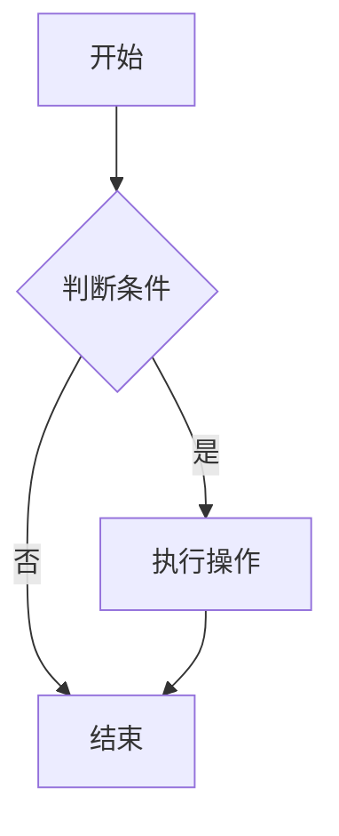

# Markdown & Mermaid to DOCX 转换器

[](https://github.com/xlight/md-mermaid-toDocx/stargazers)
[](https://github.com/xlight/md-mermaid-toDocx/network/members)
[](https://github.com/xlight/md-mermaid-toDocx/issues)
[](https://github.com/xlight/md-mermaid-toDocx/blob/main/LICENSE)

一个基于 Web 的在线工具，支持将 Markdown 文档和 Mermaid 图表转换为 DOCX 格式文件。提供实时预览和左右对照编辑功能。

> **⭐ 如果这个项目对你有帮助，请点击右上角的 Star 支持一下！**

## ✨ 功能特性

- 📝 **Markdown 编辑器**：支持完整的 Markdown 语法
- 📊 **Mermaid 图表**：支持流程图、时序图、类图等多种图表类型
- 📐 **数学公式支持**：支持 LaTeX 数学公式渲染（行内公式 `$...$` 和块级公式 `$$...$$`）
- 🎨 **主题配置**：15+ 精美主题，支持自定义颜色配置（Flowchart, State, Sequence, Class, ER 图表）
- 🖼️ **ASCII 输出**：支持将图表导出为 ASCII/Unicode 文本格式（终端友好）
- 👀 **实时预览**：编辑内容即时渲染预览
- 🔄 **同步滚动**：编辑器和预览区域同步滚动，方便对照
- 📱 **响应式布局**：宽屏时左右布局，窄屏时上下布局
- 🌍 **多语言支持**：自动检测浏览器语言，支持简体中文和英文界面切换
- 🎭 **丰富字体**：支持 20+ 种中英文字体选择
- 📄 **DOCX 导出**：一键生成 Word 文档，图表和公式高清晰度嵌入
- 🖨️ **打印预览**：支持浏览器打印功能

### 数学公式说明

- 支持 LaTeX 行内公式：`$...$`
- 支持 LaTeX 块级公式：`$$...$$`
- 预览渲染使用 MathJax v3（SVG 输出）
- DOCX 导出时，数学公式会先渲染为 SVG，再转换为 PNG 嵌入，避免多层叠加导致的错位问题

## 🚀 在线使用

访问 GitHub Pages 部署的在线版本：

**🔗 [立即使用 https://xlight.github.io/md-mermaid-toDocx/](https://xlight.github.io/md-mermaid-toDocx/)**

> 💡 提示：首次访问可能需要几秒钟加载 CDN 资源

## 💻 本地运行

由于使用了 ES 模块和 Fetch API，需要通过 HTTP 服务器运行：

```bash
# 使用 Python
python -m http.server 8000

# 或使用 Node.js
npx serve

# 或使用 PHP
php -S localhost:8000
```

然后在浏览器中访问 `http://localhost:8000`

## 📖 使用说明

### 基本使用

1. 在左侧编辑器中输入 Markdown 内容
2. 右侧会实时显示渲染预览
3. 选择所需的字体和主题（支持 Flowchart, State, Sequence, Class, ER 图表主题化）
4. 可选择 SVG 或 ASCII 输出模式
5. 点击"生成 DOCX"下载 Word 文档

### 工具栏布局

- 顶部保持单层工具栏，减少对编辑与预览区域高度的占用
- 工具栏按主工作流组织：编辑配置 -> 视图入口预留 -> 导出操作
- `Generate DOCX` 为主按钮，`Print Preview` 为次按钮
- GitHub / Star / 语言入口采用更紧凑表达，降低对主操作流的干扰
- 状态信息显示在独立反馈区，不与主控件混排

### 主题配置（新功能！）

应用现在支持 **beautiful-mermaid** 渲染引擎，为支持的图表类型提供精美主题：

#### 支持主题的图表类型
- ✅ **流程图** (Flowchart)
- ✅ **时序图** (Sequence Diagram)
- ✅ **类图** (Class Diagram)
- ✅ **ER 图** (ER Diagram)
- ⚠️ **状态图** (State Diagram) - 当前版本暂时使用原生 Mermaid.js 渲染（beautiful-mermaid 0.1.3 的状态图支持存在问题）

#### 主题功能
- **15+ 内置主题**：Tokyo Night, Catppuccin, Nord, Dracula, GitHub Dark/Light 等
- **自定义主题**：通过颜色选择器自定义 bg (背景)、fg (前景)、line、accent、muted 等颜色
- **主题持久化**：主题选择自动保存到浏览器本地存储
- **导入/导出**：支持主题 JSON 导出和导入，方便分享和备份

#### 其他图表类型
不支持主题的图表类型（Gantt, Pie, Journey 等）将使用原生 Mermaid.js 渲染，保持默认样式。

### 输出模式

应用提供三种输出模式，可通过工具栏"输出"下拉菜单切换：

#### 1. SVG (主题) - 默认模式
- 使用 beautiful-mermaid 渲染支持的图表类型（Flowchart, Sequence, Class, ER）
- 应用选中的主题颜色
- 图表美观、专业
- 支持所有主题功能

#### 2. ASCII (文本) - 终端友好
- 将图表渲染为纯文本格式
- **Unicode 模式**：使用框绘字符（`┌─┐│└┘`）绘制图表，适合支持 Unicode 的终端
- **纯 ASCII 模式**：使用纯 ASCII 字符（`+-|`）绘制图表，最大兼容性
- **复制功能**：一键复制 ASCII 图表到剪贴板
- **限制**：仅支持 beautiful-mermaid 引擎的图表类型（Flowchart, Sequence, Class, ER）

#### 3. 经典 (兼容) - 完全兼容模式
- 所有图表强制使用原生 Mermaid.js 渲染
- 不应用自定义主题，使用 Mermaid 默认样式
- 最大兼容性，支持所有 Mermaid 图表类型
- 适用场景：
  - 需要原生 Mermaid.js 的特定样式
  - 调试主题渲染问题
  - 确保图表在所有环境下一致显示

### 多语言界面

应用会自动检测浏览器语言设置：
- 如果浏览器语言为中文，默认显示简体中文界面
- 如果浏览器语言为其他语言，默认显示英文界面
- 可以通过顶部工具栏中的语言选择器手动切换语言
- 语言偏好会保存在浏览器本地存储中

### Mermaid 图表语法

在 Markdown 中使用代码块标记 Mermaid 图表：

````markdown

```mermaid
graph TD
    A[开始] --> B{判断条件}
    B -->|是| C[执行操作]
    B -->|否| D[结束]
    C --> D
```
````

### 支持的 Mermaid 图表类型

#### beautiful-mermaid 引擎（支持主题和 ASCII）
- ✅ **流程图**：`graph` / `flowchart`
- ✅ **时序图**：`sequenceDiagram`
- ✅ **类图**：`classDiagram`
- ✅ **ER 图**：`erDiagram`

#### 原生 Mermaid.js 引擎（保持默认样式）
- **状态图**：`stateDiagram` / `stateDiagram-v2` (暂时使用原生渲染)
- **甘特图**：`gantt`
- **饼图**：`pie`
- **用户旅程图**：`journey`
- **Git 图**：`gitGraph`
- **思维导图**：`mindmap`
- **时间线**：`timeline`
- **象限图**：`quadrantChart`
- **需求图**：`requirementDiagram`
- **XY 图表**：`xychart-beta` 🔥
- **桑基图**：`sankey-beta` 🔥
- **块图**：`block-beta` 🔥
- **ZenUML**：`zenuml` 🔥
- **看板图**：`kanban` 🔥
- **架构图**：`architecture-beta` 🔥
- **C4 图**：`C4Context` / `C4Container` / `C4Component` 等 ⚠️
- **包图**：`packet-beta` 🔥
- **其他图表类型**

> 🔥 标记表示 Mermaid 新增的图表类型  
> ⚠️ 标记表示实验性功能  
> **注意**：default.md 中现已包含 **20+ 种图表类型**的完整示例，涵盖常用和高级图表类型。

**混合渲染**：应用会智能选择渲染引擎，确保所有 Mermaid 图表类型都能正常显示。

## 🛠️ 技术栈

- **前端框架**：纯 JavaScript（无框架依赖）
- **Markdown 渲染**：[Marked.js](https://marked.js.org/) v15.0.12
- **图表渲染**：混合渲染引擎
  - [beautiful-mermaid](https://github.com/lukilabs/beautiful-mermaid) v0.1.3（主题化图表）
  - [Mermaid.js](https://mermaid.js.org/) v11.6.0（完整图表类型支持）
- **DOCX 生成**：[docx](https://docx.js.org/) v9.5.0
- **文件保存**：[FileSaver.js](https://github.com/eligrey/FileSaver.js) v2.0.5
- **CDN 源**：[unpkg.com](https://unpkg.com/)（国内可用）

## 📦 部署到 GitHub Pages

本项目已配置 GitHub Actions 自动部署：

1. 将代码推送到 GitHub 仓库
2. 在仓库设置中启用 GitHub Pages
3. 选择 "GitHub Actions" 作为部署源
4. 推送代码到 `main` 或 `master` 分支会自动触发部署

## 🎯 功能说明

### 同步滚动

编辑器和预览区域支持同步滚动，当你在其中一侧滚动时，另一侧会自动跟随，方便对照编辑。

#### 技术实现

系统采用三层混合同步策略：

1. **结构锚点映射（主）**：基于文档结构（markdown 段落、mermaid 图表、数学公式）构建多层级锚点
   - Segment 起始/结束锚点：每个内容块的源码位置与预览渲染位置一一对应
   - Intra-block 块级锚点：markdown 段内的标题、段落、表格等元素独立锚点，实现块级对齐

2. **文本指纹微调（辅）**：在锚点稀疏区域使用顶部可见文本匹配进行微调

3. **百分比同步（兜底）**：锚点不可用时自动降级到全局百分比映射

#### 块级对齐

通过块级锚点实现精确对齐：
- 编辑器中 "### XY 图表" 滚动到视口顶部时，预览中对应的 `<h3>XY 图表</h3>` 也位于视口顶部
- mermaid 图表、数学公式等特殊内容段通过起始/结束锚点精确映射高度差异
- 文本匹配采用三遍策略（精确匹配 → 模糊正则 → 去 markdown 格式），提高定位成功率

#### 抗抖动控制

- 死区阈值：小位移（< 5px）不触发同步
- 方向锁：防止双向滚动事件互相触发
- 锚点密集区域跳过文本微调，避免引入噪声

#### 调试工具

在浏览器控制台可使用以下调试接口：

```javascript
// 启用滚动同步调试日志
__scrollSyncDebug.setEnabled(true)

// 查看当前锚点快照
__scrollSyncDebug.getSnapshot()

// 实时监控滚动位置（再次调用停止）
__scrollSyncDebug.watch()
```

### 响应式设计

- **宽屏模式（≥1024px）**：编辑器和预览区域左右并排显示
- **窄屏模式（<1024px）**：编辑器和预览区域上下堆叠显示

### 字体支持

生成的 DOCX 文档支持以下字体：

**中文字体：**
- 微软雅黑 (Microsoft YaHei)
- 宋体 (SimSun)
- 黑体 (SimHei)
- 楷体 (KaiTi)
- 仿宋 (FangSong)
- 华文宋体 (STSong)
- 华文黑体 (STHeiti)
- 华文楷体 (STKaiti)
- 华文仿宋 (STFangsong)
- 新宋体 (NSimSun)
- 苹方 (PingFang SC)
- 黑体-简 (Heiti SC)
- 华文细黑 (STXihei)

**英文字体：**
- Calibri
- Arial
- Times New Roman
- Courier New
- Verdana
- Tahoma
- Georgia
- Aptos

## 🔧 配置说明

### Mermaid 配置

项目中的 Mermaid 配置：

```javascript
mermaid.initialize({
    startOnLoad: false,
    securityLevel: 'loose',
    flowchart: { 
        htmlLabels: false, 
        useMaxWidth: true 
    },
    theme: 'default'
});
```

## 📝 示例内容

项目支持加载 `default.md` 文件作为默认内容。在项目根目录创建该文件即可自动加载。

## 🤝 贡献

欢迎提交 Issue 和 Pull Request！

### 如何贡献

1. Fork 本项目
2. 创建您的特性分支 (`git checkout -b feature/AmazingFeature`)
3. 提交您的修改 (`git commit -m 'Add some AmazingFeature'`)
4. 推送到分支 (`git push origin feature/AmazingFeature`)
5. 打开一个 Pull Request

### ⭐ Star 历史

[](https://star-history.com/#xlight/md-mermaid-toDocx&Date)

## 📄 许可证

MIT License

## 🙏 致谢

本项目基于 [cgee.nz 的 Markdown to DOCX 转换器](https://cgee.nz/files/md-docx-converter-poc.html) 进行改进和优化。

主要改进：
- ✅ 重新设计为左右对照布局
- ✅ 添加同步滚动功能
- ✅ 优化 UI/UX，充分利用屏幕空间
- ✅ 多语言支持（中英文自动切换）
- ✅ 丰富的中文字体支持
- ✅ 响应式设计
- ✅ 自动部署到 GitHub Pages
- ✅ **集成 beautiful-mermaid 主题系统**（新增）
- ✅ **支持 ASCII/Unicode 图表输出**（新增）
- ✅ **混合渲染引擎，兼容所有 Mermaid 图表类型**（新增）

## 📮 联系方式

- 📧 提交 Issue：[https://github.com/xlight/md-mermaid-toDocx/issues](https://github.com/xlight/md-mermaid-toDocx/issues)
- 💬 讨论：[https://github.com/xlight/md-mermaid-toDocx/discussions](https://github.com/xlight/md-mermaid-toDocx/discussions)
- ⭐ 如果觉得项目不错，请给个 Star 支持一下！

---

<div align="center">

Made with ❤️ by [xlight](https://github.com/xlight)

⭐ **喜欢这个项目？给它一个 Star 吧！** ⭐

</div>
