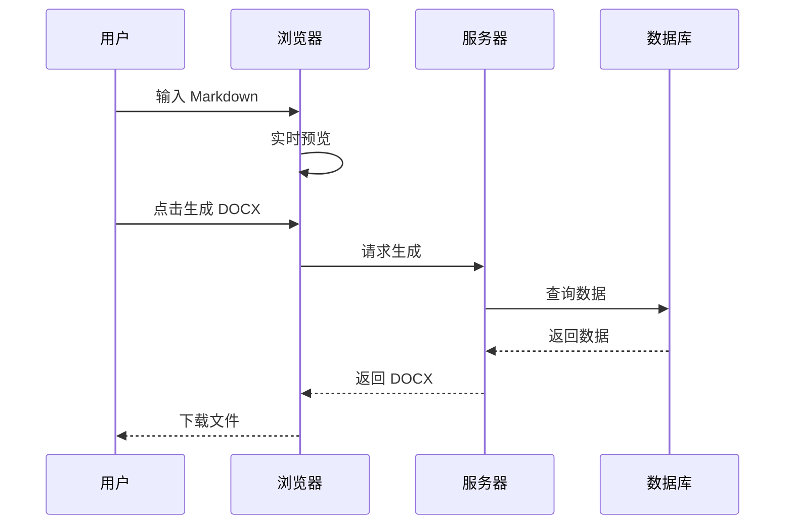
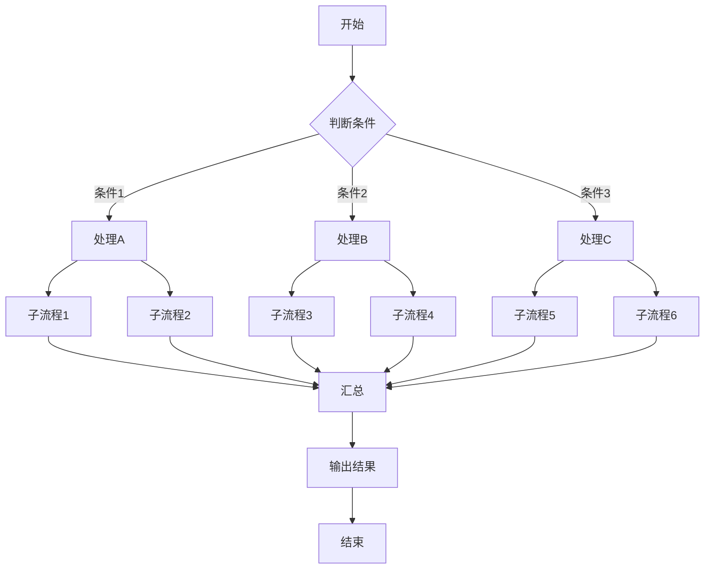

# Mermaid 图片宽度测试文档

此文档用于测试 DOCX 导出时 Mermaid 图片的自动缩放功能。

## 测试场景 1: 窄图（应保持原始尺寸）

简单的小流程图，宽度应该小于 602 像素：

## 测试场景 2: 中等宽度图表

包含 4 个节点的流程图：

## 测试场景 3: 超宽图表（应被缩放）

包含多个节点的宽流程图：

## 测试场景 4: 序列图（通常较宽）

## 测试场景 5: 复杂流程图（极宽）

## 测试验证清单

导出 DOCX 后，请在 Microsoft Word 中验证：

- [ ] 窄图（场景1）保持原始尺寸，未被放大
- [ ] 中等宽度图（场景2）显示正常，未超出页面
- [ ] 超宽图（场景3）被缩小以适应页面宽度
- [ ] 序列图（场景4）被缩小以适应页面宽度
- [ ] 复杂流程图（场景5）被缩小以适应页面宽度
- [ ] 所有图片的宽高比保持不变（无拉伸或压缩）
- [ ] 图片仍然清晰可读（得益于 1.5x PNG 缩放）
