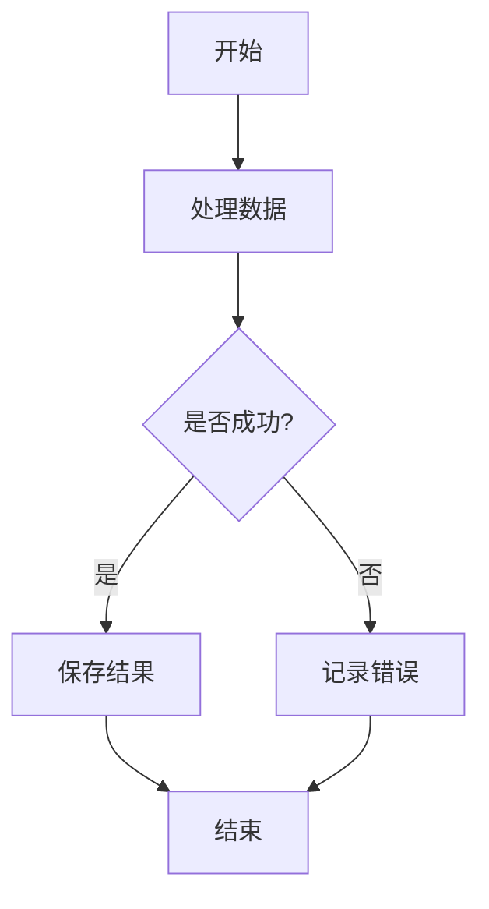
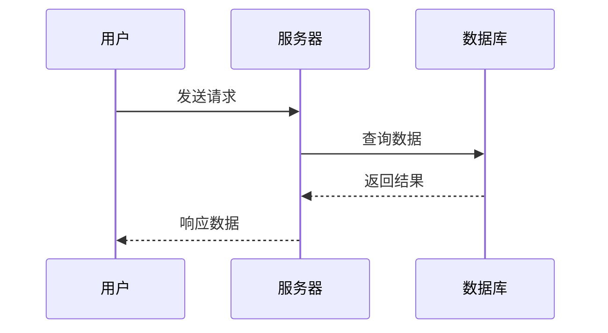
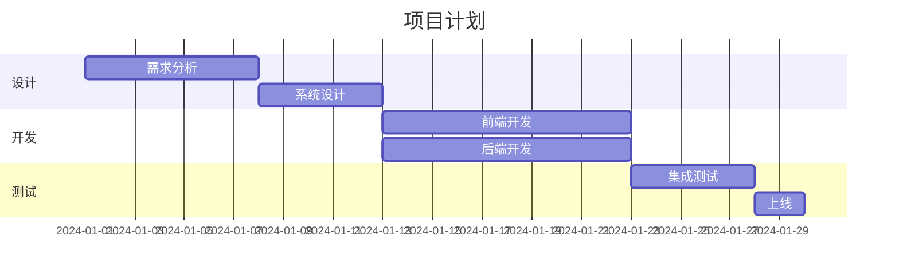

# Mermaid 密集文档

## 流程图

```mermaid
graph TD
    A[开始] --> B[处理数据]
    B --> C{是否成功?}
    C -->|是| D[保存结果]
    C -->|否| E[记录错误]
    D --> F[结束]
    E --> F
```

## 时序图

```mermaid
sequenceDiagram
    participant U as 用户
    participant S as 服务器
    participant D as 数据库
    U->>S: 发送请求
    S->>D: 查询数据
    D-->>S: 返回结果
    S-->>U: 响应数据
```

## 甘特图

```mermaid
gantt
    title 项目计划
    dateFormat YYYY-MM-DD
    section 设计
    需求分析 :a1, 2024-01-01, 7d
    系统设计 :a2, after a1, 5d
    section 开发
    前端开发 :a3, after a2, 10d
    后端开发 :a4, after a2, 10d
    section 测试
    集成测试 :a5, after a3, 5d
    上线 :a6, after a5, 2d
```

## 后续文本

图表之后的文本段落。测试 segment-end 锚点是否正确处理 mermaid 段的高度膨胀。
